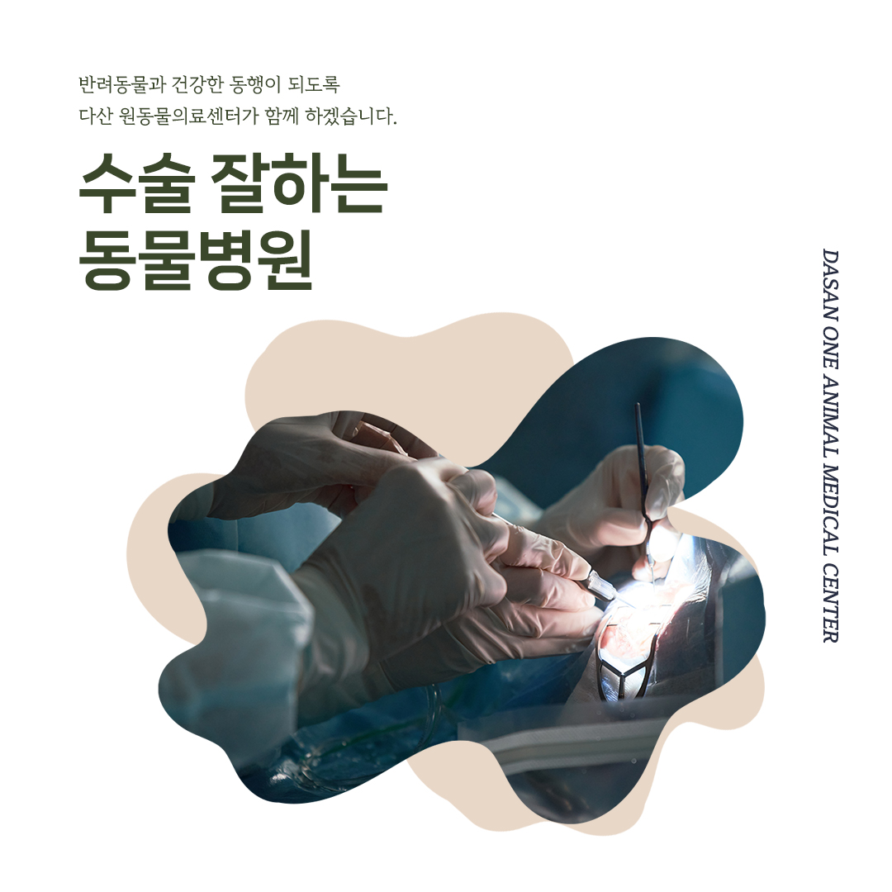
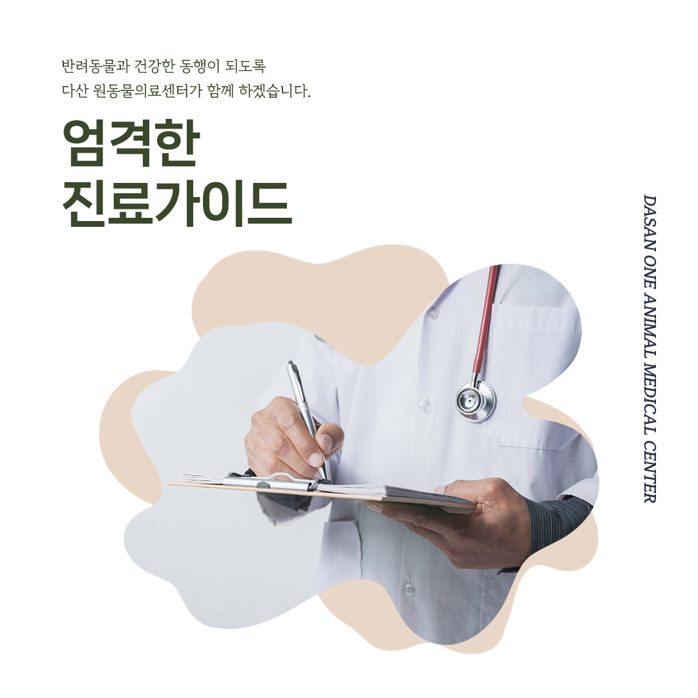
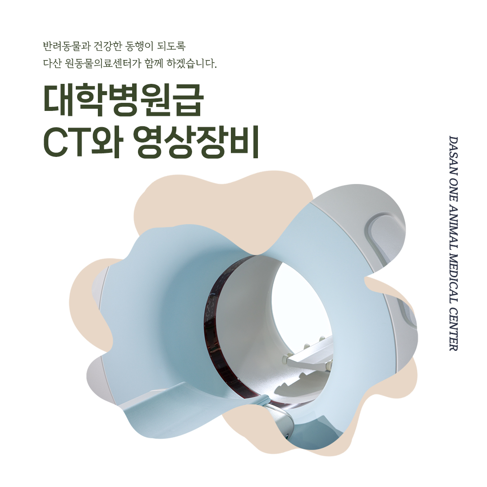
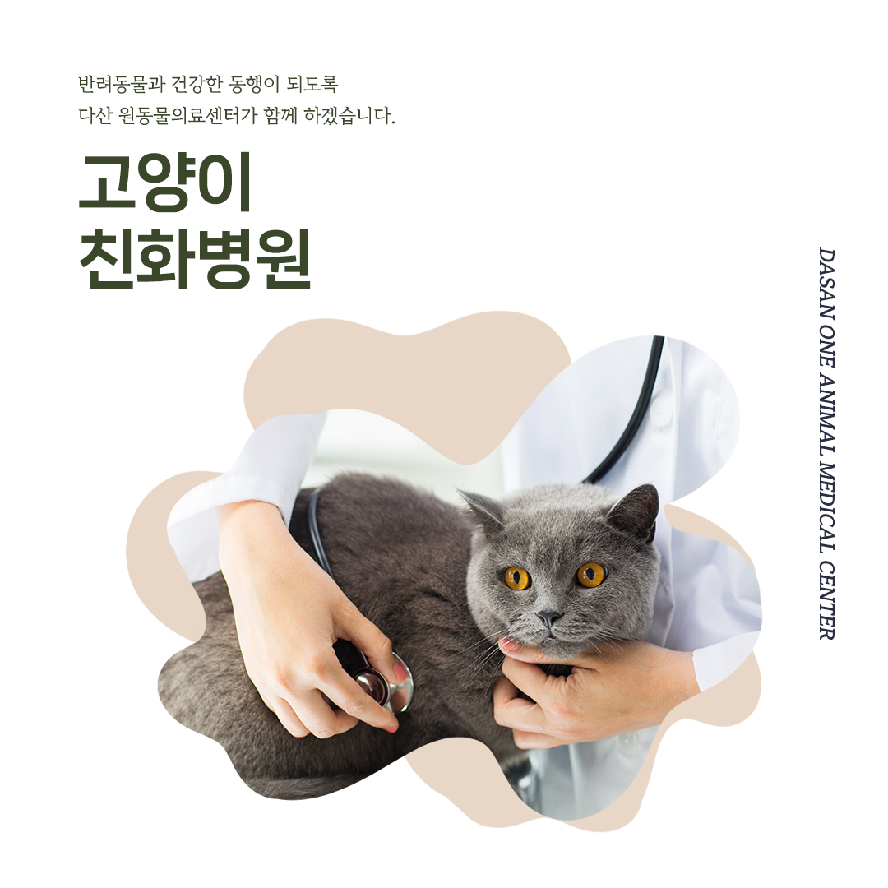
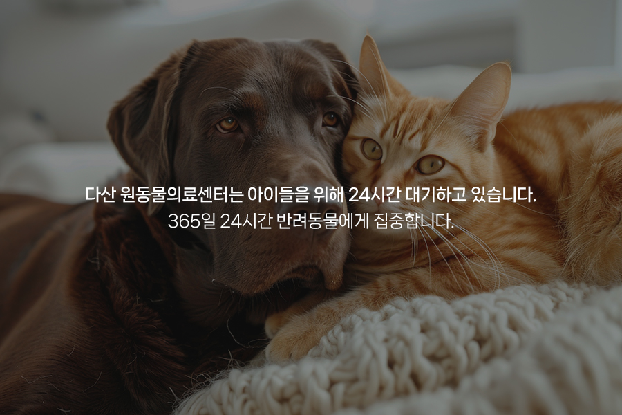

# 24시 다산 원동물의료센터 오픈 안내 남양주다산동물병원

- logNo: 223969419023
- date: 2025-08-13
- displayDate: 2025. 8. 13. 18:30
- url: https://blog.naver.com/PostView.naver?blogId=dasanoneamc&logNo=223969419023
- categoryNo: 6
- tags: 

---

안녕하세요, 다산 원동물의료센터입니다.
원동물의료센터는 8월 오픈하여
아이들을 더 가까이에서 살펴보려 합니다.

다산 원동물의료센터는 내과 외과 영상의학과
각 분과별 협진 진료를 시행합니다.
분과별 협진 진료 시스템을 통해
반려동물에게 최상의 의료 서비스를 제공합니다.

다산 원동물의료센터는 외과 전공 대표원장님이
직접 수술을 집도합니다.
관절질환인 정형외과 수술부터
디스크, 뇌질환 등의 신경외과 수술까지
폭넓은 질환의 수술이 가능합니다.

국내 수의 진료 가이드를 엄격히 준수하여
진료를 시행합니다.

영상 전공의 의료진이 촬영과 판독을 진행하여
정확한 진단이 가능합니다.
내원 당일 촬영과 판독, 수술까지 원스톱으로 가능합니다.
대학병원급 CT와 영상장비를 통해
정확하고 빠른 진단이 가능합니다.

스트레스에 예민한 고양이들의 편안한 진료를 위해
고양이 전용 대기실과 진료실, 처치 및 입원실이
별도로 준비되어 있습니다.

반려동물은 단순히 동물이 아닌
내 가족과 자식을 대한다는 마음으로
아이의 상태를, 보호자분의 마음을 이해하고 공감하여
치료하겠습니다.
다산 원동물의료센터는 아이들의 응급 상황에 대비하여
24시간 대기하고 있습니다.

📍 24시다산원동물의료센터 경기도 남양주시 다산중앙로 15 3층

#다산동물병원추천 #24시간동물병원
#도농역동물병원 #남양주동물병원 #구리동물병원
#강아지CT #고양이CT #수술잘하는동물병원
#수술전문동물병원 #수택동동물병원 #동구동동물병원
