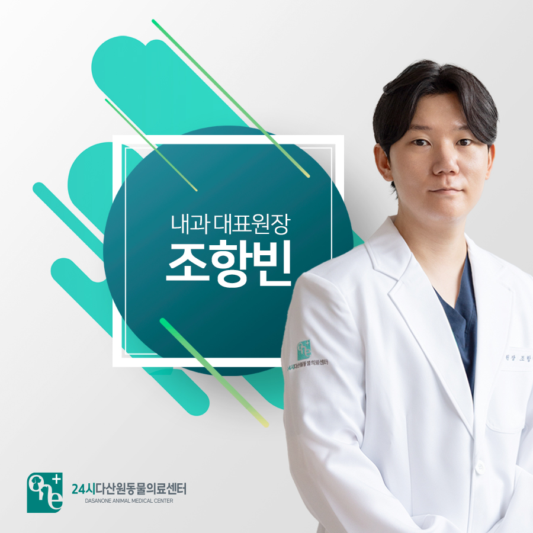
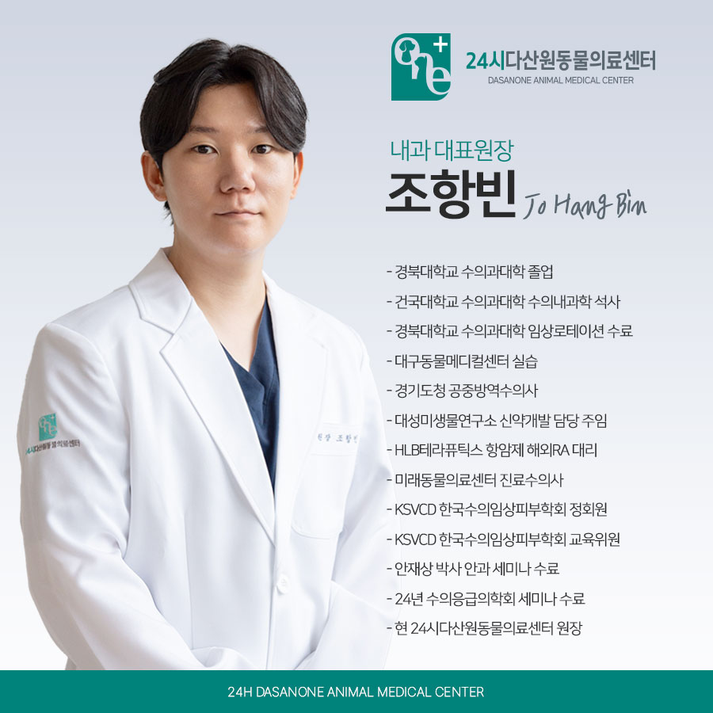
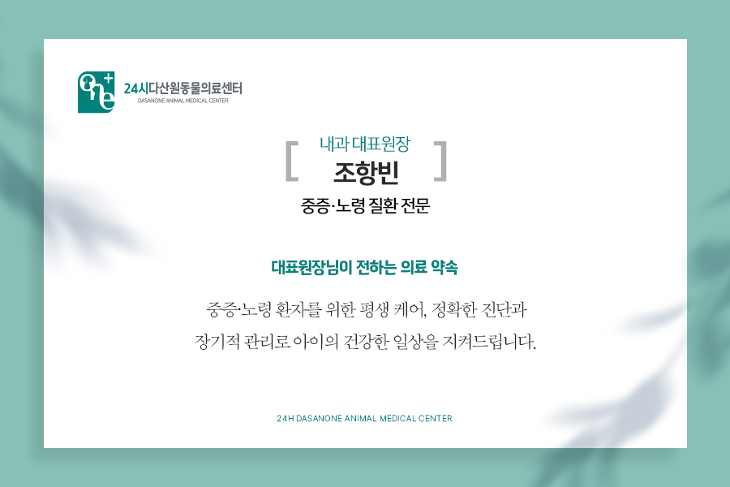
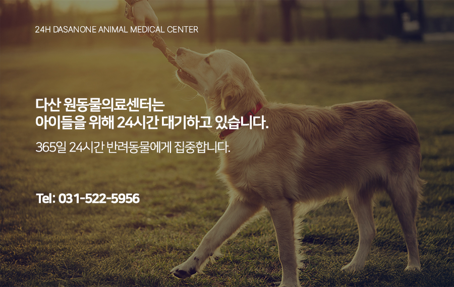

# 24시 다산 원동물의료센터 조항빈 대표원장님을 소개합니다.

- logNo: 223975705608
- date: 2025-08-19
- displayDate: 2025. 8. 19. 14:25
- url: https://blog.naver.com/PostView.naver?blogId=dasanoneamc&logNo=223975705608
- categoryNo: 7
- tags: 

---

안녕하세요.
다산 원동물의료센터 내과 대표 원장
조항빈 입니다.

---

저는 반려동물의 건강을 지키기 위해
환자 한 마리, 한 마리를 가족처럼 소중히 여기며,
보호자분들과 함께 아이들의 건강한 일상을
지켜나가고자 합니다. 앞으로도 철저한 진료와
따뜻한 마음으로 최선을 다하겠습니다.

📚
주요 약력
- 경북대학교 수의과대학 졸업
- 건국대학교 수의과대학 수의내과학석사
- 경북대학교 수의과대학 임상로테이션 수료
- 대구동물메디컬센터 실습
- 경기도청 공중방역수의사
- 대성미생물연구소 신약개발 담당 주임
- HLB테라퓨틱스 항암제 해외RA 대리
- 미래동물의료센터 진료수의사
- KSVCD 한국수의임상피부학회 정회원
- KSVCD 한국수의임상피부학회 교육위원
- 안재상 박사 안과 세미나 수료
- 24년 수의응급의학회 세미나 수료
- 현 24시다산원동물의료센터 원장

> "평생을 함께 지키는 중증·노령 내과 케어"

내과 진료는 단순히 질환을 치료하는 것을 넘어,
아이의 ‘삶의 질’을 관리하는 과정입니다.
저는 중증 질환과 노령 반려동물의 건강 관리에
집중하여, 오랜 경험과 데이터를 토대로
최적의 치료 방향을 제시합니다.
보호자분의 이야기를 끝까지 경청하며,
아이가 남은 생을 건강하고 편안하게
보낼 수 있도록 최선을 다하겠습니다.

저희 다산 원동물의료센터는
보호자분들의 든든한 동반자가 되어,
반려동물의 평생 건강 관리를 책임지겠습니다.

📍 24시다산원동물의료센터 경기도 남양주시 다산중앙로 15 3층

#다산동물병원추천 #24시간동물병원
#도농역동물병원 #남양주동물병원 #구리동물병원
#강아지CT #고양이CT #수술잘하는동물병원
#수술전문동물병원 #수택동동물병원 #동구동동물병원
