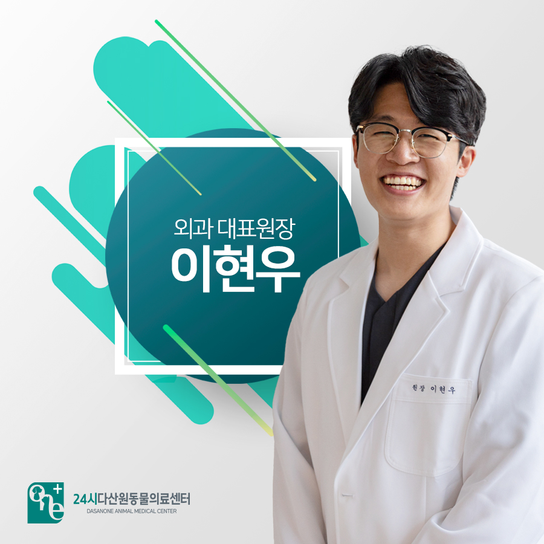
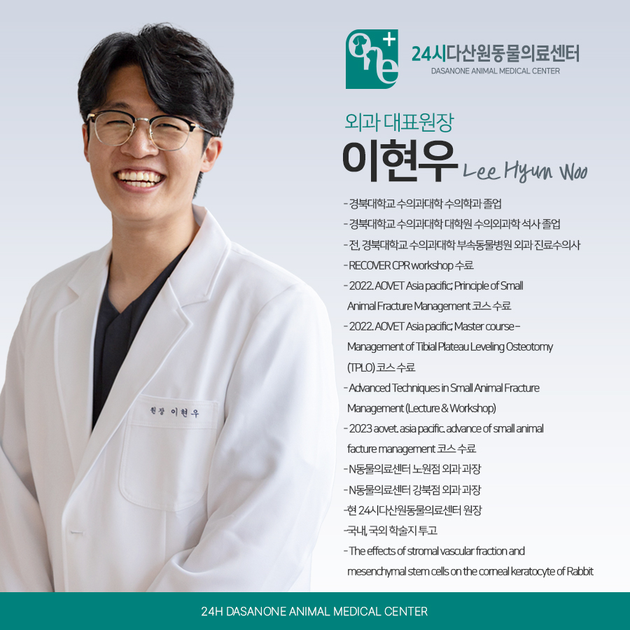
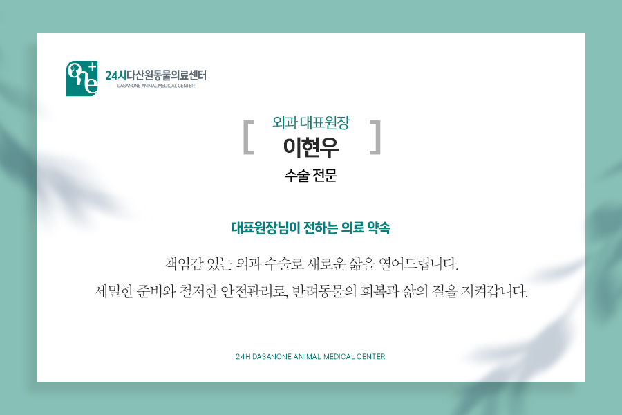

# 24시 다산 원동물의료센터 이현우 대표원장님을 소개합니다.

- logNo: 223975729028
- date: 2025-08-19
- displayDate: 2025. 8. 19. 14:43
- url: https://blog.naver.com/PostView.naver?blogId=dasanoneamc&logNo=223975729028
- categoryNo: 7
- tags: 

---

안녕하세요.
다산 원동물의료센터 외과 대표 원장
이현우 입니다.

---

저는 반려동물의 건강을 최우선으로 생각하며,
모든 환자를 가족처럼 소중히 돌보겠습니다.
보호자분들과 함께 반려동물이 오래도록
건강한 삶을 누릴 수 있도록, 정성 어린 진료와
따뜻한 마음으로 늘 곁을 지키겠습니다.

📚
주요 약력
- 경북대학교 수의과대학 수의학과 졸업
- 경북대학교 수의과대학 대학원 수의 외과학 석사 졸업
- 전, 경북대학교 수의과대학
부속 동물 병원 외과 진료 수의사
- RECOVER CPR workshop 수료
- 2022. AOVET Asia pacific; Principle of Small
Animal Fracture Management 코스 수료
- 2022. AOVET Asia pacific; Master course –
Management of Tibial Plateau Leveling
Osteotomy (TPLO) 코스 수료
- Advanced Techniques in Small Animal Fracture
Management (Lecture & Workshop)
- 2023 aovet. asia pacific. advance of small
animal facture management 코스 수료
- N동물의료센터 노원점 외과 과장
- N동물의료센터 강북점 외과 과장
-현 24시다산원동물의료센터 원장
국내, 국외 학술지 투고
- The effects of stromal vascular fraction and
mesenchymal stem cells on the corneal
keratocyte of Rabbit

> "수술로 열어가는 새로운 삶, 책임감 있는 외과 진료"

외과 수술은 단순한 기술이 아니라,
아이의 두 번째 삶을 열어주는 과정입니다.
저는 세밀한 계획과 철저한 준비, 그리고
책임감을 바탕으로 반려동물의 건강을
지켜가고 있습니다.
보호자분께는 과정과 예후를 솔직히 말씀드리고,
반려동물에게는 통증과 불안을 최소화하는
안전한 수술을 약속드립니다.

저희 다산 원동물의료센터는
보호자분들의 든든한 동반자가 되어,
반려동물의 평생 건강 관리를 책임지겠습니다.

📍 24시다산원동물의료센터 경기도 남양주시 다산중앙로 15 3층

#다산동물병원추천 #24시간동물병원
#도농역동물병원 #남양주동물병원 #구리동물병원
#강아지CT #고양이CT #수술잘하는동물병원
#수술전문동물병원 #수택동동물병원 #동구동동물병원
