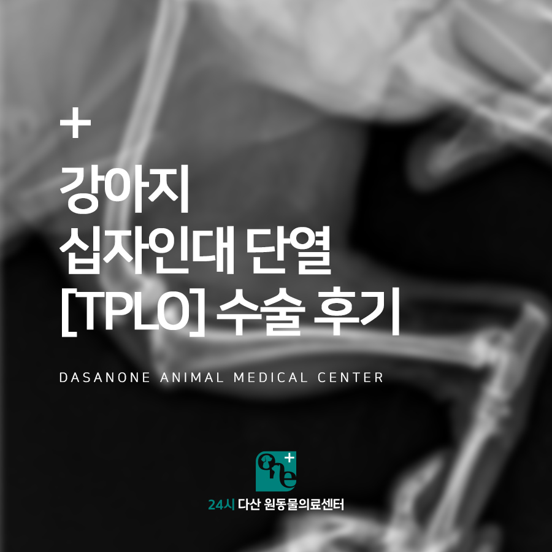
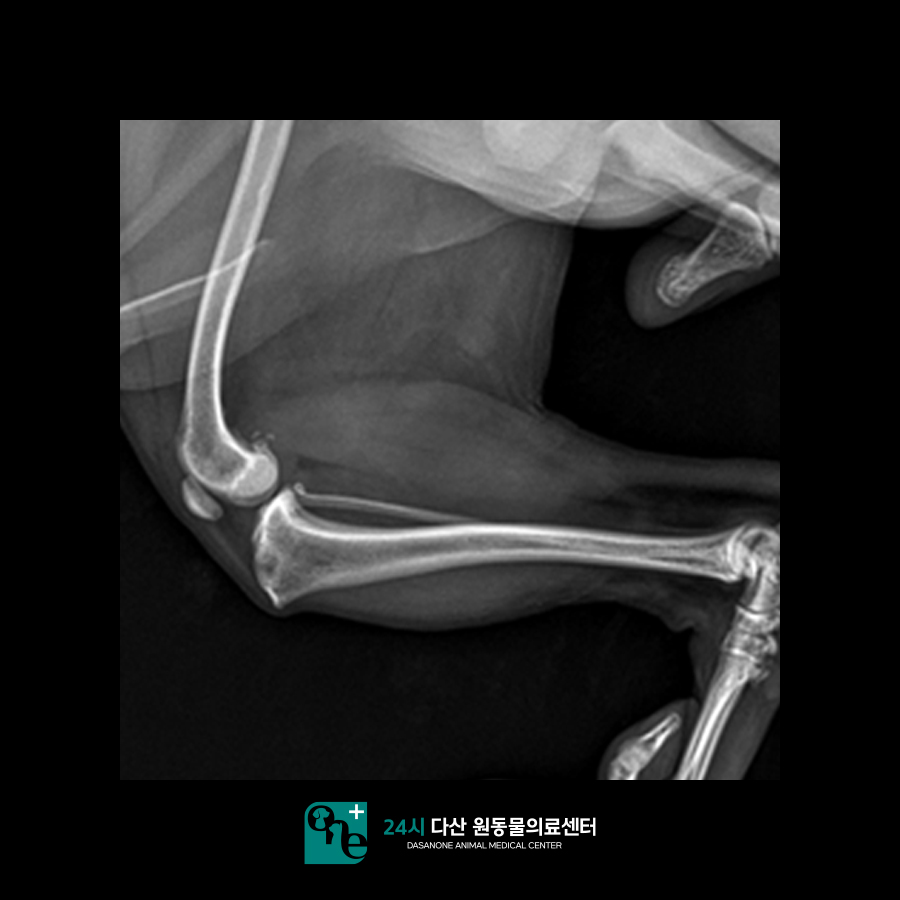
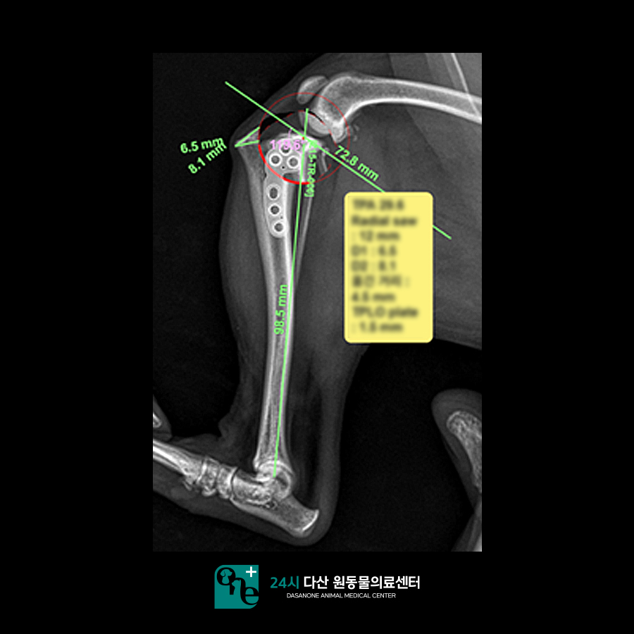
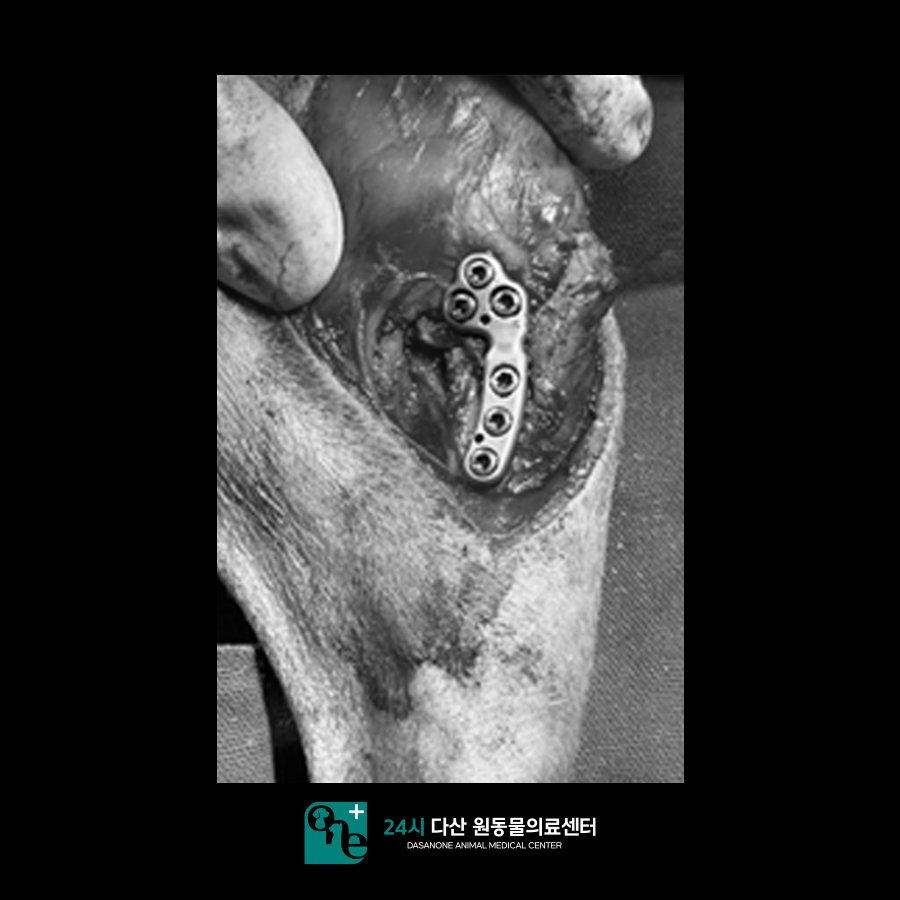
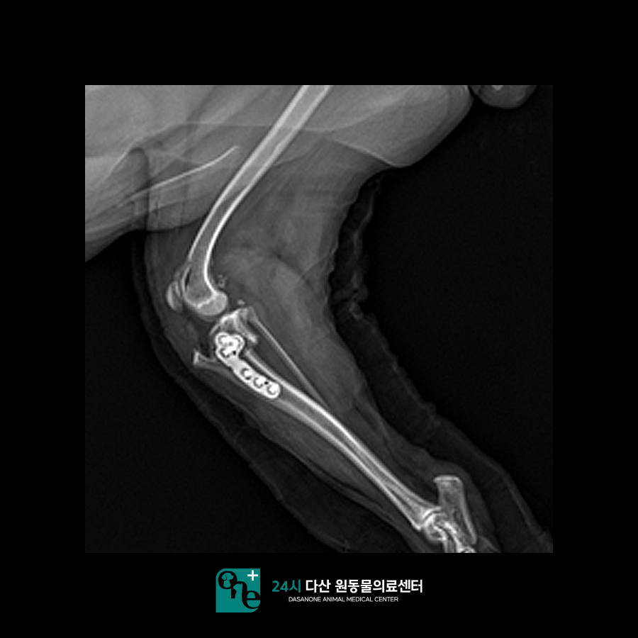
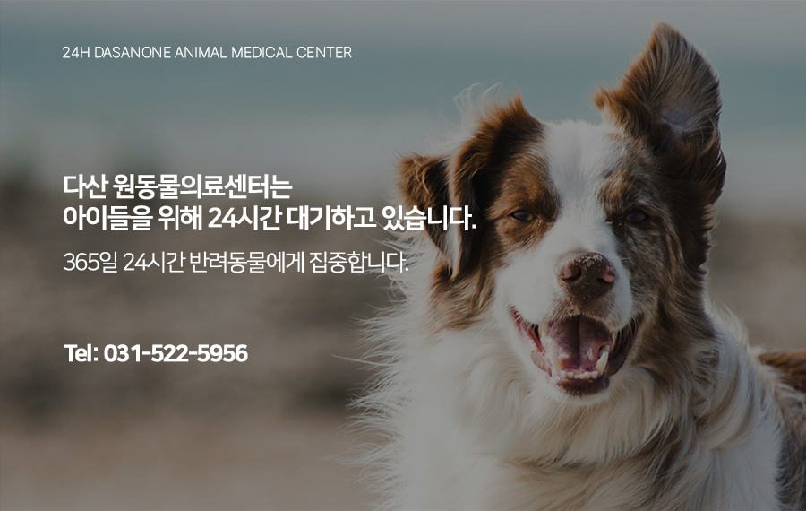

# 강아지 십자인대 단열 TPLO 수술 후기, 남양주 동물병원

- logNo: 223991311488
- date: 2025-09-01
- displayDate: 2025. 9. 1. 17:57
- url: https://blog.naver.com/PostView.naver?blogId=dasanoneamc&logNo=223991311488
- categoryNo: 11
- tags: 

---

십자인대 단열은 유전적 요인과
나이에 따라 흔하게 발병하는 질병입니다.
십자인대는 넙다리뼈와 정강뼈를
연결해 주는 인대를 말합니다.
사람과 달리 강아지의 넙다리뼈와 정강이를
이루는 각도가 커서 십자인대가 끊어진다면
발을 디딜 때마다 통증을 심하게 느끼게 됩니다.
계속해서 파행을 보이다 시간이 지나면
근육량의 차이가 생겨 예후가 좋지 않을 수 있습니다.
그렇기 때문에 십자인대 단열이 생겼다면
치료 결정을 빠르게 내려주시는 걸 추천드립니다.

> 내원 당시 방사선 촬영

9살 강아지 모모는 지난주 소파에 올라가려다
타이밍을 놓쳐 넘어진 이후로 왼쪽 뒷다리를
잘 못 딛어서 내원하게 되었습니다.
토요일에 타 병원에서 엑스레이를 찍고
십자인대 단열 소견을 들으셨습니다.
본원에 내원하여 신체검사를 진행하였고
십자인대 단열을 확인하였습니다.

> 수술 전 플랜 짜기

십자인대 단열 수술 방법 중 가장 최신화된 방법으로
예후가 더 좋은 TPLO 방법을 진행하기로 하였습니다.
TPLO의 경우 TPA의 각도를 낮춰서 걸을 때
통증을 낮춰주는 효과가 있습니다.
TPLO는 수술 전 맞는 플레이트 사이즈와
돌리는 각도를 측정하는 플랜을 미리
계획해야 합니다. 수술에 들어가기 전
모모에게 맞는 플랜을 짭니다.

> 수술 진행

수술 전 안전한 마취를 위해 검사를 진행하였습니다.
마취 전 검사에는 심장청진, 흉부방사선, 혈액검사
등이 있습니다. 모모의 경우 간 수치가 높게 나와
수액에 간 보조제를 태워준 뒤 수술을 진행하였고,
수술은 계획대로 잘 진행되었습니다.

> 수술 후 방사선 촬영

수술 후 방사선 사진입니다.
수술 전 세워 둔 플랜대로 수술이 잘 진행되었습니다.
모모의 경우 수술 후 진통 수액으로 관리 중입니다.
회복하는 데에는 1~2개월가량 필요합니다.
TPLO의 예후가 좋고 회복도 빨라 1-2주 내에
어느 정도 다이에 체중을 싣기 시작할 것입니다.

정형 수술 전문 동물병원인
24시 다산 원동물의료센터는
24시간 수의사가 상주해 있는 동물병원입니다.
늦은 밤, 갑작스러운 응급상황에도
당황하지 마시고 빠르게 내원하세요!

📍 24시 다산 원동물의료센터 경기도 남양주시 다산중앙로 15 3층

#강아지낙상 #강아지십자인대파열
#강아지슬개골탈구 #강아지슬개골수술
#다산동물병원추천 #남양주동물병원
#구리동물병원 #도농역동물병원
