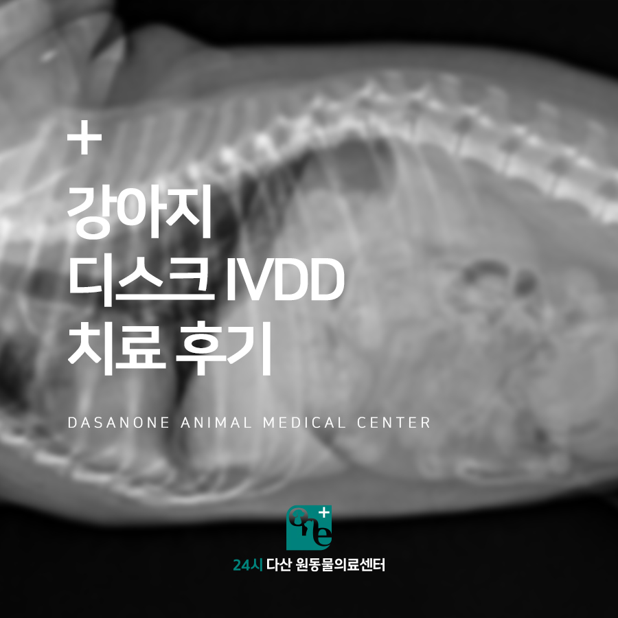
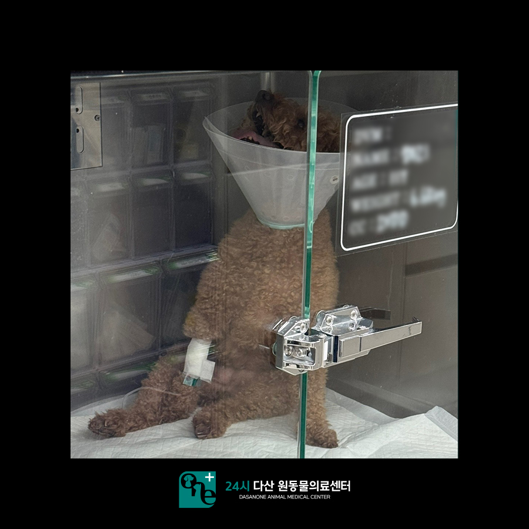
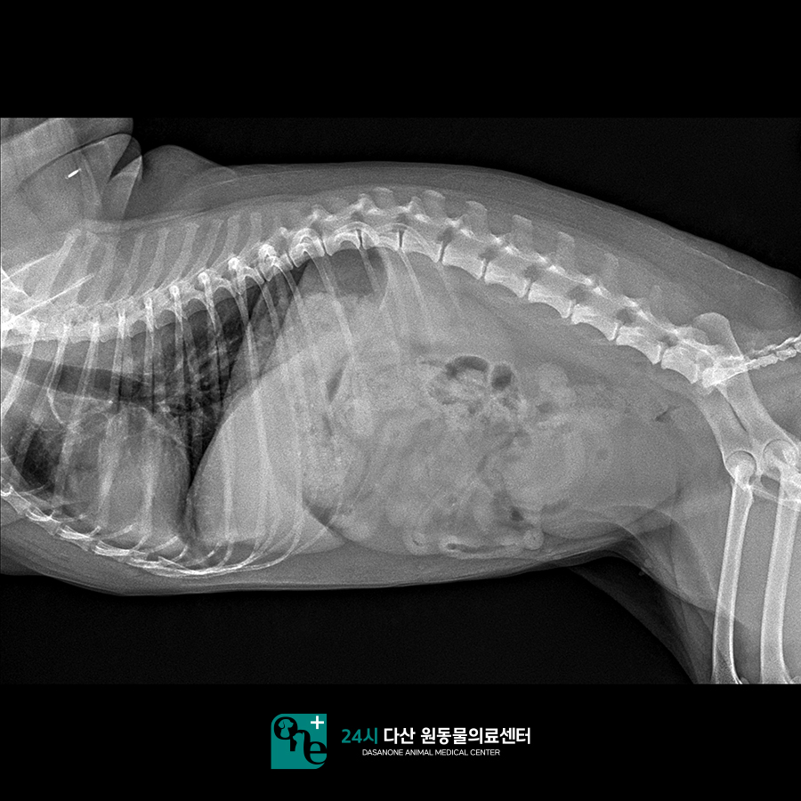
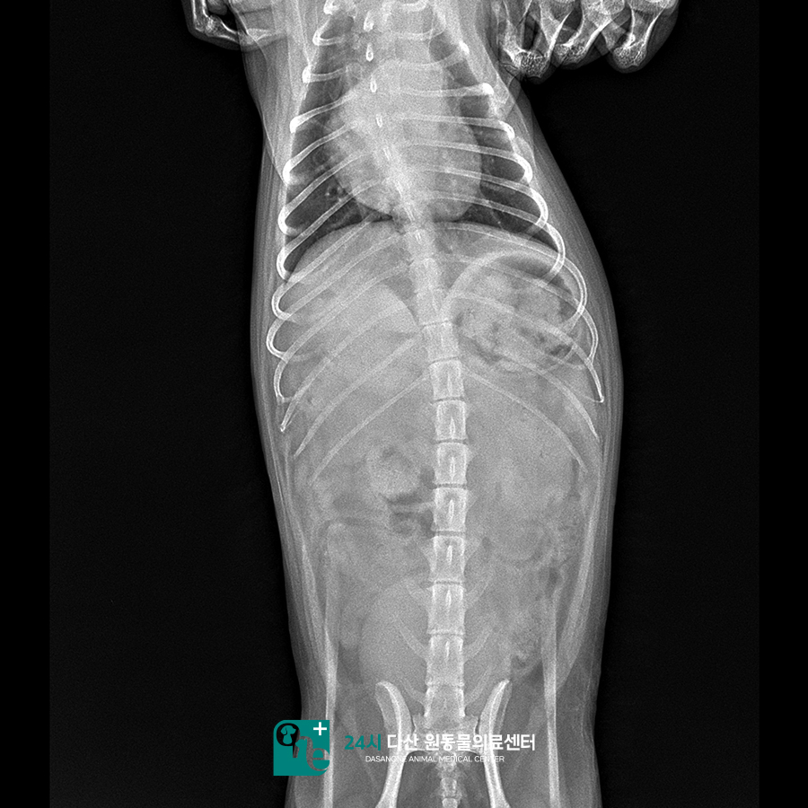
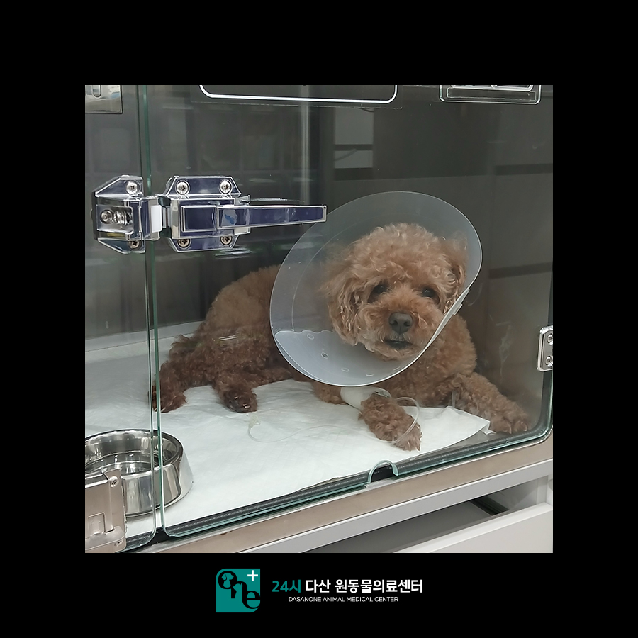
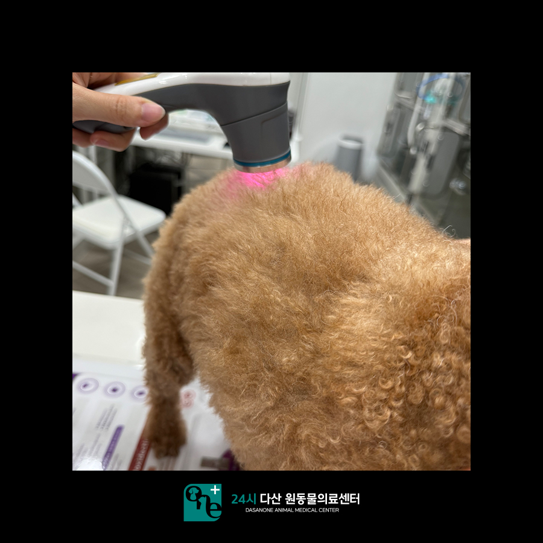
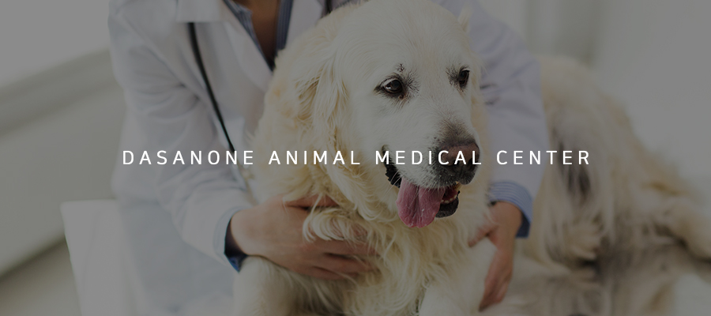
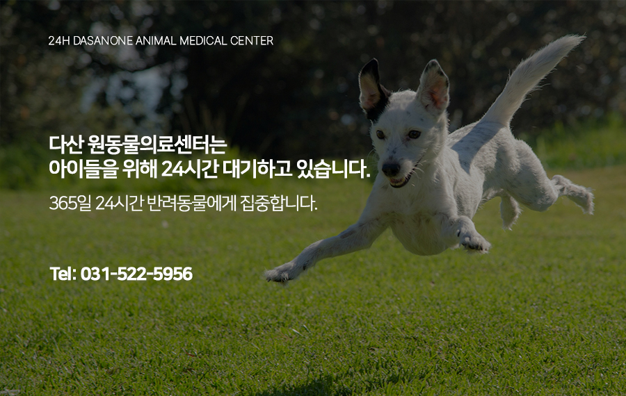

# 강아지 디스크 IVDD 치료 후기 별내동물병원

- logNo: 223995269092
- date: 2025-09-04
- displayDate: 2025. 9. 4. 16:46
- url: https://blog.naver.com/PostView.naver?blogId=dasanoneamc&logNo=223995269092
- categoryNo: 10
- tags: 

---

강아지 디스크 질환(IVDD)은
척추뼈 사이에 위치한 추간판(디스크)이
손상되거나 변성되어 신경을 압박하는 질환입니다.
경미한 경우 약물치료와 물리치료를 진행할 수 있고,
심한 경우 신경 압박을 풀기 위한
외과적 수술이 필요할 수 있습니다.
이번에 내원한 아이 역시 허리의 통증과
보행 불편으로 병원을 찾아왔는데,
주사치료와 물리치료를 통해 호전된 사례였습니다.
오늘은 그 치료 과정을 소개해 드리겠습니다.

> 내원 당시 상태

코코(가명)는 기립과 배뇨 불능으로 내원하였습니다.
아침부터 기립이 안되는 상태에서 소변도 못 보고
고개는 하늘을 보고 앉아서 아파하고 있었습니다.
보호자님이 등 부위를 만지려고 하면
보호자님을 물었다고 합니다.
타 병원에서 먹는 약을 처방받아 복용하였으나,
효과가 전혀 없는 상태로 반나절 이상이 지나
걱정되는 마음에 저희 다산 원동물의료센터로
야간에 내원해 주셨습니다.
원내에서 보행을 평가해 본 결과 보행은
전혀 불가능한 상태였으며, 요추 5~7번
사이에서 명확한 통증 반응이 관찰되었습니다.

> 방사선 촬영

엑스레이상에서 방광이 매우 확장된 것을
확인할 수 있었습니다. 코코는 입원 후
주사제 치료를 하기로 결정하고,
뇨카테터를 장착하였습니다.

> 입원 2일차

뇨카케터를 장착하고 새벽 동안 주사 처치를
진행한 결과 코코는 조금 더 편안한 자세로
입원장에 누워있을 수 있게 되었습니다.
입원 이틀차부터 신경계 검사를 진행하였습니다.

---

<NE>
GP : forelimb L (2), R (2)
hindlimb L (1), R (0-1)
Wheelbarrowing reaction : L (2), R (2)
Extensor postual thrust reaction : L (1), R (1)
Hopping reaction : forelimb L (2), R (2)
hindlimb L (1), R (0-1)
Withdrawal reflex : foreilmb L (2), R (2)
hindlimb L (1), R (1)
0 : None, 1 : Decrease, 2 : Normal, 3 : Increase

---

검사 결과 아직까지 우측 후지에서 신경 반사가
명확하게 떨어짐을 관찰할 수 있었습니다.
그래도 통증과 증상이 감소하였기에 보호자님께는
케이지레스트와 물리치료, 먹는 약으로 관리하며
며칠 지켜보는 것으로 말씀을 드렸습니다.

> 물리치료 진행

> 입원 3일차

오전 신경계 검사에서 우측 후지 신경 반사의
개선을 확인하였습니다. 저녁 신경계 검사에서도
다시 한번 추가적인 개선을 확인하였으나
아직까지 보행 시 얼마 못가 주저앉는 상태였습니다.

> 입원 4일차

신경계 검사에서 다시 한번 추가적인
개선을 확인하였고, 저녁 보행에서는
지속적인 보행 가능 상태를 확인할 수 있었습니다.

> 입원 5일차

---

NE
GP : forelimb L (2), R (2)
hindlimb L (2), R (1)
Wheelbarrowing reaction : L (2), R (2)
Extensor postual thrust reaction : L (2), R (2)
Hopping reaction : forelimb L (2), R (2)
hindlimb L (2), R (1->2)
Withdrawal reflex : foreilmb L (2), R (2)
hindlimb L (2), R (1)
0 : None, 1 : Decrease, 2 : Normal, 3 : Increase

---

오전 신경계 검사 이후 뇨카케터를 제거하였고
원내 산책 중 자발적으로 배뇨 배변하는 것을
확인하여 퇴원을 결정하였습니다.
코코는 당분간 운동을 제한하며 먹는 약을
추가로 복용하고, 디스크 관리를 위해
허리 보호대를 착용하기로 하였습니다.

코코는 입원 5일차 저녁에 퇴원하였고,
퇴원 3일 후 보호자님과 통화 결과
내복약을 먹고, 운동 제한 잘 하면서
다시 일상을 잘 지내고 있다고 하셨습니다 :)
코코의 경우처럼 급성 디스크가 3~4단계 이상으로
증상이 온 경우 응급으로 내원하셔야 신속한
내과적 치료를 시도해 볼 수 있습니다. 시간이 지나
디스크가 이미 척수 신경계를 너무 많이 누르고 있을
경우는 외과적인 수술만이 가능합니다.
아이가 갑작스러운 후지 마비, 배뇨곤란 등의 증상을
나타낸다면 빠르게 내원하셔서 적절한 치료를
시도해 보시는 게 좋습니다.

24시 다산 원동물의료센터는
24시간 수의사가 상주하여 내과 질환부터
응급 상황까지 즉시 진료가 가능한 동물병원입니다.

📍 24시 다산 원동물의료센터 경기도 남양주시 다산중앙로 15 3층

#다산동물병원 #남양주동물병원
#구리동물병원 #별내동물병원
#원동물병원 #다산원동물병원
