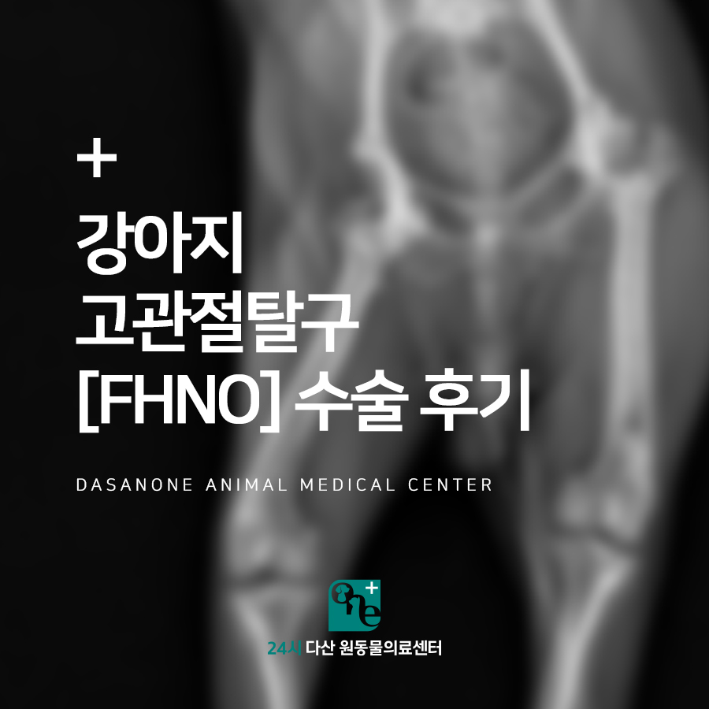
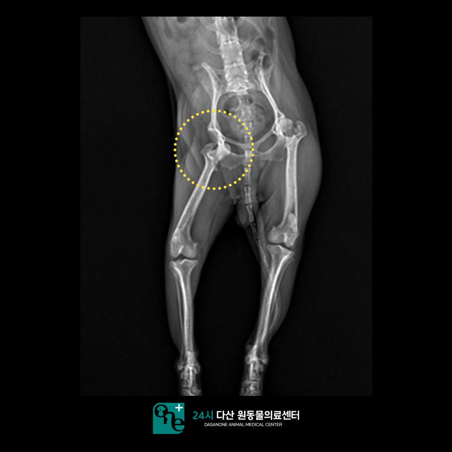
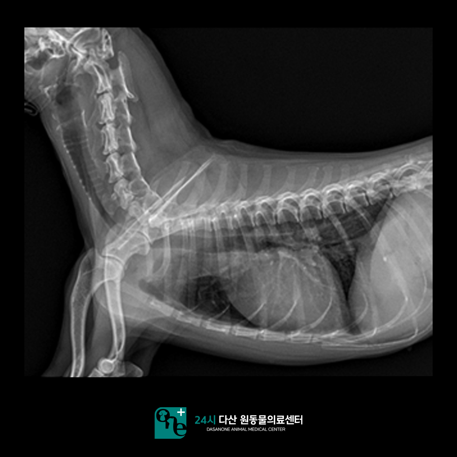
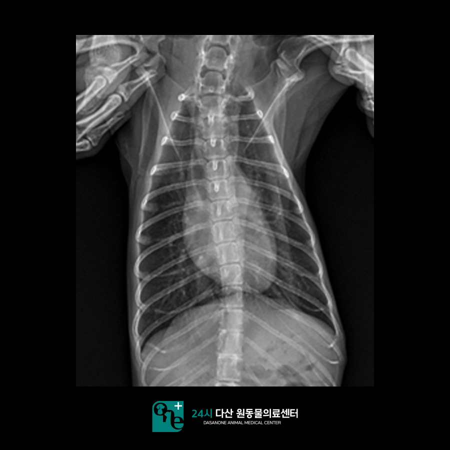
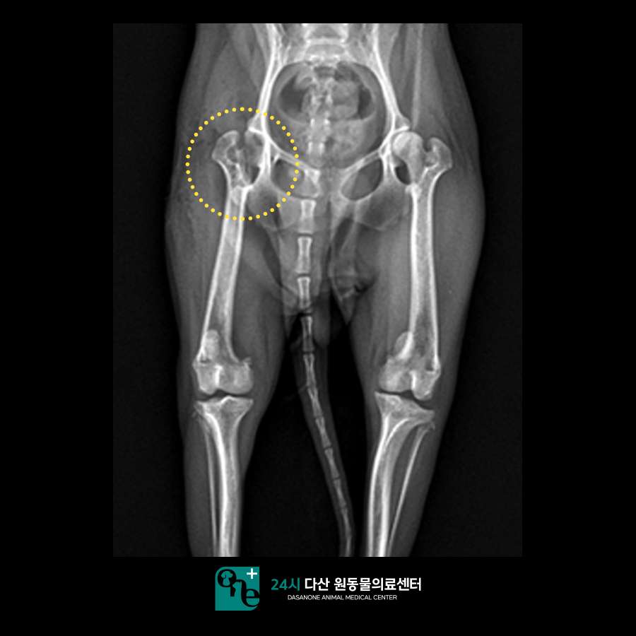
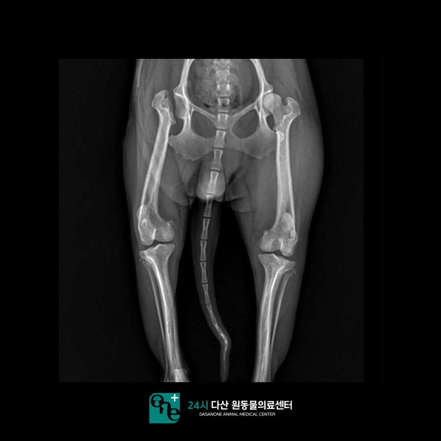
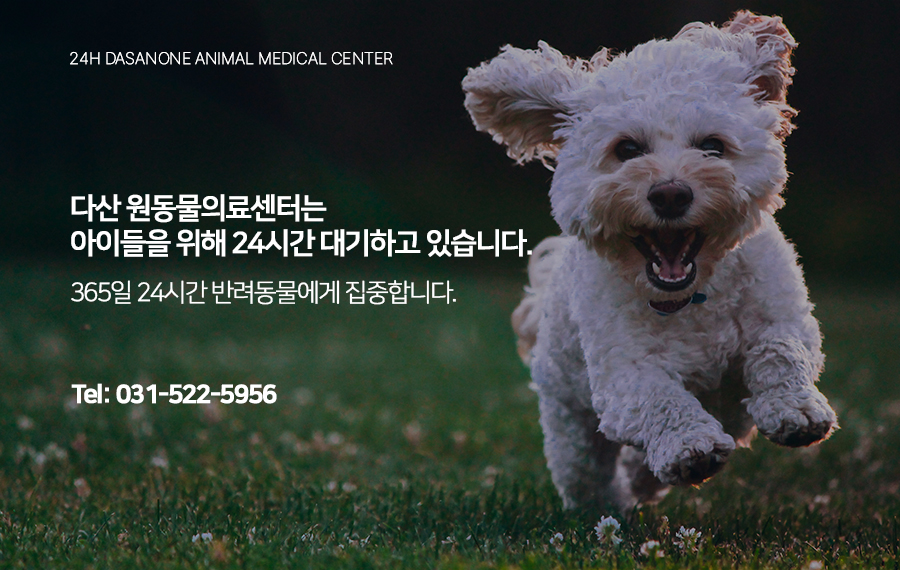

# 강아지 고관절 탈구 FHNO 수술 후기 갈매동물병원

- logNo: 224001499844
- date: 2025-09-09
- displayDate: 2025. 9. 9. 17:27
- url: https://blog.naver.com/PostView.naver?blogId=dasanoneamc&logNo=224001499844
- categoryNo: 11
- tags: 

---

안녕하세요. 정형 수술 전문
24시 다산 원동물의료센터입니다.
오늘은 본원에 고관절 탈구로 내원한 강아지
봄이에 대한 이야기를 들려드리겠습니다.
강아지의 고관절은 골반과 대퇴골을
연결해 주는 관절을 말합니다.
정상적인 상태는 고관절을 형성하는 비구와
대퇴 골두가 딱 맞아야 하는데,
관골구에서 대퇴골두가 빠져 있는 상태를
고관절 탈구라고 하며 주로 외상으로 인해
발생하게 됩니다. 고관절 탈구가 일어나게 되면
관골구와 대퇴골두를 연결하는 인대와 주변의
관절낭이 파열되며 극심한 통증을 보이게 되며,
다리를 제대로 딛지 못하고 들고 다닙니다.
이번에 내원한 강아지 봄이 역시 다리를
잘 딛지 못하는 증상으로 찾아왔습니다.

> x - ray촬영

봄이의 경우 소파에서 뛰어내린 후
발을 딛지 못하는 양상을 보였습니다.
x-ray 촬영 시 고관절 탈구가 관찰되었습니다.
고관절 탈구에 대해 보호자님께 설명을 드린 후
대퇴 골두 절골술(FHNO)를 진행하기로 하였습니다.
고관절 탈구의 경우 다시 정상 위치로
환납해 볼 수 있지만 한번 탈구가 발생하면
재탈구 위험성이 높기 때문에
수술적으로 교정하는 방법을 추천드립니다.

> 마취 전 검사

마취 전 검사에서 청진시 심잡음은 들리지 않았고
흉부 x-ray에서도 큰 특이점은 발견되지 않았습니다.
수액 처치를 통해 교정을 한 뒤 호흡 마취를 통해
수술을 진행하였습니다.

> 수술 진행

수술은 계획대로 잘 진행되었습니다.
봄이의 경우 수술한 다음날부터 잘 걷기 시작했습니다.
일주일 뒤 본원에 내원하였을 때에는 뛰어다니는
모습도 보였습니다. FHNO 수술의 경우 수술하고
재활이 중요하며 24시 다산 원동 물 의료센터에서는
레이저 치료를 통해 염증과 통증을
감소시켜주고 있습니다.

> 수술 후 2주 뒤

FHNO 수술 진행 후 2주 경과 시점에서
보행에 특별한 이상 없이
건강하게 잘 뛰어다니는 모습입니다.

2주 뒤 x - ray에서도 문제없이 건강한 모습을
확인할 수 있었습니다.
높은 곳에서 점프하거나미끄러운 바닥에서
달리다 보면 고관절 탈구 위험이 커집니다.
특히 소형견이나 관절이 약한 아이들은
외부 충격에 주의해 주세요.

24시 다산 원동 물 의료센터는
24시간 수의사가 상주하여 내과 질환부터
응급 상황까지 즉시 진료가 가능한 동물 병원입니다.

📍 24시 다산 원동물의료센터 경기도 남양주시 다산중앙로 15 3층

#다산동물병원 #남양주동물병원
#구리동물병원 #갈매동물병원
#원동물병원 #다산원동물병원
