# 24시 다산 원동물의료센터를 소개합니다.

- logNo: 224005546142
- date: 2025-09-12
- displayDate: 2025. 9. 12. 17:32
- url: https://blog.naver.com/PostView.naver?blogId=dasanoneamc&logNo=224005546142
- categoryNo: 6
- tags: 

---

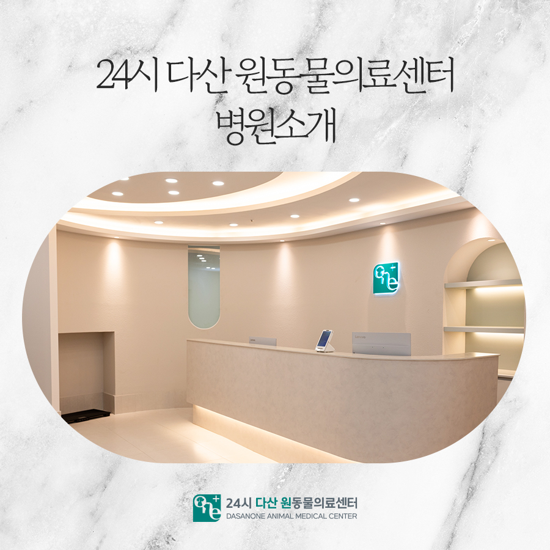

안녕하세요! 다산 원동물의료센터입니다.
오늘은 저희 병원의 내부 시설들을
소개해 드리려고 합니다. 😊
함께 둘러보실까요?

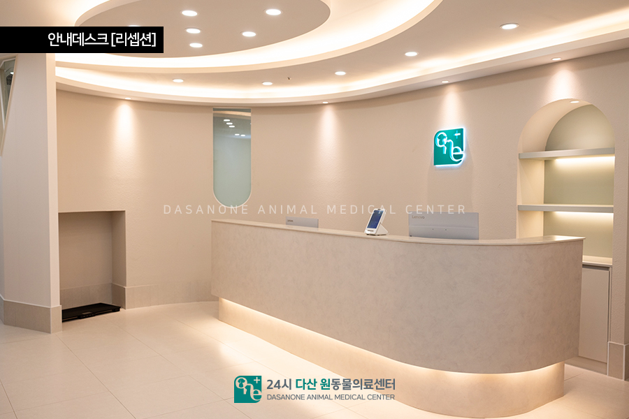

안내데스크 [리셉션]
병원에 들어오시면 가장 먼저 마주하는 공간입니다.
밝고 따뜻한 분위기로 보호자님과 아이 모두
긴장을 조금은 덜 수 있으실 거예요
접수와 상담이 이뤄지는 곳이니,
언제든 편하게 말씀해 주세요!

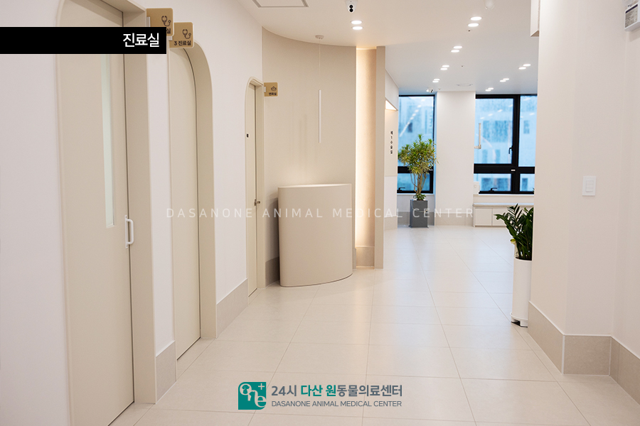

진료실
우리 아이들의 건강 상태를 가장 먼저 확인하는
공간입니다. 진료실에서는 기본 신체검사부터
각종 상담이 이루어집니다. 아이들이 긴장하지 않고
편안하게 진료받을 수 있도록 조용하고 따뜻한
분위기를 유지하고 있습니다.
작은 변화라도 놓치지 않기 위해
꼼꼼히 살펴보고, 보호자님과 충분히
소통하면서 진료를 진행하고 있습니다.
궁금하시거나 걱정되는 부분은 언제든지
편하게 말씀해 주세요!

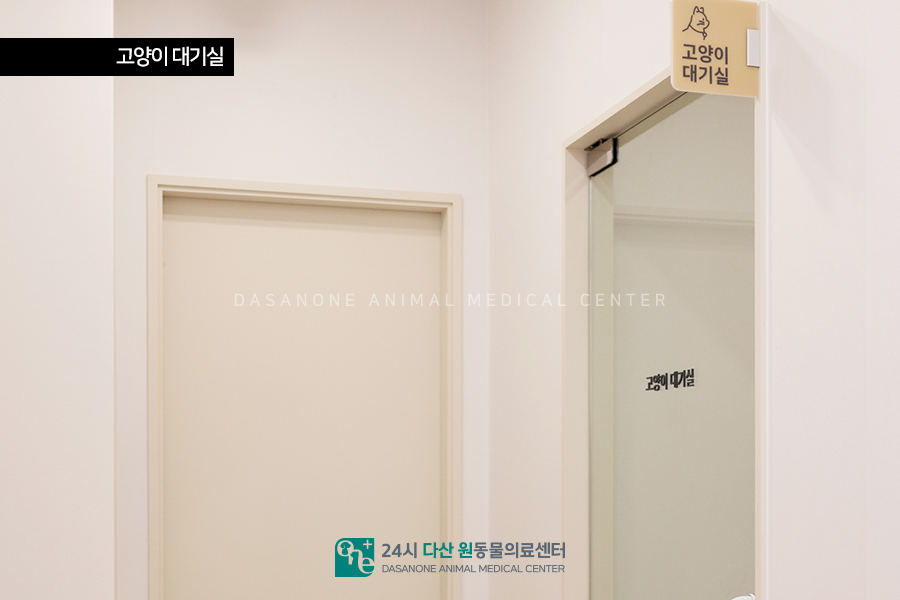

고양이 대기실
고양이는 낯선 환경과 소리에 민감하기 때문에
강아지와 분리된 고양이만의 대기 공간을
마련했습니다. 조용하고 안정적인 분위기에서
보호자님과 함께 대기하며 스트레스를
최소화할 수 있습니다.

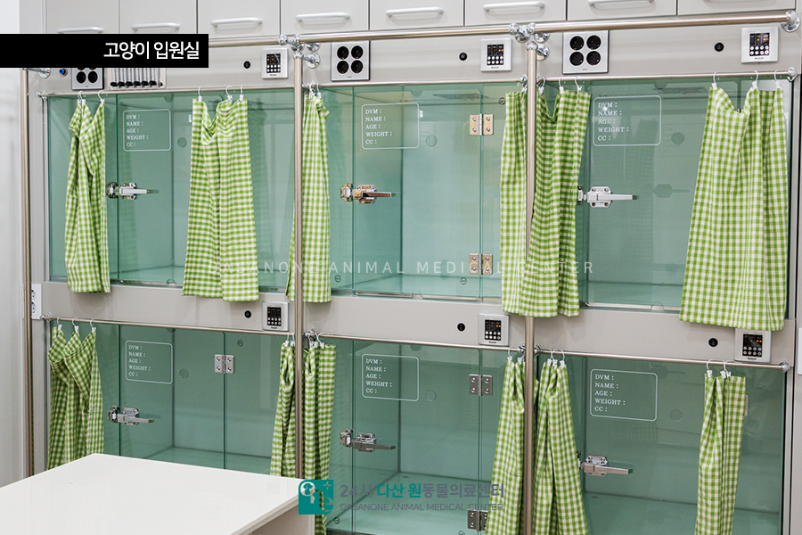

고양이 입원실
입원 치료가 필요한 경우에도 고양이 전용 입원실은
아이들의 독립적인 공간으로 운영되고 있습니다.
긴장감을 줄여줄 수 있도록 가림막도 준비되어,
스트레스 없이 회복할 수 있도록 배려했습니다.

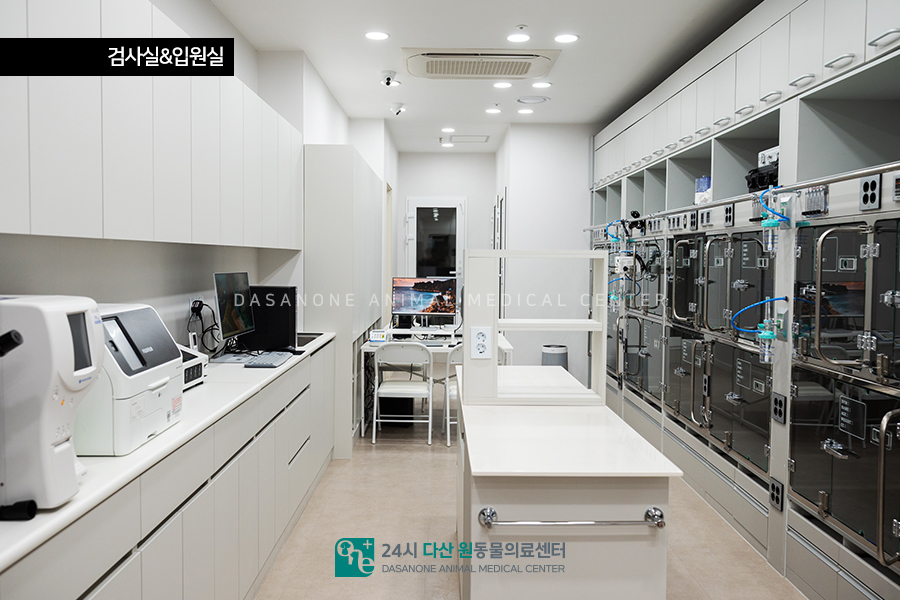

검사실 & 입원실
검사 장비들이 구비된 검사실과,
회복이 필요한 아이들이 머무는 입원실입니다.
실시간 모니터링이 가능해 회복 중에도
안심할 수 있습니다. 아이들이 안정적으로
쉴 수 있도록 쾌적한 환경을 유지하고 있습니다.

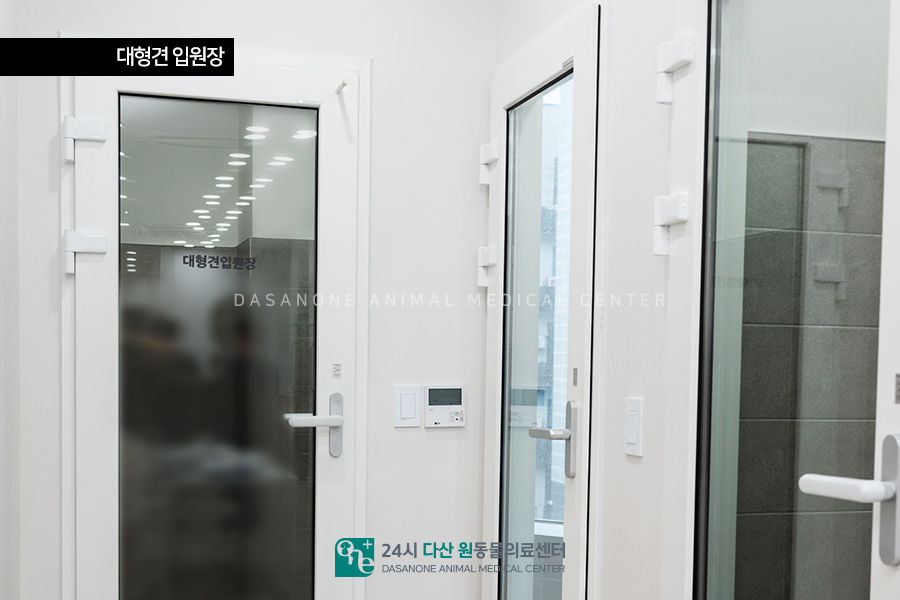

대형견 입원장
체구가 큰 아이들을 위한 대형견 전용 입원 공간도
따로 마련되어 있습니다. 충분히 움직일 수 있는
넓은 공간과 튼튼한 시설로, 아이들은 답답하지 않게
안정적으로 머물며 회복할 수 있도록
관리하고 있습니다.

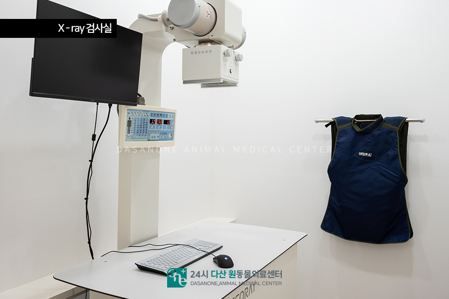

X-ray 검사실
뼈나 내부 장기 상태를 확인할 때 필요한
방사선 촬영실입니다.
빠른 진단과 치료 방향 설정에
큰 도움을 주는 공간입니다.

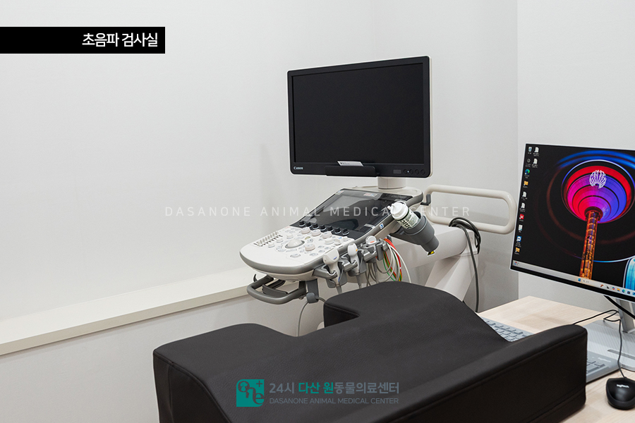

초음파 검사실
심장이나 복부 장기 같은 내부 상태를
세밀하게 확인할 수 있는 초음파 검사실입니다.
아이들에게 큰 부담 없이 정확한 검사가
가능한 중요한 장비입니다.

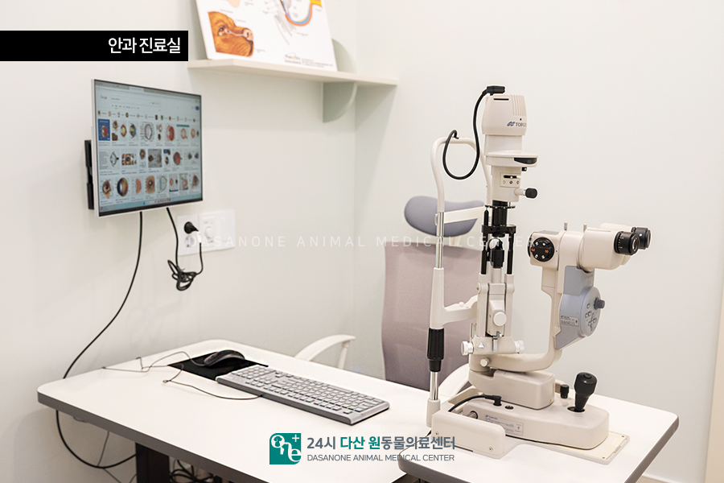

안과 진료실
반려동물의 세밀한 안구 검사가 가능한
전문 안과 장비를 통해 안구 질환을
꼼꼼히 살펴볼 수 있는 진료실입니다.
눈 건강은 삶의 질과 직결되니 더욱 신경 써서
검사하고 있습니다.

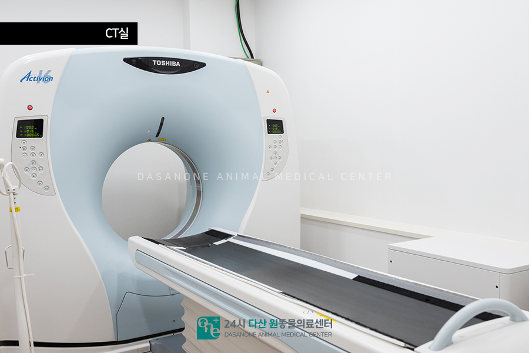

CT 실
더 정확한 진단이 필요한 경우를 위해
최신 CT 장비를 갖춘 검사실이 준비되어 있습니다.
CT 촬영은 일반 X-ray로는 확인하기 어려운
뇌, 척추, 내부 장기, 혈관까지 정밀하게
확인할 수 있어 복잡한 질환이나 수술 계획을
세우는 데 꼭 필요한 검사입니다.

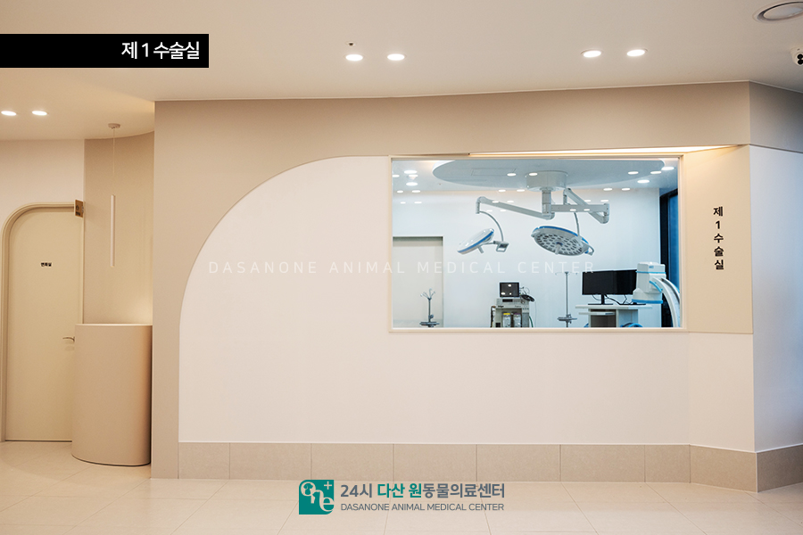

제1 수술실
최신 장비가 갖춰진 수술실입니다.
밖에서도 내부가 보이도록 유리창을 설치해 두어,
보호자님들이 안심하실 수 있도록 했습니다.
우리 아이들의 안전하고 정확한 수술을 위해
철저히 준비되어 있습니다.

---

저희 다산 원동물의료센터는
단순히 치료만 하는 공간이 아니라,
아이들이 편안하고 보호자님들이 안심할 수 있는
공간이 되기 위해 세심한 시설과
진료 시스템을 마련해 두었습니다.
작은 진료부터 정밀 검사,
그리고 입원 치료까지 모든 과정이
안전하고 투명하게 이루어질 수 있도록
최선을 다하고 있습니다.

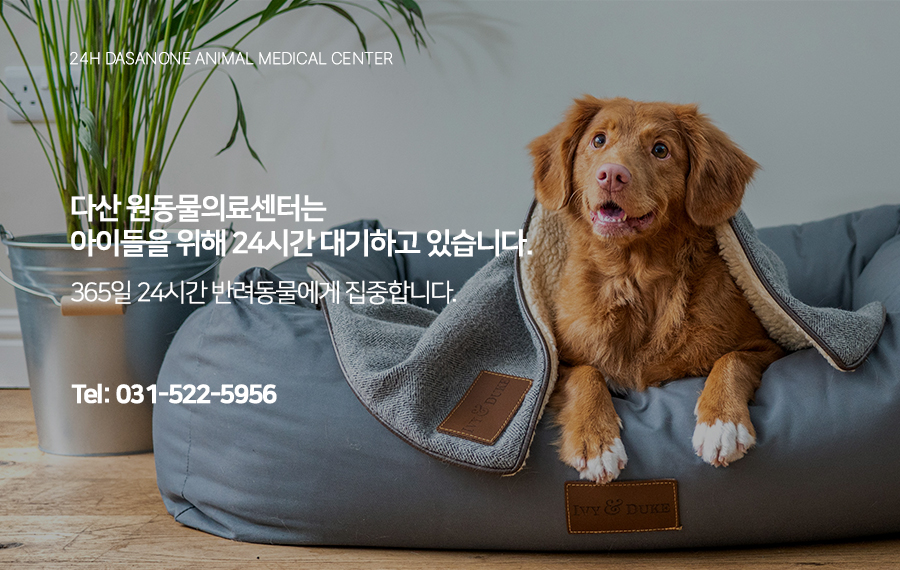

다산 원동물의료센터는
아이들의 응급 상황에 대비하여
24시간 대기하고 있습니다.

📍 24시 다산 원동물의료센터 경기도 남양주시 다산중앙로 15 3층

#다산동물병원추천 #24시간동물병원
#도농역동물병원 #남양주동물병원
#구리동물병원 #강아지CT #고양이CT
#수술잘하는동물병원 #수술전문동물병원
