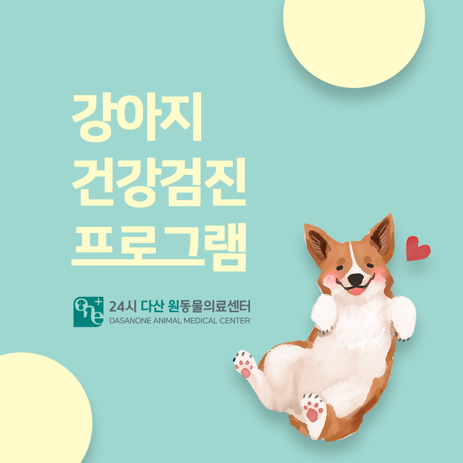
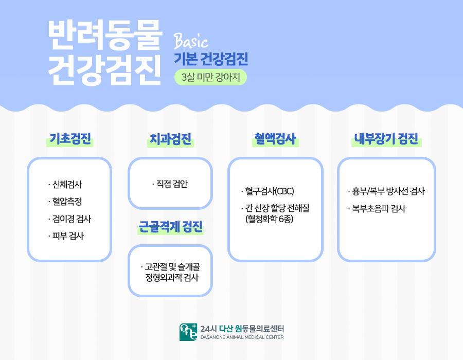
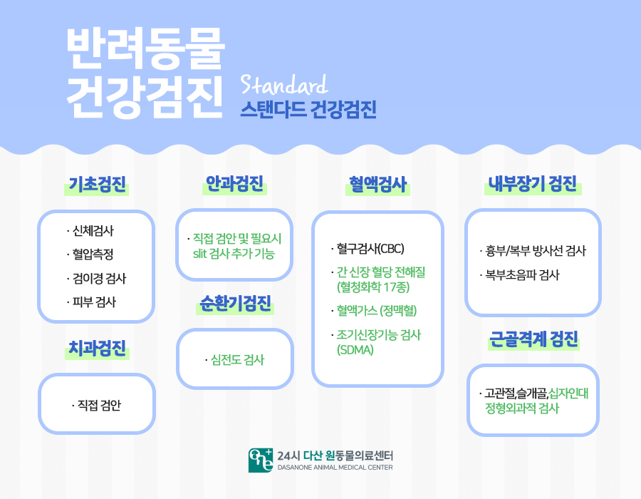
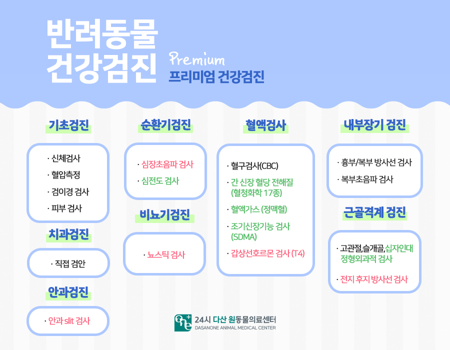
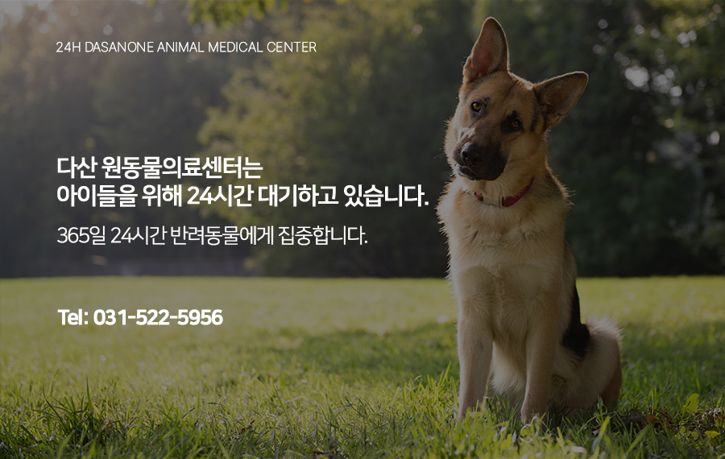

# 남양주 강아지 건강검진 프로그램 소개

- logNo: 224021529043
- date: 2025-09-25
- displayDate: 2025. 9. 25. 16:35
- url: https://blog.naver.com/PostView.naver?blogId=dasanoneamc&logNo=224021529043
- categoryNo: 8
- tags: 

---

> 반려견 건강검진 안내🐶

우리 아이의 건강은 미리 지키는 것이
가장 좋은 방법입니다. 3살 미만 어린 강아지부터
성견, 노령견까지 나이에 맞는 정기적인 건강검진은
질환을 조기 발견하고 건강한 삶을 유지하는 데
큰 도움이 됩니다.
저희 24시 다산 원동물의료센터에서는
반려견의 연령과 필요에 맞춰
Basic / Standard / Premium
세 가지 검진 프로그램을 운영하고 있습니다.

> Basic 기본 겅간검진(3살 미만 강아지)

- 신체검사, 혈압측정, 검이경 검사, 피부 검사
- 직접 구강 검안 (치과검진)
- 혈액검사(CBC, 간·신장 등 혈청화학 6종)
- 흉부/복부 방사선 및 초음파 검사
- 고관절 및 슬개골 정형외과적 검사
👉 어린 강아지의 기초 건강 상태를 확인하는 데
꼭 필요한 기본 검진 패키지 입니다.

> Standard스탠다드 건강검진

- Basic 검진 항목 포함
- 안과검진(직접 검안 및 slit 검사 가능)
- 순환기검진(심전도 검사)
- 혈액검사 확장
(CBC, 간·신장 포함 혈청화학 17종,
혈액가스, 조기신장기능검사)
- 근골격계 추가검사(십자인대 정형외과적 검사 포함)
👉 기존 검진보다 더 정밀한 검사로, 청년기~중년기의
강아지들에게 권장되는 프로그램입니다.

> Premium프리미엄 건강검진

- Standard 검진 항목 포함
- 순환기검진(심장초음파 검사, 심전도 검사)
- 비뇨기검진(뇨스틱 검사)
- 혈액검사 확장 (갑상선호르몬 검사 포함)
- 근골격계 정밀검사(전지/후지 방사선 검사 추가)
👉 심장/내분비/비뇨기 질환까지 폭넓게
확인할 수 있어 중·노령견에게 가장 적합한
종합 건강검진입니다.

---

강아지는 사람보다 노화 속도가 빠르기 때문에,
정기적인 건강검진을 통해 미리 이상을 발견하는 것이
중요합니다. 특히 무증상 상태에서 진행되는
질환들이 많기 때문에 예방 차원의 검진은 필수입니다.
우리 아이에게 맞는 건강검진 프로그램을 선택해보세요!

다산 원동물의료센터는
아이들의 응급 상황에 대비하여
24시간 대기하고 있습니다.

📍 24시 다산 원동물의료센터 경기도 남양주시 다산중앙로 15 3층

#다산동물병원 #24시간동물병원
#남양주동물병원 #강아지건강검진
#남양주건강검진동물병원
#다산건강검진동물병원
#강아지종합검진 #강아지건강검진항목
