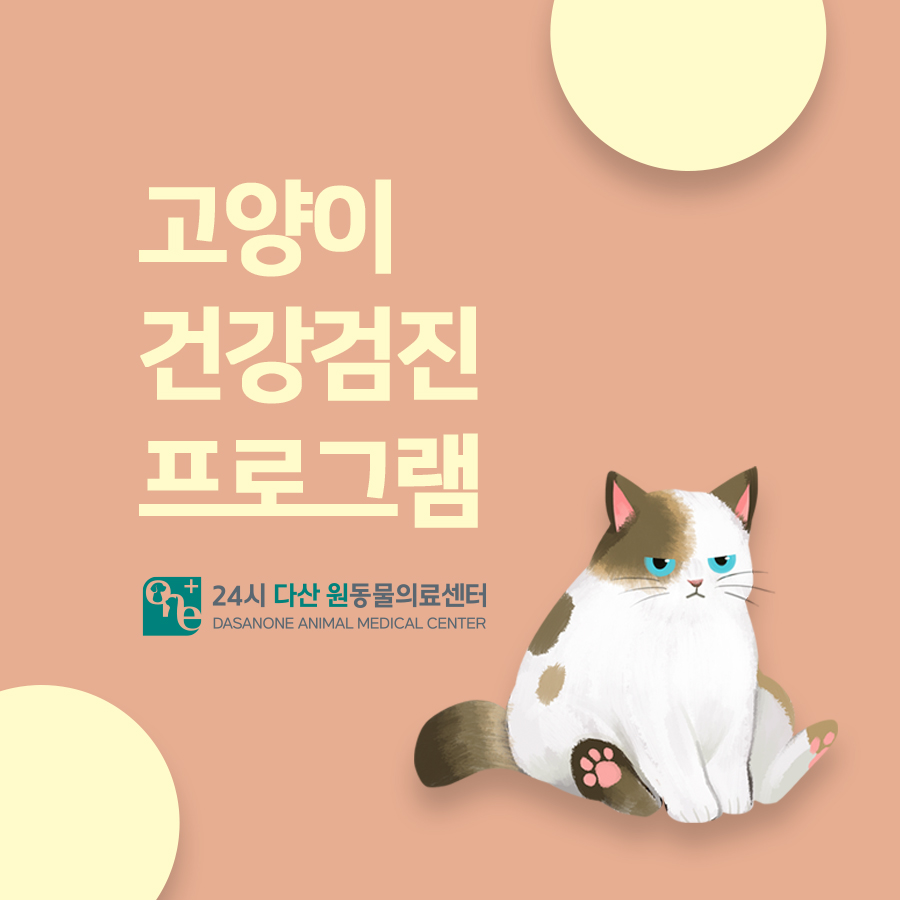
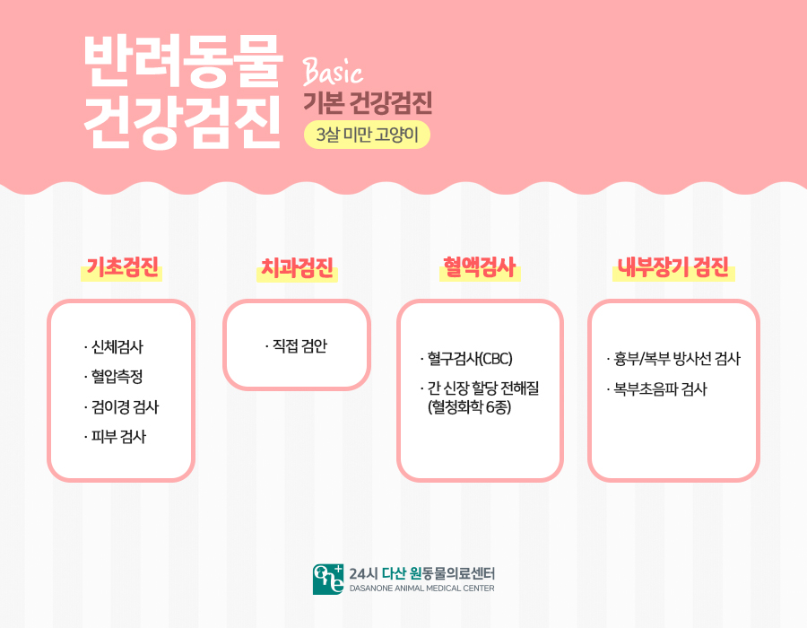
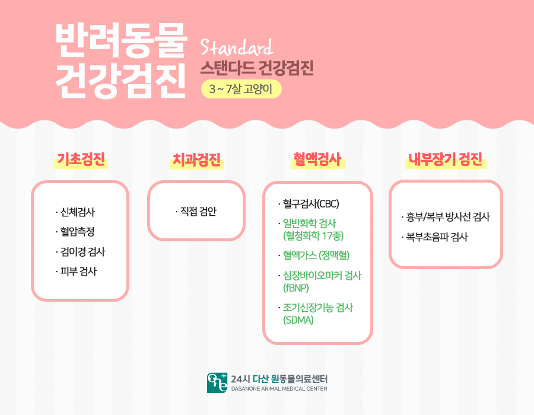
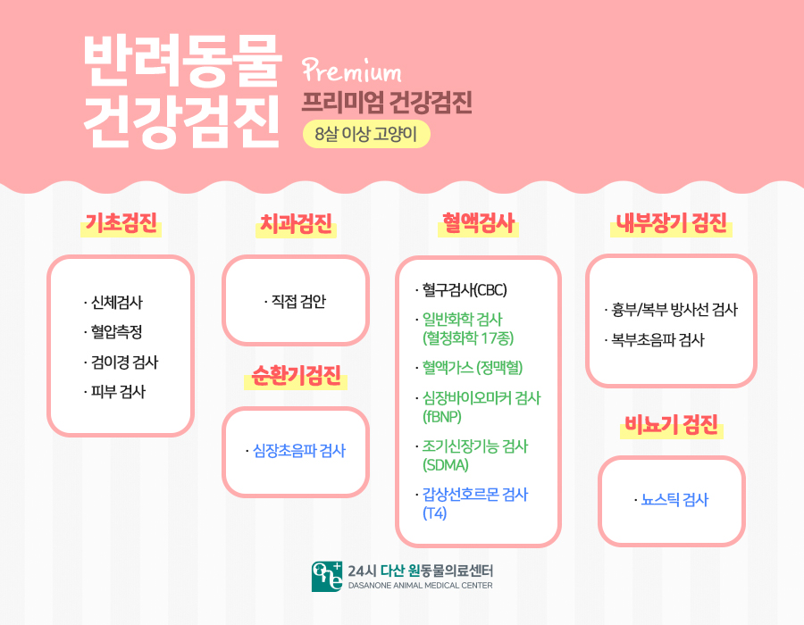
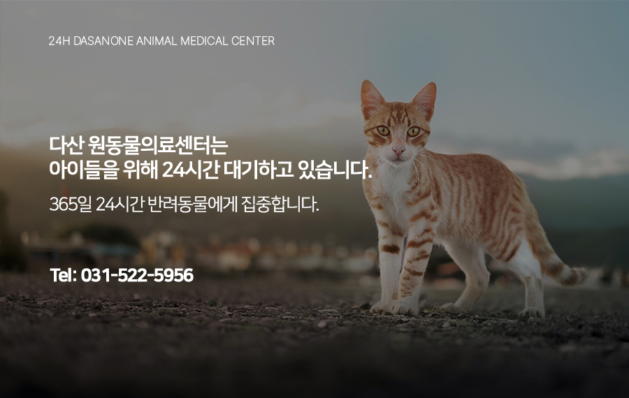

# 남양주 고양이 건강검진 프로그램 소개

- logNo: 224022213259
- date: 2025-09-26
- displayDate: 2025. 9. 26. 9:18
- url: https://blog.naver.com/PostView.naver?blogId=dasanoneamc&logNo=224022213259
- categoryNo: 8
- tags: 

---

> 반려묘 건강검진 안내😺

고양이는 아픈 티를 잘 내지 않기 때문에
정기 건강검진이 무엇보다 중요합니다.
3살 미만의 어린 고양이부터 성묘, 노령묘까지
연령에 맞는 검진은 질환을 조기 발견하고
건강한 삶을 유지하는 데 큰 역할을 합니다.
저희 24시 다산 원동물의료센터에서는
반려견의 연령과 필요에 맞춰
Basic / Standard / Premium
세 가지 검진 프로그램을 운영하고 있습니다.

> Basic 기본 건강검진(3살 미만 고양이)

- 신체검사, 혈압측정, 검이경 검사, 피부 검사
- 직접 구강 검안 (치과검진)
- 혈액검사(CBC, 간·신장 등 혈청화학 6종)
- 흉부/복부 방사선 및 초음파 검사
👉 어린 시기에 발견하기 힘든 선천적 질환이나
초기 문제를 빠르게 확인할 수 있습니다.

> Standard스탠다드 건강검진

- Basic 검진 항목 포함
- 혈액검사확장 (CBC, 일반화학 17종, 혈액가스,
심장바이오마커, 조기신장기능 검사)
- 내부장기검진 (흉부/복부 방사선, 복부초음파)
👉 만성 신장질환, 심장질환 등 성묘기에 흔히 시작되는
질환을 조기에 확인할 수 있어요

> Premium프리미엄 건강검진

- Standard 검진 항목 포함
- 순환기검진 (심장초음파 검사)
- 혈액검사 (CBC, 일반화학 17종, 혈액가스,
심장바이오마커, 조기신장기능, 갑상선호르몬 검사)
- 비뇨기검진 (뇨스틱 검사)
👉 노령묘에서 자주 발생하는 심장병, 신부전,
갑상선질환 등을 조기에 발견하고 관리할 수 있습니다.

---

고양이는 보호자가 아픔을 알아차릴 때쯤이면
이미 병이 진행된 경우가 많습니다.
나이에 맞는 건강검진을 정기적으로 진행한다면,
우리 고양이가 더 오래, 건강하게 함께할 수 있습니다.

다산 원동물의료센터는
아이들의 응급 상황에 대비하여
24시간 대기하고 있습니다.

📍 24시 다산 원동물의료센터 경기도 남양주시 다산중앙로 15 3층

#다산동물병원 #24시간동물병원
#남양주동물병원 #고양이건강검진
#남양주건강검진동물병원
#다산건강검진동물병원
#고양이종합검진 #고양이건강검진항목
