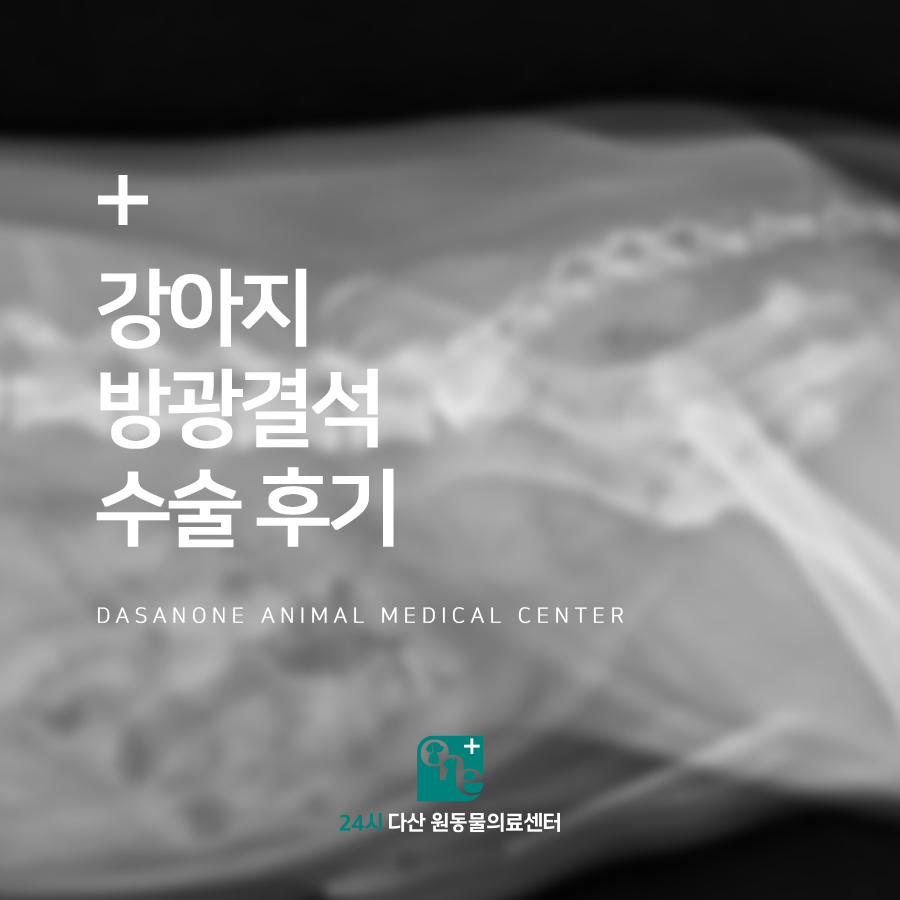
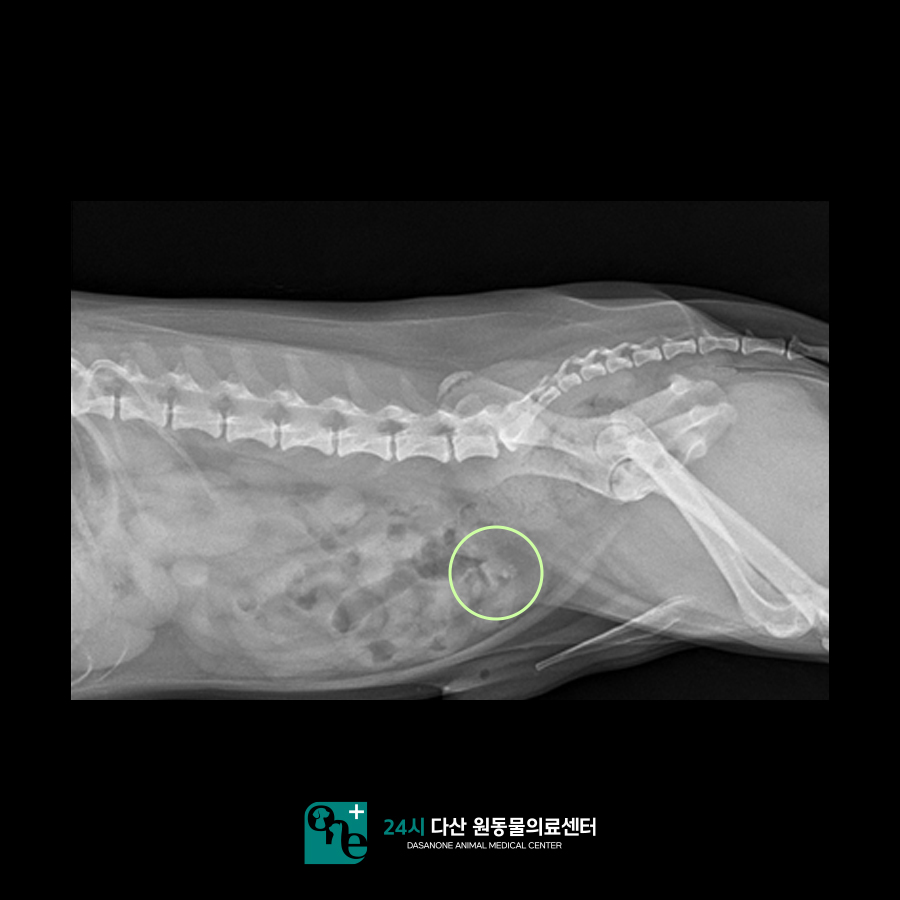
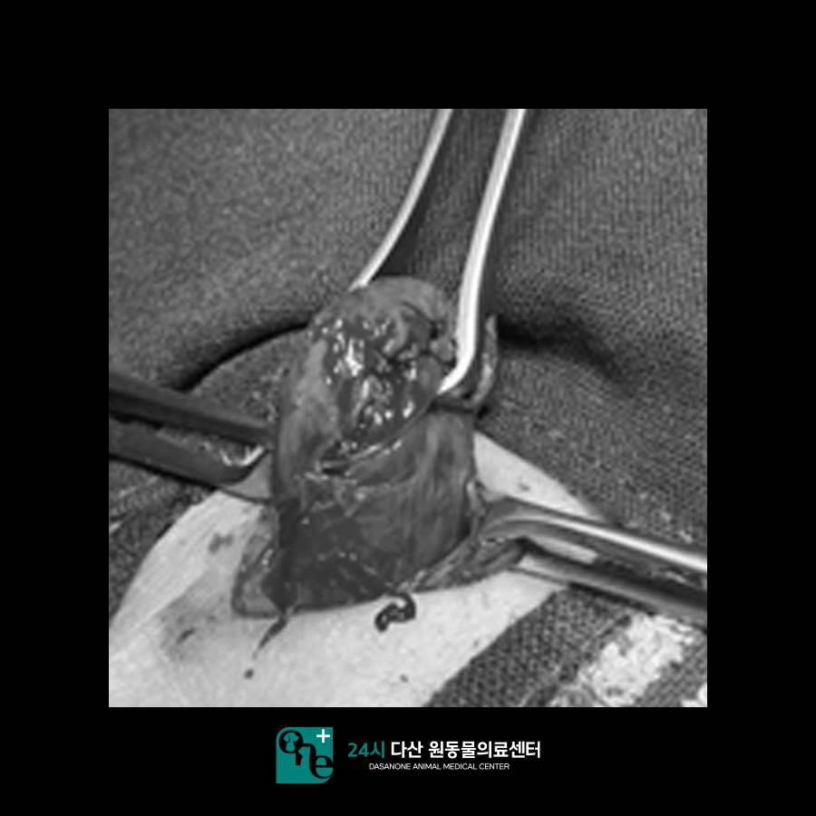
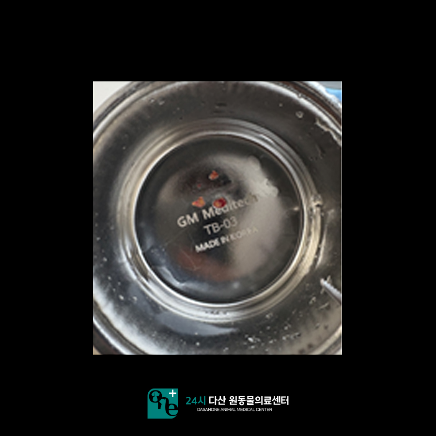
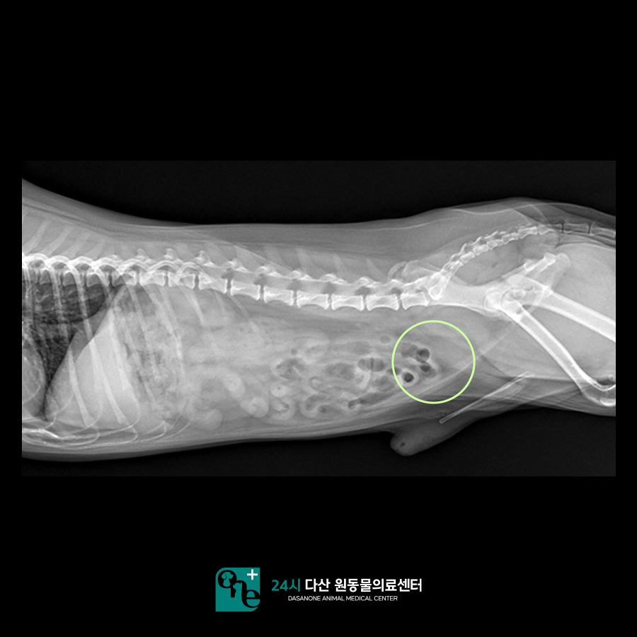
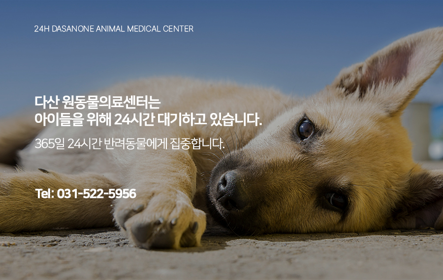

# 퇴계원동물병원, 강아지 방광결석 수술 후기

- logNo: 224040705221
- date: 2025-10-14
- displayDate: 2025. 10. 14. 12:32
- url: https://blog.naver.com/PostView.naver?blogId=dasanoneamc&logNo=224040705221
- categoryNo: 11
- tags: 

---

안녕하세요.
수술 전문 24시 다산 원 동물의료센터입니다.
오늘은 본원에서 혈뇨로 내원한
강아지 바둑이가 어떻게 수술을 진행했는지
알아보도록 하겠습니다.
바둑이는 1주 전부터 소변에 피가 섞여 나와
본원에 내원하게 되었습니다.

> 방사선 검사

방사선 검사에서 방광 내 결석이
다수 확인되었고 초음파상 방광 슬러지와
방광 벽이 비후 된 것이 확인되었습니다.
증상이 지속적으로 반복되어 보호자님께서
수술적 교정을 선택하셨습니다.
본원에서 수술을 진행할 경우 신체검사 및 혈액검사를
진행하게 됩니다. 심장 청진, 흉부 방사선, 혈액검사를
통해 아이가 마취가 가능한지, 수술해도 안전한지
꼼꼼하게 평가한 후 수술을 진행하고 있습니다.
바둑이의 경우 마취 전 검사상 특이사항은 없었습니다 :)

> 수술 진행

방광 내부에 있던 결석들을 모두 제거해 준 뒤
방광 벽을 꼼꼼하게 봉합하고 수술을 마무리
하였습니다. 이후 입원하여 수액과
항생제를 통해 수술 후 관리에 신경을 써주고,
뇨카테터를 장착하여 바둑이가 편하게
소변을 볼 수 있는 환경을 만들어 주었습니다.

> 퇴원 당일 방사선 촬영

입원 기간 내내 활력이 좋았고 혈뇨 증상도
호전을 보였습니다. 퇴원 당일 방사선 촬영에서
결석이 완전히 사라진 것을 확인하였습니다.
이후 의뢰한 결석 성분 분석 결과,
주성분은 칼슘 옥살레이트로 확인되었습니다.
식습관 개선, 충분한 수분 섭취, 결석 보조제로
바둑이는 수술 후 관리를 하기로 하였습니다.
이후 바둑이는 혈뇨 증상 없이 건강하게
잘 지내고 있습니다. :)

24시 다산 원동 물 의료센터는
24시간 수의사가 상주하여 내과 질환부터
응급 상황까지 즉시 진료가 가능한 동물 병원입니다.

📍 24시 다산 원동물의료센터 경기도 남양주시 다산중앙로 15 3층

#다산동물병원 #남양주동물병원
#퇴계원동물병원 #수택동동물병원
#원동물병원 #다산원동물병원
