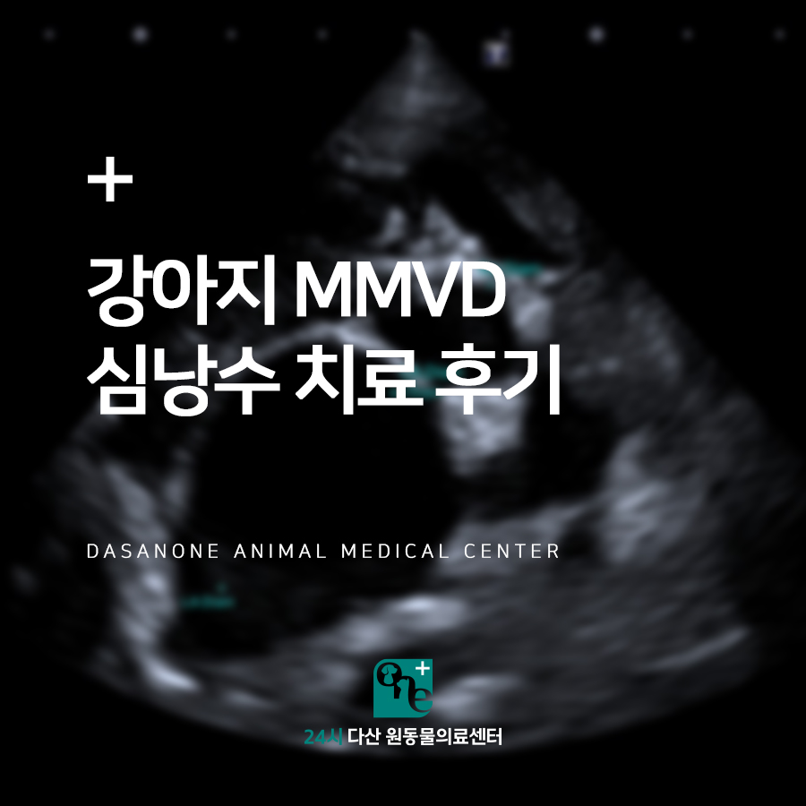
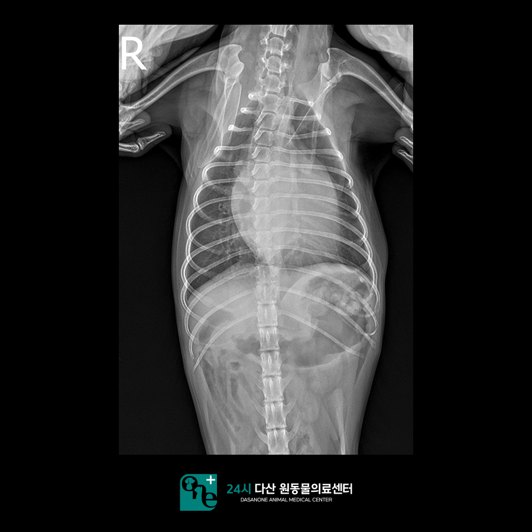
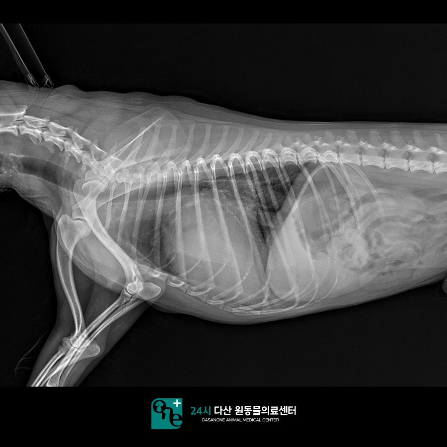
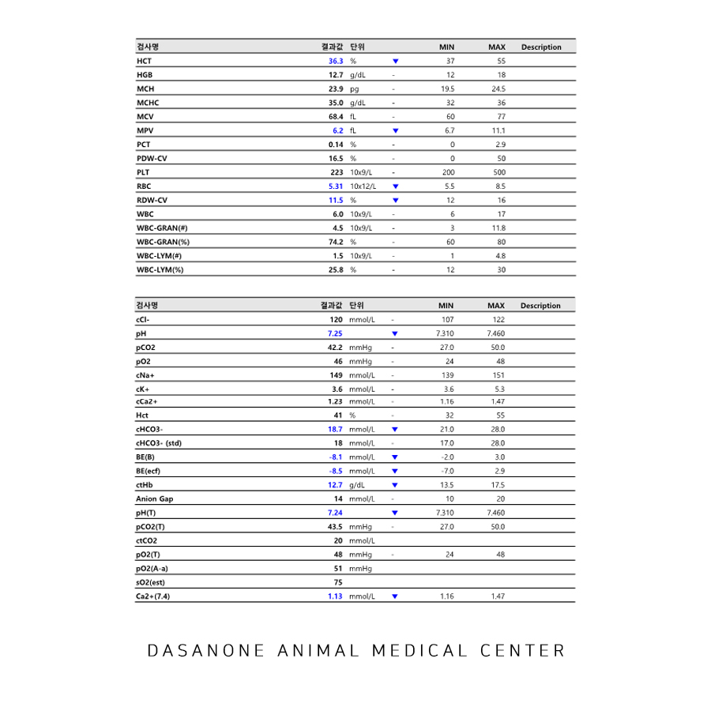
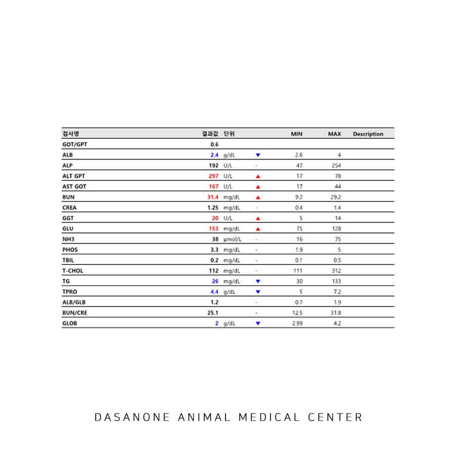
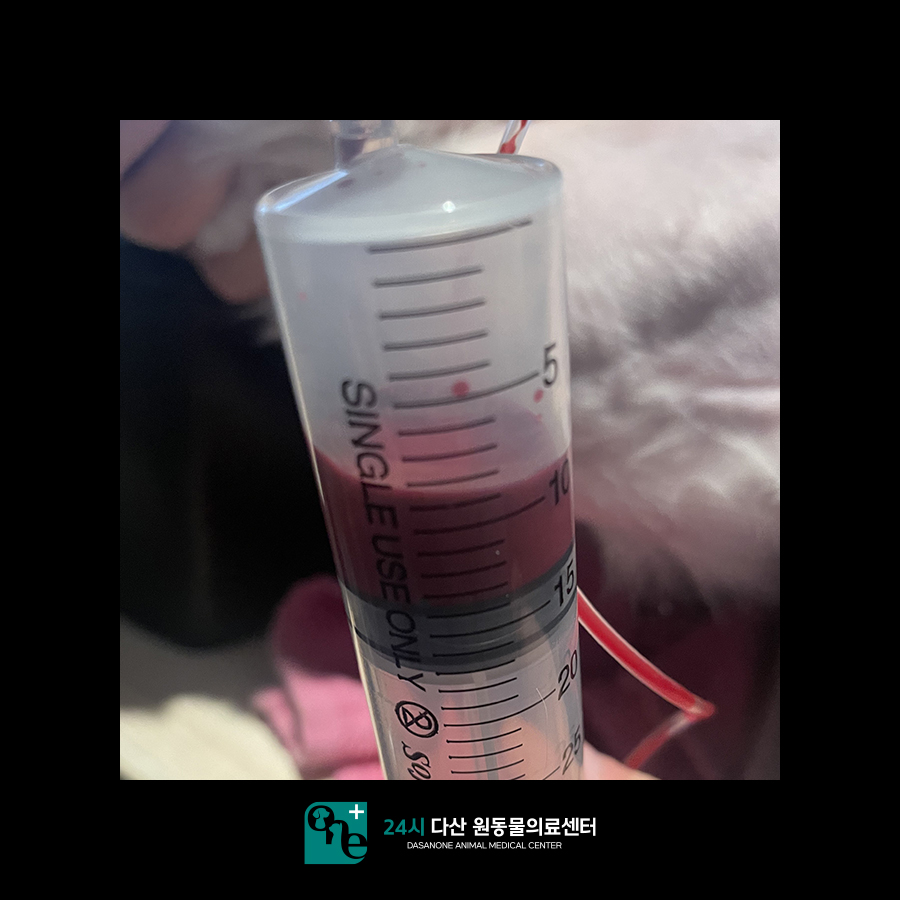
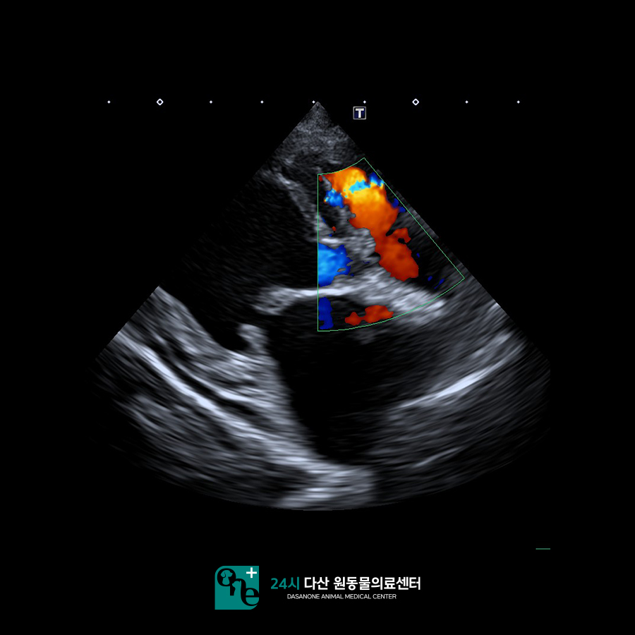
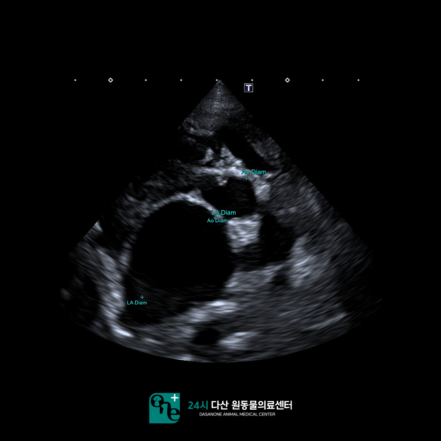
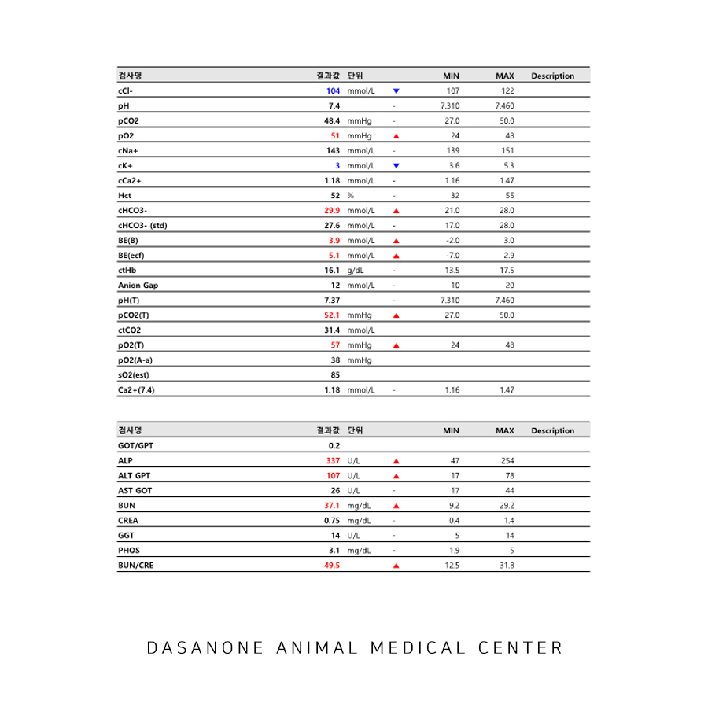
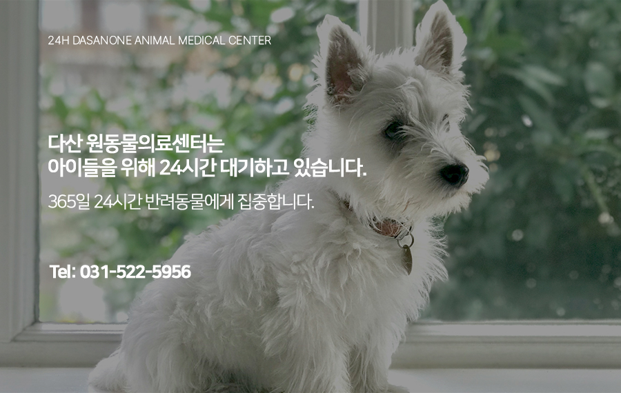

# 강아지 심장병 MMVD, 심낭수 치료 후기. 남양주 동물병원

- logNo: 224044323540
- date: 2025-10-17
- displayDate: 2025. 10. 17. 12:42
- url: https://blog.naver.com/PostView.naver?blogId=dasanoneamc&logNo=224044323540
- categoryNo: 10
- tags: 

---

11살 말티즈 쫑이가 실신 증상으로
다산 원동물의료센터에 내원하였습니다.
집에서 실신 증상을 보인 후 보호자님께서
아이를 깨우시고 바로 본원에 내원해 주셨는데요
아이는 신체검사에서 혈압이 측정이 안될 정도의
저혈압과 심장 청진음이 매우 멀리서 들리는 듯한
느낌과 심한 심잡음을 동반하는 상태였습니다.

> x - ray 촬영

엑스레이에서는 원형의 심장 모양과
lateral view에서 기관 거상 및 좌심방 비대,
간 비대 등을 확인할 수 있었습니다.

> 혈액검사

혈액검사에서는 미약한 빈혈과
간 수치 상승 등이 확인되었으나
실신과 직접적인 연관이 있어 보이진 않았습니다.
쫑이의 경우 일단 승압제를 사용하여 혈압을 올리는
치료를 진행하였고, 수축기 혈압이 80 정도로
올라갔을 때 심장 초음파 검사를 진행했습니다.

> 심장 초음파 검사

심장 초음파 검사에서 심낭수가 차 있는 것을
확인할 수 있었습니다.

> 심낭수 천자

심낭수의 경우 원인이 무엇이든 일단 심낭수를
천자하는 것이 무엇보다 우선시 됩니다.
심낭수 천자는 잘못하여 니들이 아이의 심장을
찌르게 되면 목숨이 위험해질 수 있기 때문에
아주 조심스럽게 천자를 진행하여야 합니다.
보호자님의 동의하에 쫑이는 심낭수 천자를
진행하였고 완전한 혈액성 심낭수가 확인되었습니다.
강아지에서 심낭수가 차게 됐을 때 고려할 질환 중
가장 대표적인 질환들은 심장 종양, 심내막염,
좌심방 파열 등이 있습니다. 쫑이의 경우
심낭수 천자를 진행한 후 혈압이 바로 안정되어
수축기 혈압이 130으로 올랐고, 호흡이 안정되고
빈혈이 사라진 것을 볼 수 있었습니다.

> 심낭수 천자 후 초음파 검사

이후 심장 초음파를 다시 확인했을 때, 쫑이의
심장 초음파에서 종양을 볼 수 없었던 점,
MMVD(강아지 심장병)로 인한 좌심방의 확장이
매우 심했던 점을 고려하여
MMVD로 인한 좌심방 파열로 진단되었습니다.
다만 심내막염을 정확히 배제할 수 없는 상황이었기에
감수성 검사를 같이 진행하였습니다.
쫑이는 MMVD stage C에 준하여 내복약을
처방받아서 복용을 시작하였고, 다음날
안정적인 바이탈을 확인하였습니다.

> 3일 뒤 혈액검사

3일 뒤 재검한 혈액 검사에서 쫑이는
콩팥 수치가 잘 유지되고 있었으며
간 수치가 하락한 것을 확인하였습니다.
이후 쫑이는 집에서 건강하고 안정적으로
생활하고 있다고 보호자님께서 말씀해 주셨습니다.

---

강아지의 실신의 경우 보통 심각한 질환을 동반할
가능성이 높습니다. 증상이 있으면 바로 병원으로
내원하는 것이 좋습니다.
24시 다산 원동물의료센터는 응급센터, 내과, 외과,
영상센터로 분과된 전문 진료 시스템으로 운영하고
있으며, 심낭수 환자처럼 응급 처치가 필요한
상황일 때, 빠르게 대처할 수 있는 전문 의료진이
24시간 상주하고 있습니다.
쫑이야 앞으로 약 잘 챙겨 먹고 아프지 말자 :)

24시 다산 원동 물 의료센터는
24시간 수의사가 상주하여 내과 질환부터
응급 상황까지 즉시 진료가 가능한 동물 병원입니다.

📍 24시 다산 원동물의료센터 경기도 남양주시 다산중앙로 15 3층

#24시간동물병원 #강아지심장병
#강아지MMVD #강아지심낭수
#다산동물병원 #남양주동물병원
#구리동물병원 #갈매동동물병원
#원동물병원 #다산원동물병원
