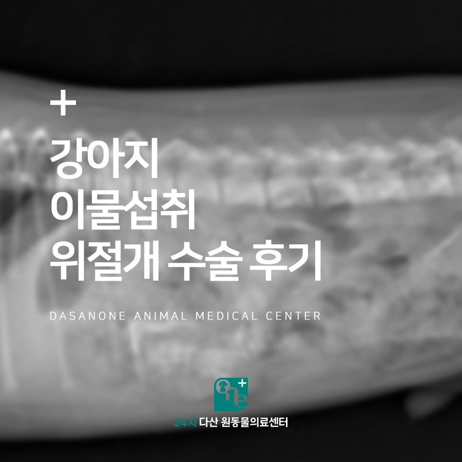
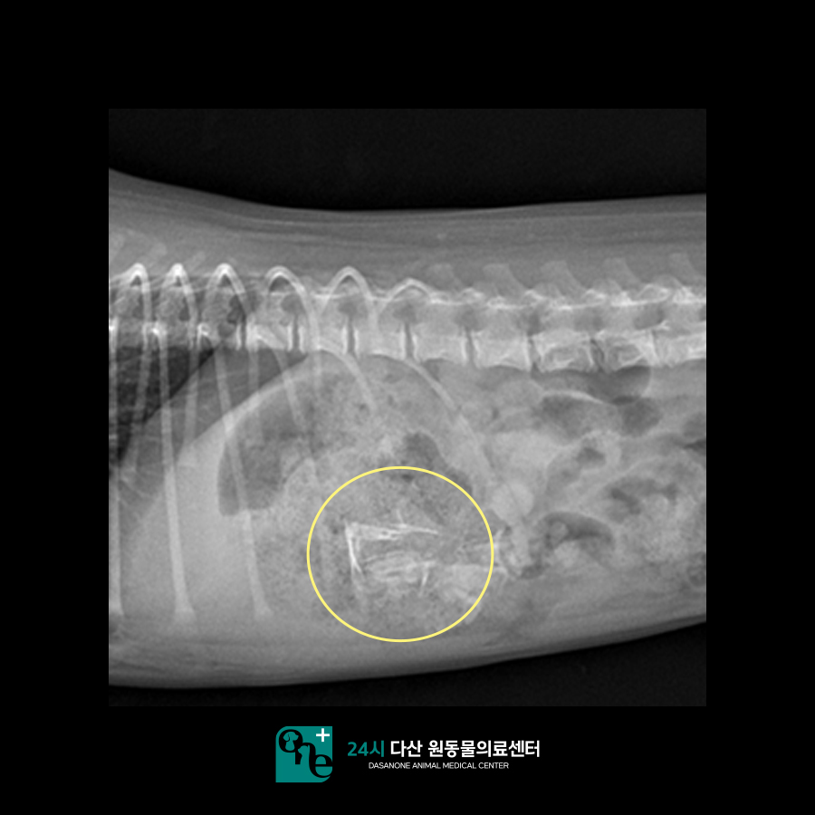
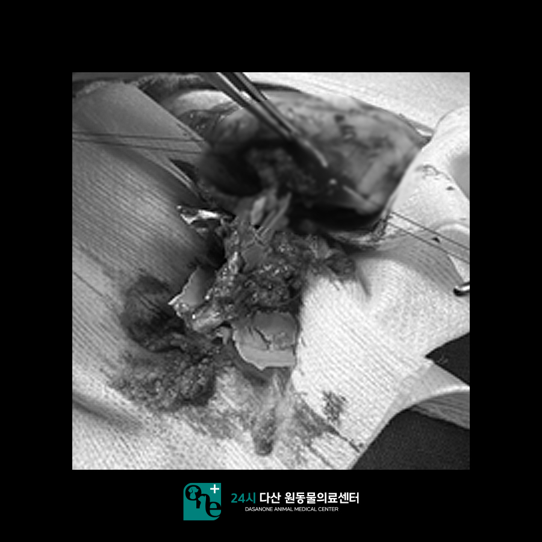
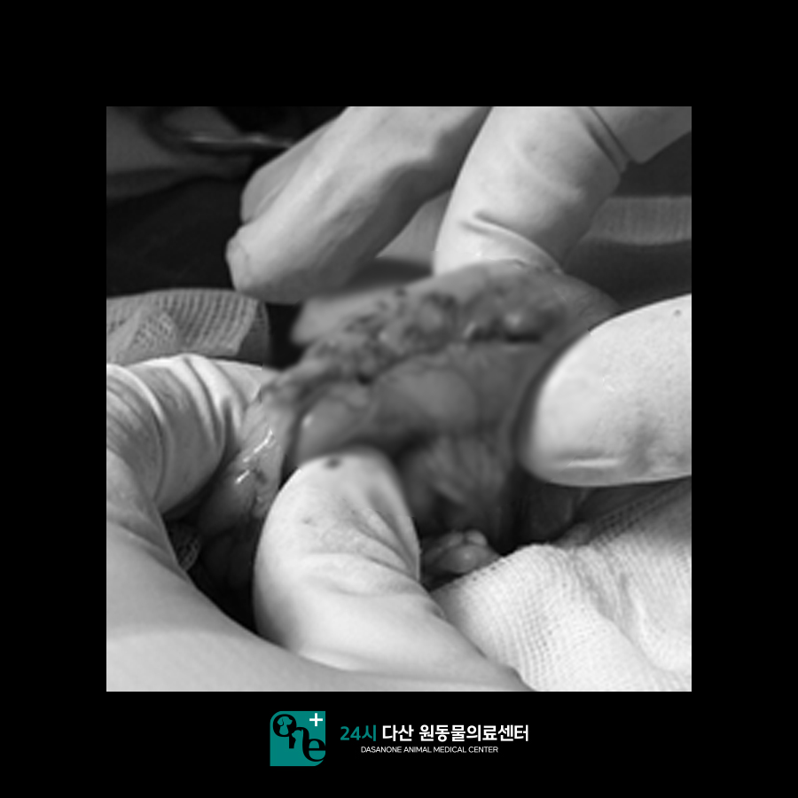
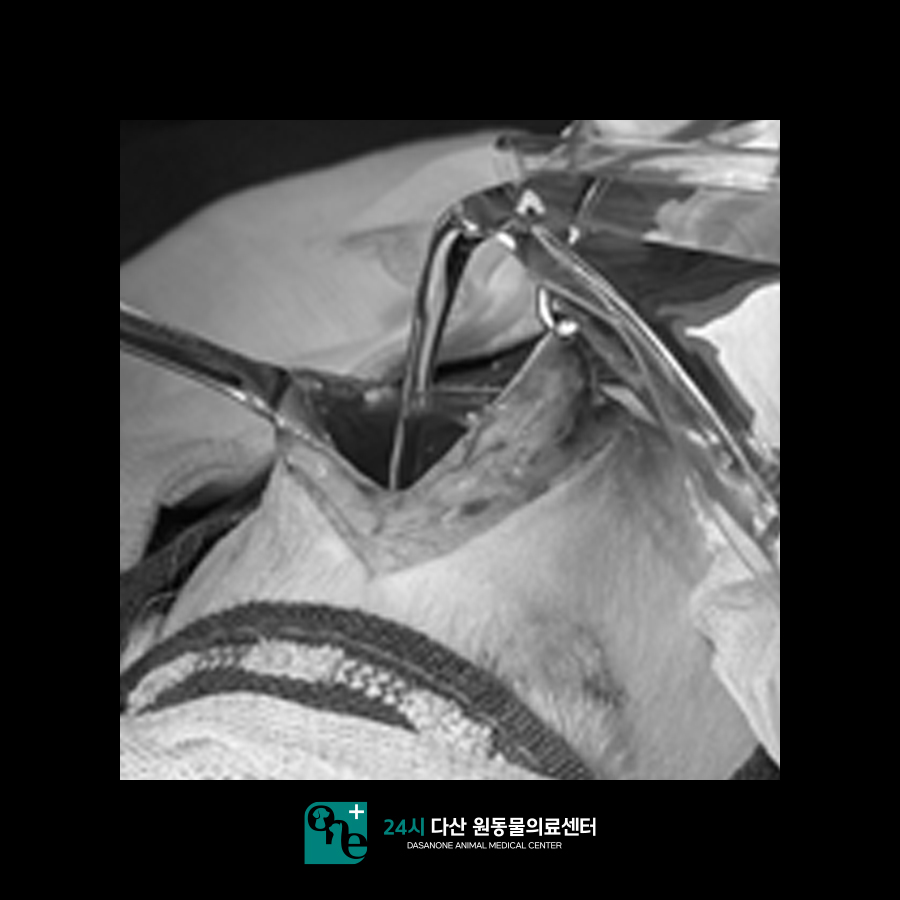
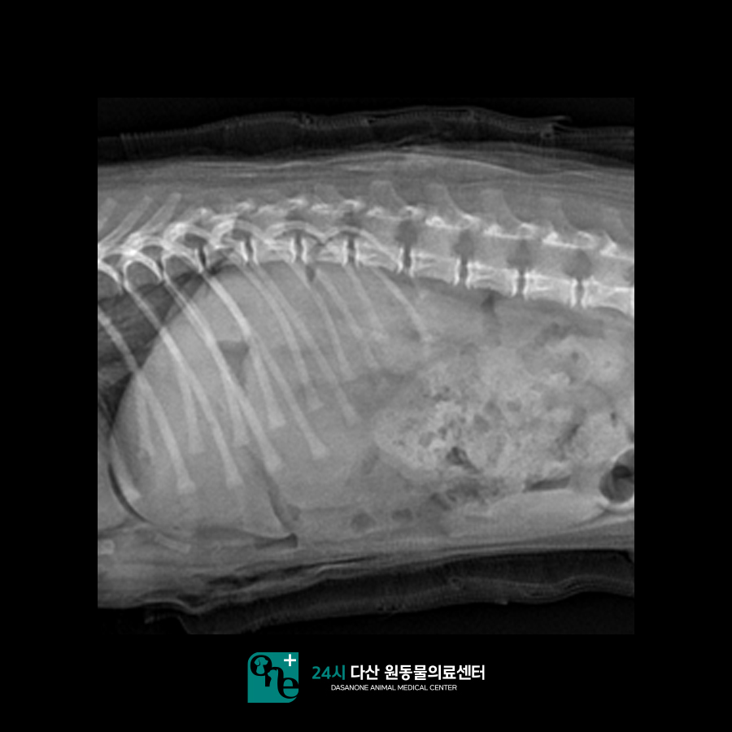
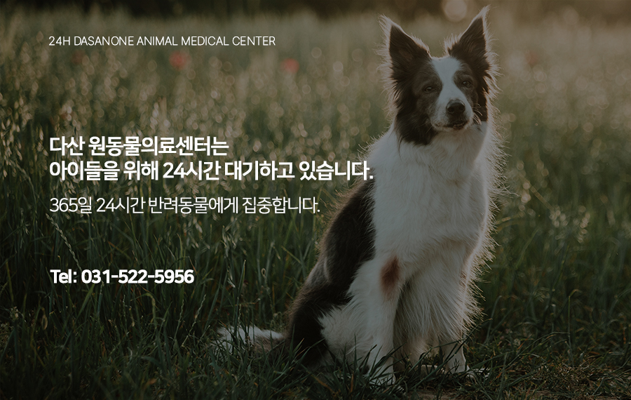

# 남양주 동물병원 강아지 이물 섭취 위 절개 수술 후기

- logNo: 224050894342
- date: 2025-10-23
- displayDate: 2025. 10. 23. 11:14
- url: https://blog.naver.com/PostView.naver?blogId=dasanoneamc&logNo=224050894342
- categoryNo: 11
- tags: 

---

안녕하세요!
수술 전문 24시 다산 원동물의료센터입니다.
오늘은 물놀이 튜브를 삼켜 수술이 필요했던
강아지 토리의 이야기를 소개해 드리겠습니다.
토리는 내원 하루 전날, 물놀이용 튜브를 씹다가
삼켜버렸습니다. 보호자님께서 보여주신
사진으로도 섭취한 양이 상당히 많아 보였고,
이후부터 지속적인 구토가 발생했습니다.
내원 전날 저녁부터 구토가 시작되어,
내원 당일에는 총 3회 이상 구토를 했습니다.

> 방사선 검사

내원 즉시 복부 방사선 촬영을 진행하였고,
위 내부에서 다량의 이물이 여전히
남아있는 것을 확인했습니다. 이처럼
이물이 24시간이 지나도 배출되지 않는 경우에는
수술적 제거가 필요한 상황입니다.
본원에서 수술을 진행하게 될 경우
신체검사 및 혈액검사를 진행하게 됩니다.
심장 청진, 흉부 방사선, 혈액검사를 통해
안전한 마취가 가능한지 꼼꼼히 평가 후
수술을 진행하고 있습니다.
토리의 경우 마취 전 검사상 간 수치가 높은 것
외에는 특이사항이 없었기 때문에 수액에
간 보조제를 추가하여 입원 처치하고
수술을 진행하였습니다.

> 위 절개 수술 진행

수술을 통해 확인한 이물은 딱딱한 플라스틱 재질의
튜브 조각이었습니다. 날카로운 모서리로 인해
위벽을 손상시킬 수 있어 매우 조심스럽게
이물을 하나씩 제거했습니다.

모든 이물을 제거한 뒤에는 위벽을 꼼꼼히 봉합하고,
복강 세척을 통해 잔여 오염을 방지했습니다.
마취 회복도 무리 없이 안정적으로 이루어졌습니다.

> 수술 후 방사선 촬영

수술 후 방사선 촬영을 총해 위 내부의 이물이
완전히 제거된 것을 확인했습니다.
수술 후 토리는 입원 치료를 통해
수액, 항생제, 간 보조제를 투여받으며
관리를 받았으며, 입원 기간 중 구토 증상이
사라지고, 점차 식욕이 회복되어
건강한 모습을 되찾았습니다.

---

이물 섭취는 갑작스럽게 일어날 수 있는
응급상황입니다. 이물이 위나 장에 남아있을 경우
생명을 위협할 수 있으므로, 빠른 검사와
수술적 대응이 중요합니다.

24시 다산 원동물의료센터는 수의사가
24시간 상주며, 응급수술 및 집중치료가
가능한 병원입니다.

📍 24시 다산 원동물의료센터 경기도 남양주시 다산중앙로 15 3층

#강아지이물섭취 #강아지수술
#강아지위절개수술 #강아지이물섭취치료
#다산동물병원 #남양주동물병원
#구리동물병원 #갈매동동물병원
#원동물병원 #다산원동물병원
