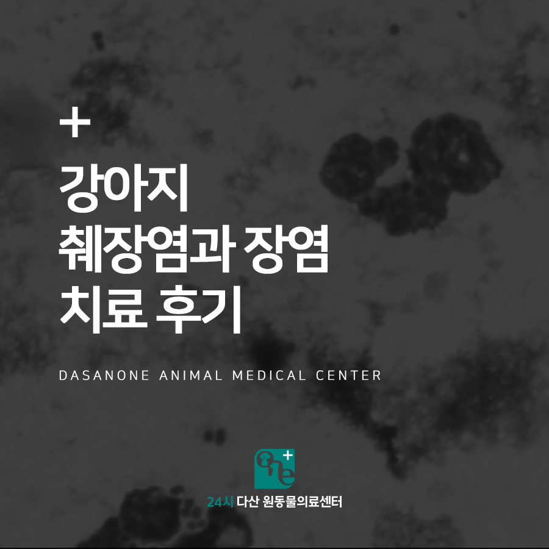
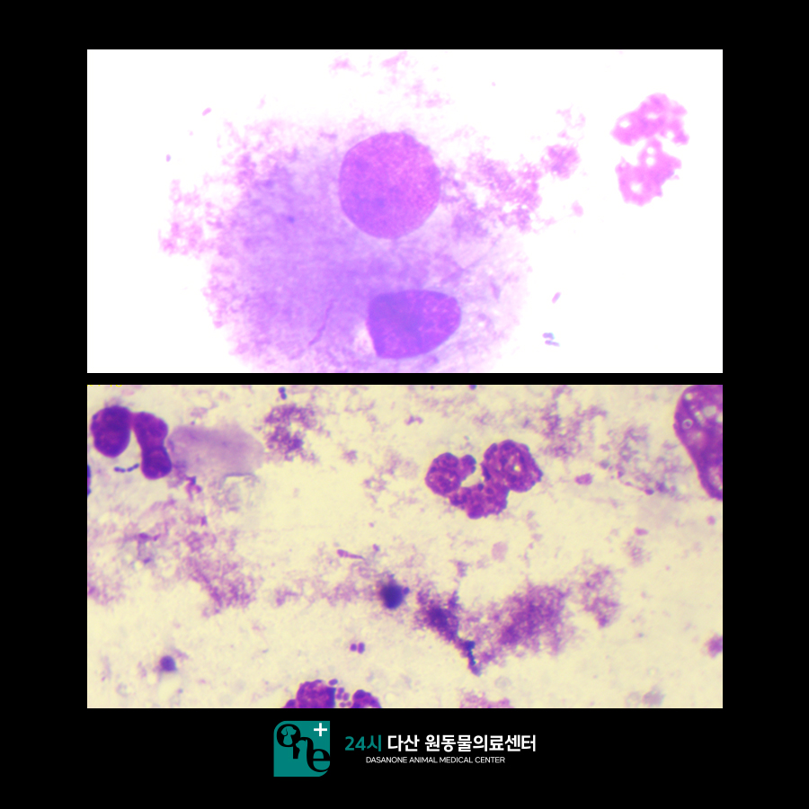
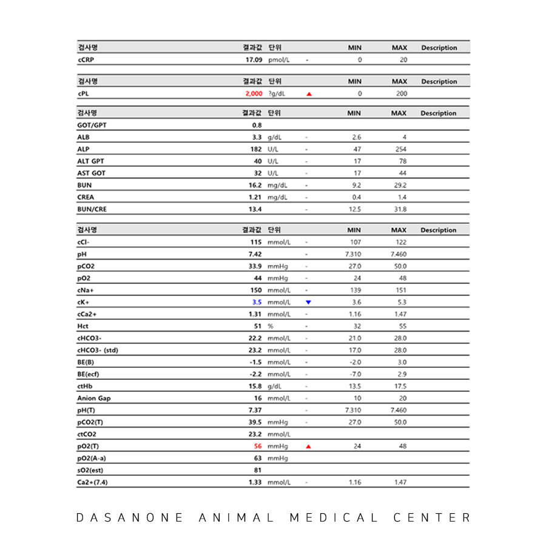
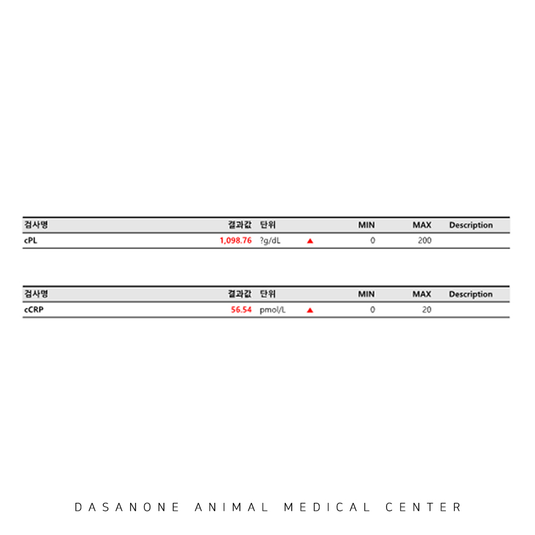
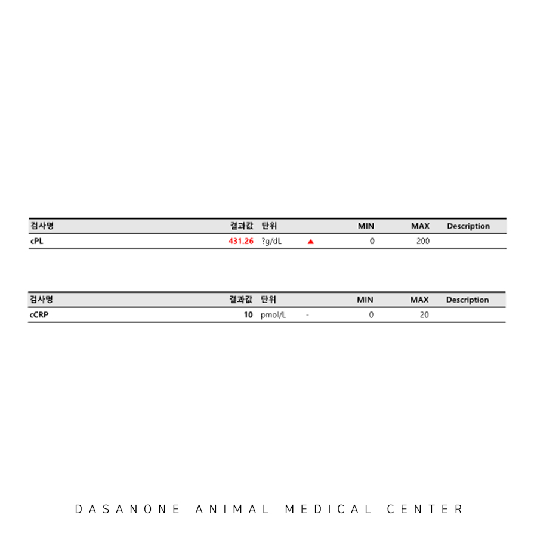
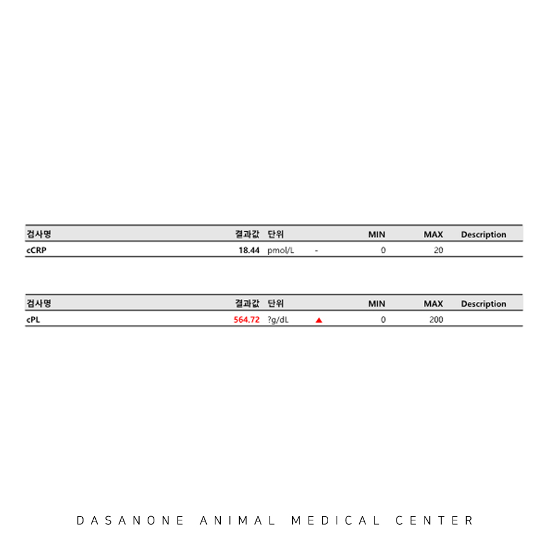
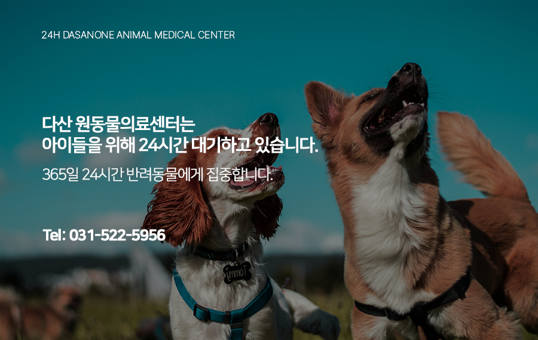

# 도농역 동물병원, 강아지 췌장염과 장염 치료 후기

- logNo: 224064419715
- date: 2025-11-04
- displayDate: 2025. 11. 4. 15:47
- url: https://blog.naver.com/PostView.naver?blogId=dasanoneamc&logNo=224064419715
- categoryNo: 10
- tags: 

---

12살 스피츠 밀키가 혈변과 기력저하 증상으로
다산 원동물의료센터에 내원하였습니다.
내원 당일 아침 설사를 시작했으며 식욕저하
증상을 보였던 밀키는 오후부터는 단시간에
10회가량 구토를 하고 저녁에는 혈변을 보고
기력 저하가 명확하게 느껴져 내원하셨습니다.
밀키는 이전부터 장염을 자주 앓는 기왕력을
가졌다고 합니다. 아이의 나이와 증상의 정도를
고려하여 혈액검사, 분변 검사, 영상검사까지
전반적인 검사를 진행하기로 하였습니다.

> 분변 검사

분변 검사에서는 탈락된 상피세포가
다수 관찰되었고, 탐식 중인 염증세포도
확인되었습니다. 정상적으로 있어야 할 장내
세균총이 명확하게 감소한 상태였습니다.

> 1일차 혈액 검사

혈액검사에서는 췌장염 수치가 기계에서
측정 가능한 최대치를 넘어선 상태로 나왔습니다.
그 외 전반적인 혈액검사 상 수치들의 특이사항이
없는 것으로 보아 밀키의 소화기 증상의 원인은
췌장염과 장염으로 진단되어, 입원을 결정하고
수액 치료와 주사제, 경구제와 유산균 등이
처방되었습니다.

> 2일차 혈액 검사

다행히 원내에서 밀키는 자발 식욕이 양호했고
이튿날부터 구토나 혈변이 잡혔습니다. 입원 이틀 만에
췌장염 수치가 많이 떨어졌지만 염증 수치는 첫날 보다
많이 증가한 상태였습니다.

> 3일차 혈액 검사

입원 3일차, 밀키는 식욕과 활력이 양호한 상태로
염증수치는 다시 정상 범위가 되었습니다.
췌장염 수치 또한 많이 떨어진 것을 확인하고
보호자님께서 빠른 퇴원을 희망하셨습니다.
그래서 밀키는 입원 3일 만에 퇴원하였고
통원치료로 전환하였습니다.

> 통원 치료 혈액 검사

3일 뒤 밀키는 혈액 검사와 재진을 위해 내원하였고
췌장염 수치가 조금 더 하락한 것을 확인하였습니다.
이후 밀키는 만성 췌장염 환자에 준하는
식이관리와 보조제 복용을 지속하며
특이사항 없이 건강히 잘 지내고 있습니다 :)

---

이처럼 고령의 반려견에게 갑작스러운 구토나 혈변,
식욕저하가 나타난다면 췌장염 가능성을 항상
염두에 두어야 합니다. 췌장염은 조기에 빠르게
수액치료를 시작하는 것이 회복의 핵심이며,
적절한 식이조절과 보조치료가 병행되어야
재발을 막을 수 있습니다. 만약 소화기 증상이
심하게 나타난다면, 지체하지 말고 즉시
동물병원으로 내원하시길 권장 드립니다.
밀키야 앞으로 아프지 말고 건강하게 지내자~

24시 다산 원 동물의료센터는
응급센터, 내과, 외과 영상센터로 분과된
전문 시스템으로 운영하고 있으며
24시간 수의사가 상주하여 응급 상황까지
즉시 진료가 가능한 동물병원입니다.

📍 24시 다산 원동물의료센터 경기도 남양주시 다산중앙로 15 3층

#강아지췌장염 #강아지장염
#강아지췌장염치료 #다산동물병원
#다산원동물병원 #남양주동물병원
#도농역동물병원 #인창동동물병원
