# 심한 호흡곤란, 심인성 폐수종과 MMVD 치료 후기 인창동 동물병원

- logNo: 224068256681
- date: 2025-11-07
- displayDate: 2025. 11. 7. 17:57
- url: https://blog.naver.com/PostView.naver?blogId=dasanoneamc&logNo=224068256681
- categoryNo: 10
- tags: 

---

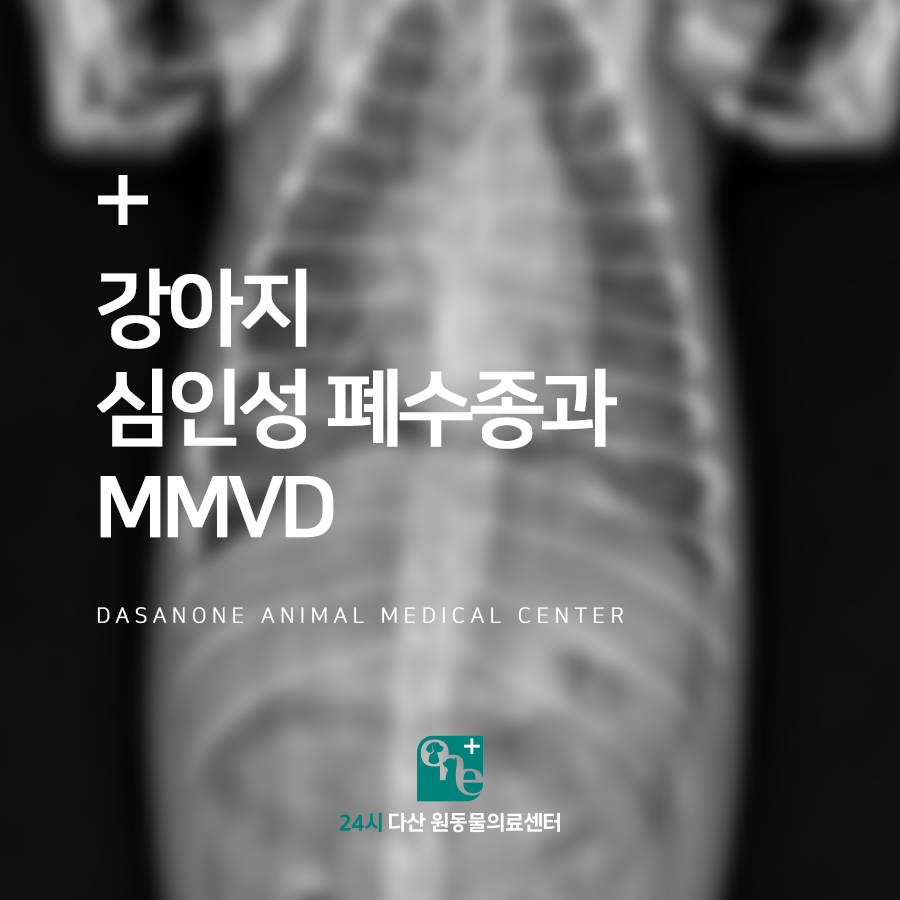

9살 말티즈 마루는 갑작스러운 호흡곤란으로
24시 다산 원동물의료센터에 응급 내원하였습니다.
마루는 내원 당시 심한 청색증과
빈호흡 증상이 동반되었습니다.

> 내원 당시 방사선 촬영

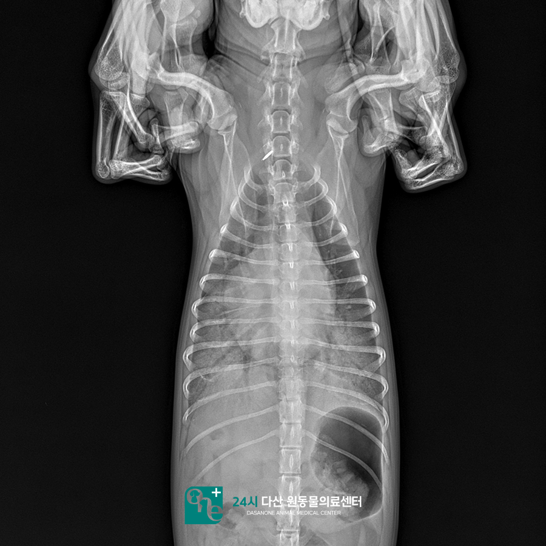

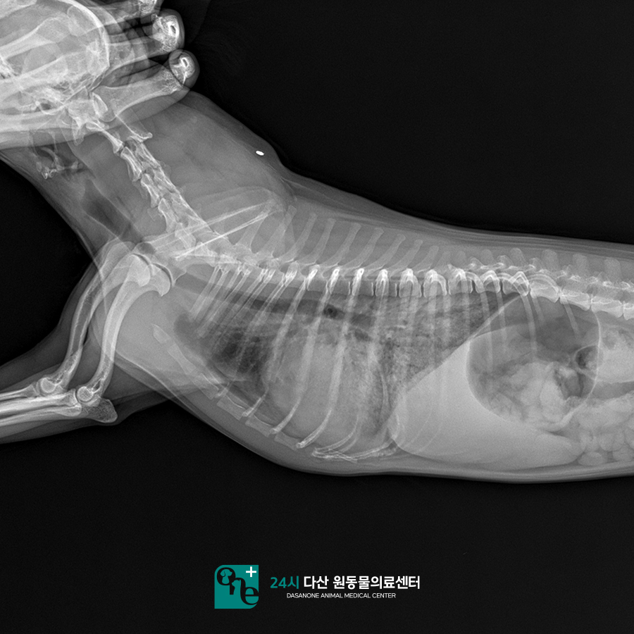

청진상 심한 심잡음이 들렸고, 엑스레이 촬영상
폐 전반에 걸친 폐침윤 소견이 관찰되어
심인성 폐수종으로 가진단 하였습니다.
이후 빠르게 이뇨제와 강심제 주사,
그리고 의료용 산소치료를 시작하였습니다.

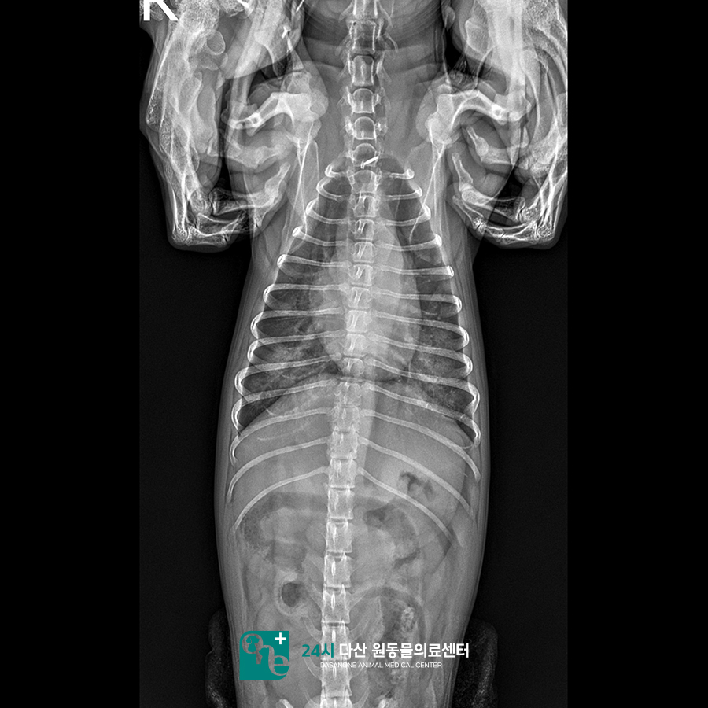

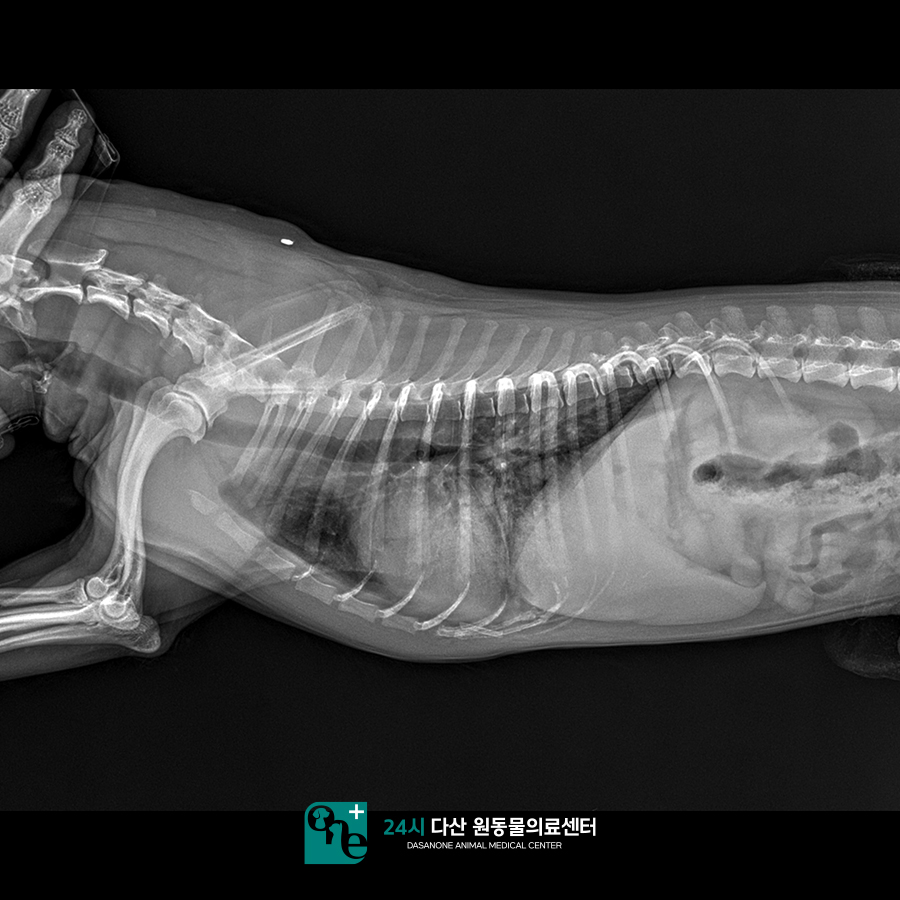

다행히 치료 직후 마루의 호흡은
빠르게 안정되었으며, 입원 당일 저녁 촬영한
방사선에서는 폐침윤이 눈에 띄게 감소된
모습을 보였습니다.

> 혈액검사

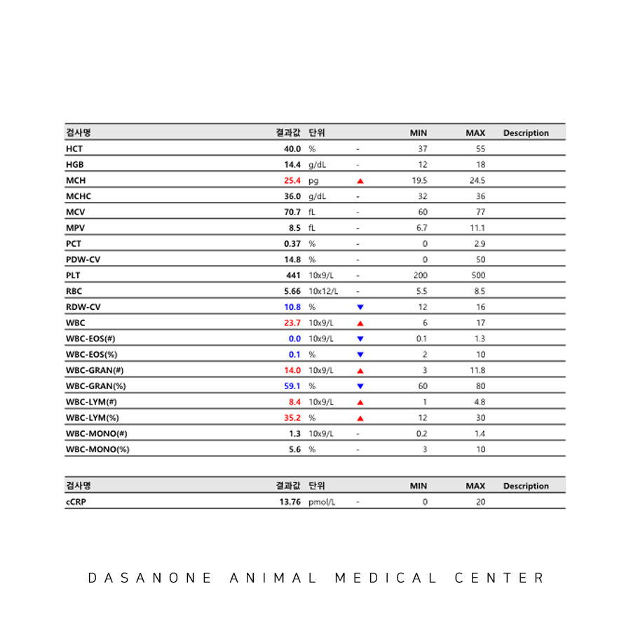

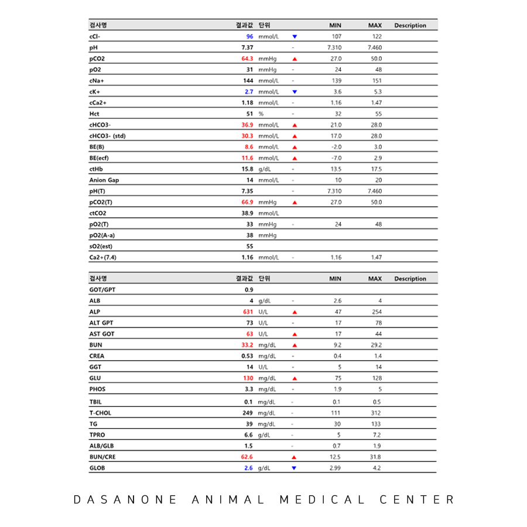

마루의 호흡이 안정된 후 진행한 혈액검사에서
경미한 백혈구 증가와 간 수치 상승을 보였지만,
염증 수치는 정상 범위였습니다.

> 입원 2일 차 방사선 촬영

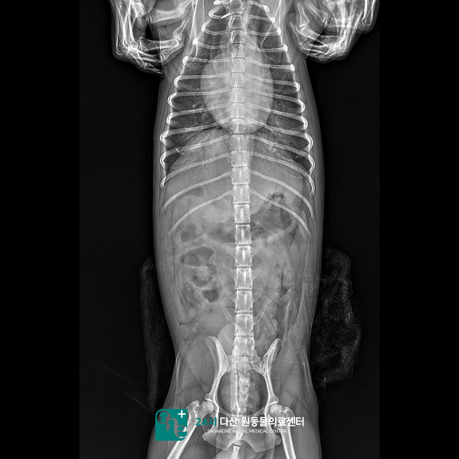

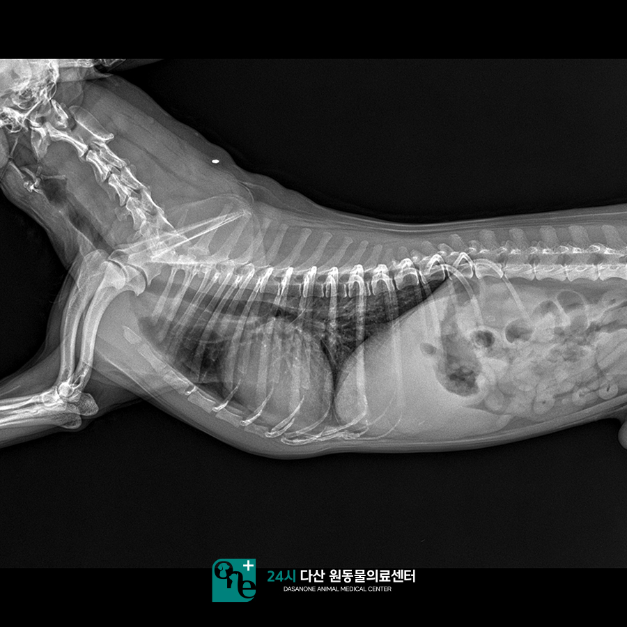

입원 이틀 차 마루는 방사선 촬영에서 심장의 크기가
많이 줄어들었고, 폐침윤도 많이 개선된 것을
확인하였으나, 양측 폐 후엽 부분이 아직
폐침윤이 남아있었습니다.

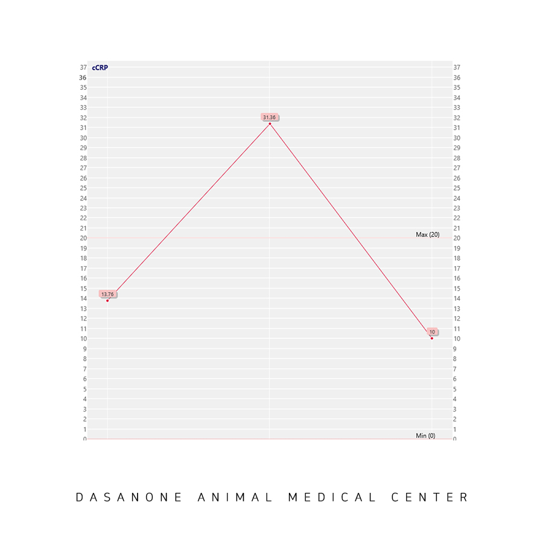

이뇨제 치료를 계속하고 호흡이 안정됐음에도
폐침윤이 남아있는 것으로 보아
심인성 폐수종에 더하여 폐렴 혹은 비심인성
폐수종까지 동반되었을 수 있음을 고려하여
CRP 수치를 다시 측정하였고,
상승된 CRP 수치를 확인하여 염증 수치 하락을 위해
항생제 치료를 추가하게 되었습니다.
마루의 호흡이 안정된 후 진행된 심장초음파
검사 결과에서 중증도의 판막 변성과,
심한 혈액 역류, 좌심방 확장 등 MMVD를
진단할 수 있었습니다.

> 입원 3일 차 방사선 촬영

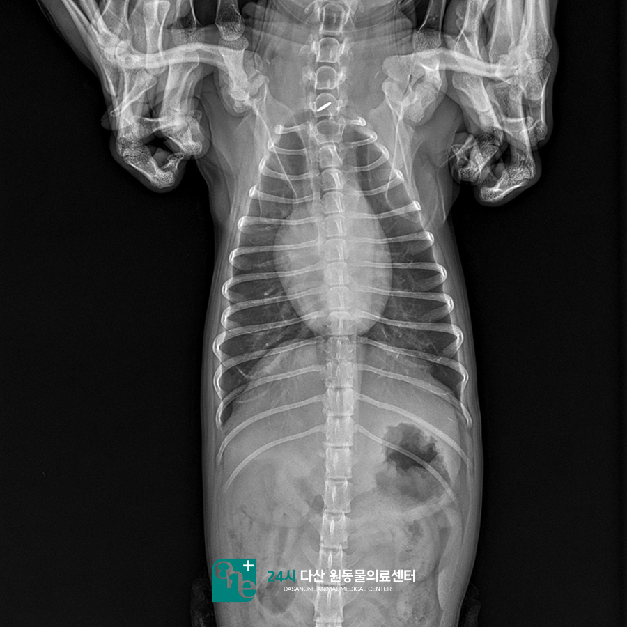

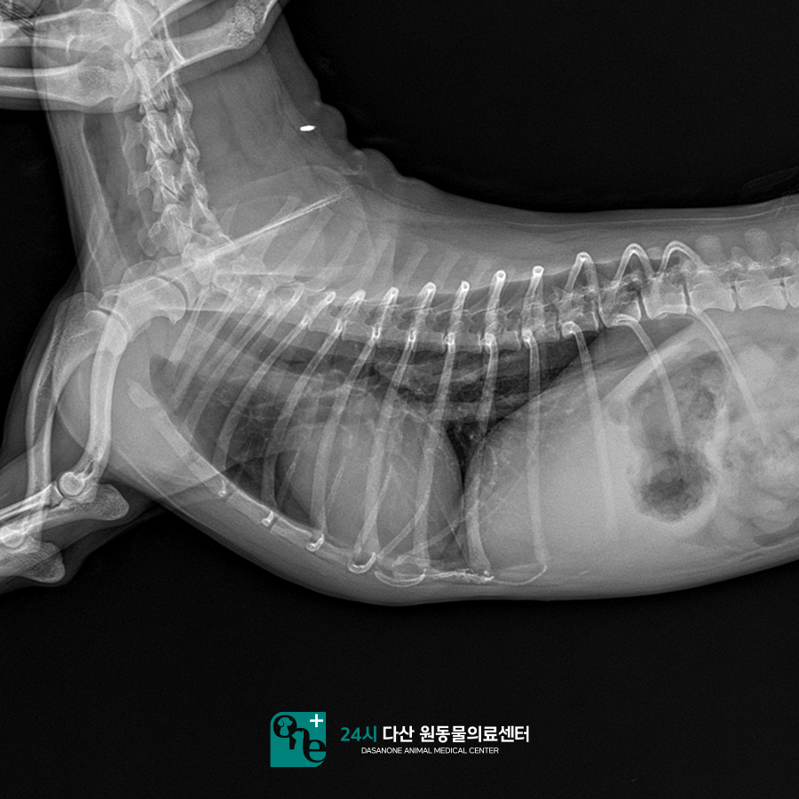

입원 3일차, 마루는 이뇨제나 산소 치료 없이도
안정된 호흡을 유지하였고, 방사선상 폐야는
거의 정상적으로 회복되었습니다.
염증 수치 또한 항생제 치료 하루 만에
정상으로 돌아왔습니다.
보호자님과 상의 끝에 퇴원 후 심장약 복용으로
관리하기로 결정하였고, 퇴원 1주일 후
확인 전화에서 마루는 심장약을 먹으며
아주 잘 지내고 있다는 소식을 전해 들었습니다 :)

---

고령의 강아지에서 호흡곤란은
심장과 관련이 있는 경우가 매우 흔합니다.
이럴 경우 최대한 빠르게 초기 처치를 하는 것이
매우 중요합니다.
24시 다산 원동물의료센터는
24시간 수의사가 상주하여 응급상황 시
신속하게 진단 및 치료를 시행합니다.
마루야, 앞으로는 숨 쉬는 게 편안하기를,
아프지 말고 건강하자~

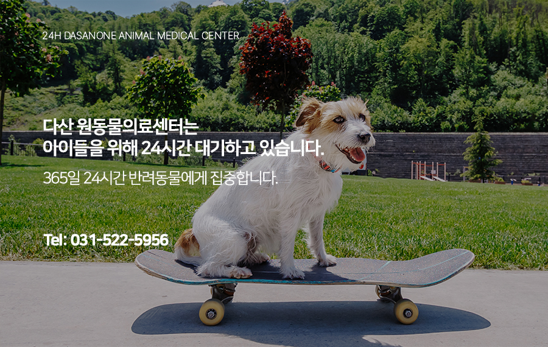

24시 다산 원동물의료센터는 수의사가
24시간 상주며, 응급수술 및 집중치료가
가능한 병원입니다.

📍 24시 다산 원동물의료센터 경기도 남양주시 다산중앙로 15 3층

#강아지폐수종 #강아지심장병
#강아지MMVD #심인성폐수종치료
#다산동물병원 #남양주동물병원
#구리동물병원 #인창동동물병원
#원동물병원 #다산원동물병원
