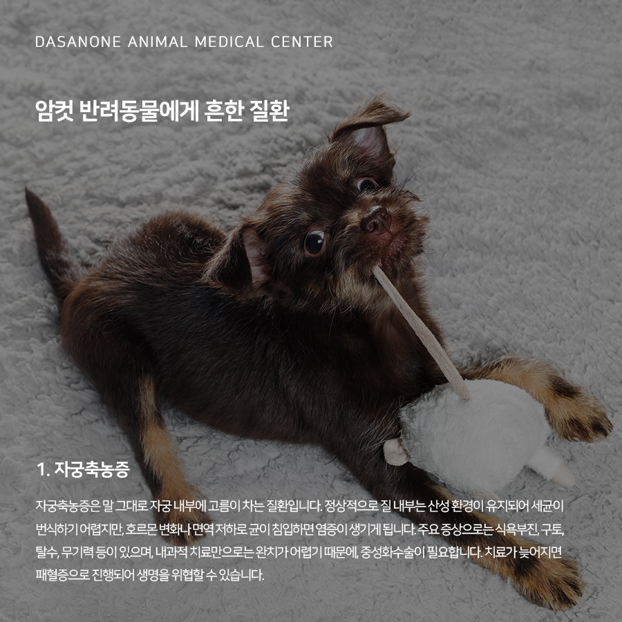
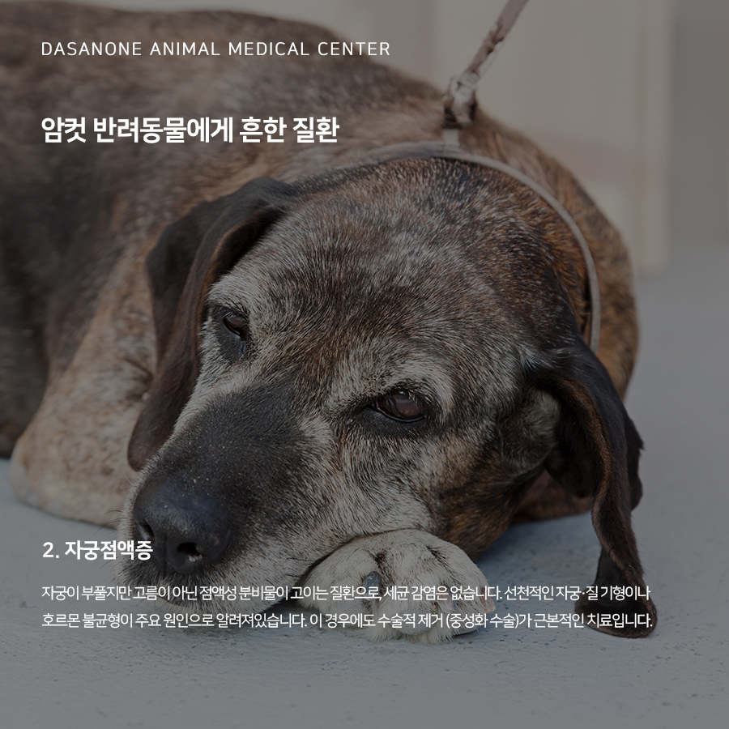
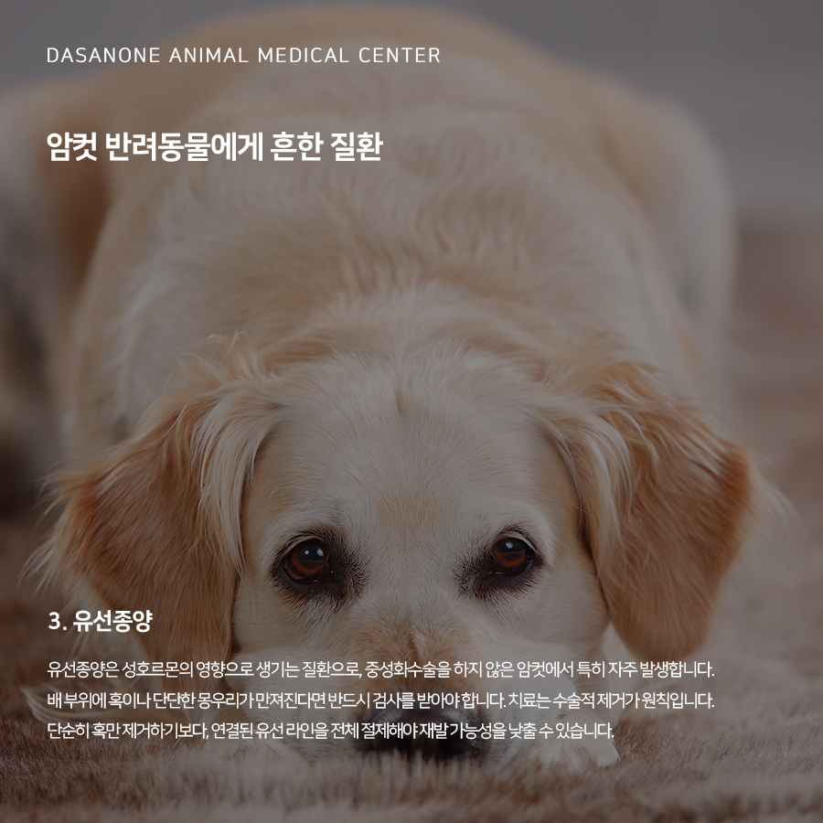
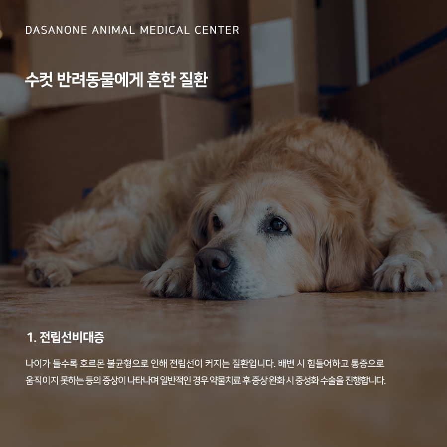
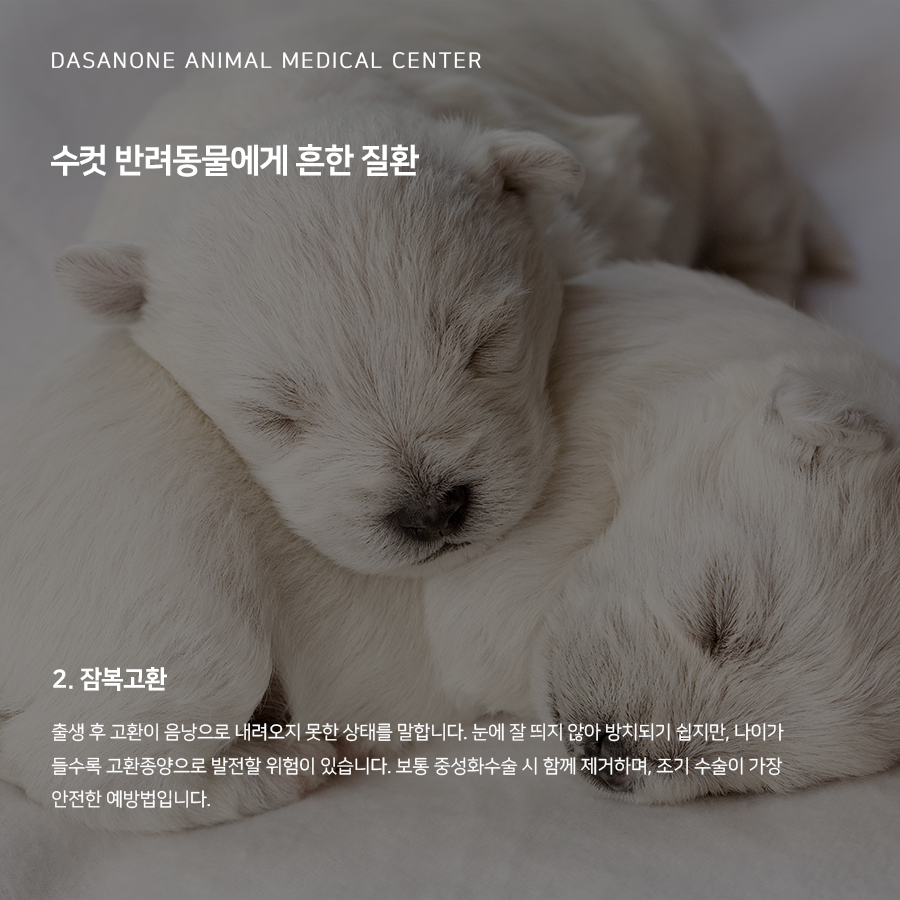
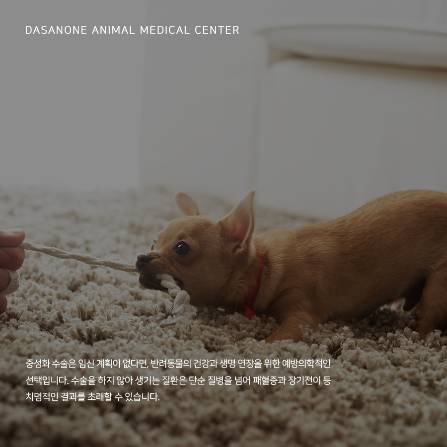

# 반려동물 중성화 수술이 꼭 필요한 이유. 남양주 동물병원

- logNo: 224075679550
- date: 2025-11-14
- displayDate: 2025. 11. 14. 11:25
- url: https://blog.naver.com/PostView.naver?blogId=dasanoneamc&logNo=224075679550
- categoryNo: 14
- tags: 

---

반려동물 중성화 수술은 단순히 번식을
막기 위한 목적만이 아닙니다. 건강상의 문제를
예방하고, 불필요한 스트레스나 행동학적 문제를
줄여주는 데에도 큰 도움이 됩니다.
오늘은 중성화 수술을 하지 않았을 때 생길 수 있는
주요 생식기 질환에 대해 알아보겠습니다.

> 암컷 반려동물에게 흔한 질환

1. 자궁축농증
자궁축농증은 말 그대로 자궁 내부에 고름이 차는
질환입니다. 정상적으로 질 내부는 산성 환경이
유지되어 세균이 번식하기 어렵지만, 호르몬 변화나
면역 저하로 균이 침입하면 염증이 생기게 됩니다.
주요 증상으로는 식욕부진, 구토, 탈수, 무기력 등이
있으며, 내과적 치료만으로는 완치가 어렵기 때문에,
중성화 수술이 필요합니다. 치료가 늦어지면
패혈증으로 진행되어 생명을 위협할 수 있습니다.

2 자궁점액증
자궁이 부풀지만 고름이 아닌 점액성 분비물이
고이는 질환으로, 세균 감염은 없습니다.
선천적인 자궁·질 기형이나 호르몬 불균형이
주요 원인으로 알려져 있습니다. 이 경우에도 수술적 제거 (중성화 수술)가 근본적인 치료입니다.

3. 유선종양
유선종양은 성호르몬의 영향으로 생기는 질환으로,
중성화 수술을 하지 않은 암컷에서 특히 자주
발생합니다. 배 부위에 혹이나 단단한 몽우리가
만져진다면 반드시 검사를 받아야 합니다. 치료는
수술적 제거가 원칙입니다. 단순히 혹만 제거하기보다,
연결된 유선 라인을 전체 절제해야
재발 가능성을 낮출 수 있습니다.

> 수컷 반려동물에게 흔한 질환

1. 전립선비대증
나이가 들수록 호르몬 불균형으로 인해
전립선이 커지는 질환입니다. 배변 시 힘들어하고
통증으로 움직이지 못하는 등의 증상이 나타나며
일반적인 경우 약물치료 후 증상 완화 시
중성화 수술을 진행합니다.

2. 잠복고환
출생 후 고환이 음낭으로 내려오지 못한
상태를 말합니다. 눈에 잘 띄지 않아 방치되기 쉽지만,
나이가 들수록 고환종양으로 발전할 위험이 있습니다.
보통 중성화 수술 시 함께 제거하며, 조기 수술이 가장 안전한 예방법입니다.

중성화 수술은 임신 계획이 없다면, 반려동물의 건강과
생명 연장을 위한 예방의학적인 선택입니다.
수술을 하지 않아 생기는 질환은 단순 질병을 넘어
패혈증과 장기전이 등 치명적인 결과를
초래할 수 있습니다.

저희 다산 원동물의료센터는
보호자분들의 든든한 동반자가 되어,
반려동물의 평생 건강 관리를 책임지겠습니다.

📍 24시 다산 원동물의료센터 경기도 남양주시 다산중앙로 15 3층

#다산동물병원추천 #24시간동물병원
#도농역동물병원 #남양주동물병원 #구리동물병원
#수택동동물병원 #강아지중성화 #고양이중성화
