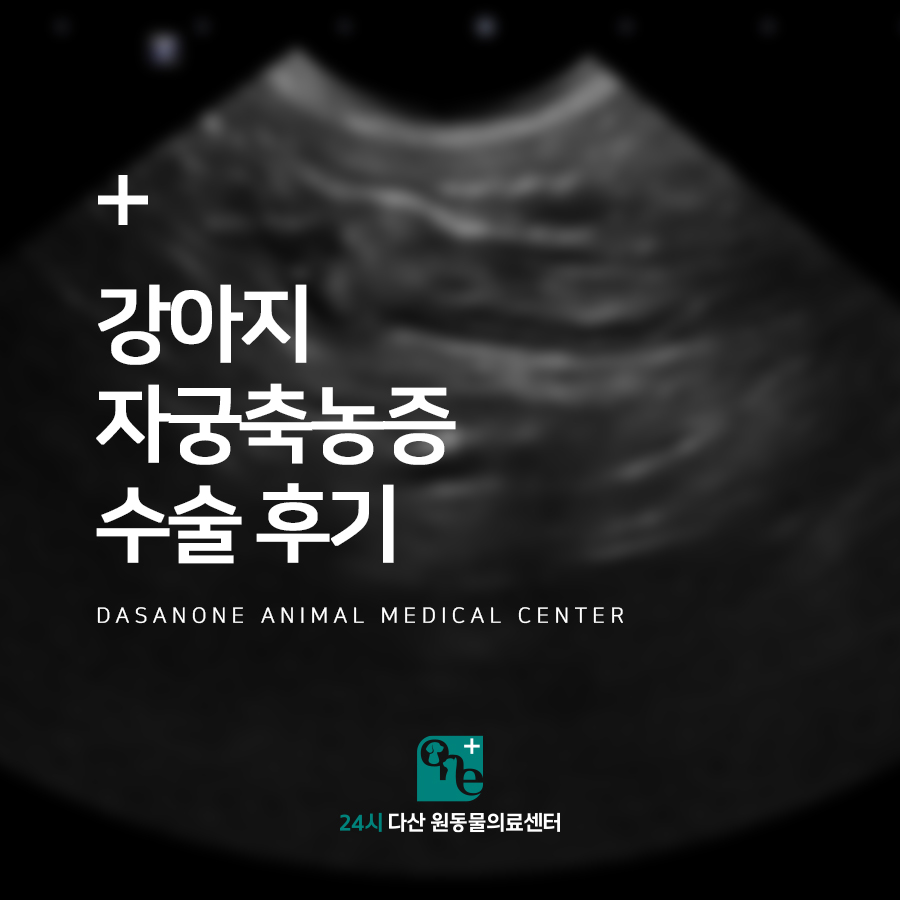
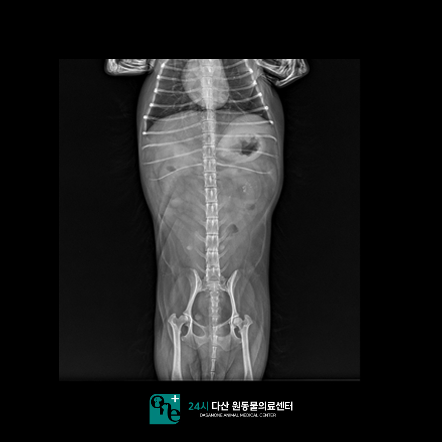
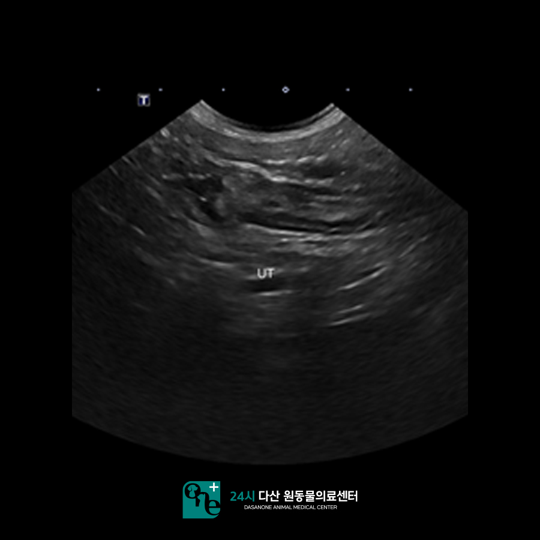
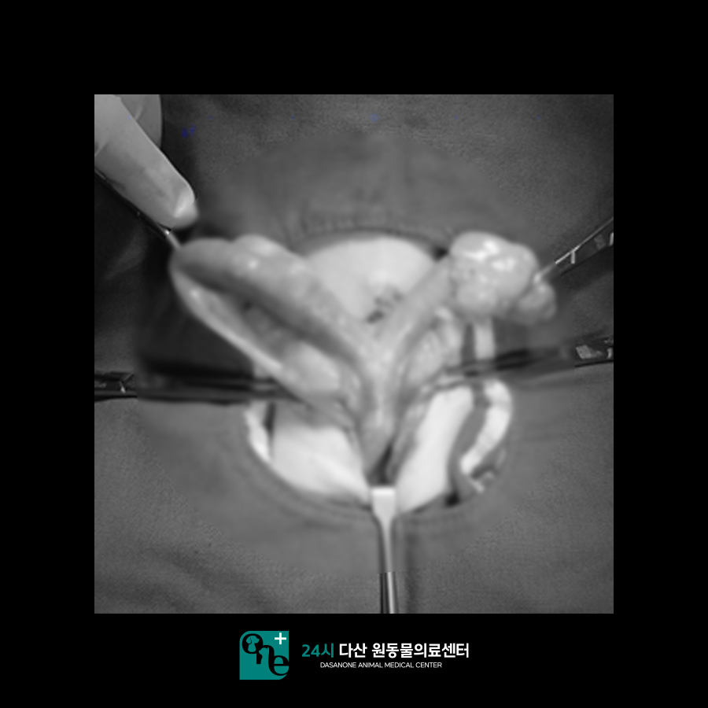
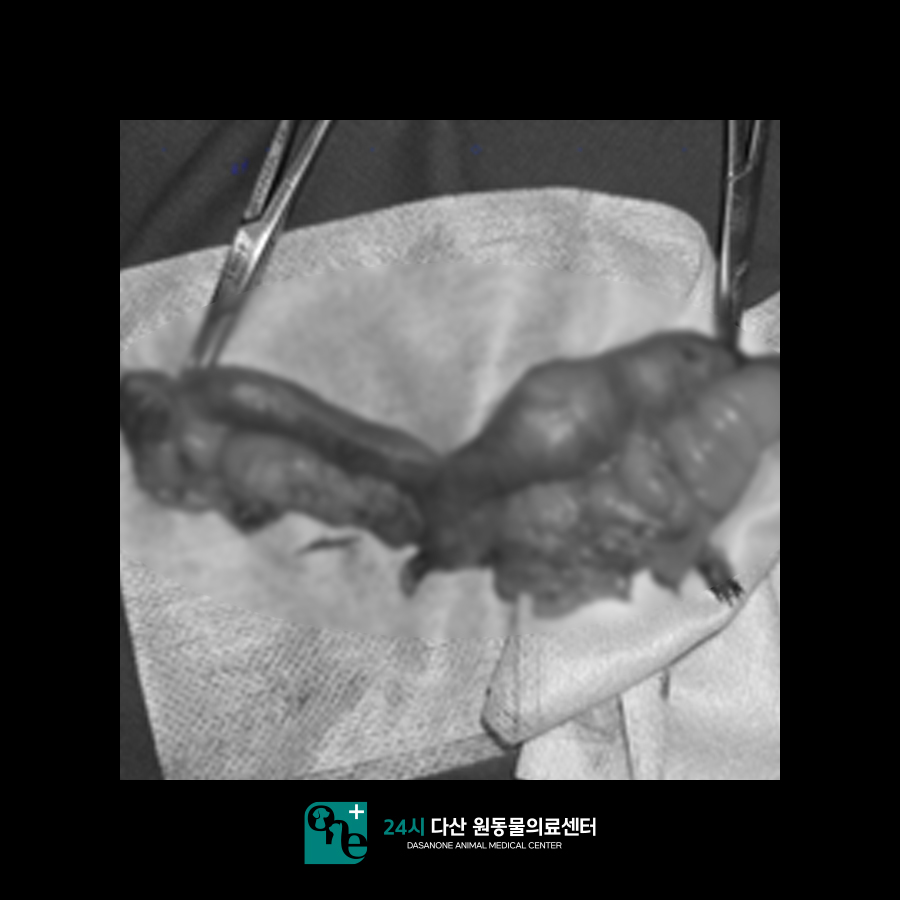
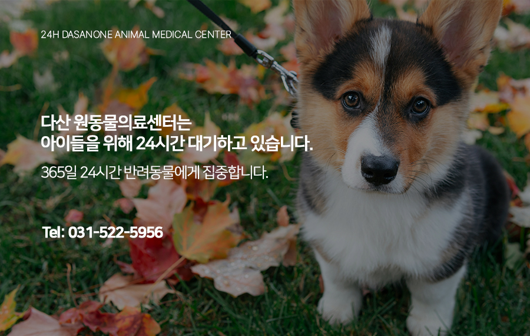

# 수택동 동물병원, 강아지 자궁축농증 수술 후기

- logNo: 224086002594
- date: 2025-11-24
- displayDate: 2025. 11. 24. 10:00
- url: https://blog.naver.com/PostView.naver?blogId=dasanoneamc&logNo=224086002594
- categoryNo: 11
- tags: 

---

안녕하세요.
수술 전문 24시 다산 원동물의료센터입니다.
오늘은 자궁축농증으로 본원에 내원하여
수술을 진행 받은 강아지 모리의 케이스를
소개해 드리려고 합니다.

> 내원 당시 증상

모리는 내원 하루 전부터 구토가 시작되었고,
다음 날 아침 보호자님께서 보셨을 때
구토와 설사를 반복한 흔적이 확인되었습니다.
계속 누워있고 기력이 없어 보인다고 하셨습니다.
모리의 나이는 8살로
아직 중성화를 하지 않은 상태였습니다.

> 진단 과정

혈액검사 결과, 염증 수치가 정상(10 이하)에 비해
모리는 173으로 매우 높게 측정되었습니다.
또한 방사선 촬영에서 자궁의
비정상적 확장이 확인되었습니다.

> 초음파 검사

확진을 위해 초음파 검사를 진행한 결과
자궁 내 농이 차 있는 것을 확인할 수 있었습니다.
이에 따라 자궁축농증(Pyometra)으로
진단되었고 즉시 수술을 결정했습니다.
본원에서 수술을 진행하게 될 경우
신체검사 및 혈액검사를 진행하게 됩니다.
심장 청진, 흉부 방사선, 혈액검사를 통해
아이가 안전하게 마취가 가능한지
꼼꼼하게 평가 후 수술을 진행하고 있습니다.
모리의 경우 마취 전 검사상
설사와 구토로 인한 것으로 판단되는
전해질 불균형이 있었습니다.
수액으로 전해질을 교정시켜 준 뒤
수술을 진행하였습니다.

> 수술 진행

수술 중 확장된 자궁을 확인할 수 있었습니다.

자궁을 제거한 뒤 모습입니다.
피가 나지 않게 꼼꼼하게 제거를 해주었습니다.
이후 입원하여 지속적인 수액 공급과
항생제 치료, 혈압 모니터링도 꾸준히 진행하며
수술 후 관리에 신경을 써주었습니다.
입원 기간 동안 구토는 사라졌고 식욕도
정상적으로 회복되었습니다. 수술 후 3일째
염증 수치 역시 정상 범위로 회복되었습니다.
현재 모리는 구토나 식욕부진 없이 건강하게
잘 지내고 있습니다.

---

자궁축농증은 중성화 수술을 하지 않은 중년 이상의
암컷 강아지에게 흔히 발생하는 질환입니다.
초기에 치료하지 않으면 패혈증, 장기 부전 등으로
생명이 위태로워질 수 있는 매우 위험한
질환입니다. 구토, 설사, 식욕 감소,
배가 부풀어 보이는 증상이 있을 경우
시간을 지체하지 말고 즉시 병원에 방문하여
검사를 받는 것을 권장 드립니다.

24시 다산 원동물의료센터는 수의사가
24시간 상주며, 응급수술 및 집중치료가
가능한 병원입니다.

📍 24시 다산 원동물의료센터 경기도 남양주시 다산중앙로 15 3층

#강아지중성화수술 #강아지자궁축농증
#강아지중성화병원 #다산동물병원 #남양주동물병원
#구리동물병원 #수택동동물병원 #다산원동물병원
