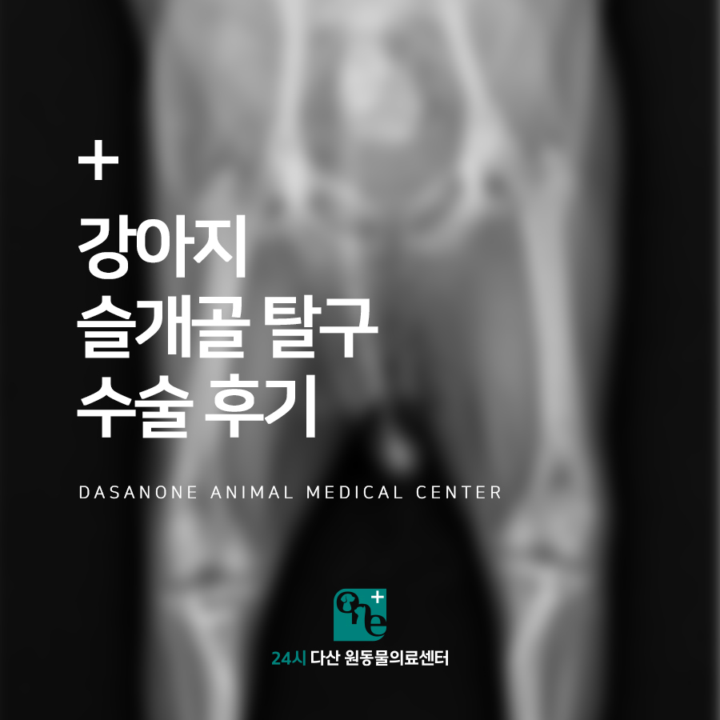
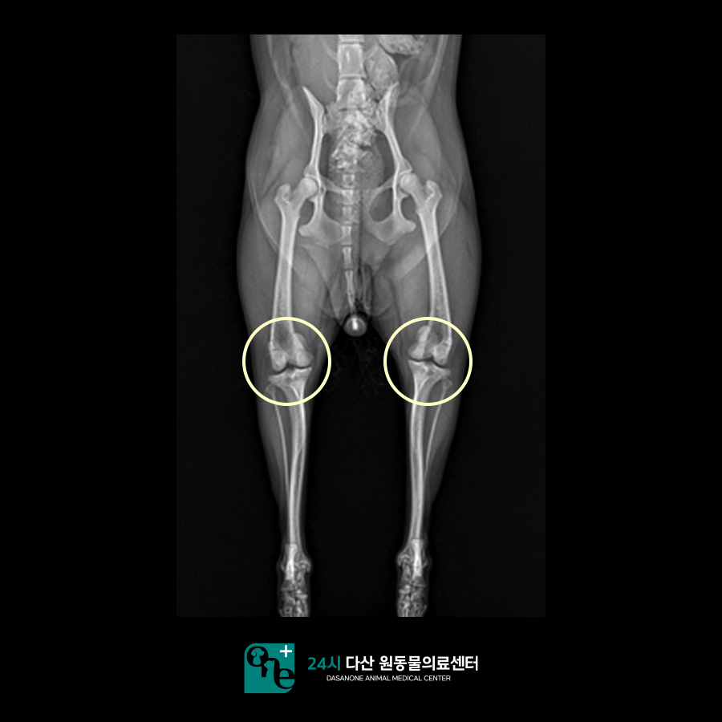
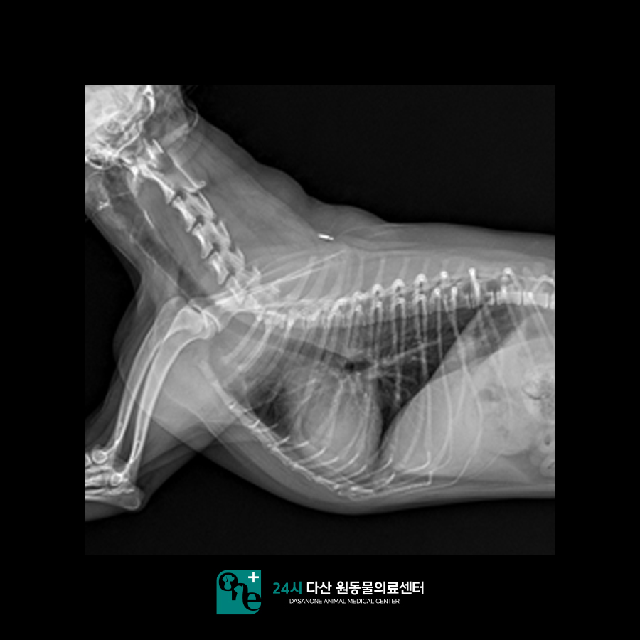
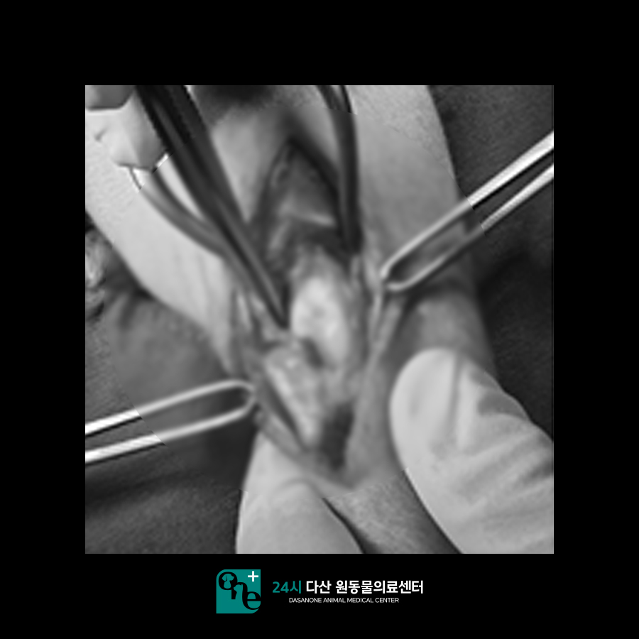
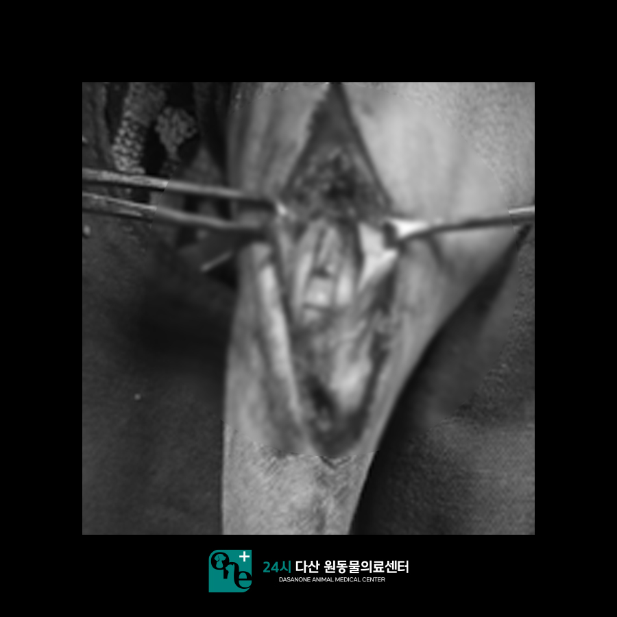
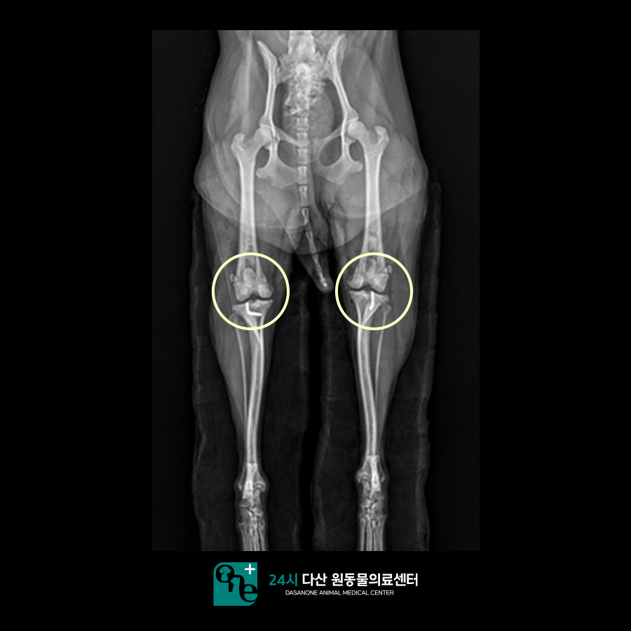
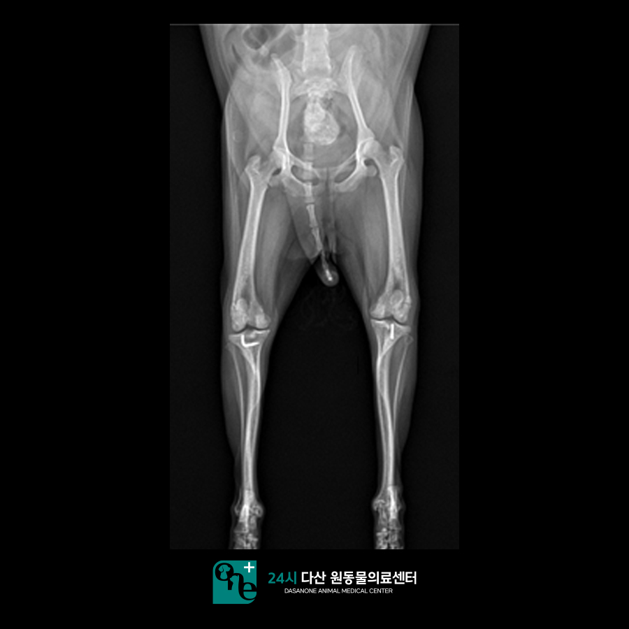
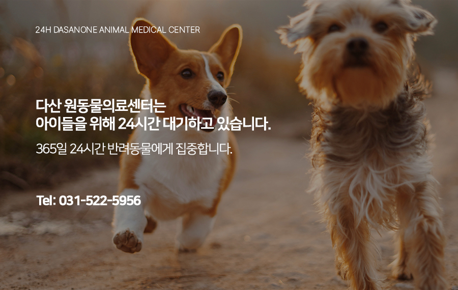

# 강아지 슬개골 탈구 수술 (MPL) 후기. 교문동 동물병원

- logNo: 224113206105
- date: 2025-12-17
- displayDate: 2025. 12. 17. 17:43
- url: https://blog.naver.com/PostView.naver?blogId=dasanoneamc&logNo=224113206105
- categoryNo: 11
- tags: 

---

안녕하세요. 정형 수술 전문
24시 다산 원동물의료센터입니다.
오늘은 본원에서 슬개골 탈구로 내원한 강아지
다비에 대한 이야기입니다.
다비가 어떻게 수술을 진행했는지
알아보도록 하겠습니다.
강아지 슬개골 탈구란 슬개골이 제 위치에
위치하지 않고 안쪽이나 바깥쪽으로
탈구된 형태를 의미합니다.
슬개골 탈구가 진행될수록 통증 및
임상 증상이 나타날 수 있습니다.
슬개골 탈구가 확진되고 임상 증상을
보이기 시작한다면 수술적 교정을 통해
슬개골 중심축을 본래 자리로 회복시켜주어야 합니다.

> 수술 전 x-ray 촬영

다비는 최근 들어 일어날 때 뒷다리를 불편해하여
내원하게 되었습니다. x-ray 촬영 시 슬개골 탈구가
관찰되었습니다. Lateral view에서 관절염도
진행이 된 것을 확인하였습니다.
보호자님 상담 후 수술적으로 교정하기로 하였습니다.

> 수술 전 검사

다비는 MPL 수술을 진행하기로 했습니다.
마취 전 검사에서 청진 시 심잡음은 들리지 않았고
흉부 x-ray에서도 큰 특이점은 발견되지 않았습니다.
수액 처치를 통해 교정을 한 뒤 호흡 마취를 통해
수술을 진행하였습니다.

> MPL 수술 진행

안쪽 활차구쪽으로 염증이 확인되었습니다.
그 부위로 슬개골이 왔다 갔다 하면서
염증을 악화시킨 것으로 확인되었습니다.

활차구를 깊게 만들어주는 수술을 진행합니다.
그리고 patella ligament의 축을 안쪽으로
돌려주는 수술인 TTT까지 진행하였습니다.

> 수술 후 x-ray 촬영

수술 후 방사선 사진입니다. 수술은 계획대로
잘 진행되었습니다. 관절염 회복을 위한
관절 주사도 같이 진행해 주었습니다.
다비의 경우 수술 3일차부터 붕대를 풀고
걷는 재활을 진행하였습니다. 염증 완화와 통증 감소를
위한 레이저 치료와 얼음찜질도 병행하며
수술 후 회복 케어에 특히 신경을 써주었습니다.
슬개골 수술의 경우 재활과 술후 관리가 중요합니다.
24시 다산 원동물의료센터는 술후 관리도
신경 써주어 진행하고 있습니다 :)

> 수술 후 36일차 x-ray

위 사진은 술후 36일차 모습입니다.
걷는 양상도 많이 좋아졌고 일어설 때
힘들어하는 모습도 이제는 보이지 않는다며
보호자님께서 만족해하셨습니다.

정형 수술 전문 동물병원인
24시 다산 원동물의료센터는
24시간 수의사가 상주해 있는 동물병원 입니다.

📍 24시 다산 원동물의료센터 경기도 남양주시 다산중앙로 15 3층

#강아지슬개골탈구 #슬개골탈구수술
#정형외과동물병원 #다산동물병원 #남양주동물병원
#구리동물병원 #교문동동물병원 #다산원동물병원
