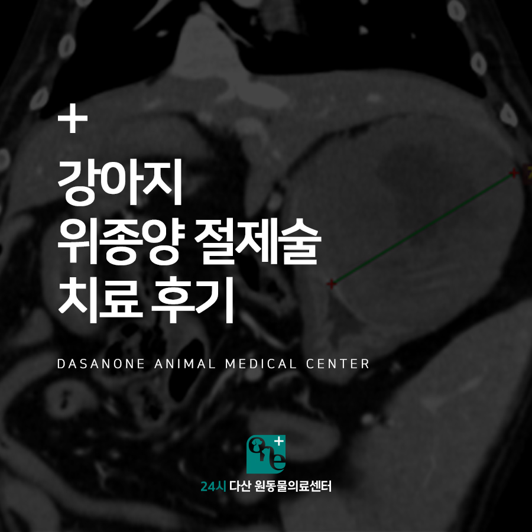
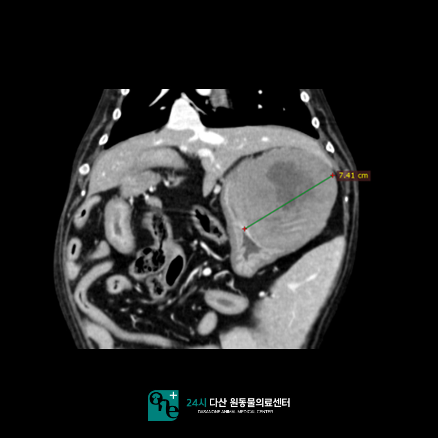
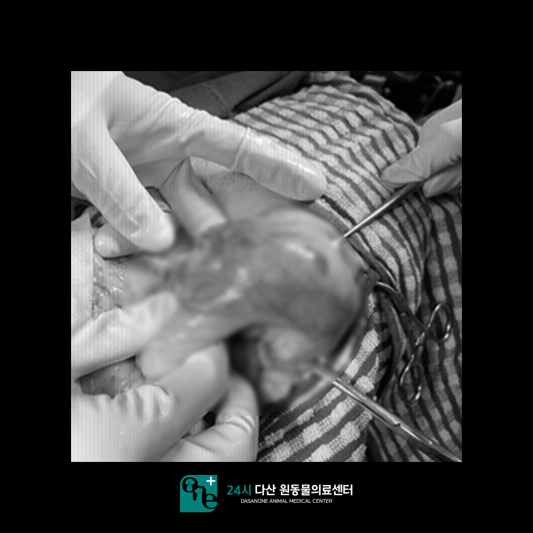
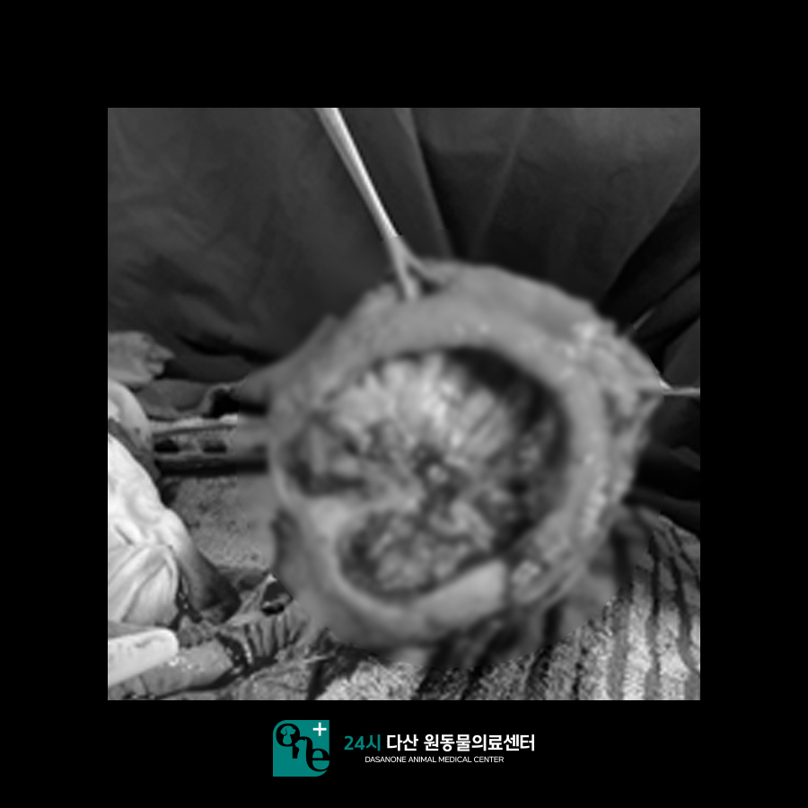
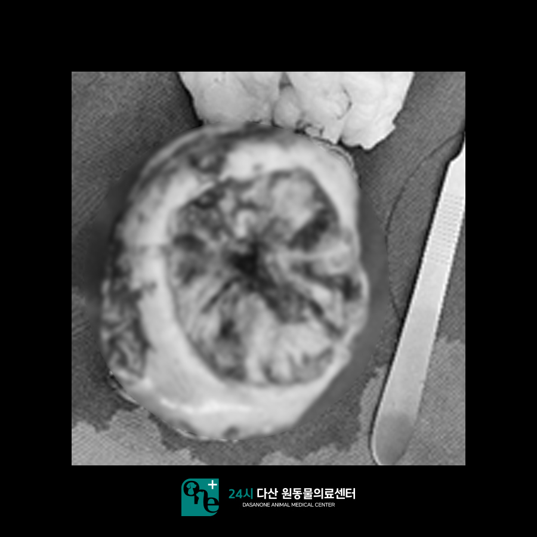
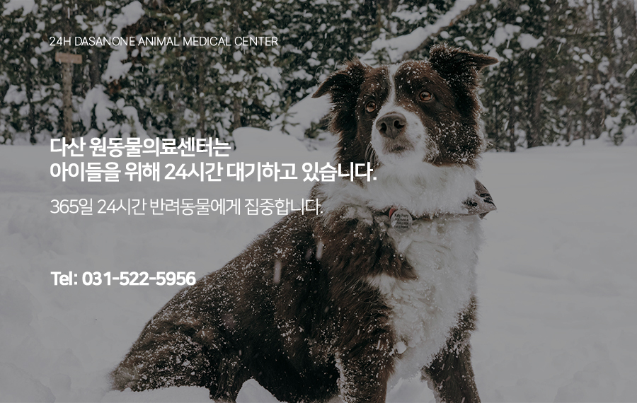

# 일패동 동물병원 강아지 위 종양 절제술 치료 후기

- logNo: 224153510509
- date: 2026-01-20
- displayDate: 2026. 1. 20. 17:26
- url: https://blog.naver.com/PostView.naver?blogId=dasanoneamc&logNo=224153510509
- categoryNo: 11
- tags: 

---

안녕하세요.
수술 전문 24시 다산 원동물의료센터입니다.
오늘은 본원에 위 종양으로 내원한 강아지
테오에 대한 이야기입니다. 테오가 어떤
수술과 치료를 받았는지 알아보도록 하겠습니다.
테오는 내원하기 전날부터 식욕 부진과 기력 저하로
내원하였습니다. 체중도 2주 전에 비해 1kg가량
빠진 상태였습니다.

> 내원 당시 CT 촬영

초음파 상 위에 종괴로 의심되는 양상이 확인되어
보호자님과 상의 후 CT 촬영에 들어갔습니다.
CT 촬영 전 혈액검사에서 빈혈 수치도 낮게
확인되었습니다.
CT 촬영에서 위 fundus 영역의 벽에서 유래한
종괴가 확인되었으며 크기는 7.4cm로 확인되었습니다.
종괴 내부 출혈 및 괴사 부위로 고려되는 액체 밀도가
있는 영역 역시 확인되는 상황이었습니다.
CT 촬영으로 정확한 종양의 위치와 범위를 확인한 후
수술을 진행할 수 있었습니다. 수술 시 빈혈 수치가
더 떨어질 수 있어, 보호자님께 고지 후
수혈과 함께 수술을 진행하였습니다.

> 위 종양 제거 수술

개복 후 위의 fundus 부위에서 종양을 확인하였습니다.
종양이 위의 벽 전층에 포함되어 있어,
위 절제술을 진행하였습니다.

> 수술로 제거된 위 종양

위 종양을 제거한 모습입니다.
수술을 진행하며 지속적으로 혈압을 모니터링하였으며,
중간에 혈압이 떨어져 승압제를 추가하고
수술을 잘 마무리하였습니다.
테오는 이후 6일간 입원을 하며 혈압을 모니터링하고,
수액과 항생제를 통해 술후 관리에 신경을 써주었습니다.
수술 3일 차부터 밥을 먹기 시작하여 퇴원 시에는
식욕과 활력이 많이 올라온 상태가 되었습니다.
테오의 종양은 조직 검사 결과 상
MCT라는 악성 종양으로 판명되었습니다.
보호자님께서는 테오의 식욕이 돌아오고
컨디션이 회복되었기 때문에 추가적인 항암치료는
원치 않으셨습니다. 이후 테오는 체중이 다시 증가하였고,
수술 후 3개월이 지난 시점에서도 잘 지내고 있습니다.

수술 전문 동물병원인 24시 다산 원동물의료센터는
24시간 수의사가 상주해 있는 동물 병원입니다.

📍 24시 다산 원동물의료센터 경기도 남양주시 다산중앙로 15 3층

#강아지위종양 #강아지위절제술
#수술잘하는동물병원
#일패동동물병원 #다산동물병원추천
#남양주동물병원 #구리동물병원 #다산역동물병원
