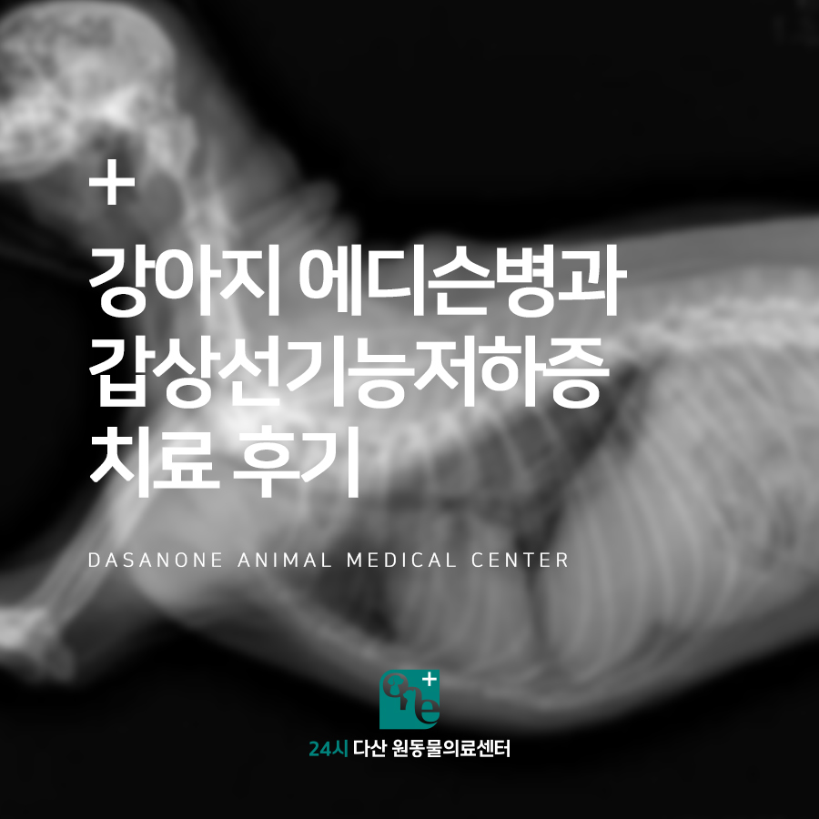
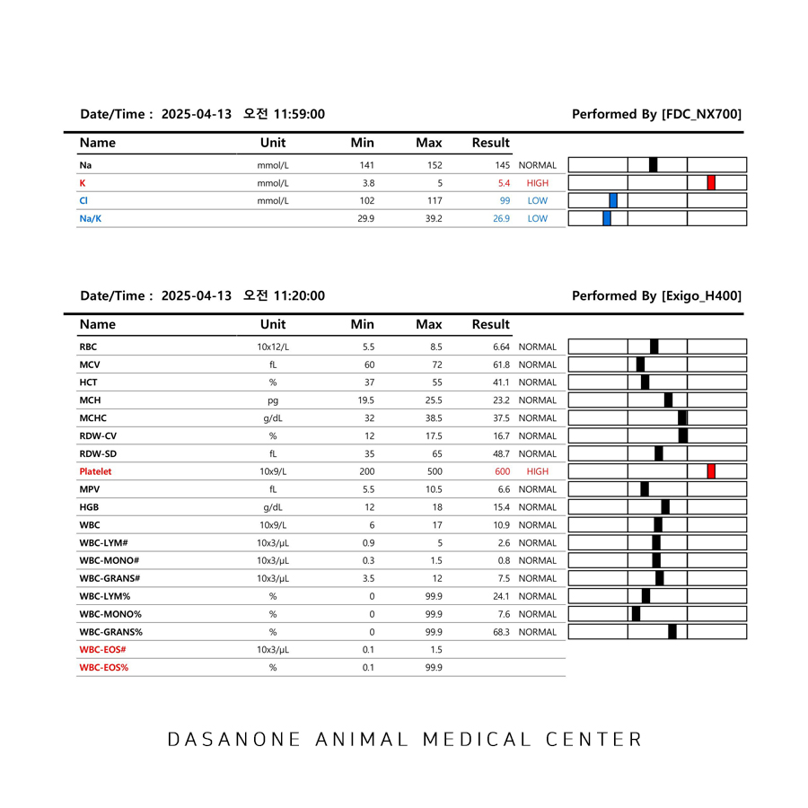
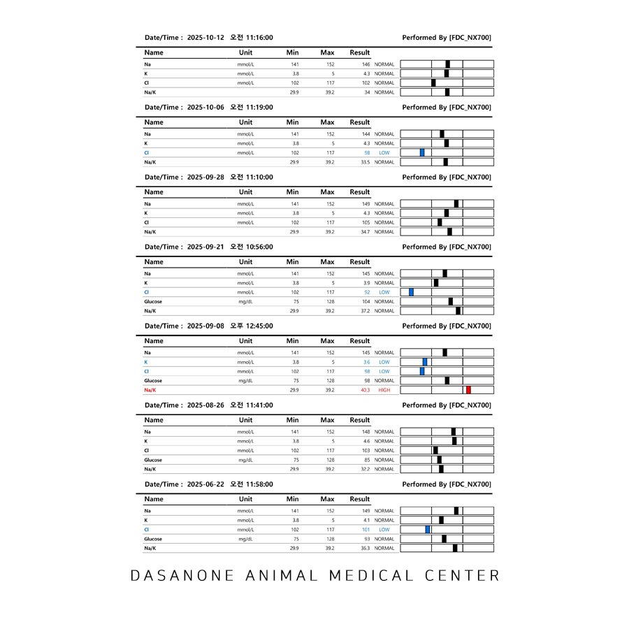
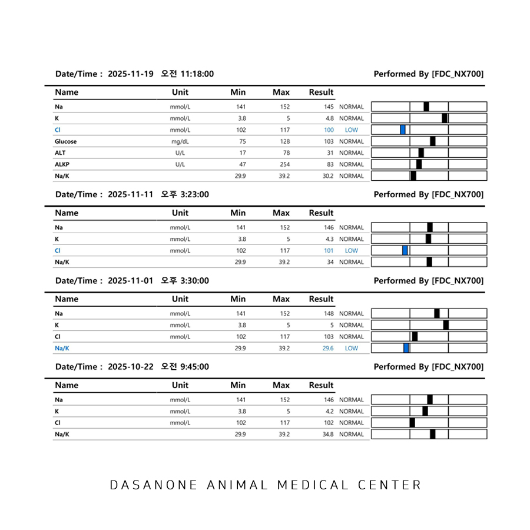
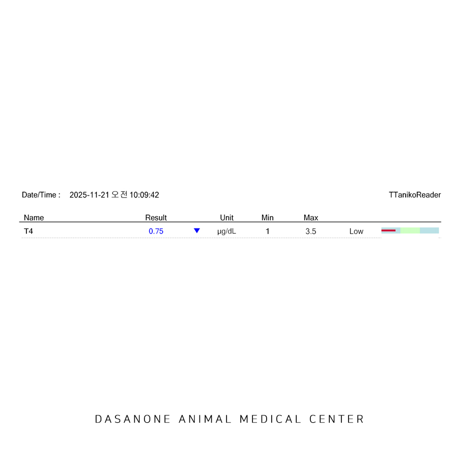
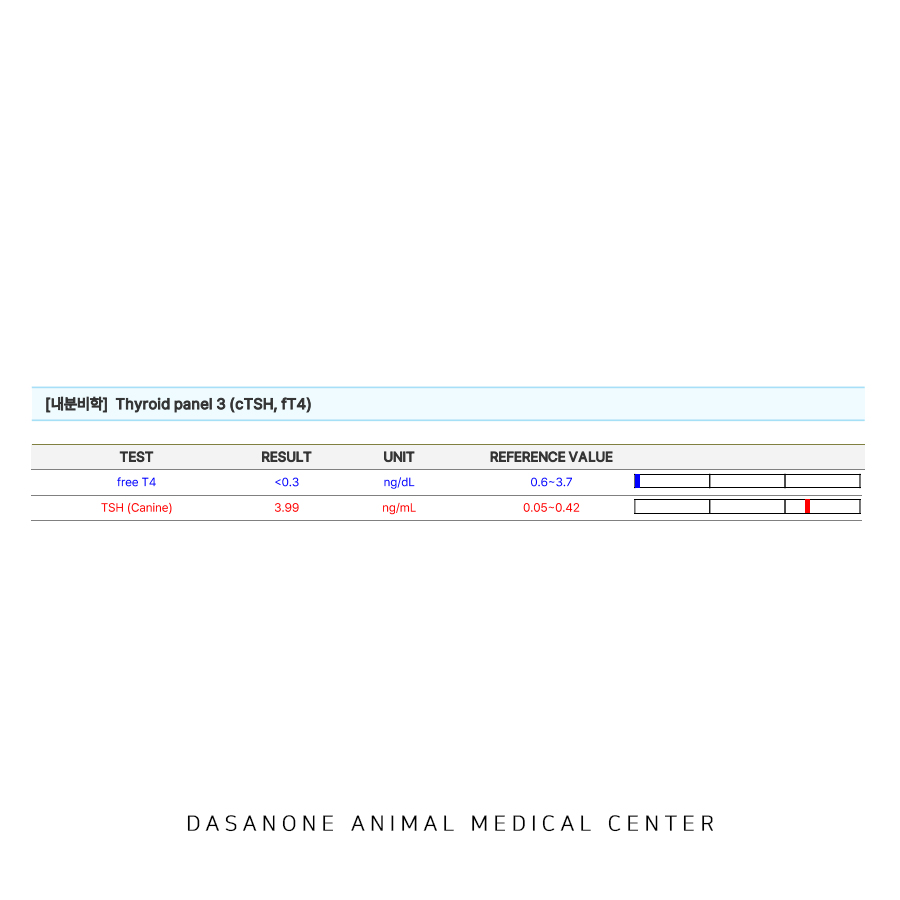
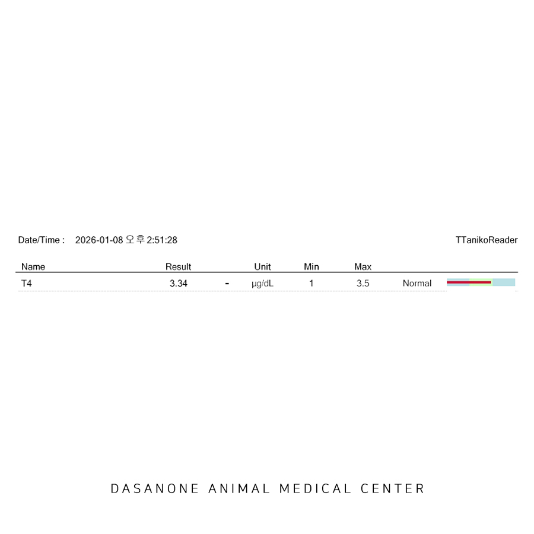
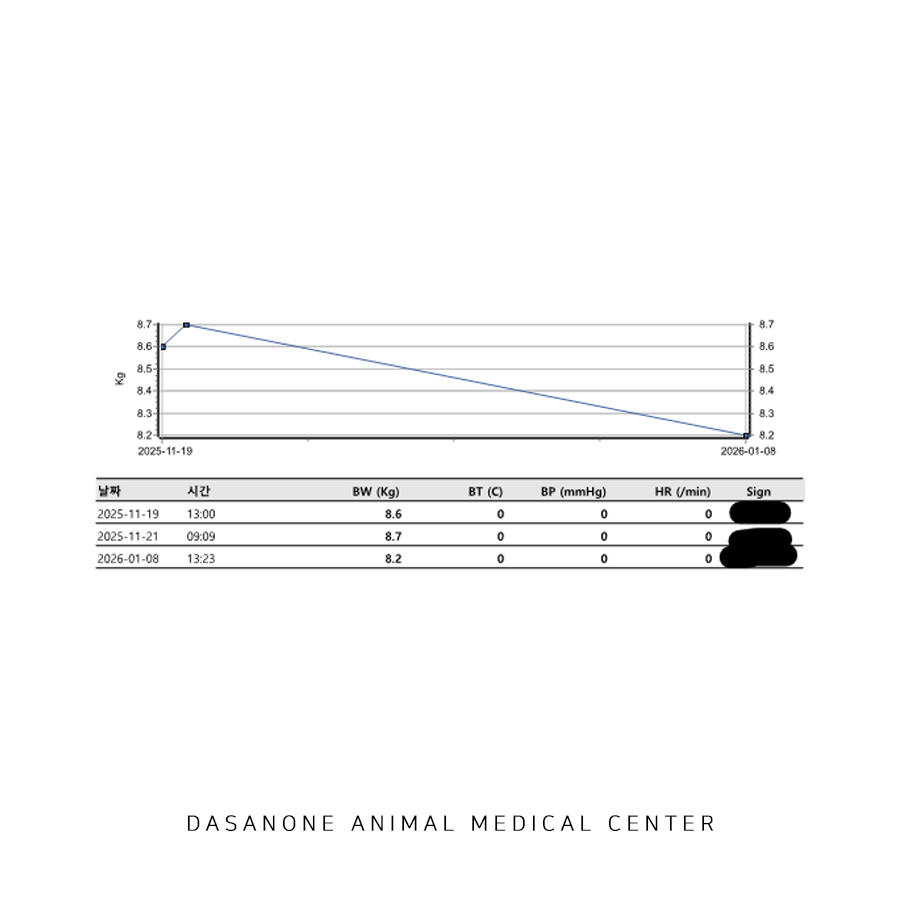
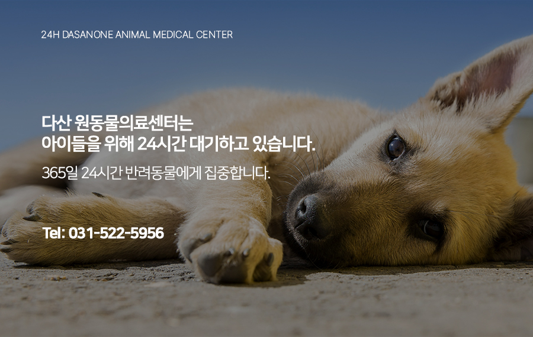

# 수택동 동물병원 강아지 에디슨병과 갑상선 기능 저하증 치료 후기

- logNo: 224157296850
- date: 2026-01-23
- displayDate: 2026. 1. 23. 17:22
- url: https://blog.naver.com/PostView.naver?blogId=dasanoneamc&logNo=224157296850
- categoryNo: 10
- tags: 

---

10살 이탈리안 그레이하운드 마루가
에디슨병 관리를 위해 24시 다산 원동물의료센터에
내원하였습니다. 마루는 다른 지역 병원에서
에디슨병을 진단받고 관리 중인 아이였는데요,
에디슨병 관리 약물인 주사제와 내복약을
계속 바꿔가면서 관리를 하였으나
구토, 설사, 소화기 증상, 떨림 등이 계속 되어
스테로이드 일정 용량 이상 복용하여야만 증상이
나타나지 않는 상태였습니다.

> 이전 병원 검사 자료

다니던 병원에서 계속해서 혈액검사를 지속하였으나
개선이 없어 본원에 내원하였습니다.

아이의 문진과 신체검사 중 아이에게서
특이사항을 발견할 수 있었는데요,
그레이하운드 치고 체중이 많이 나가는 점,
꼬리에 탈모가 진행되는 점, 몸 떨림 증상이
지속된다는 점에서 에디슨병과 갑상선기능저하증이
함께 있는 아이가 아닐까 의심이 되었습니다.

> total T4 검사

그렇게 보호자님과 상의하에 갑기저 진단을 위한
혈액검사를 진행하기로 하였습니다.
원내 total T4 검사를 통해 total T4가
정상보다 많이 낮은 것을 확인하였습니다.

> freeT4, TSH 검사

갑기저 확진을 위해 실험실에 freeT4, TSH 검사를
추가로 의뢰하였습니다. 검사 결과 마루는
갑상선 기능 저하증을 앓고 있는 것으로 나타났습니다.
다만 스테로이드를 지속 복용하고 있었던 점에서
100% 확진을 할 수 있는 상황이 아니었기 때문에
스테로이드를 tapering 하여 끊고
갑기저 치료 약을 복용하여 증상이 개선되는지
모니터링하기로 하였습니다.
에디슨 환자에서 갑기저가 동반되어 나타나는 경우가
드물게 있는데요, 이럴 경우 매우 중요한 부분은
갑상선 기능 저하증을 치료하기 위한
약물 처방 용량입니다. 에디슨 환자에서는
갑상선 기능 저하증 치료 약물이 대사율을 증가시켜
신체 코티솔 필요량을 증가시킬 수 있습니다.
따라서 코티솔을 제대로 분비해야 될 상황에서
분비가 안되기에 에디슨 질환이 더 심각해질 수 있으며,
저혈당을 유발할 수 있습니다. 따라서 두 가지 질병이
같이 있는 경우 갑상선 기능 저하증 치료 약물의
농도를 정상보다 훨씬 낮은 농도에서
복용을 시작하여야 합니다.

> 1달간 내복약 복용 후 tT4 재검사 결과

마루의 경우 저용량의 갑기저 치료 약물을
복용하면서 스테로이드를 끊었고,
4주간의 스테로이드 wash out 기간을 거친 후
total T4 검사를 다시 진행하였을 때 갑상선 수치가
정상 범위 내에 있는 걸 확인하였습니다.
또한 아이는 몸 떨림 증상이 완전히 치료되었고,
체중이 감소하였으며, 꼬리에 털이 많이 자라는
긍정적인 치료 반응을 보였습니다.

> 체중변화

마루는 저용량의 갑기저 치료제를
에디슨 치료제와 함께 지속해서 복용 중에 있습니다.

---

이처럼 갑상선 기능 저하증은 기력 저하,
꼬리 털 빠짐, 비만, 탈모 등 전형적인 증상을
나타내지만 다른 호르몬 질환과 겹쳐서
증상이 발현하는 경우 진단에서 놓치기 쉽습니다.
또한 호르몬 질환이 두 개 이상 동반되는 경우
내복약 처방도 일반적인 용량과는 다르게
조심스럽게 복용해야 합니다.

24시 다산 원동물의료센터는
분과된 진료 시스템과 24시간 수의사 상주로
아이를 24시간 세심하게 케어하고 있습니다.
마루야 앞으로 아프지 말고 건강하게 잘 지내자~

📍 24시 다산 원동물의료센터 경기도 남양주시 다산중앙로 15 3층

#강아지에디슨병 #에디슨병치료
#강아지갑상선기능저하증 #다산동물병원추천
#남양주동물병원 #구리동물병원 #다산역동물병원
