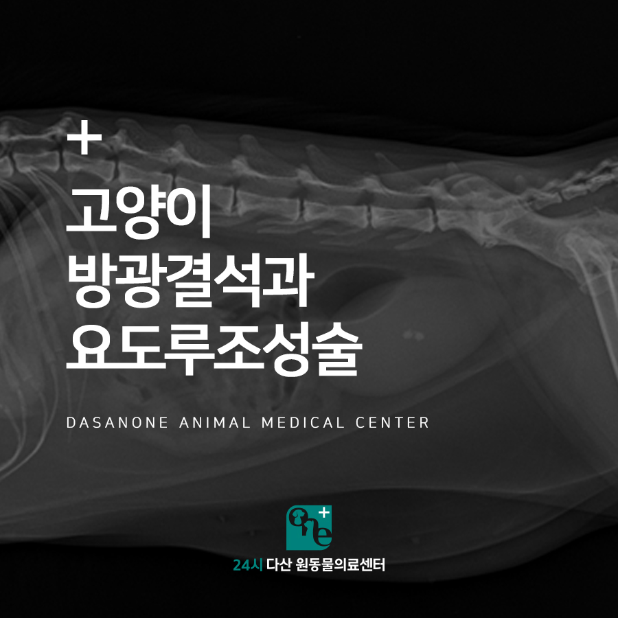
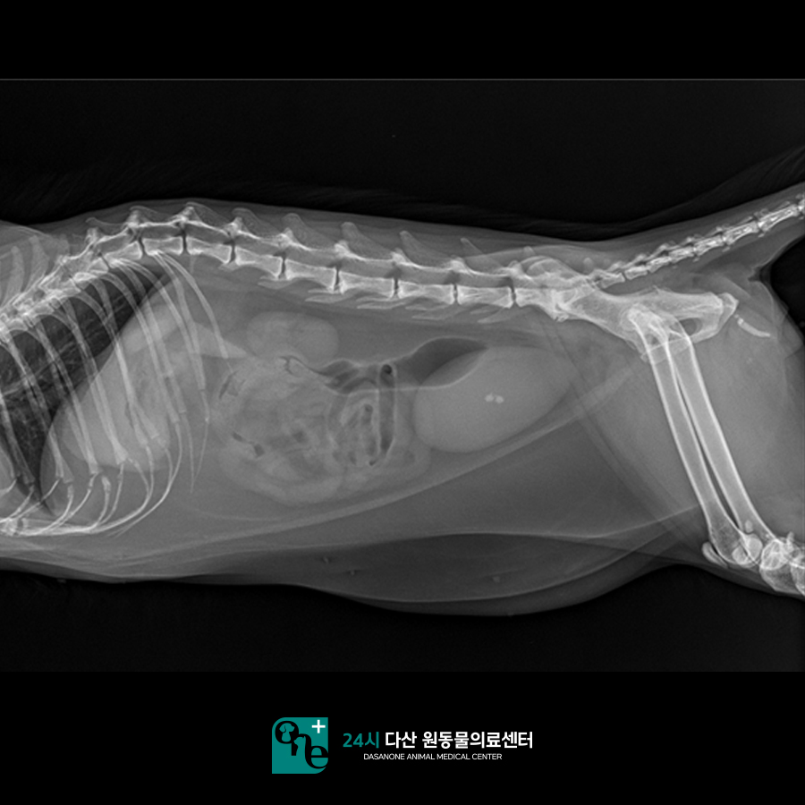
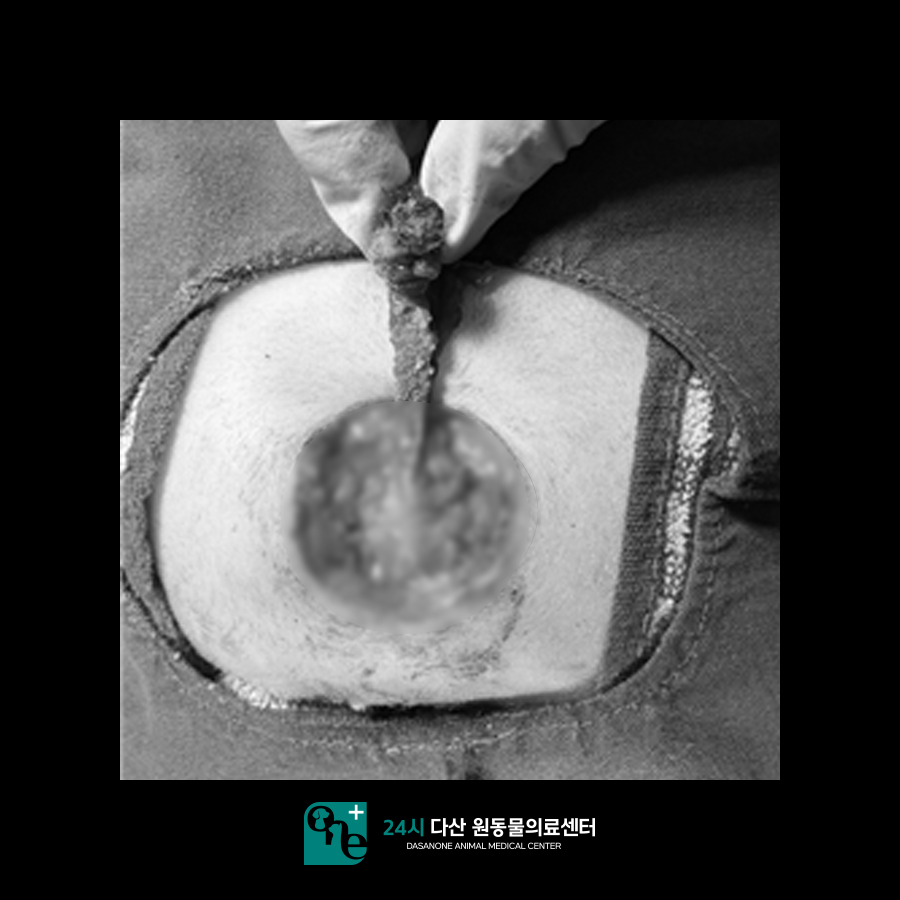
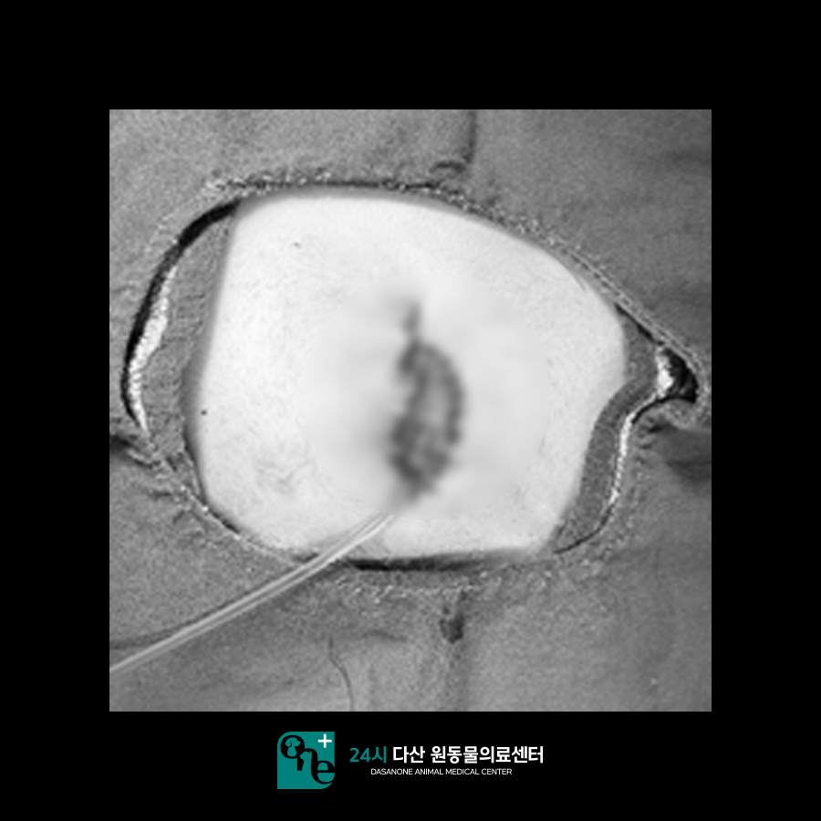
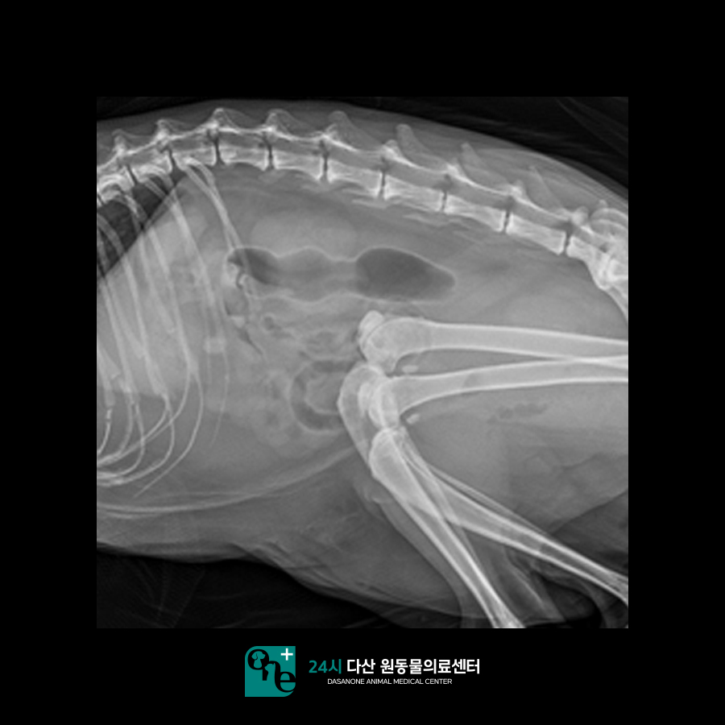
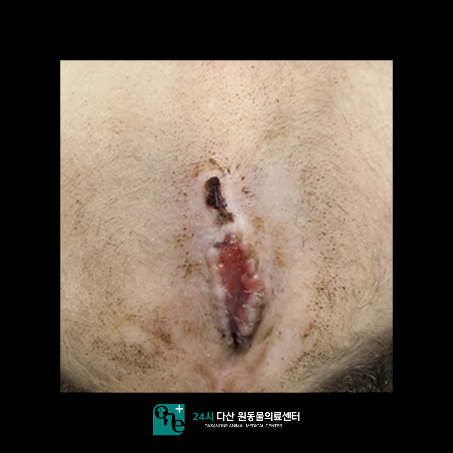
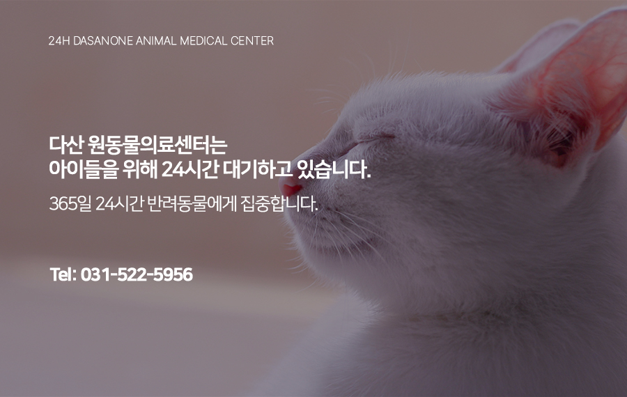

# 일패동 동물병원 고양이 방광결석과 요도루조성술

- logNo: 224163810849
- date: 2026-01-29
- displayDate: 2026. 1. 29. 11:15
- url: https://blog.naver.com/PostView.naver?blogId=dasanoneamc&logNo=224163810849
- categoryNo: 13
- tags: 

---

안녕하세요 수술 전문
24시 다산 원동물의료센터입니다.
오늘은 본원에서 오줌을 누지 못하고 잔뇨감이 있는
고양이 밤비에 대한 이야기로, 밤비가 어떻게
수술을 진행했는지에 대해 알아보도록 하겠습니다.
밤비는 최근에 소변을 제대로 보지 못해서
병원에 내원하였습니다. 고양이의 경우
소변을 제대로 보지 못하면 신장 수치가
올라가서 신독성 및 신부전이 발생할 수 있습니다.

> 내원 당시 방사선

방사선을 촬영 결과 방광 내 결석과 요도 쪽에서도
결석을 확인하였습니다. 소변이 나오는 요도 쪽이
막힌 상황이라 수술적 교정이 필요한 상황입니다.
수컷 고양이의 경우 요도 끝부분은 직경이 매우 작아
결석이 작은 크기라 하더라도 쉽게 막힐 수 있습니다.
그래서 요도루조성술이라는 수술을 통해 요도의
직경을 넓혀주는 수술을 진행합니다. 요도루조성술은
요도 폐색이 있는 수컷 고양이에게 영구적인
소변 배출구를 생식기에 새로 만들어주는 방법입니다.
요도루조성술은 숙련된 의료진의 집도 하에
진행하시는 걸 추천드립니다.
본원에서 수술을 진행하실 경우 신체검사 및
혈액검사를 진행하게 됩니다. 심장 청진,
흉부 방사선, 혈액검사를 통해 아이가
안전하게 마취가 가능한지 꼼꼼하게 평가 후
수술을 진행하고 있습니다.
밤비의 경우 나이가 14살로 많았지만 신장 수치가
아직 정상이었습니다. 칼륨 수치가 낮은 것 외에는
특이사항은 없었습니다. 수액에 칼륨을 추가해
수액 처치를 진행하였습니다.

> 요도루조성술 진행

요도 쪽을 절개해 보니 다량의 결석으로 인해
완전히 막혀있는 것을 확인할 수 있었습니다.

요도루조성술을 통해 결석 있는 요도를 제거하였습니다.
요도의 직경 부위가 넓은 곳까지 확인한 뒤
방광 내 결석도 제거하고 요도 카케터를 장착한 채로
수술을 마무리하였습니다. 이후 마취 회복도
무리 없이 안정적으로 이루어졌습니다.

> 수술 후 방사선

수술을 하고 난 뒤 방사선 사진입니다.
요도 쪽 결석과 방광 내 결석 모두 제거한 것을
확인하였습니다. 이후 입원하여 수액과
항생제, 칼슘 수액을 통해 술후 관리에
신경을 써 주었습니다.
입원 2일 차부터 요도 카테터를 제거하였고
자발 배뇨도 원활하게 이루어졌습니다.

> 수술 2주 후

수술하고 2주 뒤 모습입니다. 수술 부위는
잘 아물었고, 밤비는 정상적인 배뇨를 보며
잘 지내고 있습니다.

수술 전문 동물병원인 24시 다산 원동물의료센터는
24시간 수의사가 상주해 있는 동물병원입니다.

📍 24시 다산 원동물의료센터 경기도 남양주시 다산중앙로 15 3층

#고양이요도루조성술
#고양이방광결석 #다산동물병원추천
#남양주동물병원 #구리동물병원 #다산역동물병원
