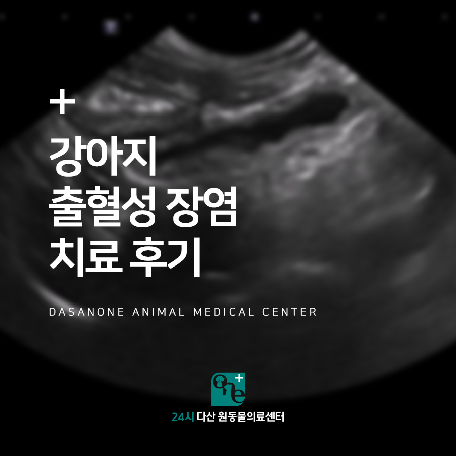
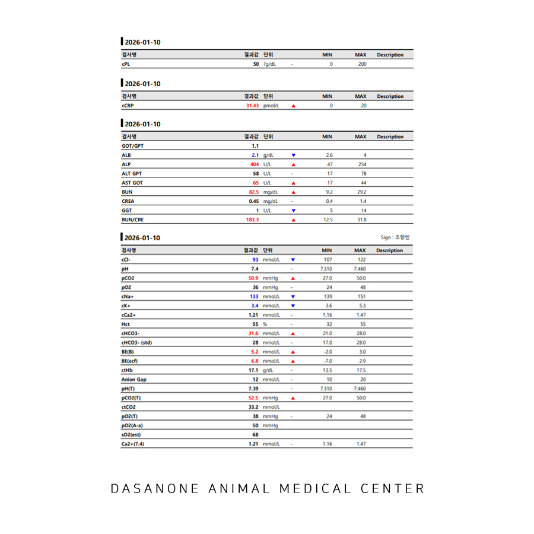
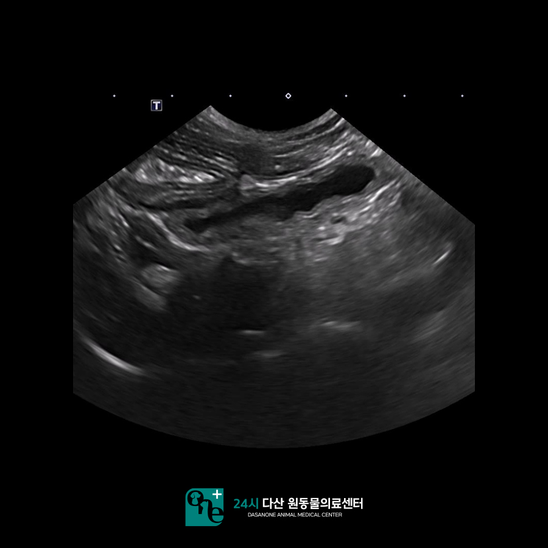
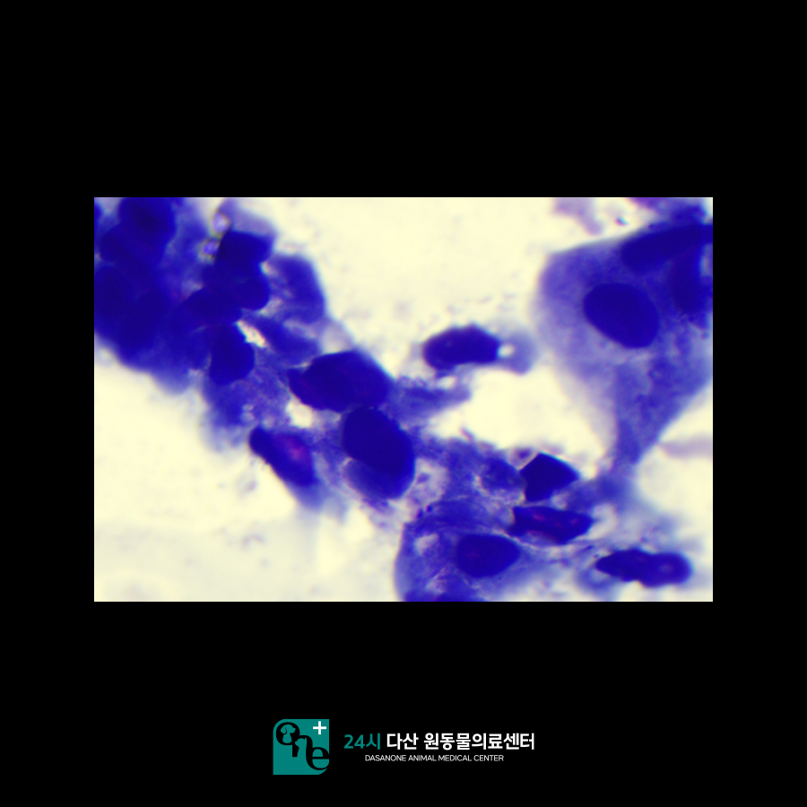
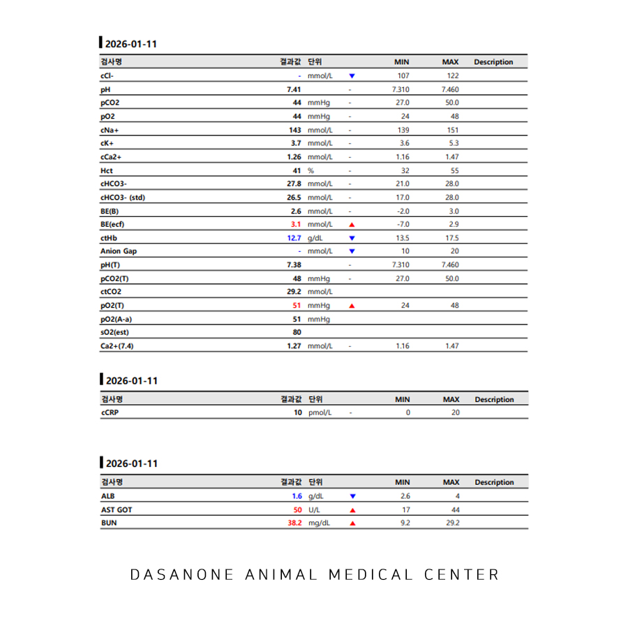
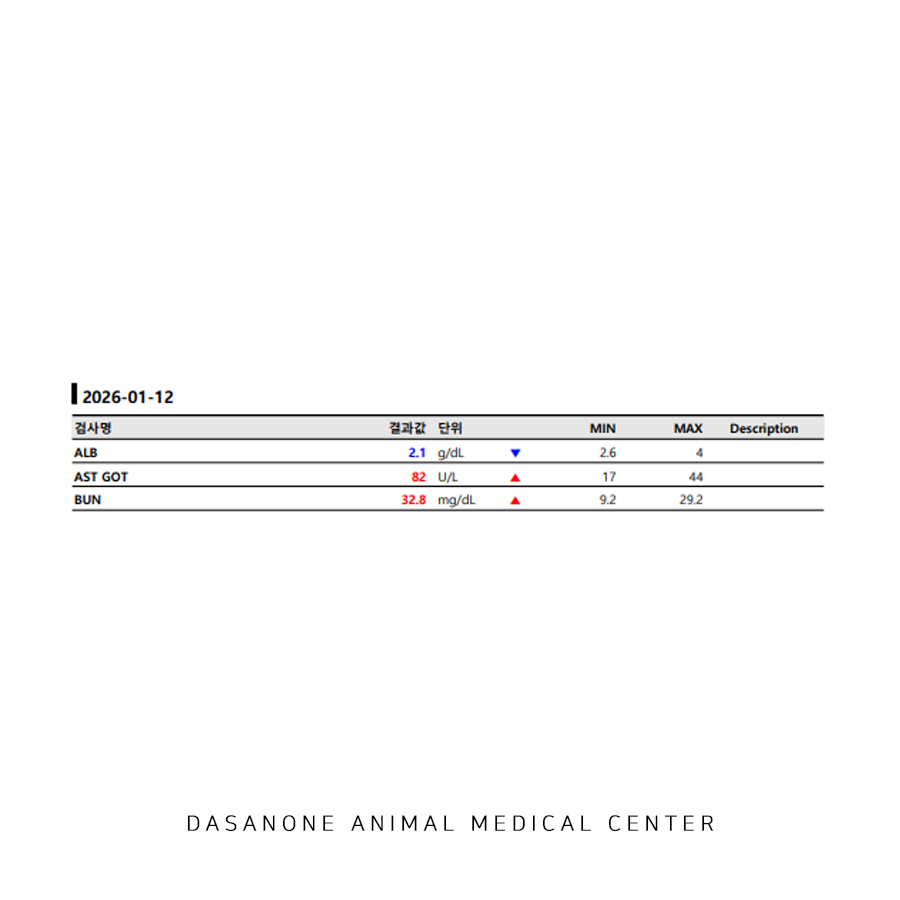
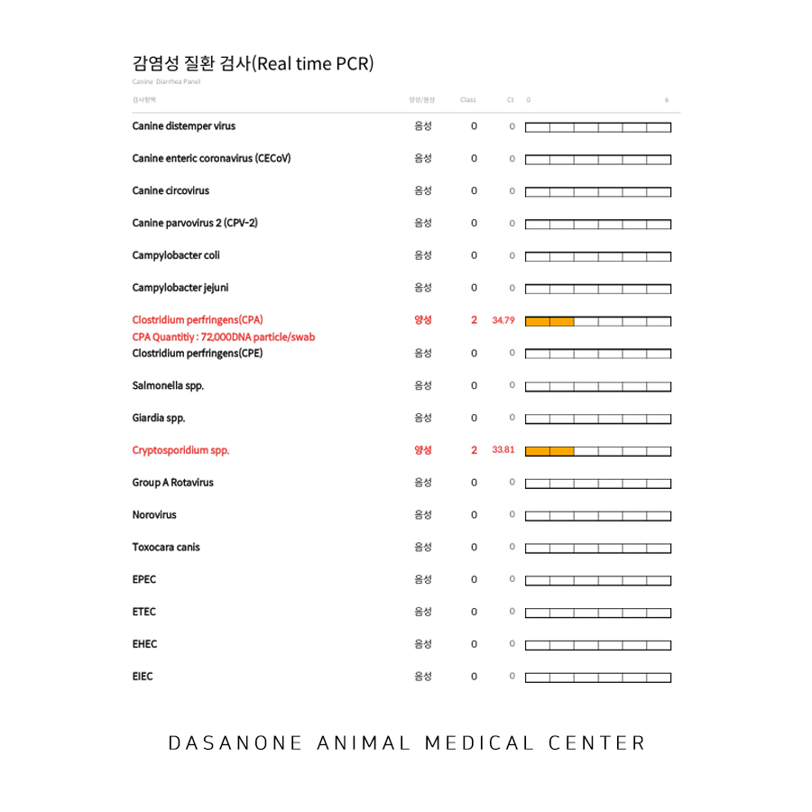
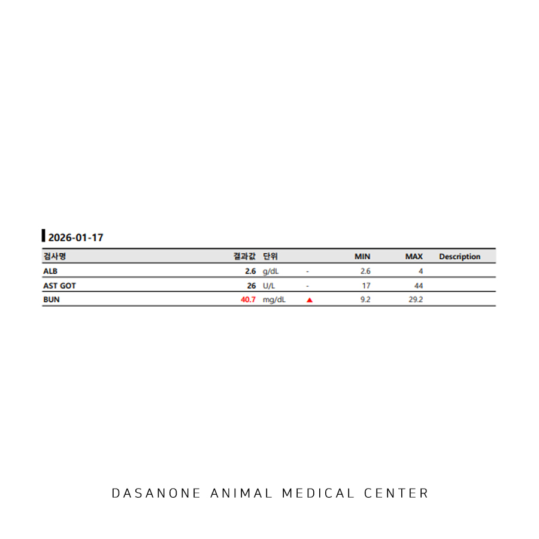
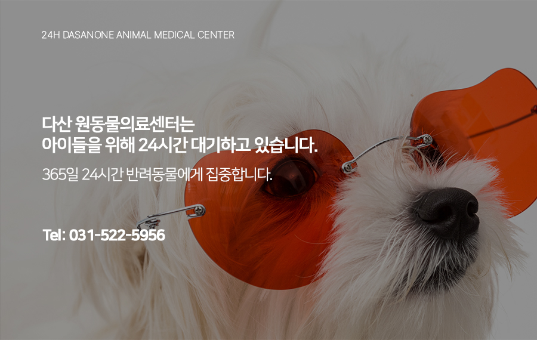

# 남양주 금곡동 동물병원 강아지 출혈성 장염 치료 후기

- logNo: 224165236735
- date: 2026-01-30
- displayDate: 2026. 1. 30. 12:55
- url: https://blog.naver.com/PostView.naver?blogId=dasanoneamc&logNo=224165236735
- categoryNo: 10
- tags: 

---

6개월령의 어린 말티푸 제리가 소화기 증상으로
다산 원동물의료센터에 내원하였습니다.
제리는 내원 하루 전부터 계속되는 구토와
심한 설사, 혈변을 보고 있었는데요.
문진상 최근 들어 아이 주변에서
특별한 변화는 없었습니다.

> 내원 당일 혈액검사

제리는 기초 접종이 다 완료된 상태였기 때문에
키트 검사보다는 혈액검사를 먼저 진행해 보기로
하였습니다. 혈액검사 결과 제리는 심한
전해질 불균형과 탈수 증상, 저알부민혈증,
염증 수치 상승 등이 나타났습니다.

> 초음파 검사

또한 영상 검사에서는 소장 내 다량의 액체 저류와 함께
소장 벽 비후 양상을 보이고 있었습니다.
분변 검사에서는 다수의 탈락 상피세포를
발견하였습니다.

> 분변 PCR 검사

제리는 입원 치료와 함께 출혈성 장염의 원인을
찾기 위해 감염체 분변 PCR 검사를
의뢰하기로 하였습니다.

> 입원 2일 차 혈액 검사

수액과 주사제, 처방 사료 등의 치료를 시작하였고
입원 2일차에 제리는 다른 수치들은 모두
개선세를 보였으나 알부민 수치가 크게
하락하였습니다. 이것은 아이가 실제로
알부민 수치가 더 떨어졌을 수도 있지만,
탈수가 교정됨에 따라 수치가 떨어진 것으로
판단되었고, 다만 여기서 더 떨어지면
아이에게 심각한 임상 증상이 나타날 수 있기 때문에
보호자님께 알부민 수혈도 필요할 수 있음을
안내해 드렸습니다.

> 입원 3일 차 혈액 검사 와 분변 PCR 결과

입원 3일차 제리는 임상 증상이 모두
개선되었으며, 식욕도 양호하고
알부민 수치도 많이 오른 양상을 보였습니다.
분변 PCR 검사에서 아이는 외부 세균의
감염이 확인되었습니다.
제리는 증상이 개선되고, 원인도 정확히
파악되었기에 퇴원하여 통원치료로
전환하였습니다.

> 퇴원 5일 후 혈액 검사

퇴원 5일 뒤 재진에서 제리는 소화기 임상 증상이
재발하지 않았으며, 식욕도 양호하게 잘 지냈다고
보호자님께서 말씀해 주셨습니다.
또한 혈액 검사에서도 알부민 수치가 정상으로
돌아온 것을 확인하였습니다.

수술 전문 동물병원인 24시 다산 원동물의료센터는
24시간 수의사가 상주해 있는 동물병원입니다.

📍 24시 다산 원동물의료센터 경기도 남양주시 다산중앙로 15 3층

#강아지장염 #강아지출혈성장염
#강아지설사 #강아지구토 #강아지혈변
#다산동물병원추천 #남양주동물병원
#구리동물병원 #도농역동물병원
