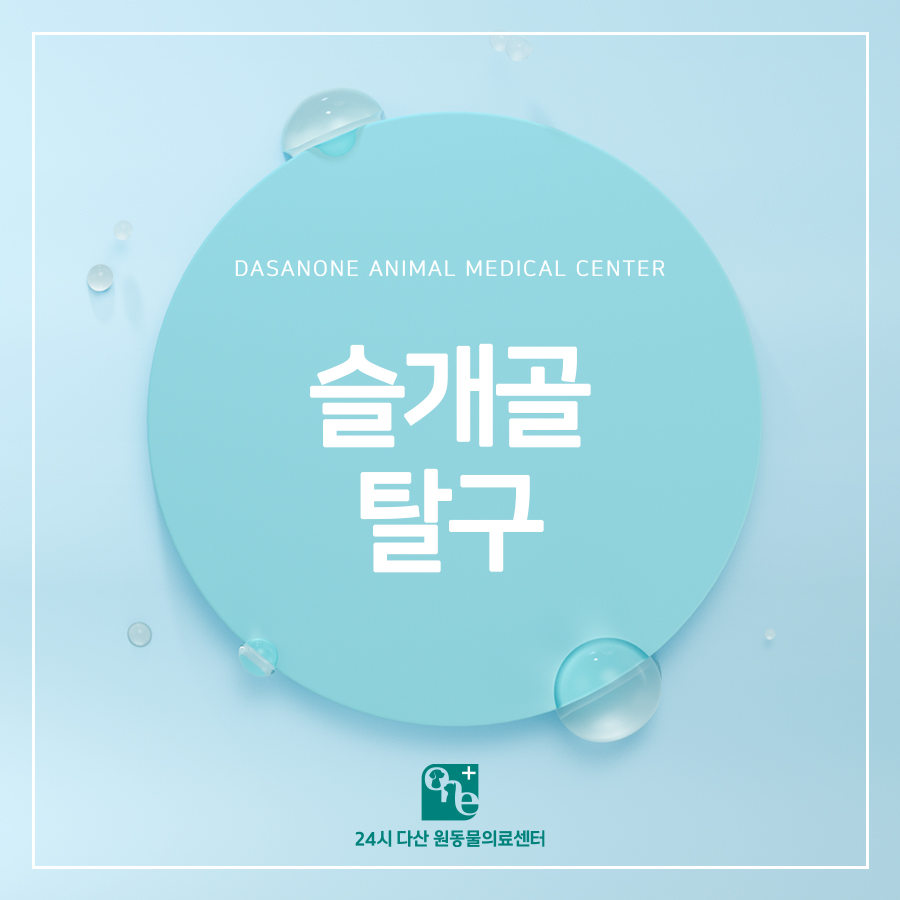
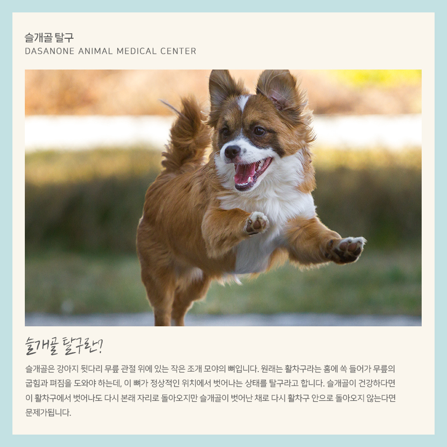
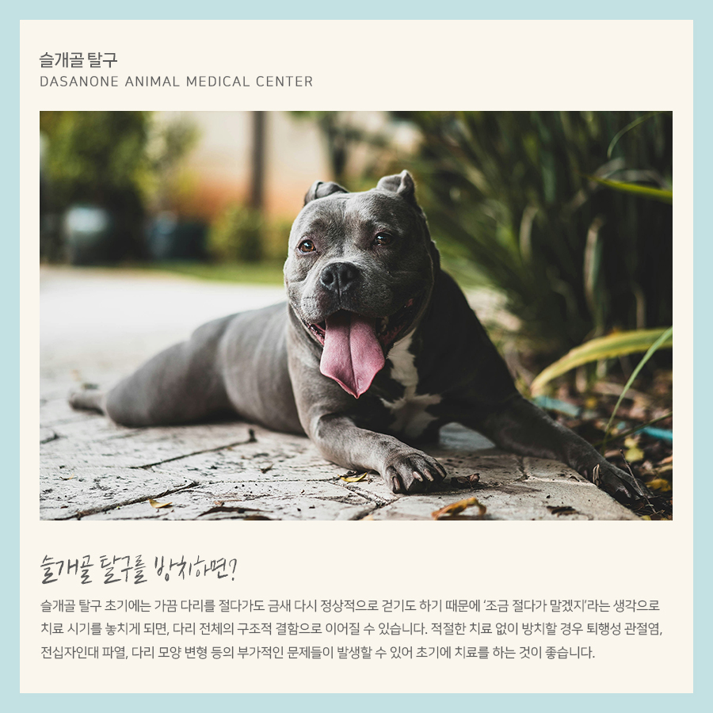
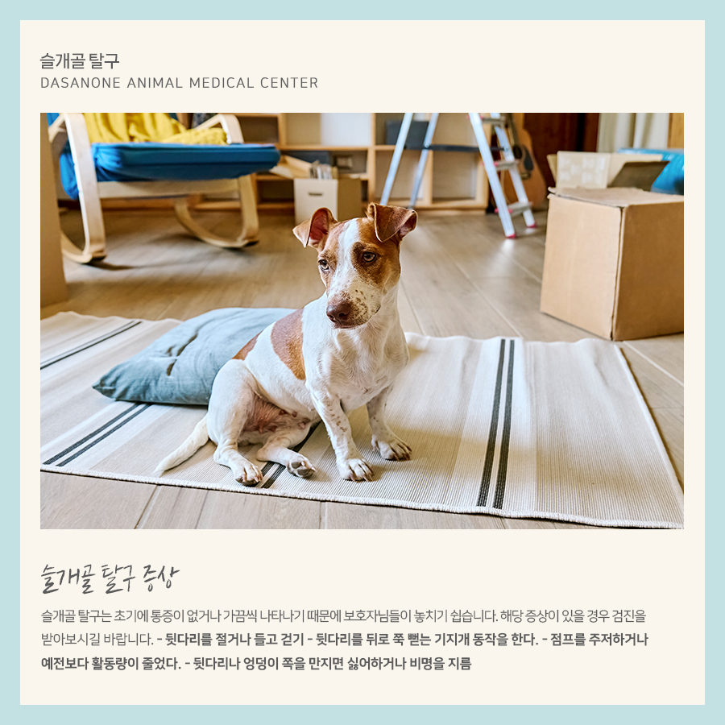
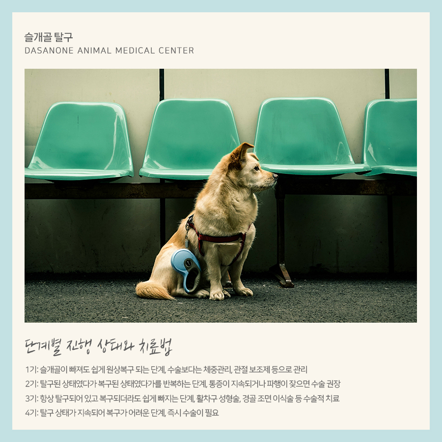
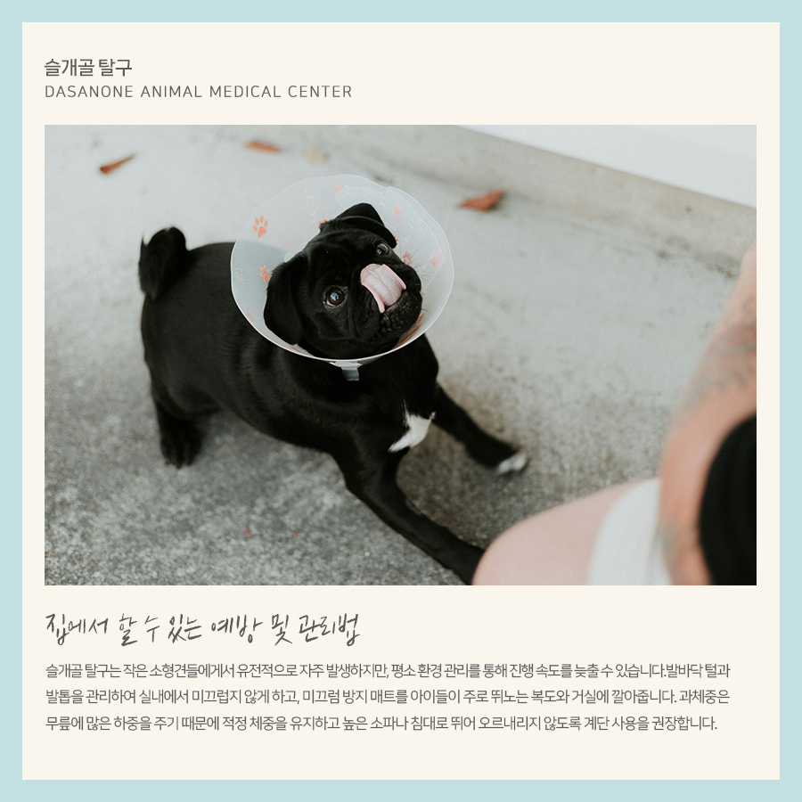
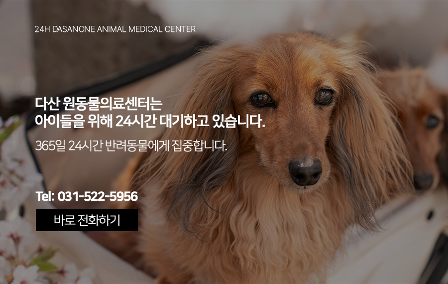

# 교문동 동물병원 뒷다리를 절뚝거려요. 슬개골 탈구의 증상과 예방법

- logNo: 224174192006
- date: 2026-02-06
- displayDate: 2026. 2. 6. 16:58
- url: https://blog.naver.com/PostView.naver?blogId=dasanoneamc&logNo=224174192006
- categoryNo: 14
- tags: 

---

날씨가 좋아지면 강아지들과 야외활동을
많이 하게 됩니다. 산책을 좋아하는 강아지들은
신나서 즐거운 산책 시간을 보내게 됩니다.
그러던 중 아이가 갑자기 뒷다리를 들고 걷거나
깽깽이 발을 하는 모습을 발견하면 보호자분들은
가슴이 철렁하게 됩니다. 오늘은 소형견의 고질병이라
불리는 슬개골 탈구에 대해 알아보겠습니다.

> 슬개골 탈구란?

슬개골은 강아지 뒷다리 무릎 관절 위에 있는
작은 조개 모양의 뼈입니다. 원래는 활차구라는 홈에
쏙 들어가 무릎의 굽힘과 펴짐을 도와야 하는데,
이 뼈가 정상적인 위치에서 벗어나는 상태를
탈구라고 합니다. 슬개골이 건강하다면 이 활차구에서
벗어나도 다시 본래 자리로 돌아오지만 슬개골이
벗어난 채로 다시 활차구 안으로
돌아오지 않는다면 문제가 됩니다.

> 슬개골 탈구를 방치하면?

슬개골 탈구 초기에는 가끔 다리를 절다가도
금새 다시 정상적으로 걷기도 하기 때문에
‘조금 절다가 말겠지’라는 생각으로 치료 시기를
놓치게 되면, 다리 전체의 구조적 결함으로
이어질 수 있습니다. 적절한 치료 없이 방치할 경우
퇴행성 관절염, 전십자인대 파열, 다리 모양 변형 등의
부가적인 문제들이 발생할 수 있어
초기에 치료를 하는 것이 좋습니다.

> 슬개골 탈구 증상

슬개골 탈구는 초기에 통증이 없거나
가끔씩 나타나기 때문에 보호자님들이
놓치기 쉽습니다. 아래 증상이 있을 경우
검진을 받아보시길 바랍니다.
✓ 뒷다리를 절거나 들고 걷기
✓ 뒷다리를 뒤로 쭉 뻗는 기지개 동작을 한다.
✓ 점프를 주저하거나 예전보다 활동량이 줄었다.
✓ 뒷다리나 엉덩이 쪽을 만지면 싫어하거나 비명을 지름

> 단계별 진행 상태와 치료법

1기: 슬개골이 빠져도 쉽게 원상복구되는 단계,
수술보다는 체중관리, 관절 보조제 등으로 관리
2기: 탈구된 상태였다가 복구된 상태였다가를
반복하는 단계, 통증이 지속되거나
파행이 잦으면 수술 권장
3기: 항상 탈구되어 있고 복구되더라도
쉽게 빠지는 단계, 활차구 성형술,
경골 조면 이식술 등 수술적 치료
4기: 탈구 상태가 지속되어 복구가 어려운 단계,
즉시 수술이 필요

> 집에서 할 수 있는 예방 및 관리법

슬개골 탈구는 작은 소형견들에게서 유전적으로
자주 발생하지만, 평소 환경 관리를 통해 진행 속도를
늦출 수 있습니다. 발바닥 털과 발톱을 관리하여
실내에서 미끄럽지 않게 하고, 미끄럼 방지 매트를
아이들이 주로 뛰노는 복도와 거실에 깔아줍니다.
과체중은 무릎에 많은 하중을 주기 때문에 적정 체중을
유지하고 높은 소파나 침대로 뛰어 오르내리지 않도록
계단 사용을 권장합니다.

---

아이의 걸음걸이가 평소와 다르고 다리를 절거나
불편해한다면, 언제든 본원에 내원하여 정확한 검진을
받아보시길 바랍니다. 전문 수의사가 아이의
관절 건강을 꼼꼼히 체크해 드리겠습니다.

저희 다산 원동물의료센터는
보호자분들의 든든한 동반자가 되어,
반려동물의 평생 건강 관리를 책임지겠습니다.

📍 24시 다산 원동물의료센터 경기도 남양주시 다산중앙로 15 3층

#강아지슬개골탈구 #슬개골탈구수술
#수술잘하는동물병원 #다산동물병원추천
#24시간동물병원 #다산역동물병원
#남양주동물병원 #구리동물병원
#교문동동물병원
