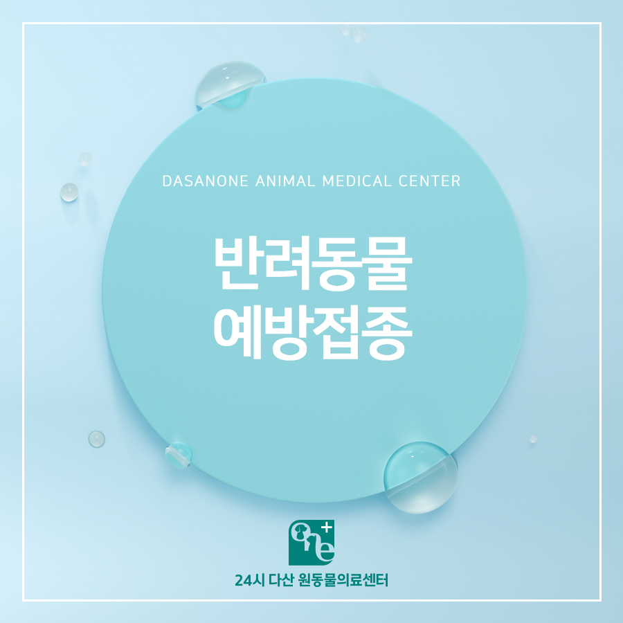
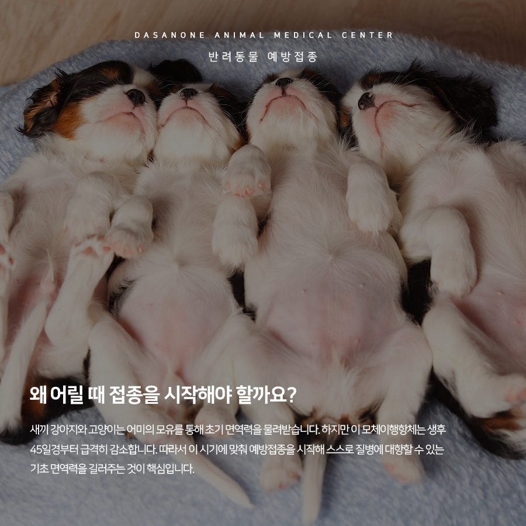
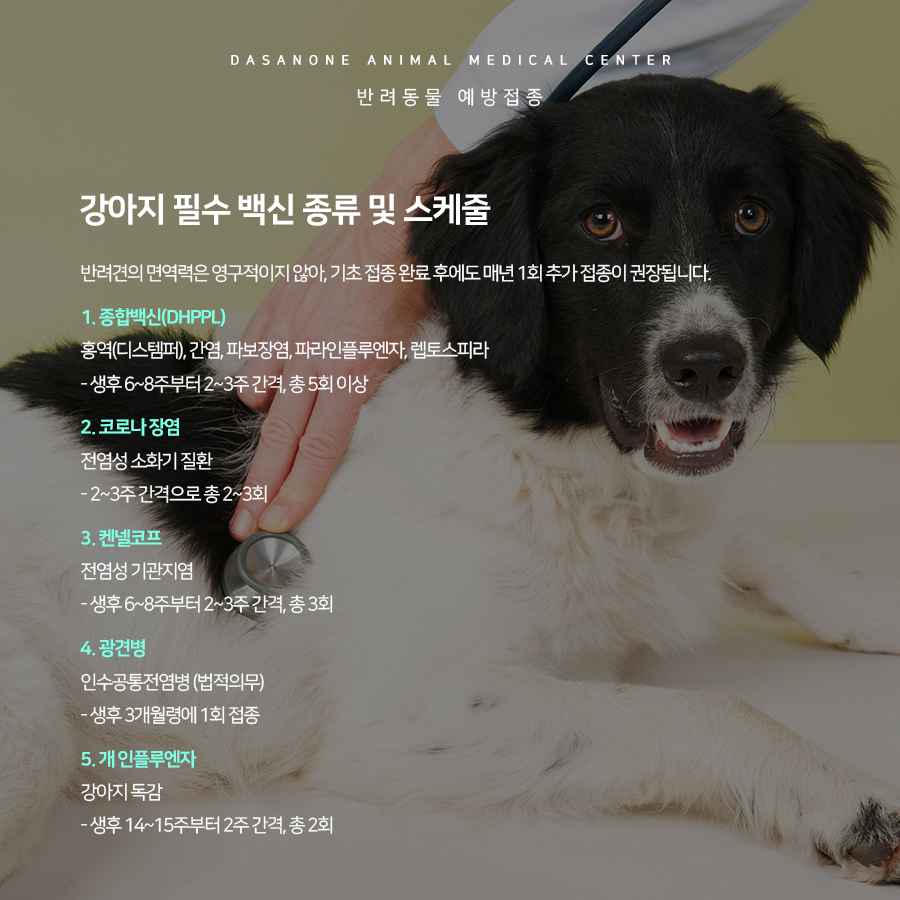
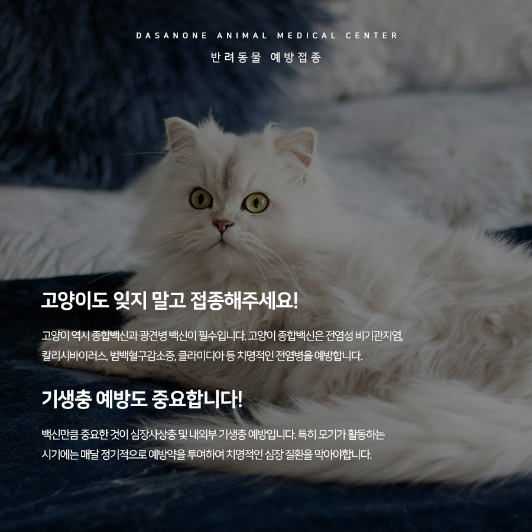
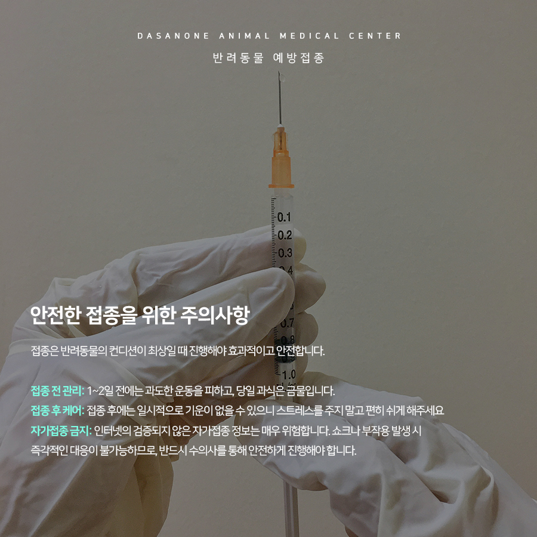
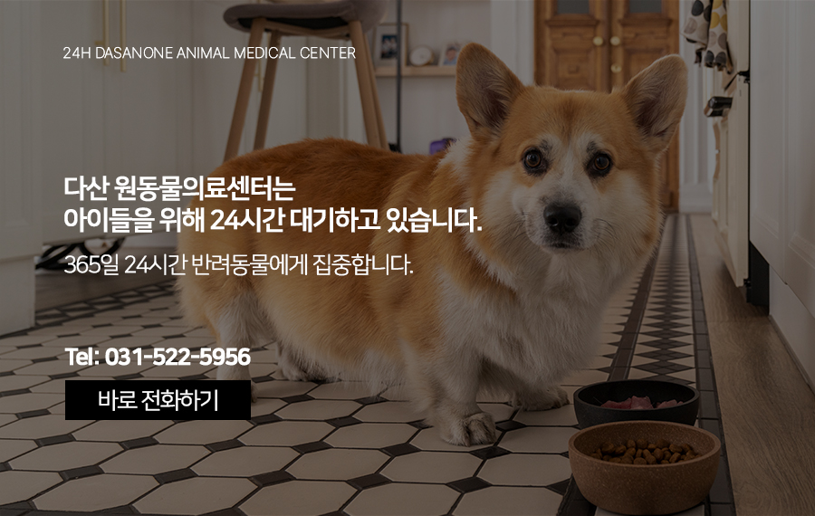

# 동구동 동물병원 우리 아이 건강 첫 단추, 반려동물 필수 예방접종 가이드

- logNo: 224198132477
- date: 2026-02-27
- displayDate: 2026. 2. 27. 15:36
- url: https://blog.naver.com/PostView.naver?blogId=dasanoneamc&logNo=224198132477
- categoryNo: 14
- tags: 

---

“집에서만 키우니까 괜찮겠지” 혹은
“접종 시기를 놓쳤는데 이제 와서 필요할까?”라는
고민은 반려동물의 건강을 위험에 빠뜨릴 수 있습니다.
바이러스는 보호자의 외출복이나 신발을 통해서도
언제든 실내로 유입될 수 있기 때문입니다. 특히
광견병처럼 법적 의무 접종인 경우도 있으니,
사랑하는 반려동물을 위해 예방접종 리스트를
꼭 확인해 주세요.

> 왜 어릴 때 접종을 시작해야 할까요?

새끼 강아지와 고양이는 어미의 모유를 통해
초기 면역력을 물려받습니다. 하지만
이 모체이행항체는 생후 45일경부터
급격히 감소합니다. 따라서 이 시기에 맞춰
예방접종을 시작해 스스로 질병에 대항할 수 있는
기초 면역력을 길러주는 것이 핵심입니다.

> 강아지 필수 백신 종류 및 스케줄

반려견의 면역력은 영구적이지 않아,
기초 접종 완료 후에도 매년 1회
추가 접종이 권장됩니다.
1. 종합백신(DHPPL)
홍역(디스템퍼), 간염, 파보장염,
파라인플루엔자, 렙토스피라
- 생후 6~8주부터 2~3주 간격, 총 5회 이상
2. 코로나 장염
전염성 소화기 질환
- 2~3주 간격으로 총 2~3회
3. 켄넬코프
전염성 기관지염
- 생후 6~8주부터 2~3주 간격, 총 3회
4. 광견병
인수공통전염병 (법적의무)
- 생후 3개월령에 1회 접종
5. 개 인플루엔자
강아지 독감
- 생후 14~15주부터 2주 간격, 총 2회

> 고양이도 잊지 말고 접종해 주세요!

고양이 역시 종합백신과 광견병 백신이 필수입니다.
고양이 종합백신은 전염성 비기관지염,
칼리시바이러스, 범백혈구감소증, 클라미디아 등
치명적인 전염병을 예방합니다.

> 기생충 예방도 중요합니다!

백신만큼 중요한 것이 심장사상충 및
내외부 기생충 예방입니다. 특히 모기가 활동하는
시기에는 매달 정기적으로 예방약을 투여하여
치명적인 심장 질환을 막아야 합니다.

> 안전한 접종을 위한 주의사항

접종은 반려동물의 컨디션이 최상일 때 진행해야
효과적이고 안전합니다.
접종 전 관리
1~2일 전에는 과도한 운동을 피하고,
당일 과식은 금물입니다.
접종 후 케어
접종 후에는 일시적으로 기운이 없을 수 있으니
스트레스를 주지 말고 편히 쉬게 해주세요
자가접종 금지
인터넷의 검증되지 않은 자가접종 정보는
매우 위험합니다. 쇼크나 부작용 발생 시
즉각적인 대응이 불가능하므로, 반드시 수의사를 통해
안전하게 진행해야 합니다.

---

반려동물의 시간은 사람보다 빠르게 흐릅니다.
장기적인 예방접종은 아이들의 소중한 시간을
건강하게 지켜주는 가장 확실한 투자입니다 :)

저희 다산 원동물의료센터는
보호자분들의 든든한 동반자가 되어,
반려동물의 평생 건강 관리를 책임지겠습니다.

📍 24시 다산 원동물의료센터 경기도 남양주시 다산중앙로 15 3층

#다산동물병원추천 #24시간동물병원
#도농역동물병원 #남양주동물병원 #구리동물병원
#동구동동물병원 #강아지예방접종 #고양이예방접종
#강아지건강검진 #고양이건강검진
