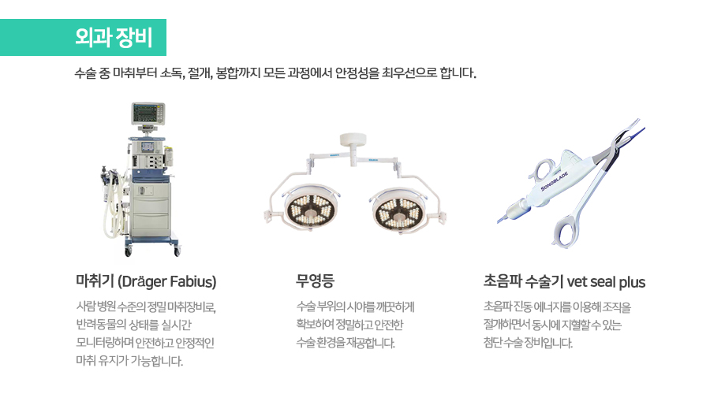
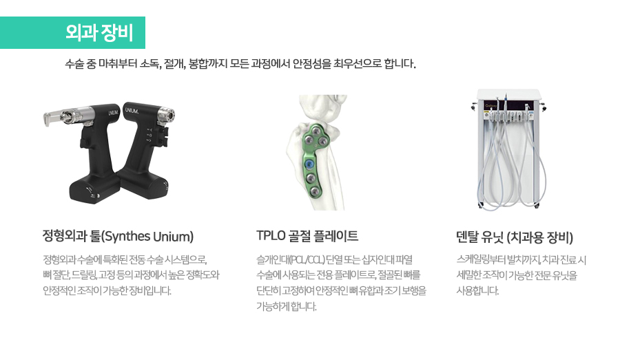
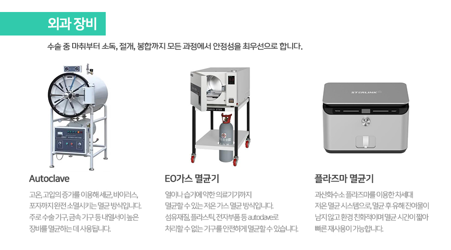
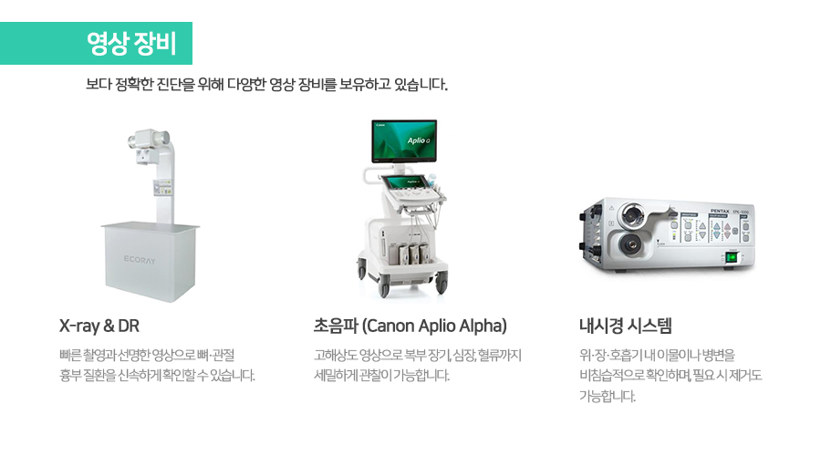
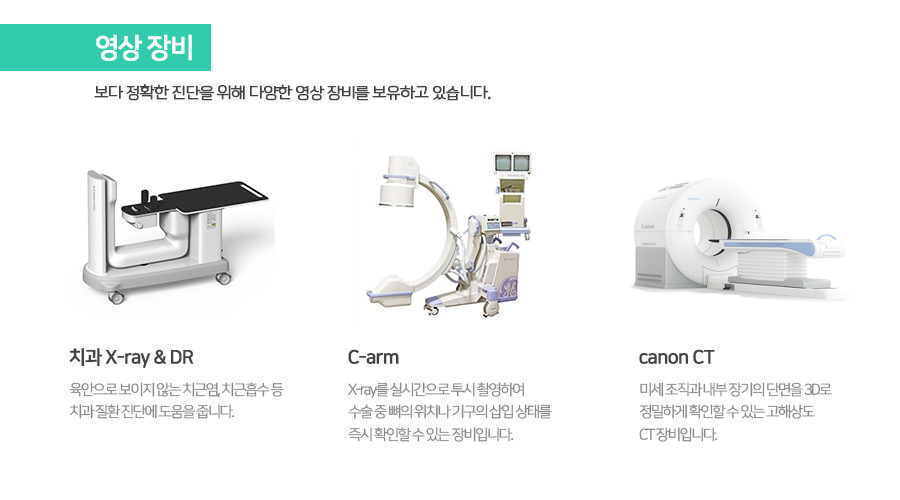
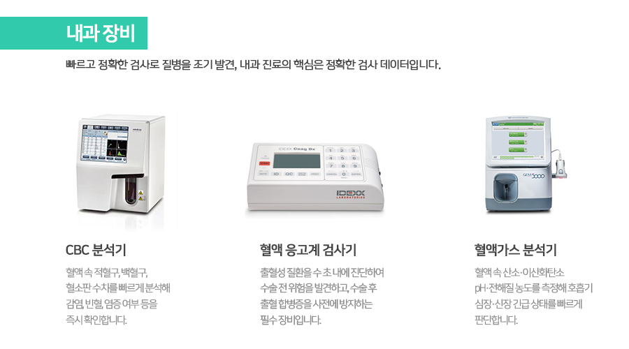
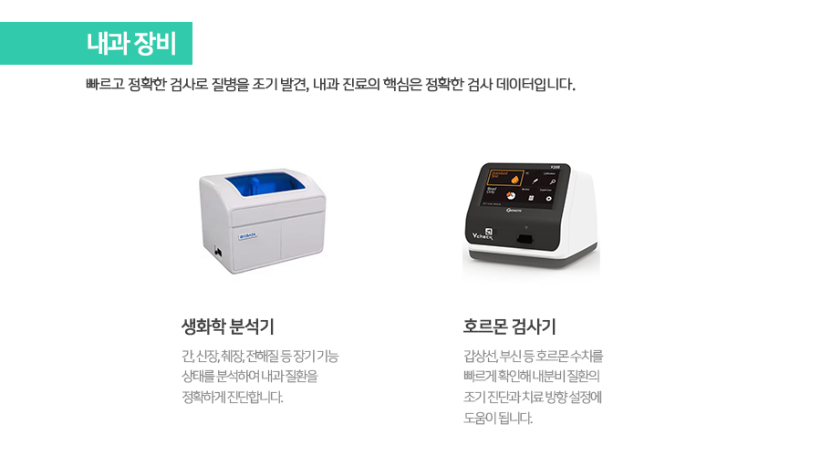
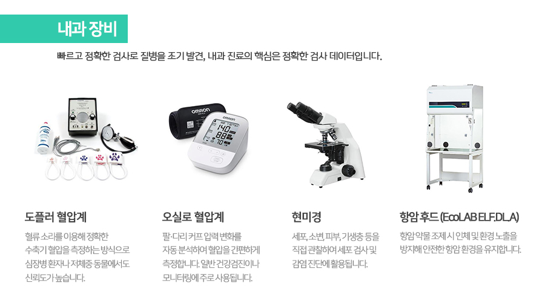
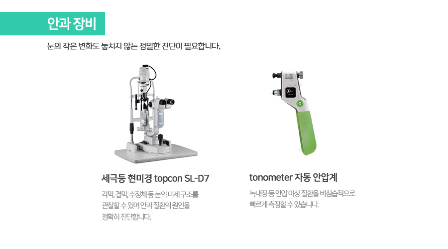
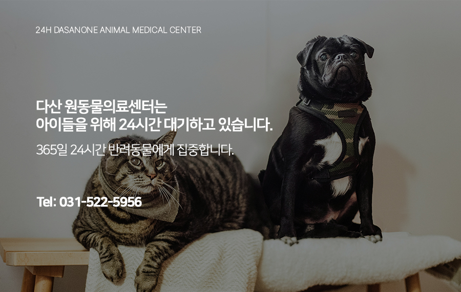

# 다산 원동물의료센터 장비소개

- logNo: 224206534588
- date: 2026-03-06
- displayDate: 2026. 3. 6. 12:11
- url: https://blog.naver.com/PostView.naver?blogId=dasanoneamc&logNo=224206534588
- categoryNo: 6
- tags: 

---

반려동물이 아플 때, 가장 중요한 건
정확한 진단과 안전한 치료입니다.
다산 원동물의료센터는 다양한 진료 분야에 맞춘
최신 의료장비를 도입하여 더 정밀하고 신속한
진료 서비스를 제공하고 있습니다.

> 외과 장비
> 수술 중 마취부터 소독, 절개, 봉합까지모든 과정에서 안정성을 최우선으로 합니다.

마취기 (Dräger Fabius)
사람 병원 수준의 정밀 마취장비로,
반려동물의 상태를 실시간 모니터링하며
안전하고 안정적인 마취 유지가 가능합니다.
무영등
수술 부위의 시야를 깨끗하게 확보하여
정밀하고 안전한 수술 환경을 재공합니다.
초음파 수술기 (vet seal plus)
초음파 진동 에너지를 이용해 조직을
절개하면서 동시에 지혈할 수 있는
첨단 수술 장비입니다.

정형외과 툴(Synthes Unium)
정형외과 수술에 특화된 전동 수술 시스템으로,
뼈 절단, 드릴링, 고정 등의 과정에서 높은 정확도와
안정적인 조작이 가능한 장비입니다.
TPLO 골절 플레이트
슬개인대(PCL/CCL) 단열 또는 십자인대 파열 수술에
사용되는 전용 플레이트로, 절골된 뼈를
단단히 고정하여 안정적인 뼈 유합과
조기 보행을 가능하게 합니다.
덴탈 유닛 (치과용 장비)
스케일링부터 발치까지, 치과 진료 시
세밀한 조작이 가능한 전문 유닛을 사용합니다.

Autoclave
고온, 고압의 증기를 이용해 세균, 바이러스,
포자까지 완전 소멸시키는 멸균 방식입니다.
주로 수술 기구, 금속 기구 등 내열서이 높은 장비를
멸균하는 데 사용됩니다.
EO가스 멸균기
열이나 습기에 약한 의료기기까지 멸균할 수 있는
저온 가스 멸균 방식입니다. 섬유재질, 플라스틱,
전자부품 등 autoclave로 처리할 수 없는 기구를
안전하게 멸균할 수 있습니다.
플라즈마 멸균기
과산화수소 플라즈마를 이용한 차세대
저온 멸균 시스템으로, 멸균 후 유해 잔여물이
남지 않고 환경 친화적이며 멸균 시간이 짧아
빠른 재사용이 가능합니다.

> 영상장비
> 보다 정확한 진단을 위해 다양한 영상 장비를보유하고 있습니다.

X-ray & DR
빠른 촬영과 선명한 영상으로 뼈·관절 흉부 질환을
신속하게 확인할 수 있습니다.
초음파 (Canon Aplio Alpha)
고해상도 영상으로 복부 장기, 심장, 혈류까지
세밀하게 관찰이 가능합니다.
내시경 시스템
위·장·호흡기 내 이물이나 병변을 비침습적으로
확인하며, 필요 시 제거도 가능합니다.

치과 X-ray & DR
육안으로 보이지 않는 치근염, 치근흡수 등
치과 질환 진단에 도움을 줍니다.
C-arm
X-ray를 실시간으로 투시 촬영하여
수술 중 뼈의 위치나 기구의 삽입 상태를
즉시 확인할 수 있는 장비입니다.
canon CT
미세 조직과 내부 장기의 단면을 3D로
정밀하게 확인할 수 있는 고해상도 CT 장비입니다.

> 내과장비
> 빠르고 정확한 검사로 질병을 조기 발견, 내과 진료의핵심은 정확한 검사 데이터입니다.

CBC 분석기
혈액 속 적혈구, 백혈구, 혈소판 수치를 빠르게 분석해
감염, 빈혈, 염증 여부 등을 즉시 확인합니다.
혈액 응고계 검사기
출혈성 질환을 수 초 내에 진단하여
수술 전 위험을 발견하고, 수술 후 출혈 합병증을
사전에 방지하는 필수 장비입니다.
혈액가스 분석기
혈액 속 산소·이산화탄소 pH·전해질 농도를 측정해
호흡기 심장·신장 긴급 상태를 빠르게 판단합니다.

생화학 분석기
간, 신장, 췌장, 전해질 등 장기 기능 상태를 분석하여
내과 질환을 정확하게 진단합니다.
호르몬 검사기
갑상선, 부신 등 호르몬 수치를 빠르게 확인해
내분비 질환의 조기 진단과 치료 방향 설정에
도움이 됩니다.

도플러 혈압계
혈류 소리를 이용해 정확한 수축기 혈압을
측정하는 방식으로 심장병 환자나
저체중 동물에서도 신뢰도가 높습니다.
오실로 혈압계
팔, 다리 커프 압력 변화를 자동 분석하여
혈압을 간편하게 측정합니다. 일반 건강검진이나
모니터링에 주로 사용됩니다.
현미경
세포, 소변, 피부, 기생충 등을
직접 관찰하여 세포 검사 및
감염 진단에 활용됩니다.
항암 후드 (EcoLAB ELE.DLA)
항암 약물 조제 시 인체 및 환경 노출을 방지해
안전한 항암 환경을 유지합니다.

> 안과장비
> 눈의 작은 변화도 놓치지 않는정밀한 진단이 필요합니다.

세극등 현미경 (topcon SL-D7)
각막, 결막, 수정체 등 눈의 미세 구조를
관찰할 수 있어 안과 질환의 원인을
정확히 진단합니다.
tonometer 자동 안압계
녹내장 등 안압 이상 질환을 비침습적으로
빠르게 측정할 수 있습니다.

다산 원동물의료센터는
아이들의 응급 상황에 대비하여
24시간 대기하고 있습니다.

📍 24시 다산 원동물의료센터 경기도 남양주시 다산중앙로 15 3층

#다산동물병원추천 #24시간동물병원
#도농역동물병원 #남양주동물병원 #구리동물병원
#강아지CT #고양이CT #수술잘하는동물병원
#다산강아지건강검진 #다산고양이건강검진
