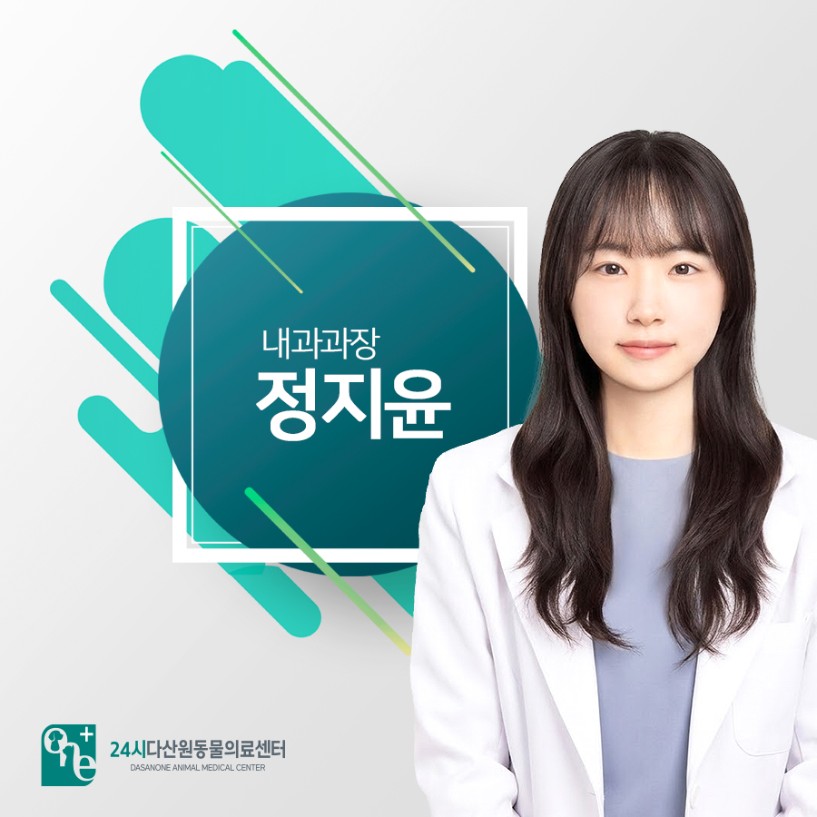
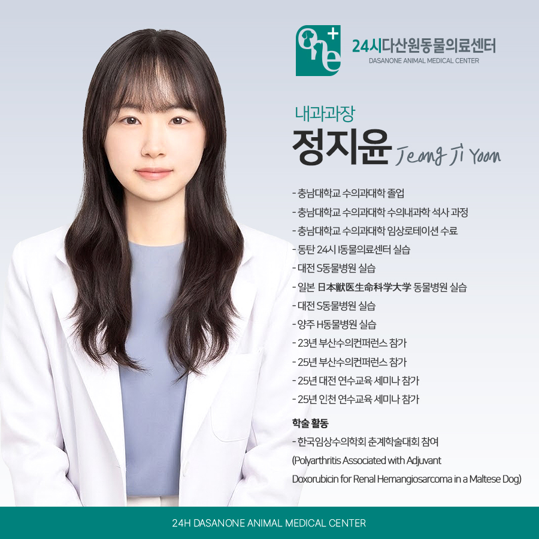
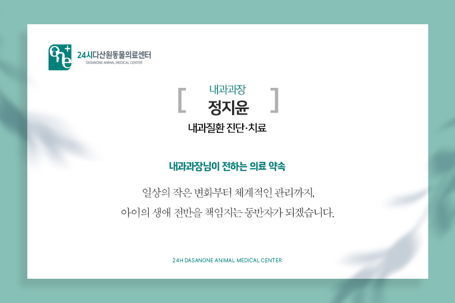

# 24시 다산 원동물의료센터 정지윤 내과원장님을 소개합니다.

- logNo: 224212430320
- date: 2026-03-11
- displayDate: 2026. 3. 11. 12:30
- url: https://blog.naver.com/PostView.naver?blogId=dasanoneamc&logNo=224212430320
- categoryNo: 7
- tags: 

---

안녕하세요.
다산 원동물의료센터 내과 과장
정지윤 입니다.

---

아이들이 다시 꼬리를 흔들며
일상으로 돌아가는 그날까지,
저는 보호자님의 든든한 조력자가 되어
아이들의 생명을 귀하게 여기겠습니다.
아이들의 눈높이에서 한 번 더 생각하고
진심을 다해 진료하겠습니다.

📚
주요 약력
- 충남대학교 수의과대학 졸업
- 충남대학교 수의과대학 수의내과학 석사 과정
- 충남대학교 수의과대학 임상로테이션 수료
- 동탄 24시 I동물의료센터 실습
- 대전 S동물병원 실습
- 일본 日本獣医生命科学大学 동물병원 실습
- 대전 S동물병원 실습
- 양주 H동물병원 실습
- 23년 부산수의컨퍼런스 참가
- 25년 부산수의컨퍼런스 참가
- 25년 대전 연수교육 세미나 참가
- 25년 인천 연수교육 세미나 참가
학술 활동
- 한국임상수의학회 춘계학술대회 참여
(Polyarthritis Associated with Adjuvant
Doxorubicin for Renal Hemangiosarcoma in a Maltese Dog)

> 삶의 질을 개선하는 내과 질환 치료

내과 진료는 아이의 생애 전반을 함께 걷는
긴 여정입니다. 심장, 신장, 내분비 질환처럼
꾸준한 관리가 필요한 만성 질환일수록
보호자님과의 소통이 중요합니다.
아이의 투병 과정을 보호자님 혼자
견디게 하지 않겠습니다. 아이가 통증 없이
가족 곁에서 행복하게 오래 머물 수 있도록
최적의 관리 솔루션을 제공합니다.

저희 다산 원동물의료센터는
보호자분들의 든든한 동반자가 되어,
반려동물의 평생 건강 관리를 책임지겠습니다.

📍 24시 다산 원동물의료센터 경기도 남양주시 다산중앙로 15 3층

#다산동물병원추천 #24시간동물병원
#도농역동물병원 #남양주동물병원 #구리동물병원
#강아지CT #고양이CT #수술잘하는동물병원
#수술전문동물병원 #수택동동물병원 #동구동동물병원
