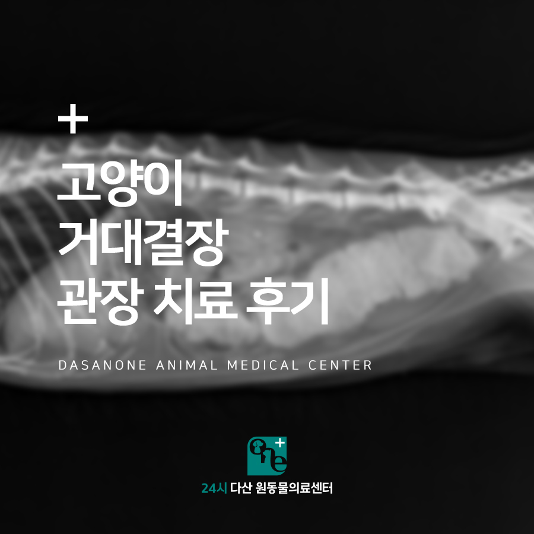
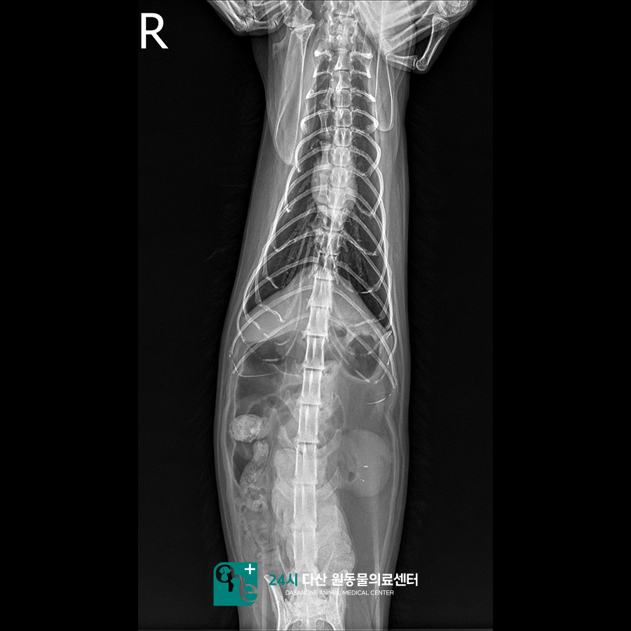
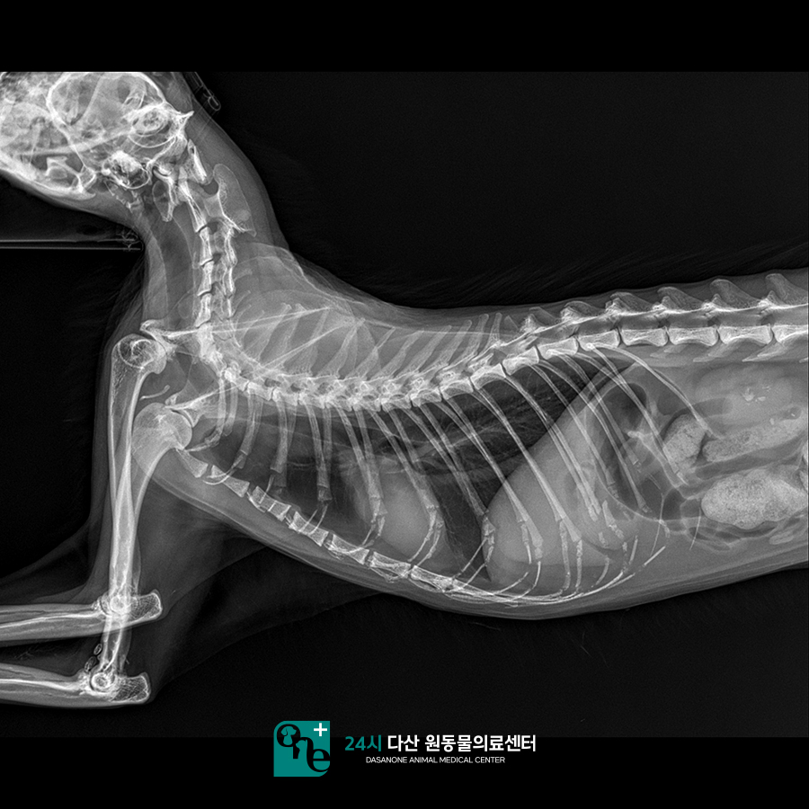
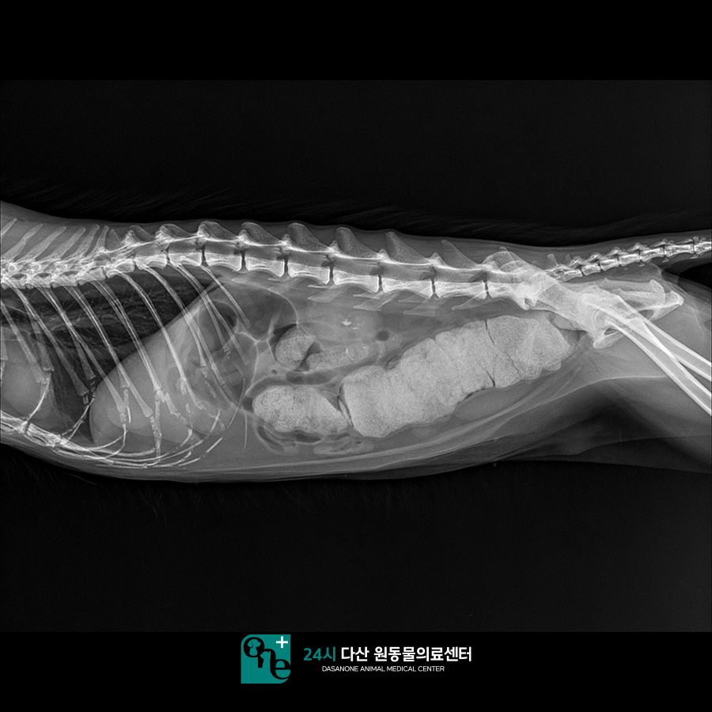
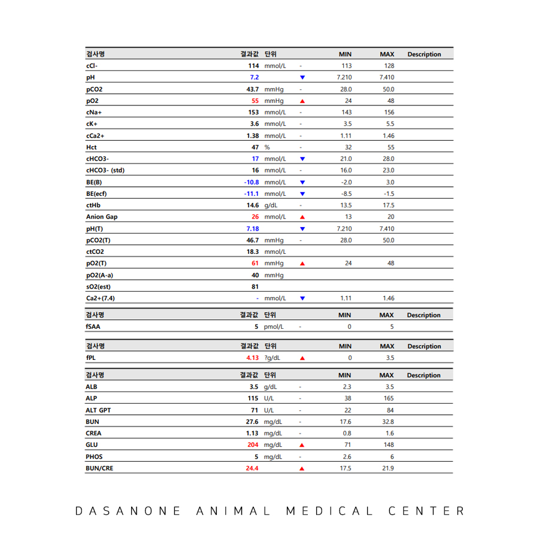
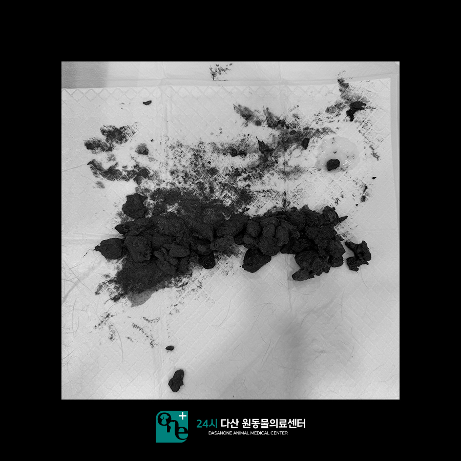
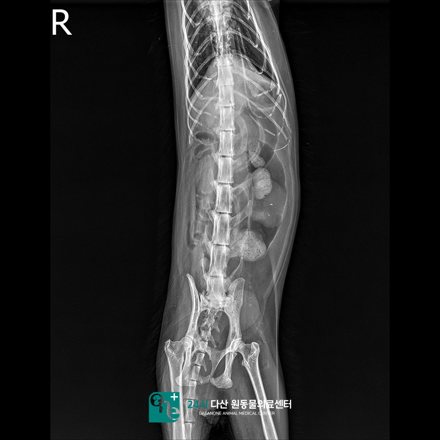
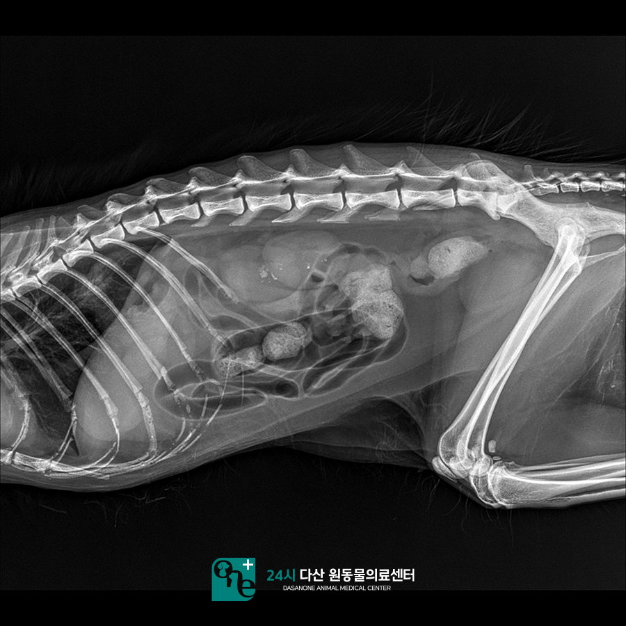
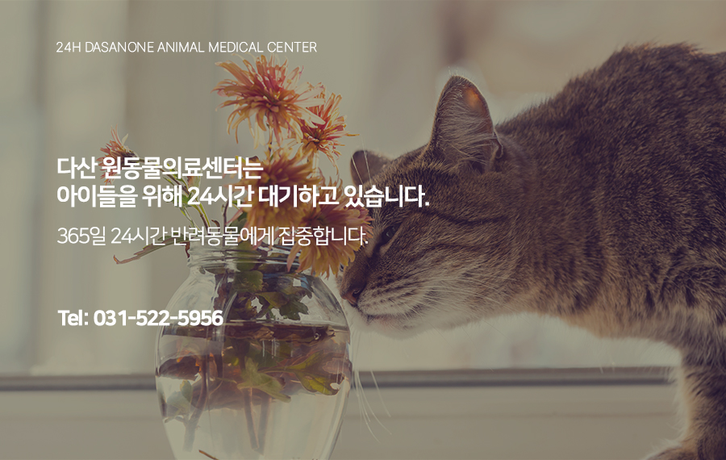

# 동구동 동물병원 고양이 변비, 거대결장 관장 치료 후기

- logNo: 224212433332
- date: 2026-03-12
- displayDate: 2026. 3. 12. 11:00
- url: https://blog.naver.com/PostView.naver?blogId=dasanoneamc&logNo=224212433332
- categoryNo: 10
- tags: 

---

18살 고양이 유니가 변비 증상으로
다산 원동물의료센터에 내원하였습니다.
보호자님께서는 아이가 원래부터 만성적인
변비 증상을 갖고 있다고 하셨습니다.
이번에는 변을 못 본 지 5일 이상 됐다고 하셨고
3~4일 전부터 식욕저하가 시작되어 점점
심해지고 있는 상황이었습니다.
집에서 유산균도 먹여보고 타 병원 약도 복용했으나
효과가 없었다고 하셨습니다.

> 방사선 촬영과 혈액 검사 진행

유니는 일단 방사선 촬영과 혈액검사를 진행하였습니다.
검사 결과 유니는 대장 내 분변이 쌓여
거대결장화 되어 있었고, 탈수 증상과
췌장염 수치 상승이 동반되고 있는 상태였습니다.
보호자님과 상의 후 관장을 진행하기로 하였으나
탈수화, 췌장염 수치 상승으로 인해 수액을
충분히 맞은 후에 관장을 진행하기로 하였습니다.

> 관장 치료 진행

그렇게 수액을 맞고 탈수를 교정한 뒤 변연화제를
아이 항문으로 투여한 후 배변을 기다렸으나
아이는 스스로 배변을 하지 못하는 상황이었습니다.
직접 관장을 하기로 결정하고 관장을 진행하였습니다.

> 관장 후 방사선 촬영

관장 후 방사선 촬영에서 변이 많이 빠진 것을
확인하였습니다. 이후 유니는 꾸준히 변비를
방지하기 위한 약을 복용하고 있습니다.
보호자님께서는 아이가 약을 먹은 이후로는
아직까지 변비 없이 변을 잘 보고 있다고
말씀해 주셨습니다.

---

고양이에서 유니와 같은 변비는
굉장히 흔한 질환입니다. 보통 3~4일가량
배변이 없어도 크게 문제가 되진 않는데요.
그 이상의 기간 동안 배변이 없고,
아이가 변을 보기 위해 화장실을 갔으나
변을 보지 못하는 상황이 지속되면
변비라고 봐야 합니다. 변비가 지속되면
아이는 통증과 스트레스 등으로 식욕저하가 동반되며
증상이 악화될 수 있습니다. 따라서 아이가
4~5일 이상의 긴 시간 동안 변을 못 보거나,
변을 보려고 해도 잘 나오지 않는 증상 등이
나타날 때는 즉시 병원에 내원하셔서
진료를 보시길 권장 드립니다.

24시 다산 원동물의료센터는
24시간 수의사가 상주하며
내과·외과·영산의학과가 분과된
전문 시스템으로 진료를 보고 있습니다.

📍 24시 다산 원동물의료센터 경기도 남양주시 다산중앙로 15 3층

#남양주고양이동물병원 #고양이변비 #고양이관장
#고양기거대결장 #고양이췌장염
#다산동물병원 #남양주동물병원 #구리동물병원
#동구동동물병원 #다산원동물병원
