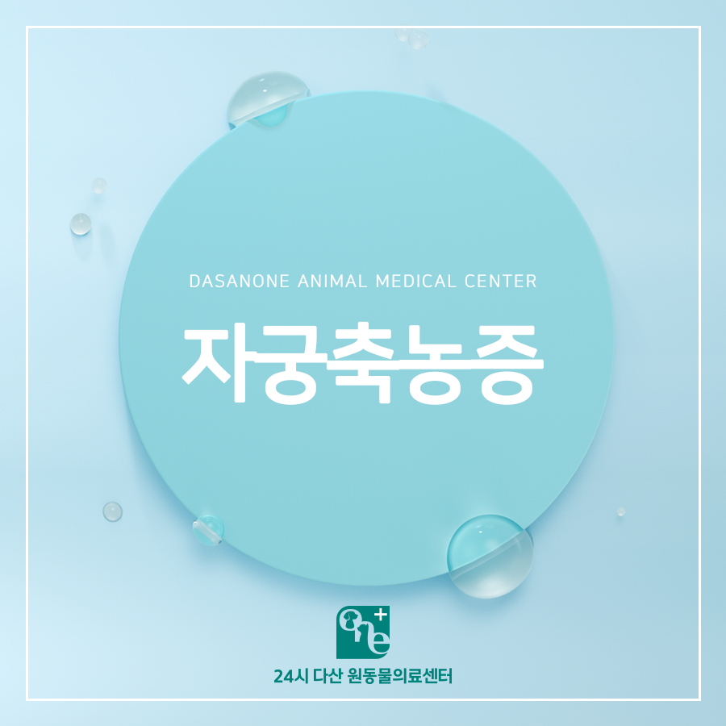
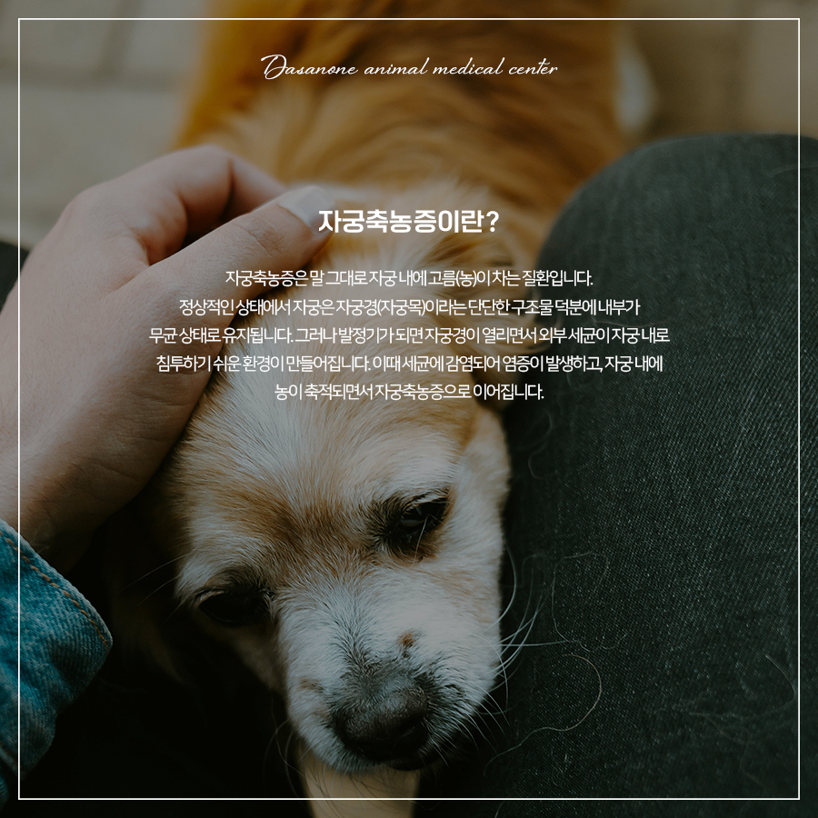
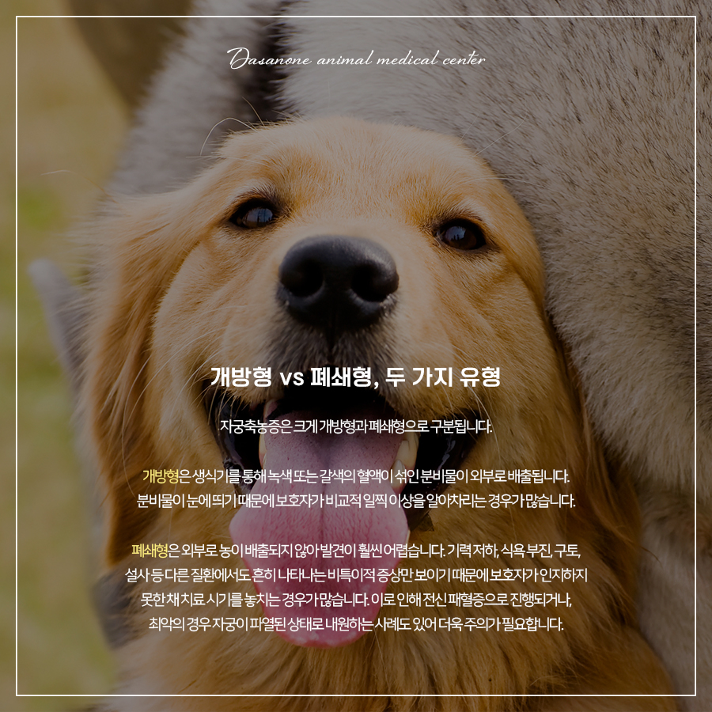
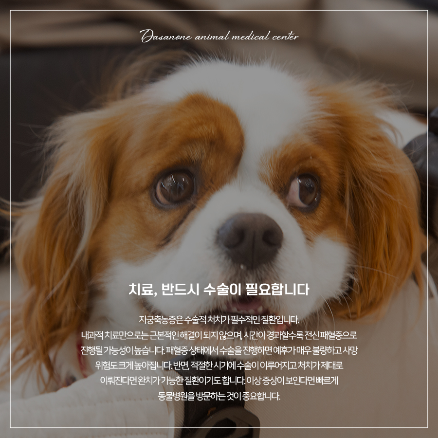
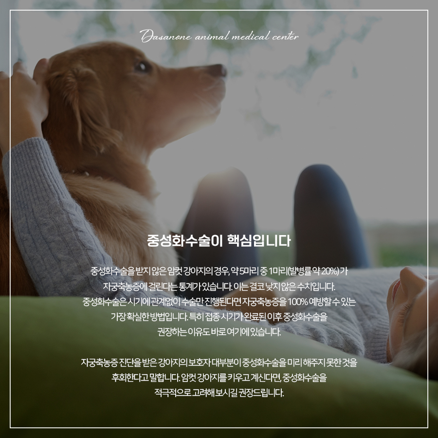
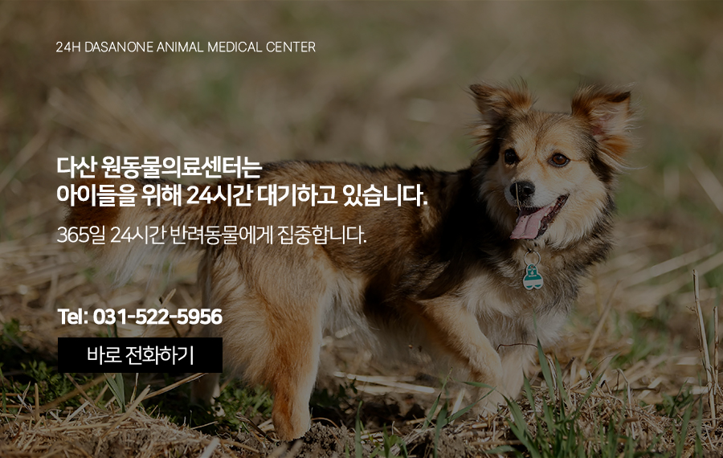

# 토평동 동물병원 강아지 자궁축농증, 왜 위험하고 어떻게 예방할 수 있을까?

- logNo: 224223471178
- date: 2026-03-20
- displayDate: 2026. 3. 20. 14:07
- url: https://blog.naver.com/PostView.naver?blogId=dasanoneamc&logNo=224223471178
- categoryNo: 14
- tags: 

---

중성화 수술에 대한 인식이 높아진 오늘날에도,
실제 임상 현장에서는 매달 여러 마리의 강아지가
자궁축농증으로 수술대에 오르고 있습니다.
자궁축농증은 조기에 발견하면 완치가 가능하지만,
발견이 늦어질 경우 생명을 위협하는 심각한
질환입니다. 오늘은 자궁축농증의 원인부터 증상,
진단, 치료, 그리고 예방까지 핵심 정보를
정리해 드립니다.

> 자궁축농증이란?

자궁축농증은 말 그대로 자궁 내에
고름(농)이 차는 질환입니다.
정상적인 상태에서 자궁은 자궁경(자궁목)이라는
단단한 구조물 덕분에 내부가 무균 상태로 유지됩니다.
그러나 발정기가 되면 자궁경이 열리면서 외부 세균이
자궁 내로 침투하기 쉬운 환경이 만들어집니다.
이때 세균에 감염되어 염증이 발생하고, 자궁 내에
농이 축적되면서 자궁축농증으로 이어집니다.

> 개방형 vs 폐쇄형 — 두 가지 유형

자궁축농증은 크게 개방형과 폐쇄형으로 구분됩니다.
개방형은 생식기를 통해 녹색 또는 갈색의 혈액이 섞인
분비물이 외부로 배출됩니다. 분비물이 눈에 띄기
때문에 보호자가 비교적 일찍 이상을 알아차리는
경우가 많습니다.
폐쇄형은 외부로 농이 배출되지 않아 발견이
훨씬 어렵습니다. 기력 저하, 식욕 부진, 구토, 설사 등
다른 질환에서도 흔히 나타나는 비특이적 증상만
보이기 때문에 보호자가 인지하지 못한 채 치료 시기를
놓치는 경우가 많습니다. 이로 인해 전신 패혈증으로
진행되거나, 최악의 경우 자궁이 파열된 상태로
내원하는 사례도 있어 더욱 주의가 필요합니다.

> 치료, 반드시 수술이 필요합니다

자궁축농증은 수술적 처치가 필수적인 질환입니다.
내과적 치료만으로는 근본적인 해결이 되지 않으며,
시간이 경과할수록 전신 패혈증으로 진행될 가능성이
높습니다. 패혈증 상태에서 수술을 진행하면 예후가
매우 불량하고 사망 위험도 크게 높아집니다.
반면, 적절한 시기에 수술이 이루어지고 처치가
제대로 이뤄진다면 완치가 가능한 질환이기도 합니다.
이상 증상이 보인다면 빠르게 동물병원을
방문하는 것이 중요합니다.

> 예방, 중성화 수술이 핵심입니다

중성화 수술을 받지 않은 암컷 강아지의 경우,
약 5마리 중 1마리(발병률 약 20%)가
자궁축농증에 걸린다는 통계가 있습니다.
이는 결코 낮지 않은 수치입니다.
중성화 수술은 시기에 관계없이 수술만 진행된다면
자궁축농증을 100% 예방할 수 있는 가장 확실한
방법입니다. 특히 접종 시기가 완료된 이후
중성화 수술을 권장하는 이유도 바로 여기에 있습니다.
자궁축농증 진단을 받은 강아지의 보호자 대부분이
중성화 수술을 미리 해주지 못한 것을 후회한다고
말합니다. 암컷 강아지를 키우고 계신다면,
중성화 수술을 적극적으로 고려해 보시길 권장 드립니다.

---

아이가 평소와 다르게 기력이 없거나
식욕이 떨어졌다면 망설이지 말고 내원해 주세요.
작은 이상 징후도 놓치지 않는 것이
큰 질병을 막는 첫걸음입니다.

저희 다산 원동물의료센터는
보호자분들의 든든한 동반자가 되어,
반려동물의 평생 건강 관리를 책임지겠습니다.

📍 24시 다산 원동물의료센터 경기도 남양주시 다산중앙로 15 3층

#자궁축농증 #중성화수술 #강아지생식기농
#다산중성화동물병원 #다산동물병원
#동구릉역동물병원 #토평동동물병원 #남양주동물병원
