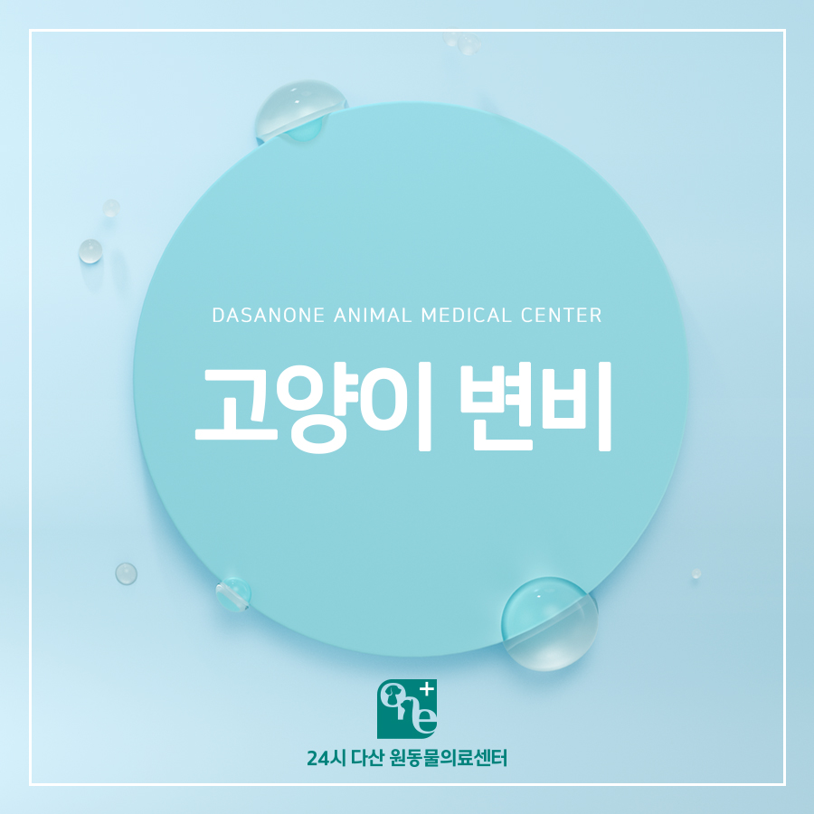
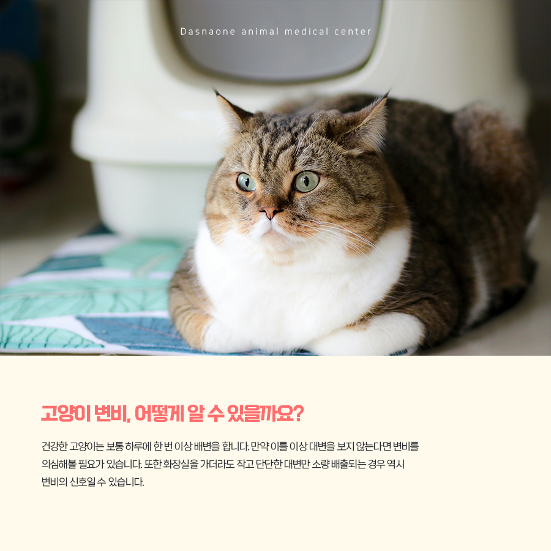
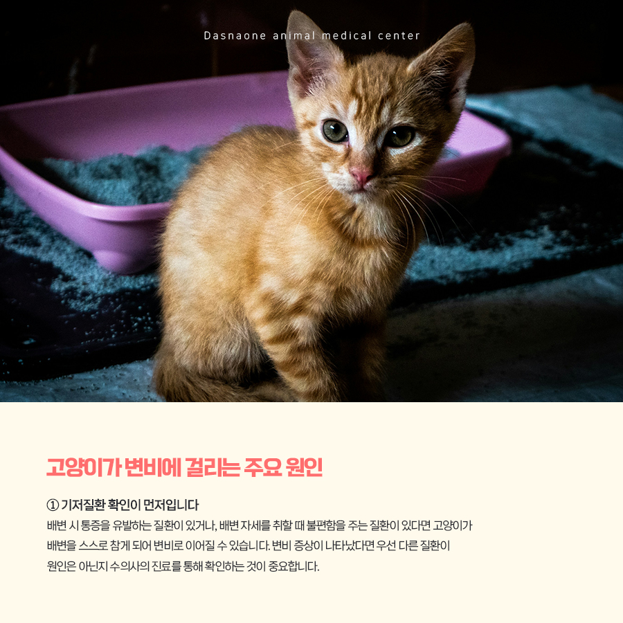
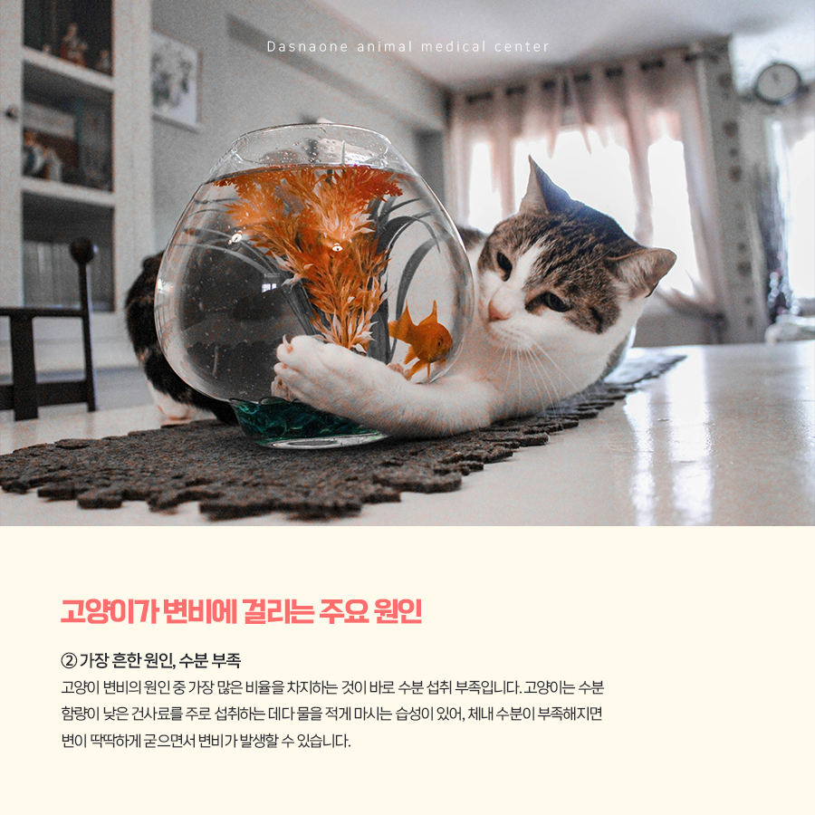
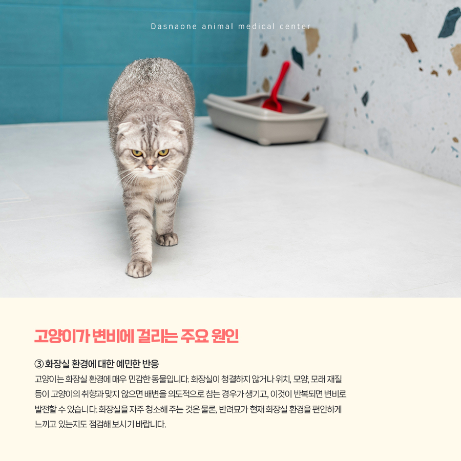
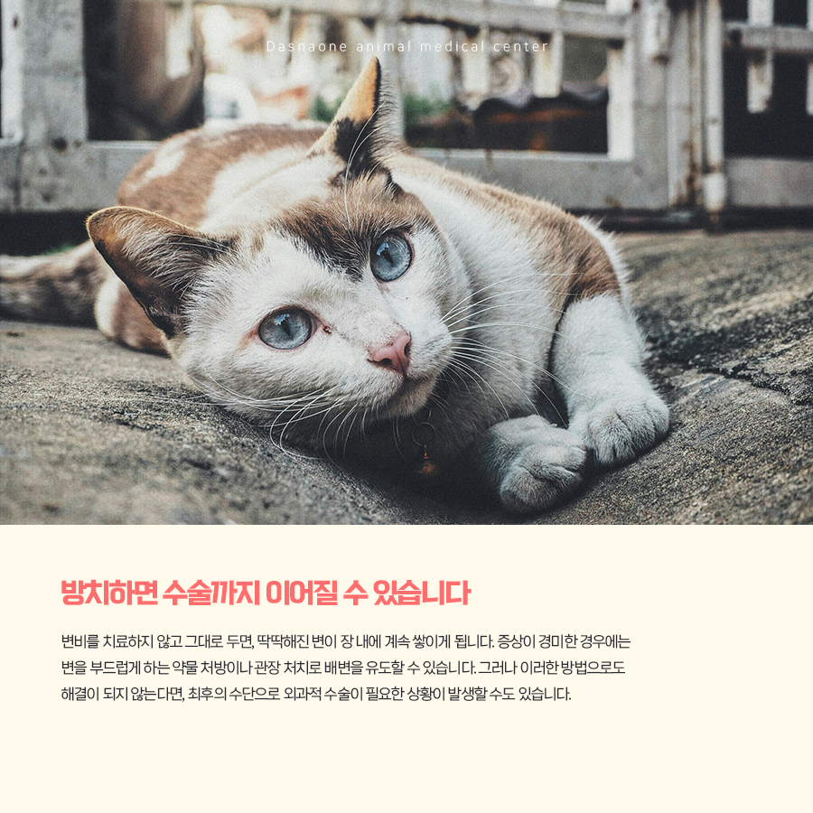
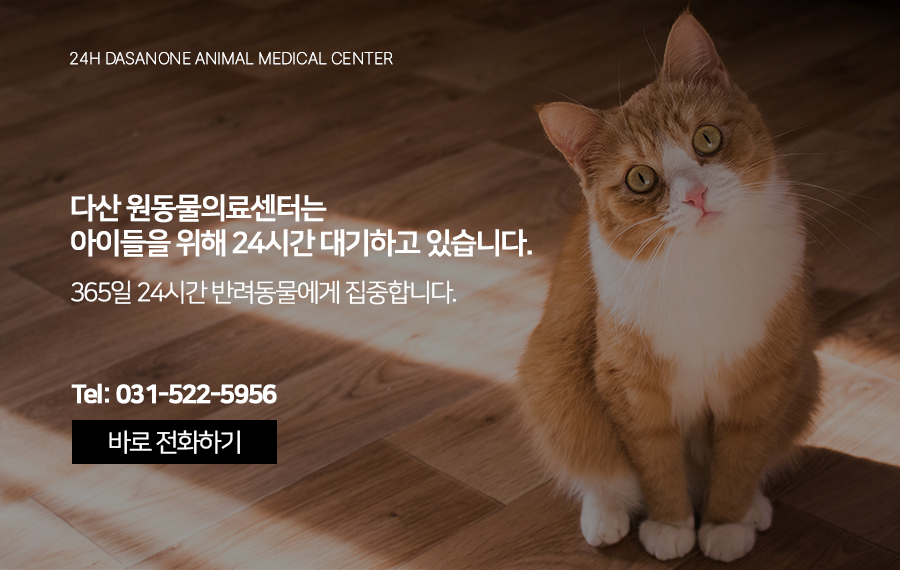

# 인창동 동물병원 고양이 변비, 방치하면 위험합니다.

- logNo: 224223539827
- date: 2026-03-21
- displayDate: 2026. 3. 21. 12:10
- url: https://blog.naver.com/PostView.naver?blogId=dasanoneamc&logNo=224223539827
- categoryNo: 14
- tags: 

---

반려묘를 키우는 보호자라면 고양이 화장실을 치울 때
대변 상태를 유심히 살펴보는 분들이 많을 것입니다.
대변은 반려묘의 건강 상태를 직접적으로
확인할 수 있는 중요한 지표이기 때문입니다.
실제로 대변의 색깔이나 형태가 평소와 다르다는
이유로 동물병원을 찾는 보호자분들도 적지 않습니다.
그런데 반대로, 화장실을 치우러 갔는데
대변이 아예 없는 경우에도 동물병원 방문을
고려해야 한다는 사실, 알고 계셨나요?
바로 고양이 변비를 의심해 볼 수 있기 때문입니다.

> 고양이 변비, 어떻게 알 수 있을까요?

건강한 고양이는 보통 하루에 한 번 이상
배변을 합니다. 만약 이틀 이상 대변을 보지 않는다면
변비를 의심해 볼 필요가 있습니다. 또한 화장실을
가더라도 작고 단단한 대변만 소량 배출되는 경우
역시 변비의 신호일 수 있습니다.

> 고양이가 변비에 걸리는 주요 원인

① 기저질환 확인이 먼저입니다
배변 시 통증을 유발하는 질환이 있거나,
배변 자세를 취할 때 불편함을 주는 질환이 있다면
고양이가 배변을 스스로 참게 되어 변비로
이어질 수 있습니다. 변비 증상이 나타났다면
우선 다른 질환이 원인은 아닌지 수의사의
진료를 통해 확인하는 것이 중요합니다.

② 가장 흔한 원인, 수분 부족
고양이 변비의 원인 중 가장 많은 비율을 차지하는 것이
바로 수분 섭취 부족입니다. 고양이는 수분 함량이
낮은 건사료를 주로 섭취하는 데다 물을 적게 마시는
습성이 있어, 체내 수분이 부족해지면 변이 딱딱하게
굳으면서 변비가 발생할 수 있습니다.
평소에 반려묘가 충분한 수분을 섭취할 수 있는
환경을 만들어 주는 것이 좋습니다.
물을 잘 마시지 않는 고양이 라면 건사료에 물을
살짝 섞어주거나, 수분 함량이 높은 습식사료로
전환하는 방법도 도움이 될 수 있습니다.

③ 화장실 환경에 대한 예민한 반응
고양이는 화장실 환경에 매우 민감한 동물입니다.
화장실이 청결하지 않거나 위치, 모양, 모래 재질 등이
고양이의 취향과 맞지 않으면 배변을 의도적으로
참는 경우가 생기고, 이것이 반복되면 변비로
발전할 수 있습니다. 화장실을 자주 청소해 주는 것은
물론, 반려묘가 현재 화장실 환경을 편안하게
느끼고 있는지도 점검해 보시기 바랍니다.

> 방치하면 수술까지 이어질 수 있습니다

변비를 치료하지 않고 그대로 두면, 딱딱해진 변이
장 내에 계속 쌓이게 됩니다. 증상이 경미한 경우에는
변을 부드럽게 하는 약물 처방이나 관장 처치로
배변을 유도할 수 있습니다. 그러나 이러한 방법으로도
해결이 되지 않는다면, 최후의 수단으로
외과적 수술이 필요한 상황이 발생할 수도 있습니다.

---

변비는 단순히 '며칠 변을 못 봤네' 하고 넘길 수 있는
문제가 아닙니다. 반려묘가 배변을 제대로 하지 못하고
있다면, 증상이 더 악화되기 전에 가까운 동물병원을
찾아 수의사와 상담하시길 권장합니다.

저희 다산 원동물의료센터는
보호자분들의 든든한 동반자가 되어,
반려동물의 평생 건강 관리를 책임지겠습니다.

📍 24시 다산 원동물의료센터 경기도 남양주시 다산중앙로 15 3층

#고양이변비 #고양이복통 #고양이음수량
#고양이관장 #고양이화장실 #남양주고양이동물병원
#다산동동물병원 #갈매동동물병원 #인창동동물병원
