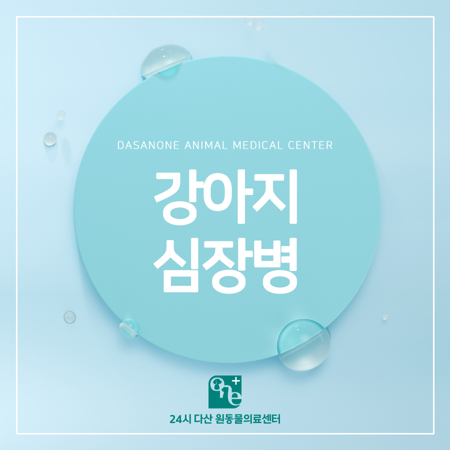
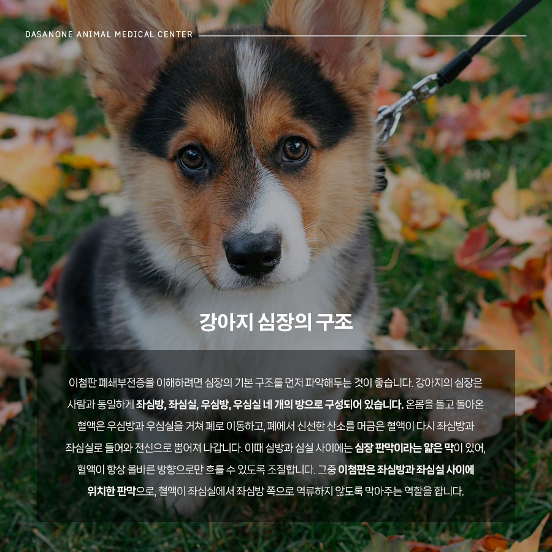
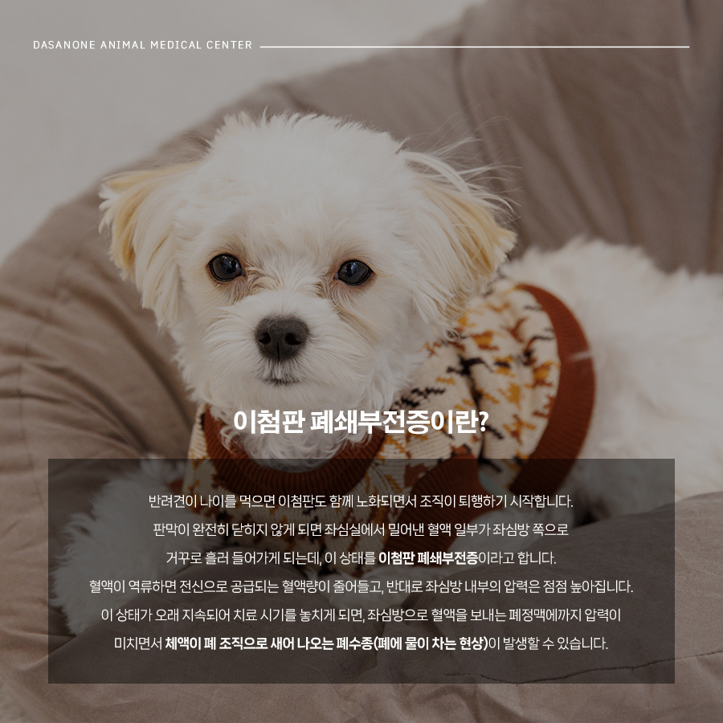
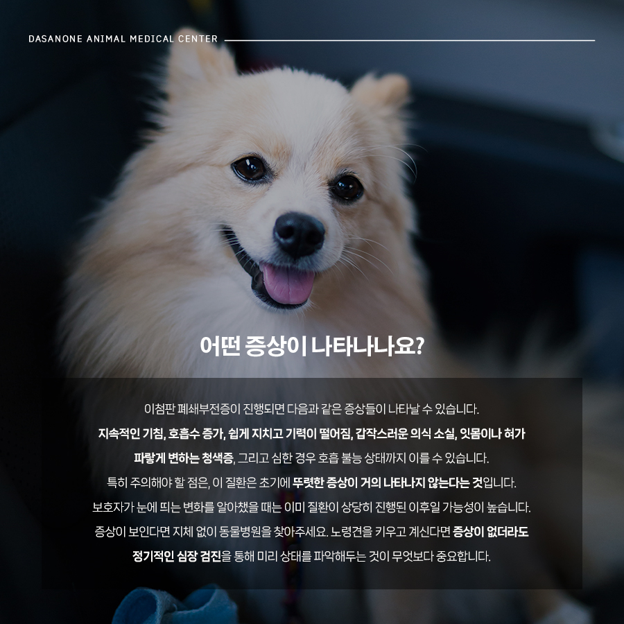
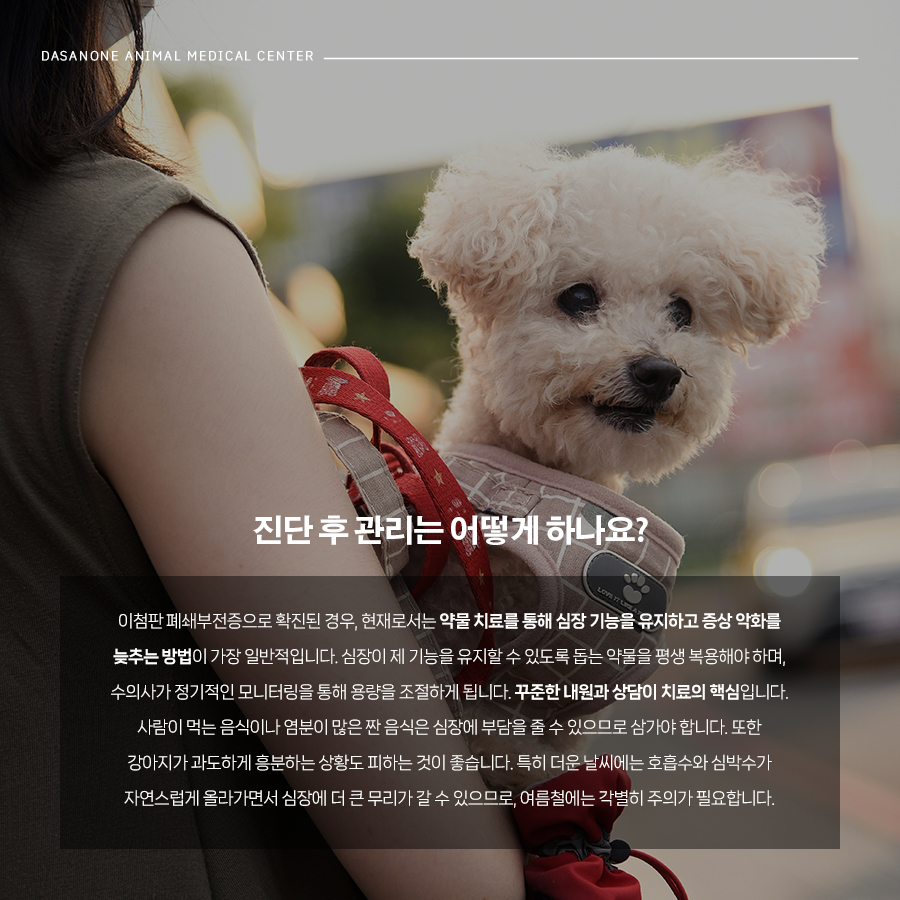
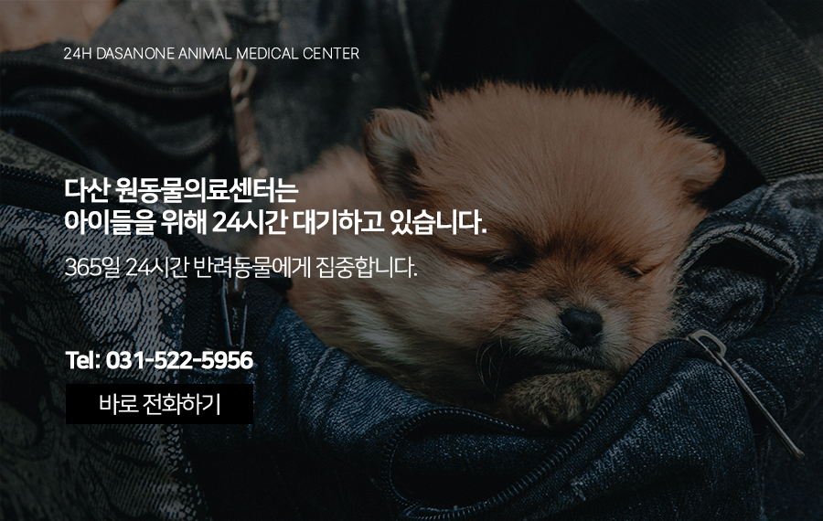

# 신내동 동물병원 강아지 심장병, 이첨판 폐쇄부전증

- logNo: 224231439866
- date: 2026-03-27
- displayDate: 2026. 3. 27. 14:20
- url: https://blog.naver.com/PostView.naver?blogId=dasanoneamc&logNo=224231439866
- categoryNo: 14
- tags: 

---

심장은 우리 몸에서 쉬지 않고 일하는 핵심 기관입니다.
혈액을 온몸으로 순환시켜 산소와 영양분을 각 조직에
전달하고, 동시에 이산화탄소와 노폐물을 회수하는
역할을 맡고 있죠. 심장 하나가 제 기능을 못 하게 되면
전신에 걸쳐 다양한 문제가 생길 수 있는 이유가
바로 여기에 있습니다.
그렇다면 강아지도 심장병에 걸릴 수 있을까요?
네, 그렇습니다. 강아지의 심장병은 크게 태어날 때부터
가지고 있는 선천적 심장병과 살아가면서 발생하는
후천적 심장병으로 나뉩니다. 오늘은 그중에서도
노령견, 특히 소형견에게 자주 나타나는
후천적 심장병인 이첨판 폐쇄부전증에 대해
자세히 살펴보겠습니다.

> 강아지 심장의 구조, 먼저 알고 가요

이첨판 폐쇄부전증을 이해하려면 심장의
기본 구조를 먼저 파악해두는 것이 좋습니다.
강아지의 심장은 사람과 동일하게 좌심방, 좌심실,
우심방, 우심실 네 개의 방으로 구성되어 있습니다.
온몸을 돌고 돌아온 혈액은 우심방과 우심실을 거쳐
폐로 이동하고, 폐에서 신선한 산소를 머금은 혈액이
다시 좌심방과 좌심실로 들어와 전신으로
뿜어져 나갑니다.
이때 심방과 심실 사이에는 심장 판막이라는
얇은 막이 있어, 혈액이 항상 올바른 방향으로만
흐를 수 있도록 조절합니다. 그중 이첨판은
좌심방과 좌심실 사이에 위치한 판막으로,
혈액이 좌심실에서 좌심방 쪽으로 역류하지 않도록
막아주는 역할을 합니다.

> 이첨판 폐쇄부전증이란?

반려견이 나이를 먹으면 이첨판도 함께 노화되면서
조직이 퇴행하기 시작합니다. 판막이 완전히
닫히지 않게 되면 좌심실에서 밀어낸 혈액 일부가
좌심방 쪽으로 거꾸로 흘러 들어가게 되는데,
이 상태를 이첨판 폐쇄부전증이라고 합니다.
혈액이 역류하면 전신으로 공급되는 혈액량이
줄어들고, 반대로 좌심방 내부의 압력은 점점
높아집니다. 이 상태가 오래 지속되어 치료 시기를
놓치게 되면, 좌심방으로 혈액을 보내는 폐정맥에까지
압력이 미치면서 체액이 폐 조직으로 새어 나오는
폐수종(폐에 물이 차는 현상)이 발생할 수 있습니다.

> 어떤 증상이 나타나나요?

이첨판 폐쇄부전증이 진행되면
다음과 같은 증상들이 나타날 수 있습니다.
✓ 지속적인 기침
✓ 호흡수 증가
✓ 쉽게 지치고 기력이 떨어짐
✓ 갑작스러운 의식 소실
✓ 잇몸이나 혀가 파랗게 변하는 청색증
✓ 심한 경우 호흡 불능 상태까지 이를 수 있습니다.
특히 주의해야 할 점은, 이 질환은
초기에 뚜렷한 증상이 거의 나타나지 않는다는
것입니다. 보호자가 눈에 띄는 변화를 알아챘을 때는
이미 질환이 상당히 진행된 이후일 가능성이 높습니다.
증상이 보인다면 지체 없이 동물병원을 찾아주세요.
노령견을 키우고 계신다면 증상이 없더라도
정기적인 심장 검진을 통해 미리 상태를
파악해두는 것이 무엇보다 중요합니다.

> 진단 후 관리는 어떻게 하나요?

이첨판 폐쇄부전증으로 확진된 경우, 현재로서는
약물 치료를 통해 심장 기능을 유지하고
증상 악화를 늦추는 방법이 가장 일반적입니다.
심장이 제 기능을 유지할 수 있도록 돕는 약물을
평생 복용해야 하며, 수의사가 정기적인
모니터링을 통해 용량을 조절하게 됩니다.
꾸준한 내원과 상담이 치료의 핵심입니다.
일상생활에서 보호자가 신경 써야 할 부분도 있습니다.
사람이 먹는 음식이나 염분이 많은 짠 음식은
심장에 부담을 줄 수 있으므로 삼가야 합니다.
또한 강아지가 과도하게 흥분하는 상황도
피하는 것이 좋습니다. 특히 더운 날씨에는 호흡수와
심박수가 자연스럽게 올라가면서 심장에 더 큰 무리가
갈 수 있으므로, 여름철에는 각별히 주의가 필요합니다.
평소 반려견의 호흡 상태와 컨디션을 꼼꼼히 살피고,
이상 징후가 보인다면 지체 없이 가까운 동물병원을
찾아 전문가의 진료를 받으시길 권장합니다.

저희 다산 원동물의료센터는
보호자분들의 든든한 동반자가 되어,
반려동물의 평생 건강 관리를 책임지겠습니다.

📍 24시 다산 원동물의료센터 경기도 남양주시 다산중앙로 15 3층

#강아지심장병 #이첨판폐쇄부전증
#강아지기침 #강아지호흡수
#남양주동물병원 #다산동동물병원
#도농역동물병원 #신내동동물병원
