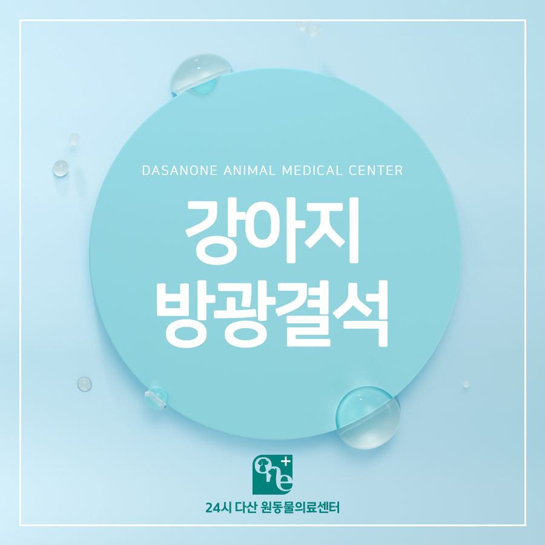
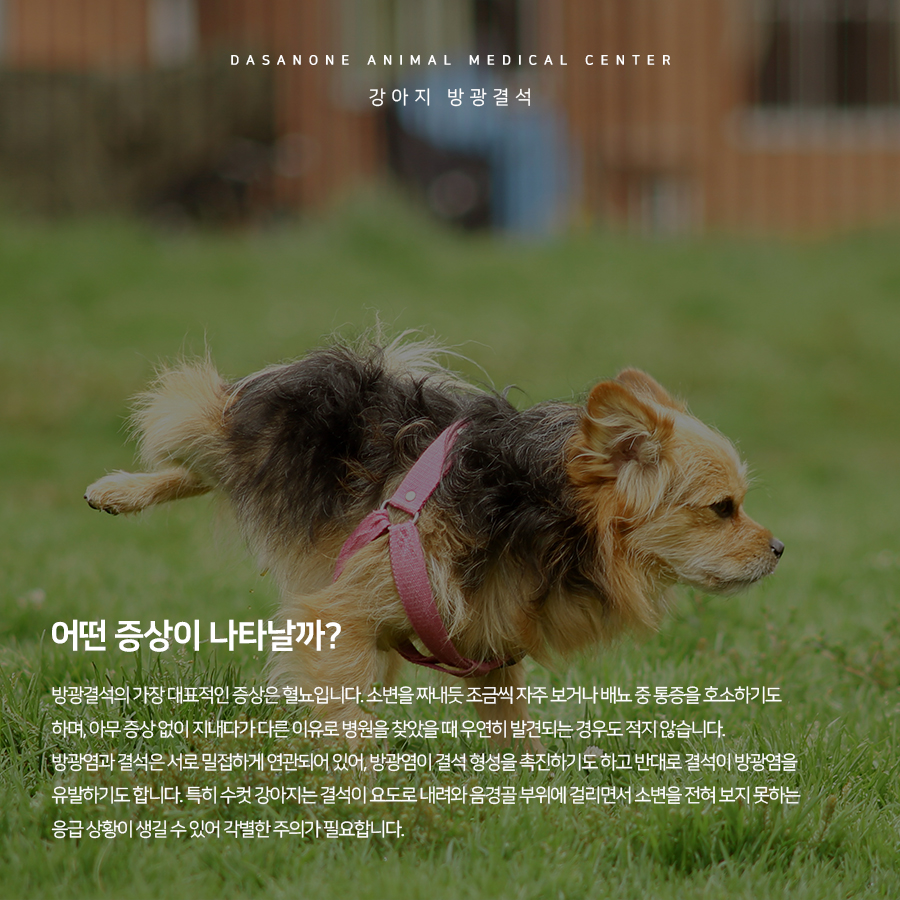
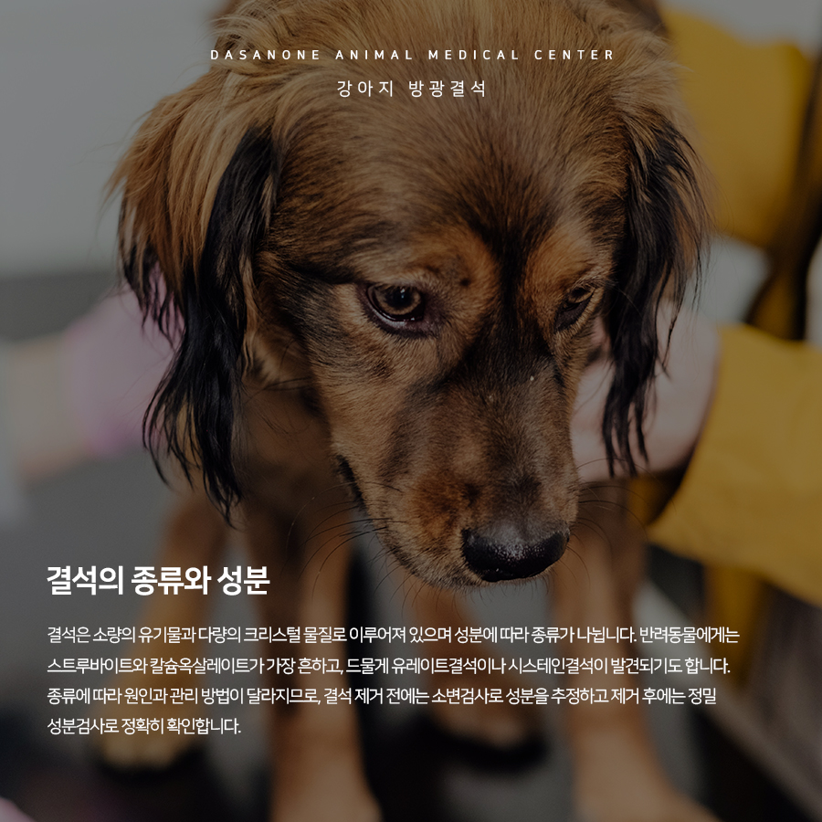
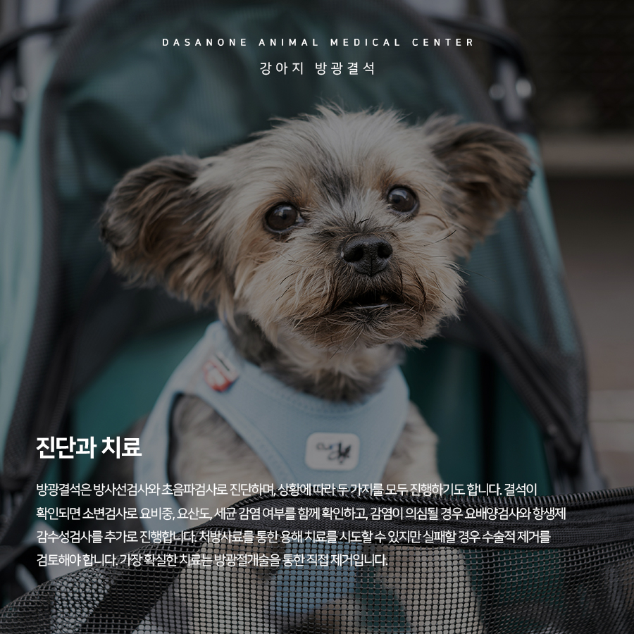
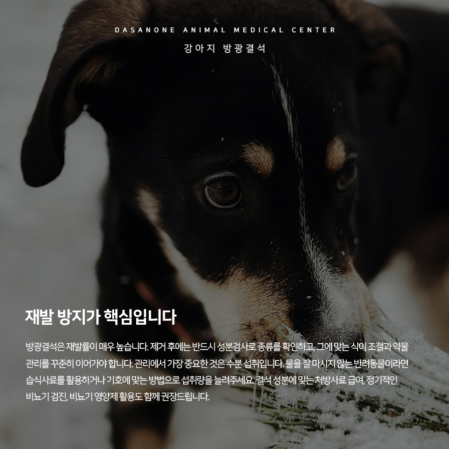

# 동구릉역 동물병원 강아지 방광결석, 증상과 치료

- logNo: 224231648402
- date: 2026-03-28
- displayDate: 2026. 3. 28. 11:20
- url: https://blog.naver.com/PostView.naver?blogId=dasanoneamc&logNo=224231648402
- categoryNo: 14
- tags: 

---

비뇨기계에 생기는 돌을 요석(uroliths)이라고 합니다.
발생 위치에 따라 신장결석, 요관결석, 방광결석,
요도결석으로 구분되는데, 그중 반려동물에게
가장 흔하게 나타나는 것이 바로 방광결석입니다.
오늘은 강아지 방광결석에 대해 알아보겠습니다.

> 어떤 증상이 나타날까요?

방광결석의 가장 대표적인 증상은 혈뇨입니다.
소변을 짜내듯 조금씩 자주 보거나 배뇨 중 통증을
호소하기도 하며, 아무 증상 없이 지내다가
다른 이유로 병원을 찾았을 때 우연히 발견되는
경우도 적지 않습니다.
방광염과 결석은 서로 밀접하게 연관되어 있어,
방광염이 결석 형성을 촉진하기도 하고 반대로
결석이 방광염을 유발하기도 합니다.
특히 수컷 강아지는 결석이 요도로 내려와
음경골 부위에 걸리면서 소변을 전혀 보지 못하는
응급 상황이 생길 수 있어 각별한 주의가 필요합니다.

> 결석의 종류와 성분

결석은 소량의 유기물과 다량의 크리스털 물질로
이루어져 있으며 성분에 따라 종류가 나뉩니다.
반려동물에게는 스트루바이트와 칼슘옥살레이트가
가장 흔하고, 드물게 유레이트결석이나 시스테인결석이
발견되기도 합니다. 종류에 따라 원인과 관리 방법이
달라지므로, 결석 제거 전에는 소변검사로 성분을
추정하고 제거 후에는 정밀 성분 검사로
정확히 확인합니다.

> 진단과 치료

방광결석은 방사선검사와 초음파검사로 진단하며,
상황에 따라 두 가지를 모두 진행하기도 합니다.
결석이 확인되면 소변검사로 요비중, 요산도,
세균 감염 여부를 함께 확인하고, 감염이 의심될 경우
요배양검사와 항생제 감수성검사를 추가로 진행합니다.
스트루바이트결석은 처방 사료를 통한 용해 치료를
시도해 볼 수 있지만, 내과적 치료가 항상
성공하는 것은 아닙니다. 수컷 강아지나 고양이는
작아진 결석이 요도를 막을 위험이 있고, 치료 시작 후
4주가 지나도 변화가 없다면 수술적 제거를
검토해야 합니다.
가장 확실한 치료는 방광 절개술을 통한
직접 제거입니다. 요도결석이 동반된 경우
방광 쪽으로 밀어 올려 함께 제거하며,
이동이 어려운 경우에는 요도 절개술을
시행하기도 합니다. 수술 후에는 일시적으로
혈뇨나 빈뇨가 나타날 수 있으며, 중증 방광염을
동반했다면 증상이 다소 오래 지속될 수 있어
방광염 치료를 병행합니다.

> 재발 방지가 핵심입니다

방광결석은 재발률이 매우 높습니다.
제거 후에는 반드시 성분 검사로 종류를 확인하고,
그에 맞는 식이 조절과 약물 관리를
꾸준히 이어가야 합니다.
관리에서 가장 중요한 것은 수분 섭취입니다.
물을 잘 마시지 않는 반려동물이라면 습식사료를
활용하거나 기호에 맞는 방법으로 섭취량을
늘려주세요. 결석 성분에 맞는 처방 사료 급여,
정기적인 비뇨기 검진, 비뇨기 영양제 활용도
함께 권장 드립니다.
배뇨 습관이나 소변 상태가 평소와 다르게 느껴진다면
가볍게 넘기지 마시고, 동물병원을 찾아
비뇨기 건강을 꼭 확인해 보시길 바랍니다.

저희 다산 원동물의료센터는
보호자분들의 든든한 동반자가 되어,
반려동물의 평생 건강 관리를 책임지겠습니다.

📍 24시 다산 원동물의료센터 경기도 남양주시 다산중앙로 15 3층

#강아지방광결석 #강아지결석수술
#강아지방광염 #남양주동물병원 #도농역동물병원
#동구릉역동물병원 #다산역동물병원
