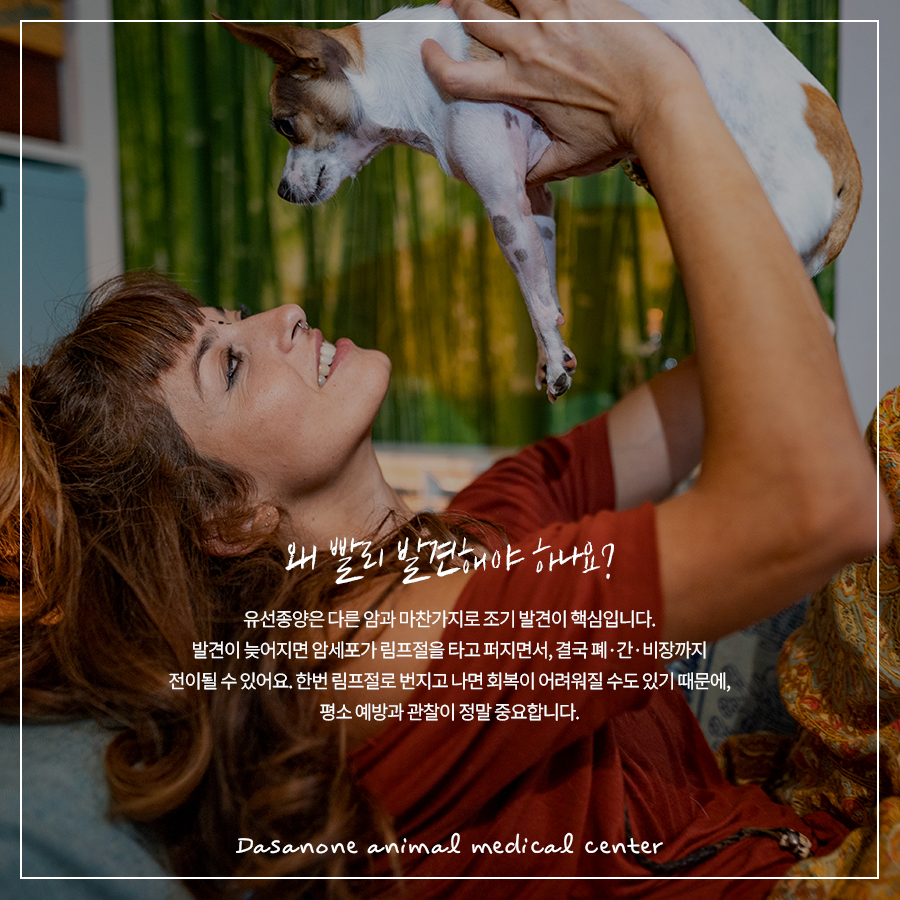
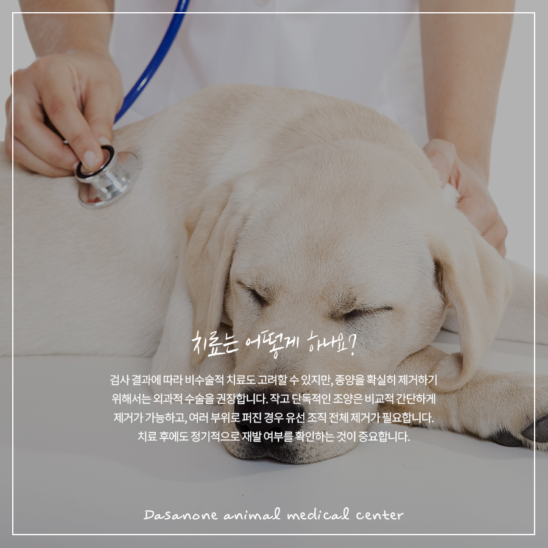
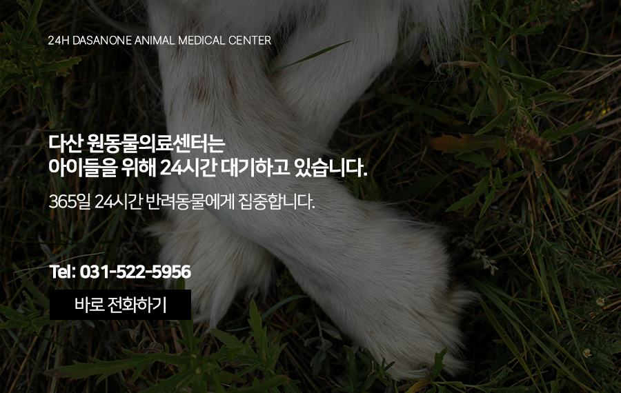

# 구리 동물병원 우리 강아지 배 쪽에 혹이 생겼다면? 반려동물 유선종양 꼭 확인하세요

- logNo: 224238519615
- date: 2026-04-02
- displayDate: 2026. 4. 2. 17:39
- url: https://blog.naver.com/PostView.naver?blogId=dasanoneamc&logNo=224238519615
- categoryNo: 14
- tags: 

---

강아지의 배를 쓰다듬다 뭔가 만져진
경험이 있으신가요? 별거 아니겠지 하고 넘기기 쉽지만
그 작은 혹 하나가 유선종양의 신호일 수 있다는 사실,
알고 계셨나요? 오늘은 반려동물에게 생각보다
흔하게 발생하는 유선종양에 대해
자세히 이야기해보려 합니다.

> 유선종양이란?

사람에게 유방암이 있다면, 반려동물에게는
유선종양이 있습니다. 유선(유방) 조직에 생기는
종양으로, 사실 생각보다 훨씬 흔한 질환입니다.
놀라운 점은, 사람의 유방암 발병률과 비교했을 때
반려동물의 유선종양 발병률이 무려
3배나 높다는 사실입니다.

> 우리아이도 해당될까요?

유선종양은 주로 10세 이상의 노령견과 노령묘에게
자주 발생합니다. 특히 푸들, 코카스패니얼,
저먼 셰퍼드 테리어 종을 반려하고 계시다면
더욱 주의가 필요합니다. 노령이 아니라고 해서
안심하기엔 이릅니다. 중성화를 하지 않은 4세 이상
암컷 강아지의 25%에서 유선종양이 발생했다는
보고가 있을 정도입니다.

> 왜 빨리 발견해야 하나요?

유선종양은 다른 암과 마찬가지로
조기 발견이 핵심입니다. 발견이 늦어지면
암세포가 림프절을 타고 퍼지면서,
결국 폐·간·비장까지 전이될 수 있어요.
한번 림프절로 번지고 나면 회복이
어려워질 수도 있기 때문에, 평소 예방과 관찰이
정말 중요합니다.

> 유선종양 예방법

① 중성화 수술
유선종양 예방에 가장 효과적인 방법은
중성화 수술입니다. 수술 한 번으로 유선종양 발병률을
크게 낮출 수 있어요. 유선종양 외에도 다양한
생식기 관련 질환 예방에도 도움이 되니,
아직 고려 중이시라면 수의사 선생님과
꼭 상담해 보세요.
② 정기적인 촉진 확인
평소 쓰다듬거나 목욕 시킬 때 가슴 쪽을
가볍게 만져보는 습관을 들이세요. 유선 부위에
혹이나 이물감이 만져지거나 피부 위로 종양이
솟아오른 것이 보일 때, 유선 부위에 출혈이나
괴사 흔적 등이 발견된다면 지체 없이
동물병원을 방문하셔야 합니다.

> 치료는 어떻게 하나요?

검사 결과에 따라 비수술적 치료도 고려할 수 있지만,
종양을 확실히 제거하기 위해서는 외과적 수술을
권장합니다. 작고 단독적인 조양은 비교적 간단하게
제거가 가능하고, 여러 부위로 퍼진 경우 유선 조직
전체 제거가 필요합니다. 치료 후에도 정기적으로
재발 여부를 확인하는 것이 중요합니다.

저희 다산 원동물의료센터는
보호자분들의 든든한 동반자가 되어,
반려동물의 평생 건강 관리를 책임지겠습니다.

📍 24시 다산 원동물의료센터 경기도 남양주시 다산중앙로 15 3층

#유선종양 #중성화수술 #유선종양수술
#남양주중성화동물병원
#남양주동물병원 #다산동동물병원
#도농역동물병원 #구리동물병원
