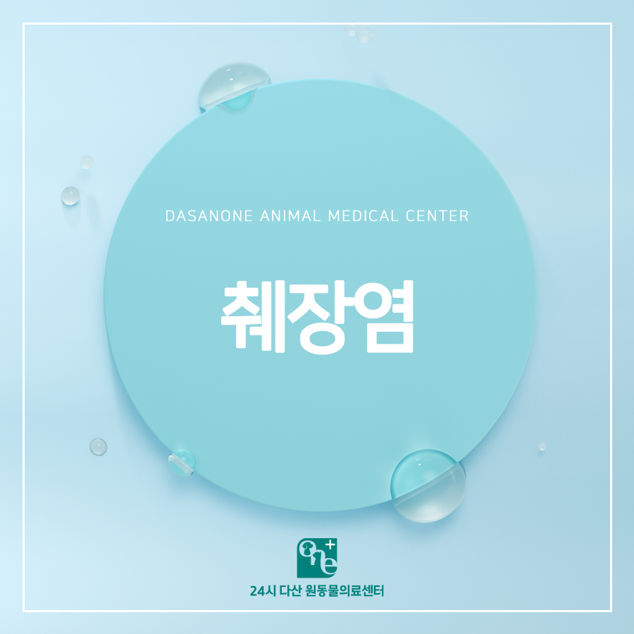
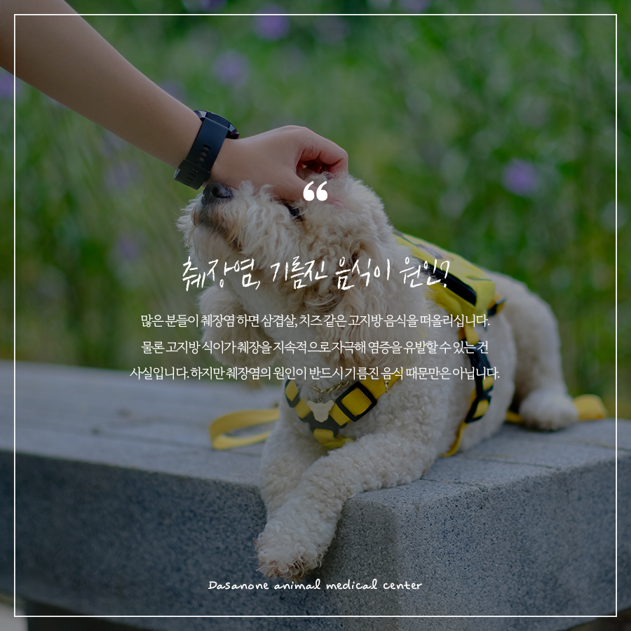
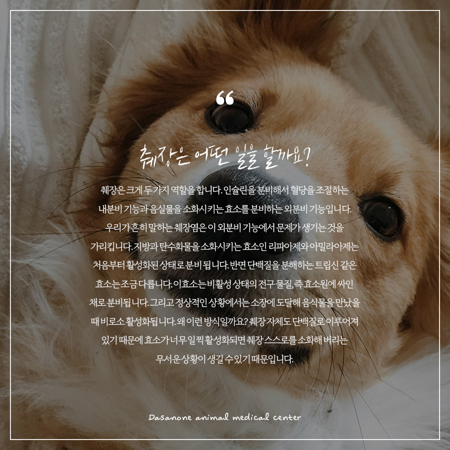
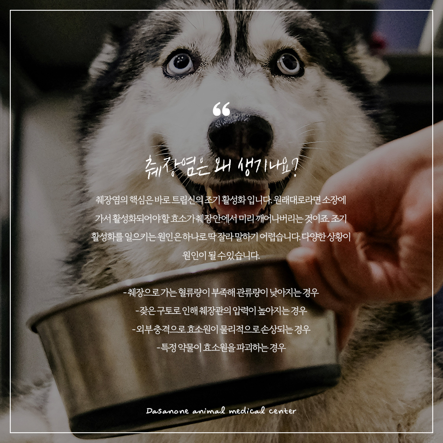
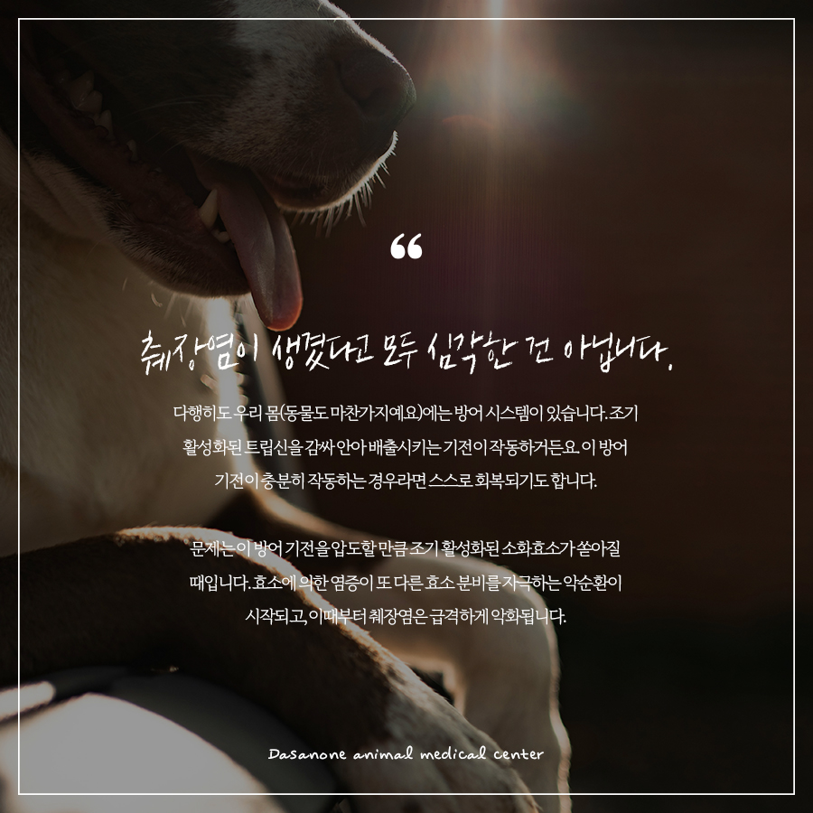
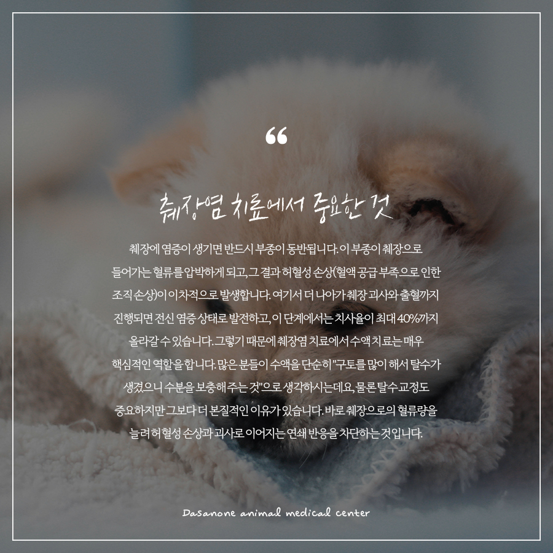
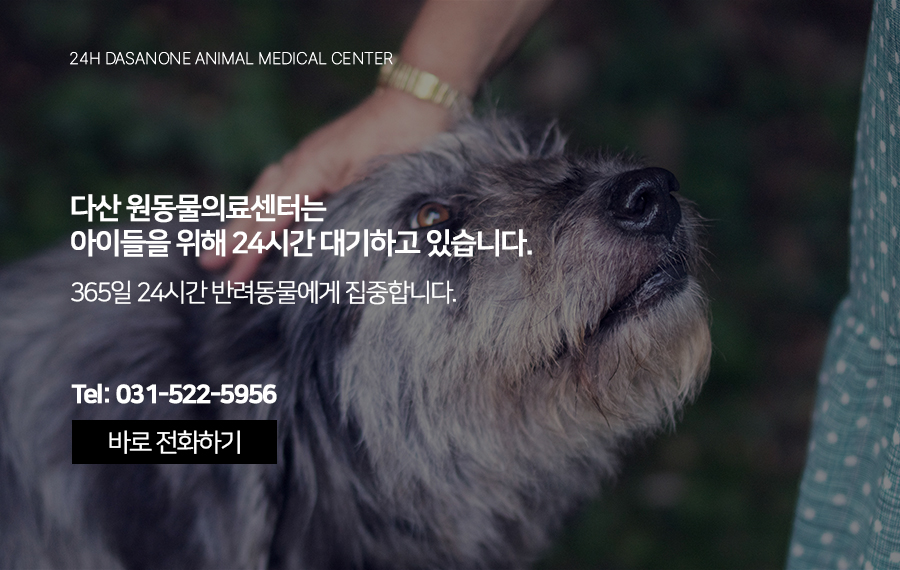

# 남양주 동물병원 반려동물 췌장염, 제대로 알고 계시나요?

- logNo: 224239788591
- date: 2026-04-03
- displayDate: 2026. 4. 3. 17:59
- url: https://blog.naver.com/PostView.naver?blogId=dasanoneamc&logNo=224239788591
- categoryNo: 14
- tags: 

---

반려견을 키우는 보호자분들이라면
췌장염이라는 단어를 한 번쯤은 들어보셨을 것입니다.
반려인들 사이에서 이미 널리 알려진 질환 췌장염,
오늘은 단순히 이름을 아는 것에서 한 걸음 더 나아가
췌장염의 원리와 치료에 대해서 조금 더 깊이
이야기해 보려 합니다.

> 췌장염, 기름진 음식이 원인?

많은 분들이 췌장염 하면 삼겹살, 치즈 같은
고지방 음식을 떠올리십니다. 물론 고지방 식이가
췌장을 지속적으로 자극해 염증을 유발할 수 있는 건
사실입니다. 하지만 췌장염의 원인이 반드시
기름진 음식 때문만은 아닙니다.

> 췌장은 어떤 일을 할까요?

췌장은 크게 두 가지 역할을 합니다.
인슐린을 분비해서 혈당을 조절하는 내분비 기능과
음식물을 소화시키는 효소를 분비하는
외분비 기능입니다. 우리가 흔히 말하는 췌장염은
이 외분비 기능에서 문제가 생기는 것을 가리킵니다.
지방과 탄수화물을 소화시키는 효소인 리파아제와
아밀라아제는 처음부터 활성화된 상태로 분비됩니다.
반면 단백질을 분해하는 트립신 같은 효소는
조금 다릅니다. 이효소는 비활성 상태의 전구물질,
즉 효소원에 싸인 채로 분비됩니다.
그리고 정상적인 상황에서는 소장에 도달해
음식물을 만났을 때 비로소 활성화됩니다.
왜 이런 방식일까요? 췌장 자체도 단백질로
이루어져 있기 때문에 효소가 너무 일찍 활성화되면
췌장 스스로를 소화해 버리는 무서운 상황이
생길 수 있기 때문입니다.

> 췌장염은 왜 생기나요?

췌장염의 핵심은 바로 트립신의 조기 활성화입니다.
원래대로라면 소장에 가서 활성화되어야 할 효소가
췌장 안에서 미리 깨어나버리는 것이죠.
조기 활성화를 일으키는 원인은
하나로 딱 잘라 말하기 어렵습니다.
다양한 상황이 원인이 될 수 있습니다.
✓ 췌장으로 가는 혈류량이 부족해
관류량이 낮아지는 경우
✓ 잦은 구토로 인해 췌장관의 압력이 높아지는 경우
✓ 외부 충격으로 효소원이 물리적으로 손상되는 경우
✓ 특정 약물이 효소원을 파괴하는 경우
이처럼 어떤 이유로든 효소가 십이지장에
도달하기 전에 활성화되어 버리면, 그것이
췌장염의 시작이 됩니다.

> 췌장염이 생겼다고 모두 심각한 건 아닙니다.

다행히도 우리 몸(동물도 마찬가지예요)에는
방어 시스템이 있습니다. 조기 활성화된 트립신을
감싸안아 배출시키는 기전이 작동하거든요.
이 방어 기전이 충분히 작동하는 경우라면
스스로 회복되기도 합니다.
문제는 이 방어 기전을 압도할 만큼 조기 활성화된
소화효소가 쏟아질 때입니다. 효소에 의한 염증이
또 다른 효소 분비를 자극하는 악순환이 시작되고,
이때부터 췌장염은 급격하게 악화됩니다.

> 췌장염 치료에서 중요한 것

췌장에 염증이 생기면 반드시 부종이 동반됩니다.
이 부종이 췌장으로 들어가는 혈류를 압박하게 되고,
그 결과 허혈성 손상(혈액 공급 부족으로 인한
조직 손상)이 이차적으로 발생합니다.
여기서 더 나아가 췌장 괴사와 출혈까지 진행되면
전신 염증 상태로 발전하고, 이 단계에서는 치사율이
최대 40%까지 올라갈 수 있습니다.
그렇기 때문에 췌장염 치료에서 수액 치료는
매우 핵심적인 역할을 합니다. 많은 분들이 수액을
단순히 "구토를 많이 해서 탈수가 생겼으니 수분을
보충해 주는 것"으로 생각하시는데요,
물론 탈수 교정도 중요하지만 그보다 더 본질적인
이유가 있습니다. 바로 췌장으로의 혈류량을 늘려
허혈성 손상과 괴사로 이어지는 연쇄 반응을
차단하는 것입니다.
⚠️ 일단 췌장 괴사가 시작되면 치료가
매우 어려워집니다. 초기에 적절한 수액 처치를 통해
괴사성 췌장염으로 진행되지 않도록 막는 것,
이것이 췌장염 치료의 핵심입니다.

---

반려동물이 구토를 반복하거나 기운이 없어 보인다면,
췌장염을 포함한 다양한 가능성을 염두에 두고
빠르게 내원해 주세요. 초기 대응이
예후를 크게 좌우합니다.

저희 다산 원동물의료센터는
보호자분들의 든든한 동반자가 되어,
반려동물의 평생 건강 관리를 책임지겠습니다.

📍 24시 다산 원동물의료센터 경기도 남양주시 다산중앙로 15 3층

#강아지췌장염 #고양이췌장염
#강아지구토 #강아지식욕부진
#남양주동물병원 #다산동동물병원
#도농역동물병원 #구리동물병원
