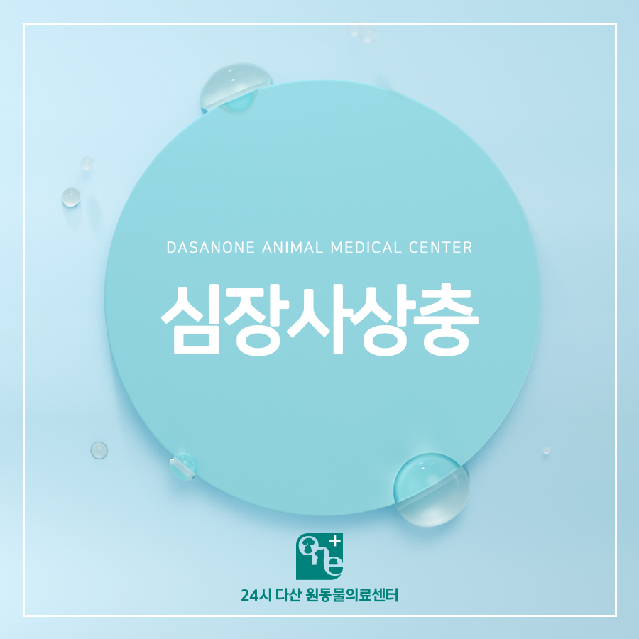
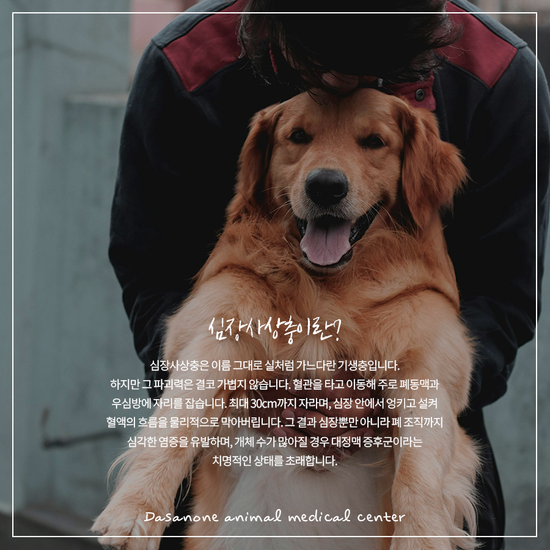
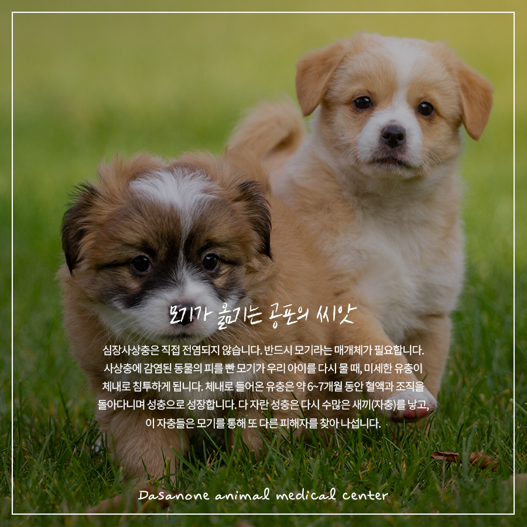
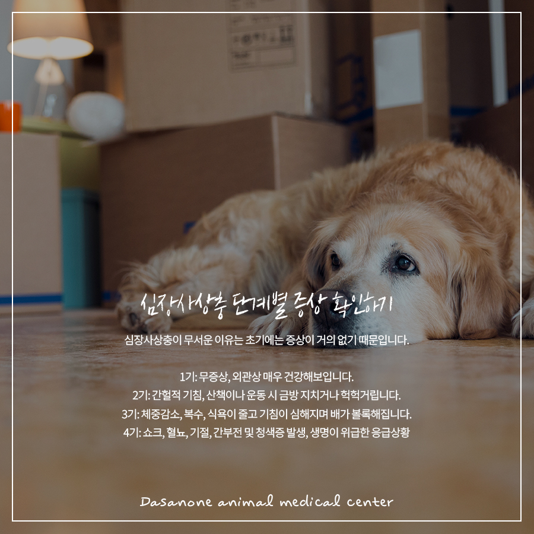
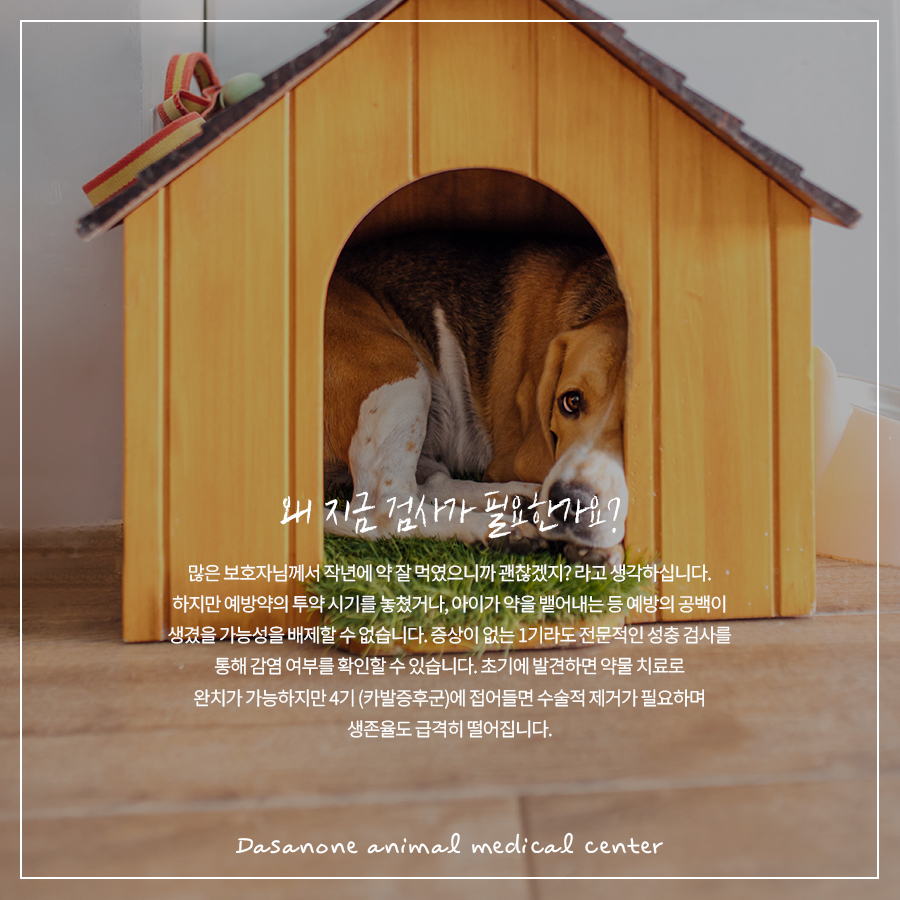
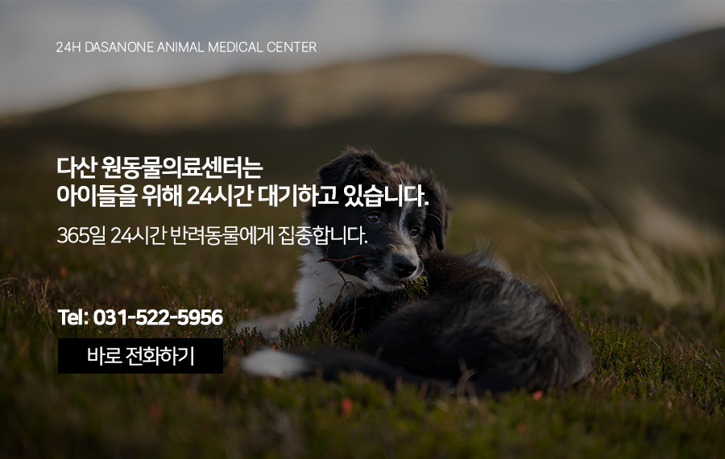

# 고덕동 동물병원 우리 아이 심장은 안전한가요? 심장사상충

- logNo: 224246258052
- date: 2026-04-09
- displayDate: 2026. 4. 9. 11:32
- url: https://blog.naver.com/PostView.naver?blogId=dasanoneamc&logNo=224246258052
- categoryNo: 14
- tags: 

---

봄기운이 완연한 4월입니다.
미세먼지 없는 맑은 하늘 아래 반려견과 산책하기
참 좋은 계절이죠. 하지만 이 아름다운 계절 뒤에
우리 아이들의 생명을 위협하는 그림자가
숨어 있습니다. 반려동물의 건강을 위협하는
1순위 질환, 심장사상충에 대해 알아보겠습니다.

> 심장사상충이란?

심장사상충은 이름 그대로 실처럼 가느다란
기생충입니다. 하지만 그 파괴력은 결코
가볍지 않습니다. 혈관을 타고 이동해 주로 폐동맥과
우심방에 자리를 잡습니다. 최대 30cm까지 자라며,
심장 안에서 엉키고 설켜 혈액의 흐름을 물리적으로
막아버립니다. 그 결과 심장뿐만 아니라 폐 조직까지
심각한 염증을 유발하며, 개체 수가 많아질 경우
대정맥 증후군이라는 치명적인 상태를 초래합니다.

> 모기가 옮기는 공포의 씨앗

심장사상충은 직접 전염되지 않습니다.
반드시 모기라는 매개체가 필요합니다.
사상충에 감염된 동물의 피를 빤 모기가 우리 아이를
다시 물 때, 미세한 유충이 체내로 침투하게 됩니다.
체내로 들어온 유충은 약 6~7개월 동안 혈액과
조직을 돌아다니며 성충으로 성장합니다.
다 자란 성충은 다시 수많은 새끼(자충)를 낳고,
이 자충들은 모기를 통해 또 다른 피해자를 찾아
나섭니다. 산책을 즐기는 강아지에게 모기를 100%
차단하는 것은 불가능에 가깝습니다.
이것이 우리가 매달 예방약을 통해 침투한 유충을
즉각 제거해야 하는 이유입니다.

> 심장사상충 단계별 증상 확인하기

심장사상충이 무서운 이유는 초기에는
증상이 거의 없기 때문입니다.
1기: 무증상, 외관상 매우 건강해보입니다.
2기: 간헐적 기침, 산책이나 운동 시
금방 지치거나 헉헉거립니다.
3기: 체중감소, 복수, 식욕이 줄고
기침이 심해지며 배가 볼록해집니다.
4기: 쇼크, 혈뇨, 기절, 간부전 및 청색증 발생,
생명이 위급한 응급상황

> 왜 지금 검사가 필요한가요?

많은 보호자님께서 작년에 약 잘 먹였으니까 괜찮겠지?
라고 생각하십니다. 하지만 예방약의 투약 시기를
놓쳤거나, 아이가 약을 뱉어내는 등 예방의 공백이
생겼을 가능성을 배제할 수 없습니다.
증상이 없는 1기라도 전문적인 성충 검사를 통해
감염 여부를 확인할 수 있습니다. 초기에 발견하면
약물 치료로 완치가 가능하지만 4기(카발증후군)에
접어들면 수술적 제거가 필요하며 생존율도
급격히 떨어집니다.

---

사랑하는 반려동물과 오래도록 맑은 하늘 아래
산책하기 위해, 매년 1회 정기 검사와
철저한 매달 예방은 선택이 아닌 필수입니다.
우리 아이의 심장 속 건강, 지금 확인해보세요!

저희 다산 원동물의료센터는
보호자분들의 든든한 동반자가 되어,
반려동물의 평생 건강 관리를 책임지겠습니다.

📍 24시 다산 원동물의료센터 경기도 남양주시 다산중앙로 15 3층

#강아지심장사상충 #심장사상충예방
#카발증후군 #심장사상충증상
#남양주동물병원 #다산동동물병원
#도농역동물병원 #신내동동물병원
