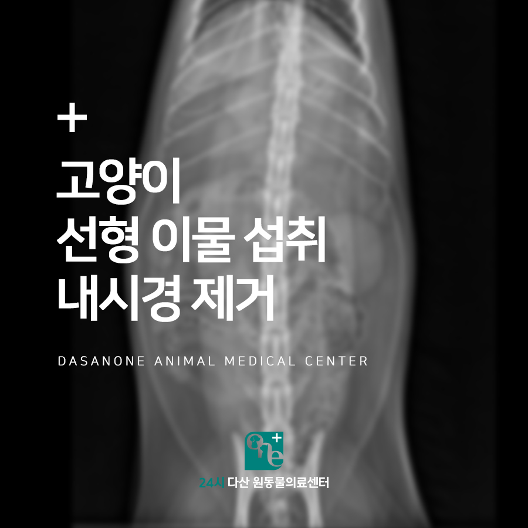
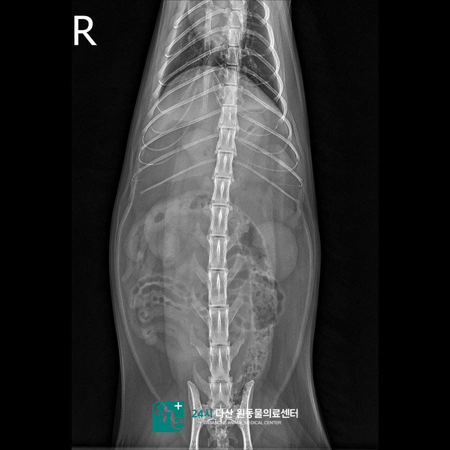
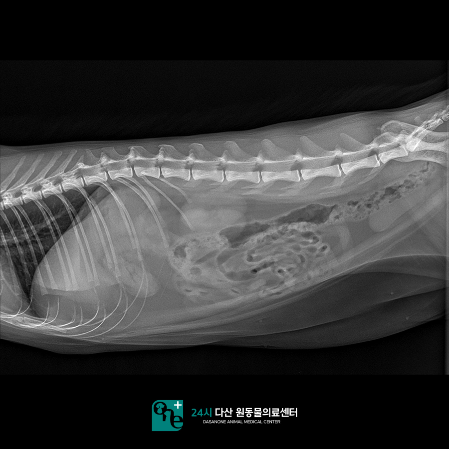
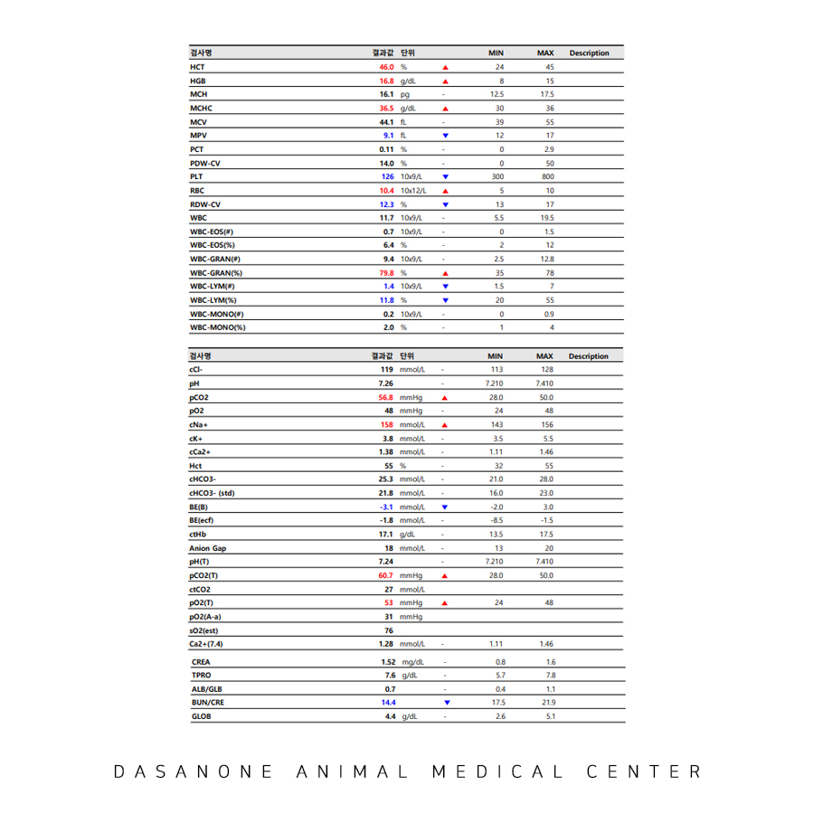
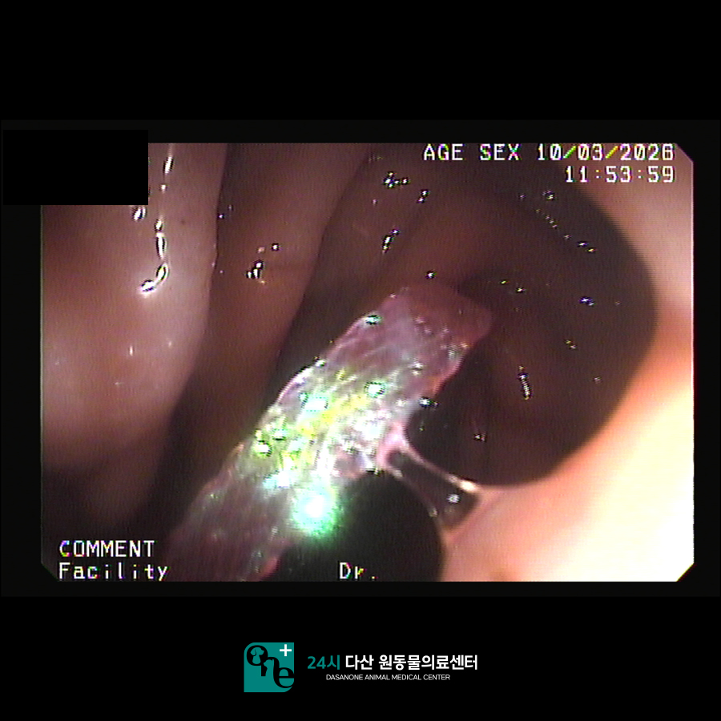
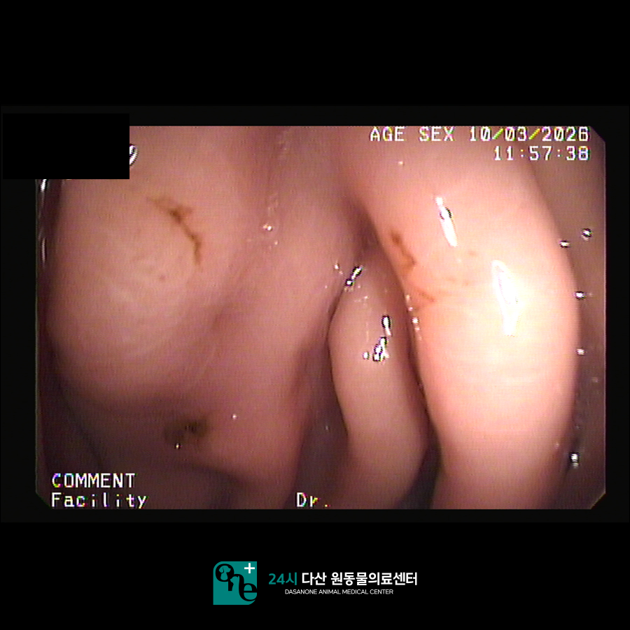
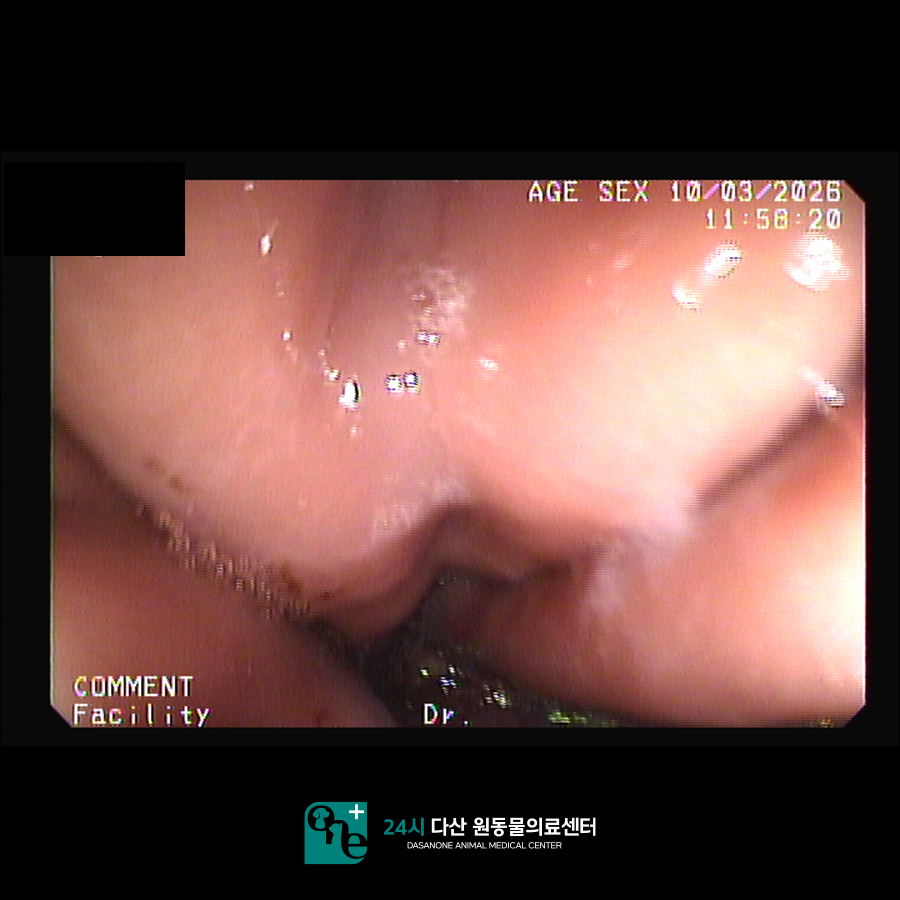
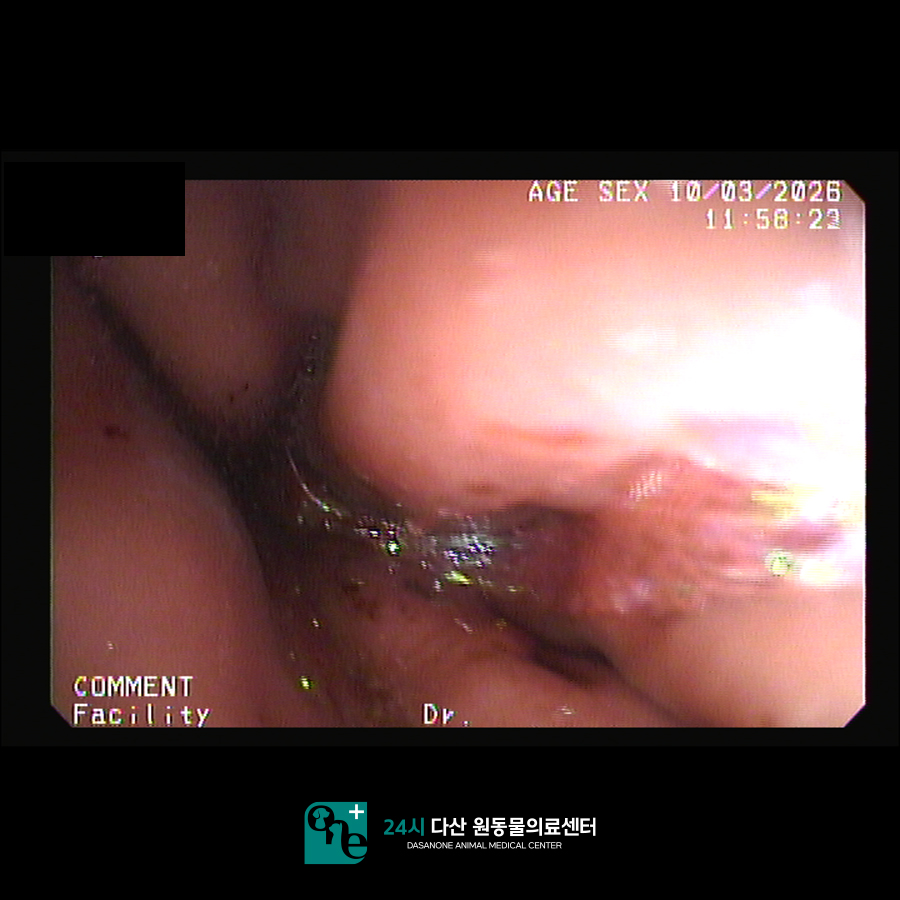

# 동구릉역 동물병원, 고양이 장난감끈 섭취, 선형이물 내시경 제거

- logNo: 224259625882
- date: 2026-04-21
- displayDate: 2026. 4. 21. 9:35
- url: https://blog.naver.com/PostView.naver?blogId=dasanoneamc&logNo=224259625882
- categoryNo: 13
- tags: 

---

3살 고양이 미노가 장난감 끈 섭취로
24시 다산원동물의료센터에 내원하였습니다.
미노는 내원 당일 고양이 장난감 끝에 걸린
끈을 섭취하였는데요
그 길이가 약 15~20cm 가량으로 추정되어
매우 긴 이물을 섭취한 것으로 보였습니다.
다만 섭취 시간은 알 수 없었고 내원 한 시간 전 아이가
구토하여 보호자님이 아이를 데리고 내원하셨습니다.

> 방사선 촬영과 혈액검사

미노는 일단 구토 처치를 진행하기로 하였습니다.
고양이 구토 유발의 경우 여러 가지 약물을
사용해 볼 수 있는데요
첫번째로는 강아지에서와 동일한 약물을
주사해 볼 수 있습니다. 다만 이 약물의 경우
고양이에서는 구토 확률이 낮은 편입니다.
그래서 본원에서는 한 번 정도 이 약물을 사용해 보고
아이가 구토를 하지 않는다면 다른 약물을
사용하는데요 추가로 사용할 수 있는 약물은
진정제 종류입니다.
진정제를 주사했을 때 부작용으로 고양이들이
구토를 잘 하는 걸 이용하여 구토 유발을 하는
원리인데요. 이 약물의 경우 첫 번째 약물보다
구토 확률이 높으나 그래도 고양이에서는
이 약물에도 구토 유발이 되지 않는 경우가 많습니다.
미노의 경우 두 가지 약물을 모두 사용하였으나
구토를 하지 않았고 보호자님 동의하에
내시경을 진행하기로 하였습니다.
고양이에서 내시경의 경우 마취를 해야 하기 때문에
마취 전 검사를 진행하였고 마취 전 검사에서
특이사항이 발견되지 않아 내시경을 진행하였습니다.

> 내시경 진행

내시경에서 미노의 위내 선형 이물을 발견하였고,
또한 안타깝게도 이물을 섭취한지 오래되었는지
아이는 위벽 군데군데 염증성 변화의 소견을
나타냈습니다. 다행히 위내 이물은 내시경 포셉으로
안전히 제거하였고, 미노는 마취에서 잘 깨어나
퇴원하였습니다. 위 내 염증성 소견이 나타났기에
미노는 위장관 보호제를 집에서 먹이실 수 있게
처방해 드렸습니다.

---

고양이 선형 이물 섭취의 경우 병원에서
매우 자주 보이는 케이스입니다. 이 경우
가장 중요한 점은 이물을 섭취한지 시간이
얼마나 지났는가, 이물이 소장으로 넘어갔는가
여부입니다. 이물이 소장으로 넘어가버린 경우
선형 이물은 장 꼬임을 유발할 수 있고
장폐색이 유발되어 일부 장 분절이 괴사될 수 있습니다.
그럴 경우 괴사된 장을 절제하는 장문합을
해야 하는 경우도 생깁니다.
이렇기 때문에 고양이가 선형 이물을 섭취한 경우
최대한 빠르게 내원하여 이물의 위치를 파악하고
적절한 치료를 받는 게 매우 중요합니다.

24시 다산원동물의료센터의 경우
대학병원급의 다양한 의료 장비와 24시간 의료진이
상주하여 언제든 아이들의 응급 케어가 가능합니다.

📍 24시 다산 원동물의료센터 경기도 남양주시 다산중앙로 15 3층

#고양이선형이물 #고양이이물섭취 #고양이내시경
#고양이이물내시경제거 #동구릉역동물병원
#남양주동물병원 #구리동물병원 #다산역동물병원
