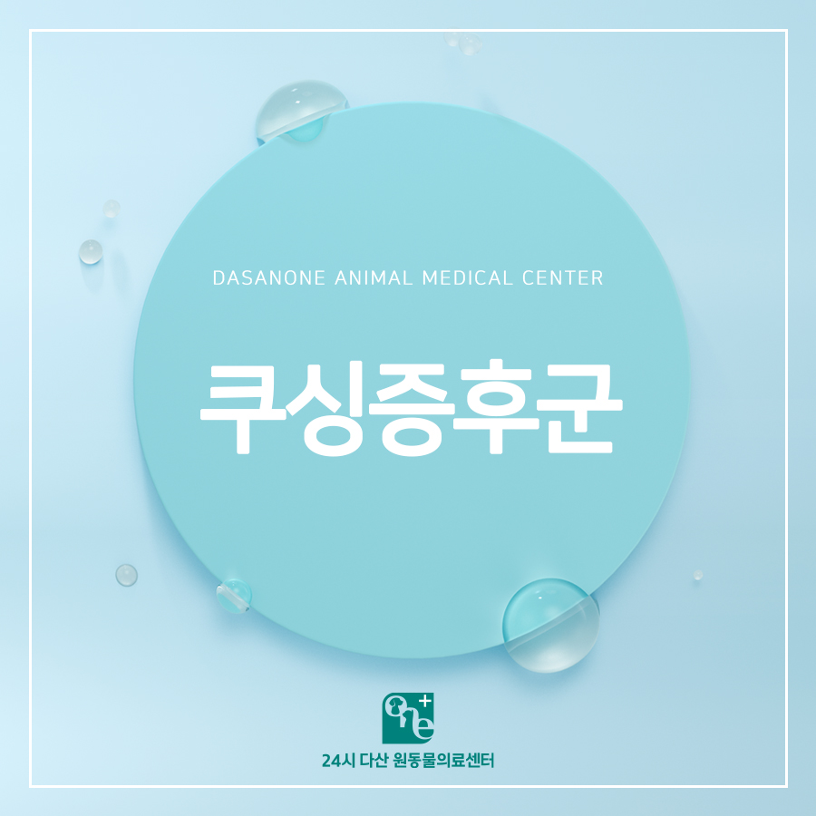
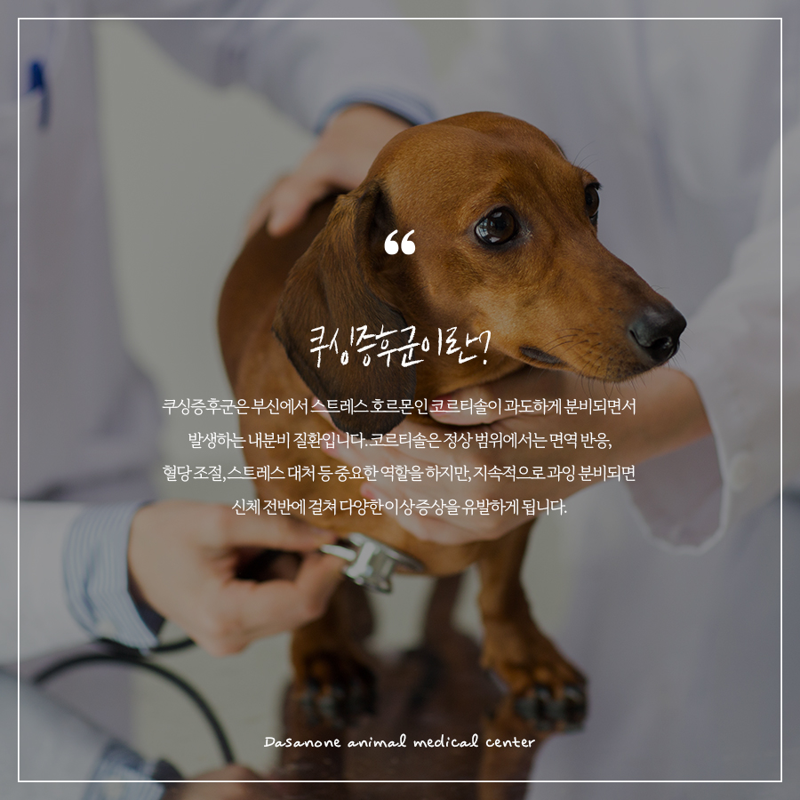
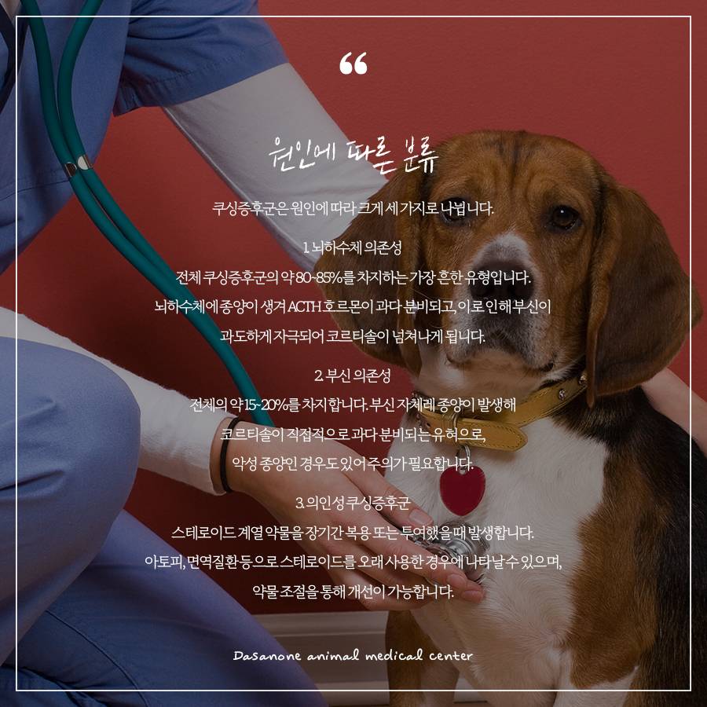
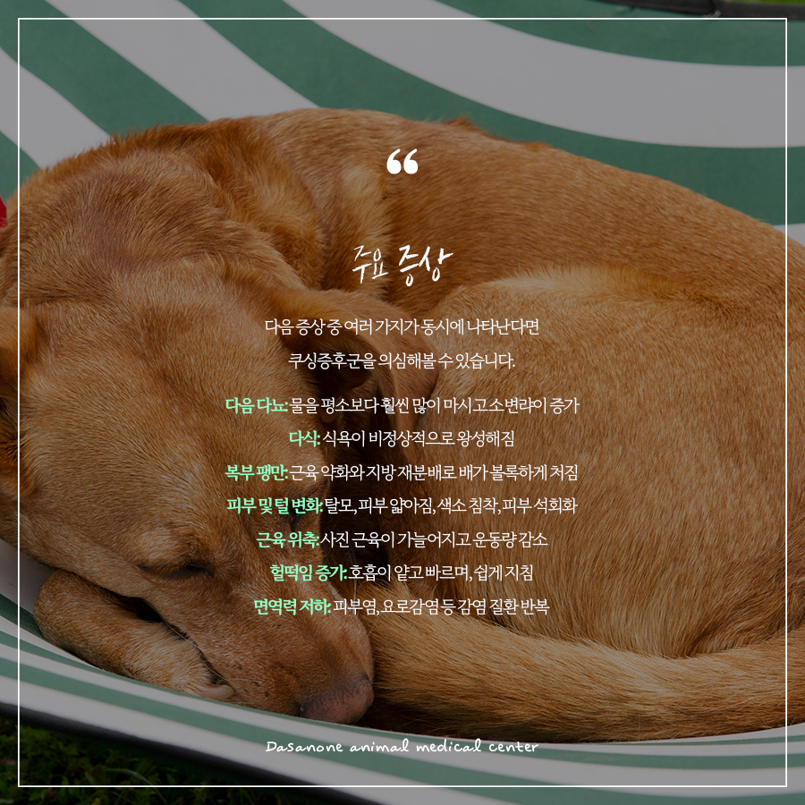
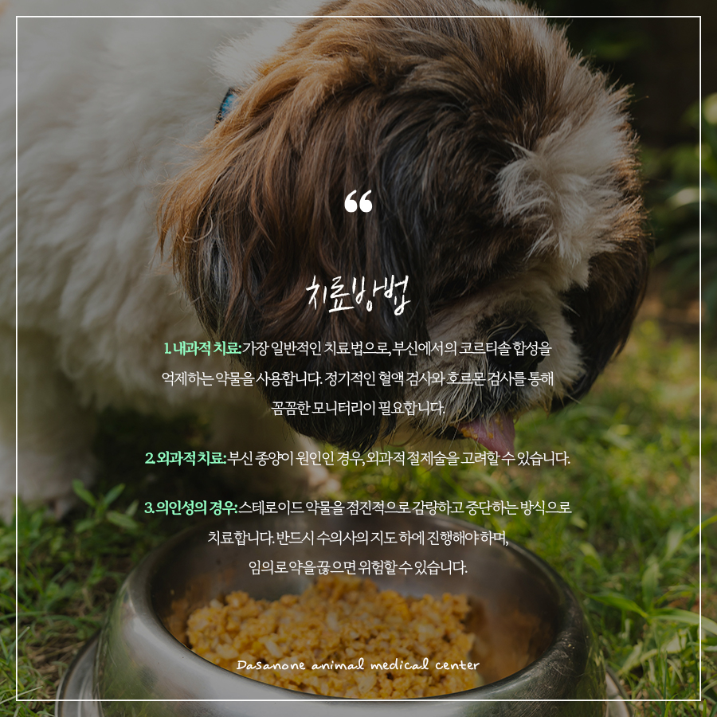
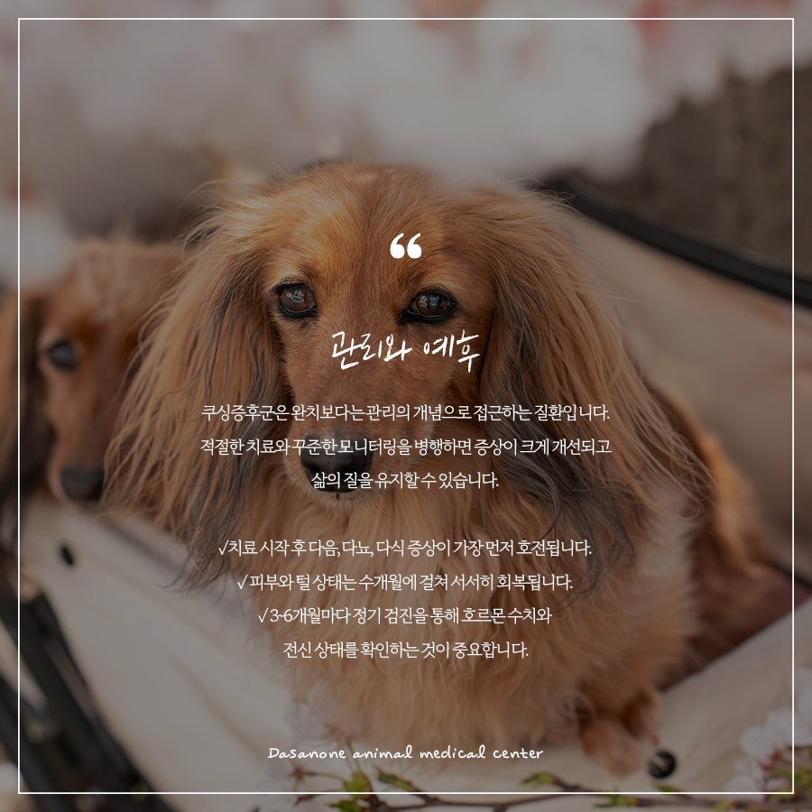
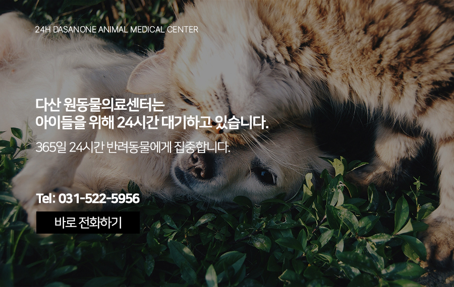

# 다산동 동물병원, 노령견에게 흔한 반려동물 쿠싱증후군(부신피질기능항진증)

- logNo: 224262573672
- date: 2026-04-23
- displayDate: 2026. 4. 23. 15:47
- url: https://blog.naver.com/PostView.naver?blogId=dasanoneamc&logNo=224262573672
- categoryNo: 14
- tags: 

---

요즘 우리 아이가 물을 너무 많이 마시고,
배가 볼록 나오고, 예전보다 털도 많이
빠지는 것 같다면 단순한 노화로 넘겨선 안되는
신호일 수 있습니다. 바로 쿠싱증후군
(부신피질기능항진증)이 의심되는 상황일 수 있습니다.
중년 이후의 강아지에게서 비교적 흔하게 발생하는
이 질환은, 초기 증상이 노화와 매우 유사해
발견이 늦어지는 경우가 많습니다.

> 쿠싱증후군이란?

쿠싱증후군은 부신에서 스트레스 호르몬인
코르티솔이 과도하게 분비되면서 발생하는
내분비 질환입니다. 코르티솔은 정상 범위에서는
면역 반응, 혈당 조절, 스트레스 대처 등 중요한
역할을 하지만, 지속적으로 과잉 분비되면
신체 전반에 걸쳐 다양한 이상 증상을 유발하게 됩니다.

> 원인에 따른 분류

쿠싱증후군은 원인에 따라 크게 세 가지로 나뉩니다.
1. 뇌하수체 의존성
전체 쿠싱증후군의 약 80~85%를 차지하는
가장 흔한 유형입니다. 뇌하수체에 종양이 생겨
ACTH 호르몬이 과다 분비되고, 이로 인해 부신이
과도하게 자극되어 코르티솔이 넘쳐나게 됩니다.
2. 부신 의존성
전체의 약 15~20%를 차지합니다. 부신 자체에
종양이 발생해 코르티솔이 직접적으로 과다 분비되는
유형으로, 악성 종양인 경우도 있어 주의가 필요합니다.
3. 의인성 쿠싱증후군
스테로이드 계열 약물을 장기간 복용 또는
투여했을 때 발생합니다. 아토피, 면역질환 등으로
스테로이드를 오래 사용한 경우에 나타날 수 있으며,
약물 조절을 통해 개선이 가능합니다.

> 주요 증상

다음 증상 중 여러 가지가 동시에 나타난다면
쿠싱증후군을 의심해 볼 수 있습니다.
☑ 다음 다뇨
물을 평소보다 훨씬 많이 마시고 소변량이 증가
☑ 다식
식욕이 비정상적으로 왕성해짐
☑ 복부 팽만
근육 약화와 지방 재분배로 배가 볼록하게 처짐
☑ 피부 및 털 변화
탈모, 피부 얇아짐, 색소 침착, 피부 석회화
☑ 근육 위축
사진 근육이 가늘어지고 운동량 감소
☑ 헐떡임 증가
호흡이 얕고 빠르며, 쉽게 지침
☑ 면역력 저하
피부염, 요로감염 등 감염 질환 반복

> 치료방법

1. 내과적 치료
가장 일반적인 치료법으로, 부신에서의
코르티솔 합성을 억제하는 약물을 사용합니다.
정기적인 혈액 검사와 호르몬 검사를 통해
꼼꼼한 모니터링이 필요합니다.
2. 외과적 치료
부신 종양이 원인인 경우, 외과적 절제술을
고려할 수 있습니다.
3. 의인성의 경우
스테로이드 약물을 점진적으로 감량하고
중단하는 방식으로 치료합니다. 반드시 수의사의
지도하에 진행해야 하며, 임의로 약을 끊으면
위험할 수 있습니다.

> 관리와 예후

쿠싱증후군은 완치보다는 관리의 개념으로
접근하는 질환입니다. 적절한 치료와 꾸준한
모니터링을 병행하면 증상이 크게 개선되고
삶의 질을 유지할 수 있습니다.
✓ 치료 시작 후 다음, 다뇨, 다식 증상이
가장 먼저 호전됩니다.
✓ 피부와 털 상태는 수개월에 걸쳐 서서히 회복됩니다.
✓ 3~6개월마다 정기 검진을 통해 호르몬 수치와
전신 상태를 확인하는 것이 중요합니다.
쿠싱증후군은 조기에 발견하고 적절히 관리한다면,
우리 아이가 훨씬 편안하고 건강한 일상을 보낼 수
있습니다. 우리 아이에게서 평소와 다른 증상들이
관찰된다면 망설이지 말고 전문 진료를
받아보시기 바랍니다.

저희 다산 원동물의료센터는
보호자분들의 든든한 동반자가 되어,
반려동물의 평생 건강 관리를 책임지겠습니다.

📍 24시 다산 원동물의료센터 경기도 남양주시 다산중앙로 15 3층

#다산동물병원 #남양주24시동물병원
#동구릉역동물병원 #수택동동물병원
#쿠싱증후군 #강아지배나옴 #강아지탈모
#부신피질기능항진증
