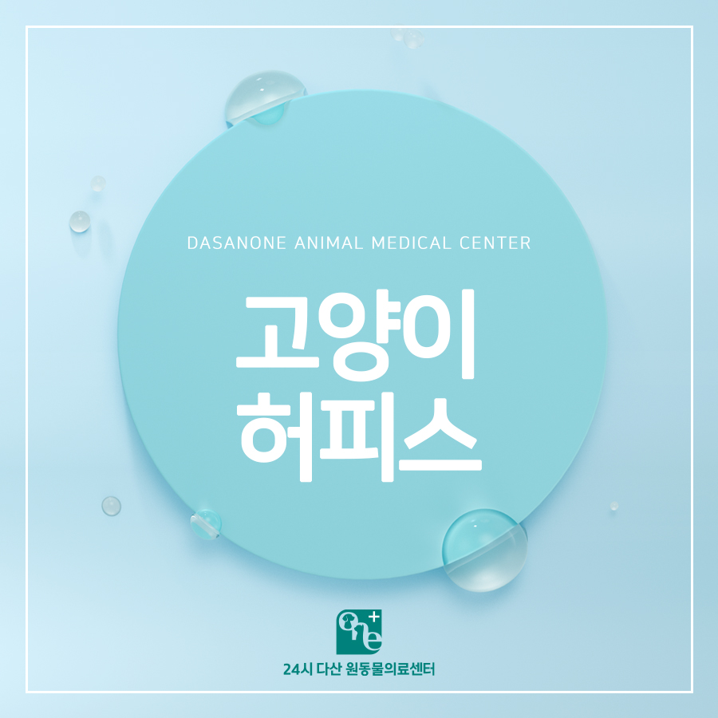
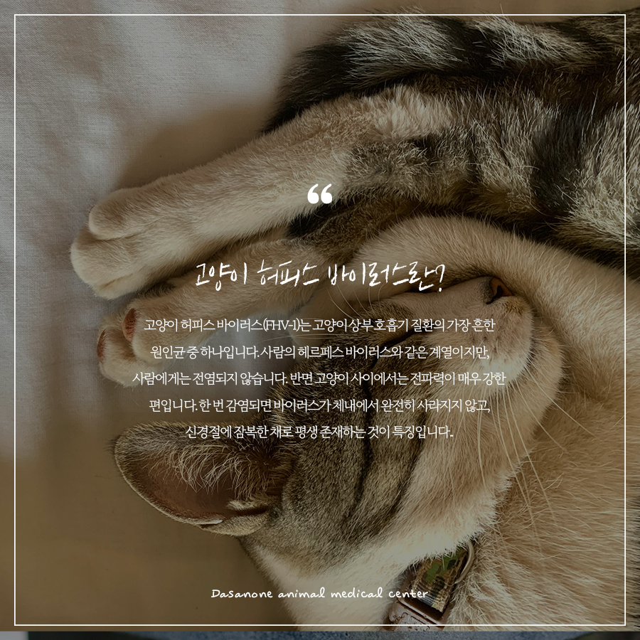
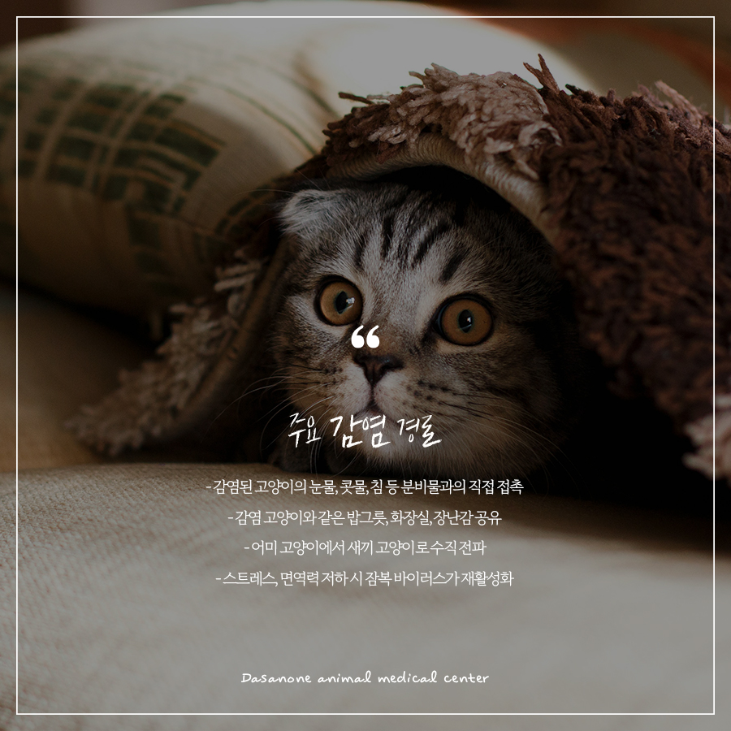
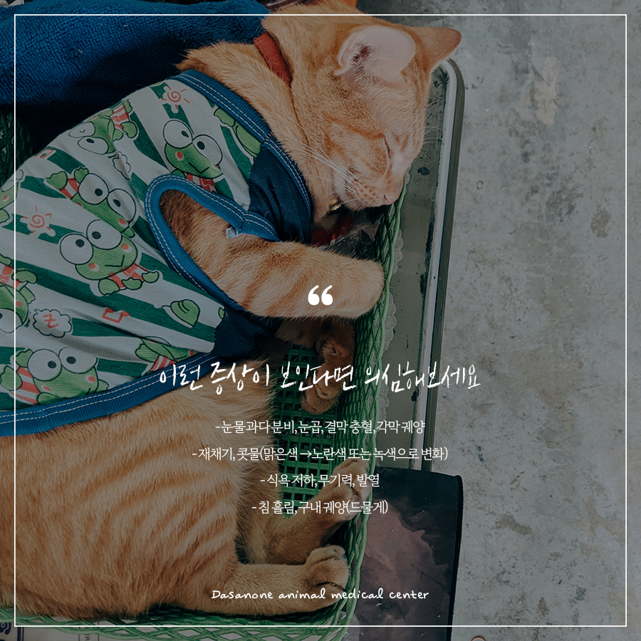
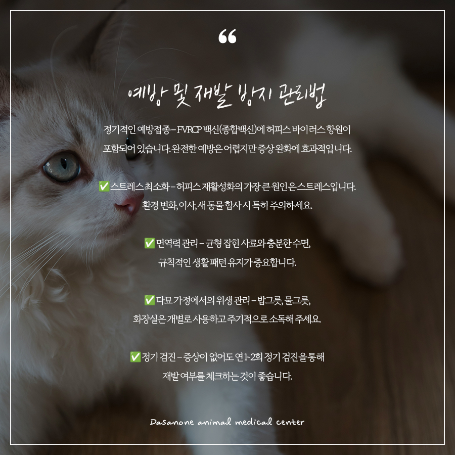
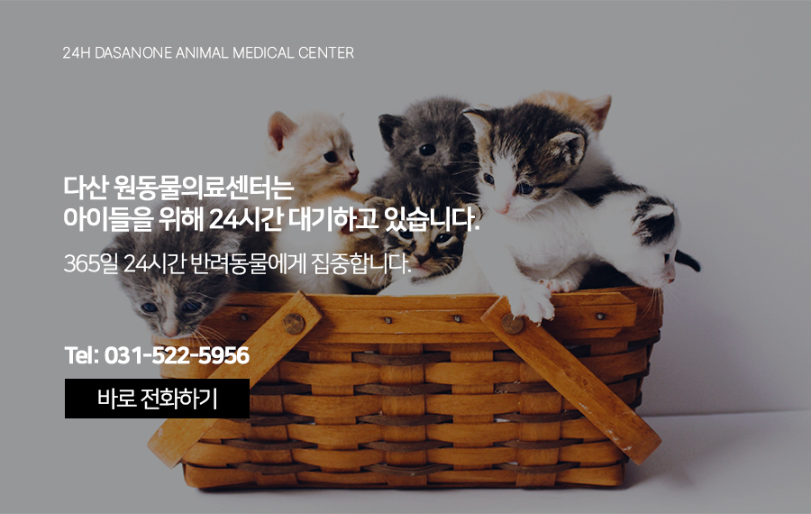

# 수택동 동물병원, 재채기 하는 고양이, 허피스 바이러스

- logNo: 224269301735
- date: 2026-04-29
- displayDate: 2026. 4. 29. 15:43
- url: https://blog.naver.com/PostView.naver?blogId=dasanoneamc&logNo=224269301735
- categoryNo: 14
- tags: 

---

우리 고양이가 갑자기 재채기를 연속으로 하거나,
눈에서 눈물과 분비물이 흘러내린다면?
단순한 감기라고 넘기기 쉽지만, 고양이에게는
허피스 바이러스(Feline Herpesvirus-1, FHV-1)가
원인인 경우가 매우 많습니다. 특히 어린 고양이나
다묘 가정, 보호소 출신 고양이에게 흔하게 나타나는
허피스 바이러스에 대해서 알아보겠습니다.

> 고양이 허피스 바이러스란?

고양이 허피스 바이러스(FHV-1)는
고양이 상부 호흡기 질환의 가장 흔한 원인균 중
하나입니다. 사람의 헤르페스 바이러스와
같은 계열이지만, 사람에게는 전염되지 않습니다.
반면 고양이 사이에서는 전파력이 매우 강한 편입니다.
한 번 감염되면 바이러스가 체내에서 완전히
사라지지 않고, 신경절에 잠복한 채로
평생 존재하는 것이 특징입니다.

> 주요 감염 경로

✓ 감염된 고양이의 눈물, 콧물, 침 등
분비물과의 직접 접촉
✓ 감염 고양이와 같은 밥그릇, 화장실, 장난감 공유
✓ 어미 고양이에서 새끼 고양이로 수직 전파
✓ 스트레스, 면역력 저하 시 잠복 바이러스가 재활성화
💡 외출 후 손을 씻지 않고 고양이를 만지거나,
외부 고양이와 접촉한 뒤 귀가하는 경우에도
간접 전파가 가능합니다.

> 이런 증상이 보인다면 의심해 보세요

✓ 눈물 과다 분비, 눈곱, 결막 충혈, 각막 궤양
✓ 재채기, 콧물(맑은색 →노란색 또는 녹색으로 변화)
✓ 식욕 저하, 무기력, 발열
✓ 침 흘림, 구내 궤양(드물게)
특히 각막궤양은 허피스에서 자주 동반되는
합병증으로, 초기에 치료하지 않으면
시력에 영향을 줄 수 있어 빠른 진료가 중요합니다.

> 치료 방법

허피스 바이러스는 완치가 어렵지만,
적절한 치료를 통해 증상을 완화하고
재발을 줄일 수 있습니다. 고양이용 항바이러스
약물을 사용하고 각막 궤양이나 결막염이 동반된 경우,
안약 또는 항생제 안약 등을 처방합니다.
증상이 심각하지 않다면 따뜻한 장소에서
습도 관리와 충분한 수분과 영양공급만으로도
치유될 수 있습니다.

> 예방 및 재발 방지 관리법

✅ 정기적인 예방접종
FVRCP 백신(종합백신)에 허피스 바이러스
항원이 포함되어 있습니다. 완전한 예방은 어렵지만
증상 완화에 효과적입니다.
✅ 스트레스 최소화
허피스 재활성화의 가장 큰 원인은 스트레스입니다.
환경 변화, 이사, 새 동물 합사 시 특히 주의하세요.
✅ 면역력 관리
균형 잡힌 사료와 충분한 수면,
규칙적인 생활 패턴 유지가 중요합니다.
✅ 다묘 가정에서의 위생 관리
밥그릇, 물그릇, 화장실은 개별로 사용하고
주기적으로 소독해 주세요.
✅ 정기 검진
증상이 없어도 연 1~2회 정기 검진을 통해
재발 여부를 체크하는 것이 좋습니다.

---

허피스 바이러스는 완치가 어려운 질환이지만,
조기에 발견하고 꾸준히 관리하면 일상적인 생활이
충분히 가능합니다. 우리 고양이가 재채기를
자주 하거나 눈곱·눈물이 심해졌다면,
가볍게 넘기지 마시고 동물병원에 방문해
상태를 확인해 보시길 권장드립니다.

저희 다산 원동물의료센터는
보호자분들의 든든한 동반자가 되어,
반려동물의 평생 건강 관리를 책임지겠습니다.

📍 24시 다산 원동물의료센터 경기도 남양주시 다산중앙로 15 3층

#고양이허피스 #고양이예방접종
#고양이감기 #고양이각마궤양
#고양이눈병 #고양이재채기
#다산동물병원 #남양주24시동물병원
#동구릉역동물병원 #수택동동물병원
