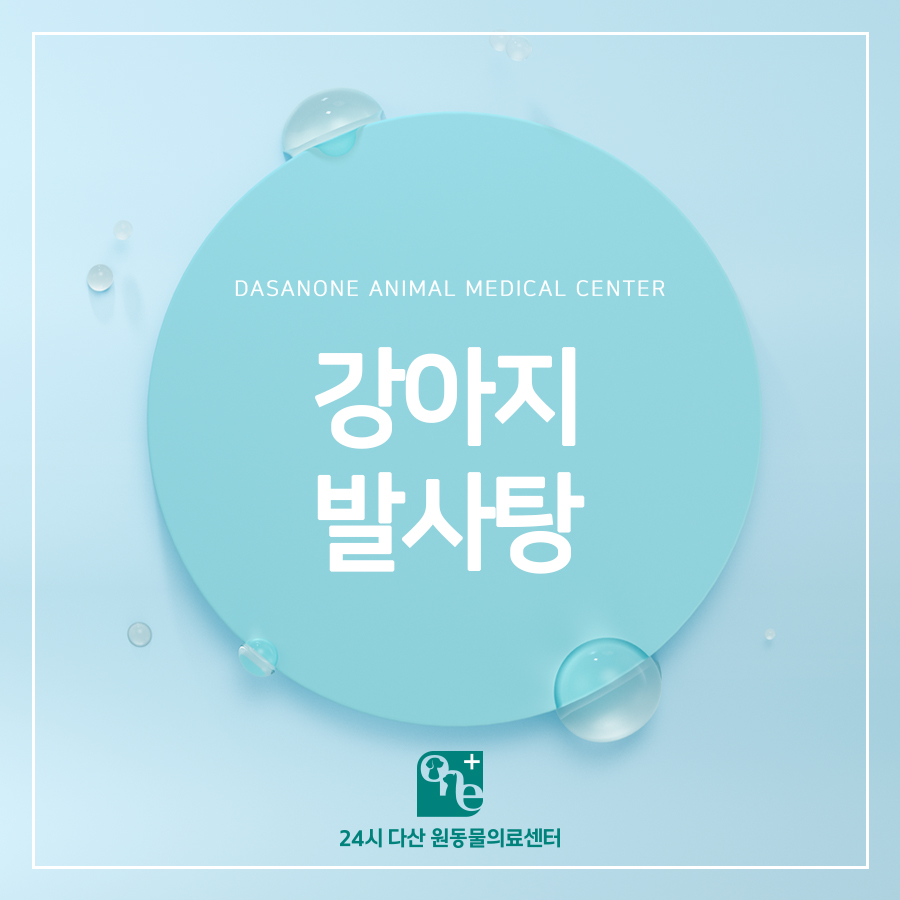
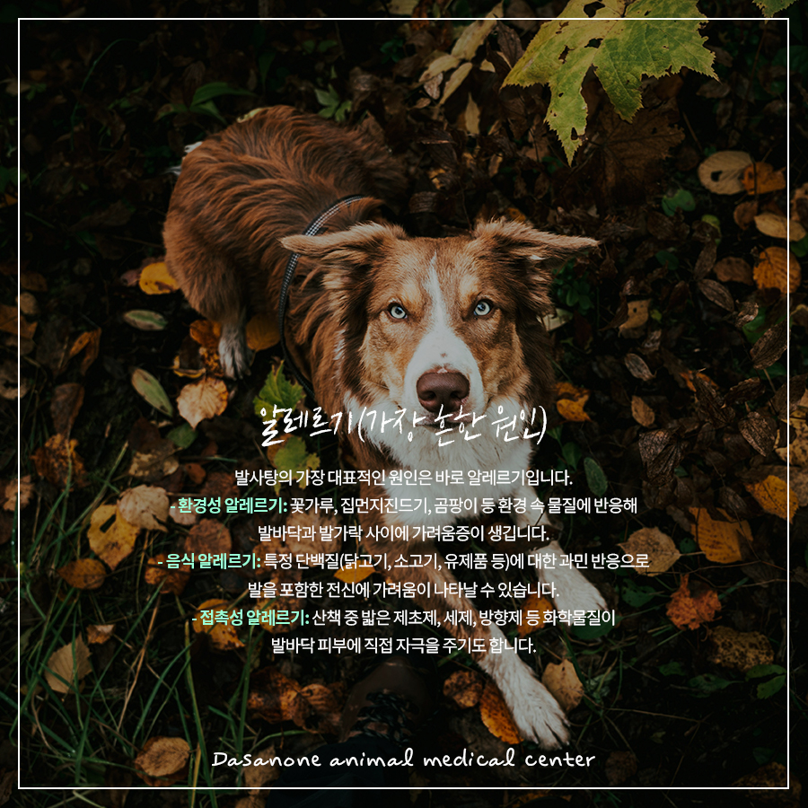
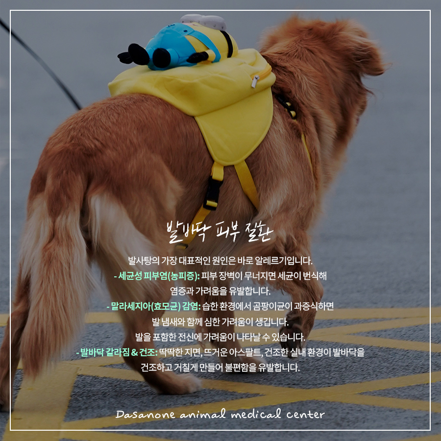
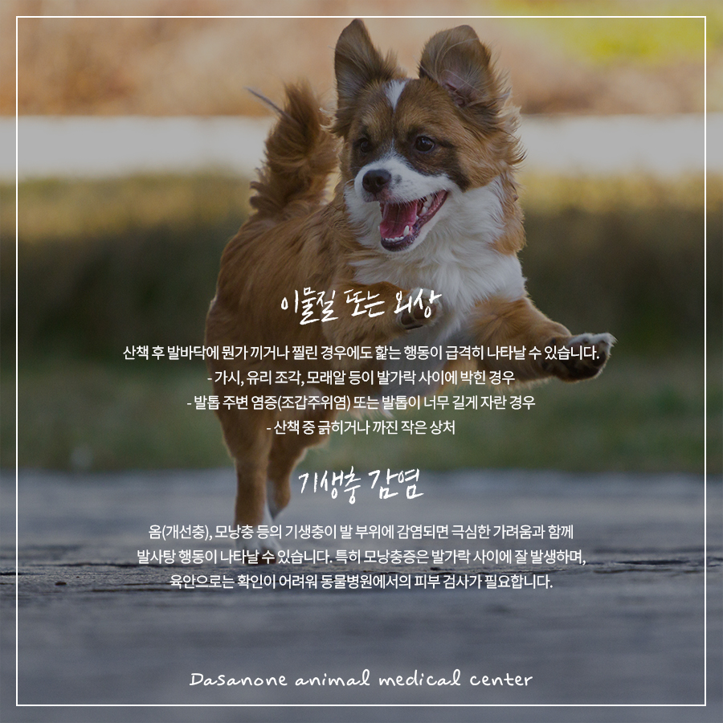
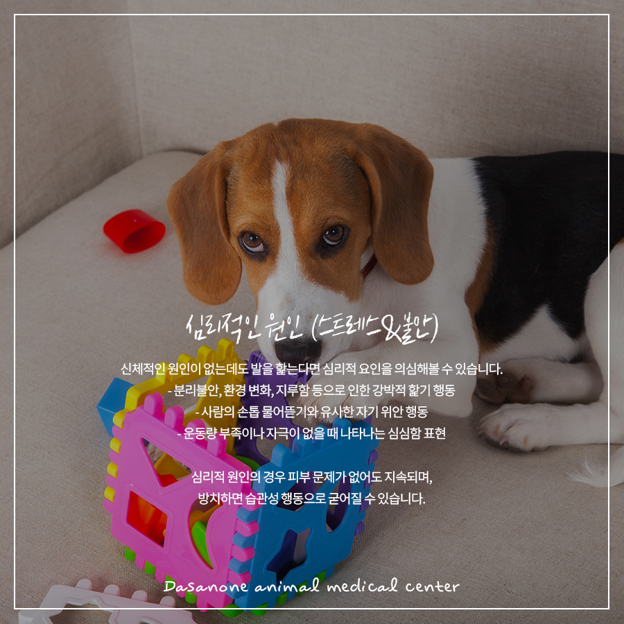
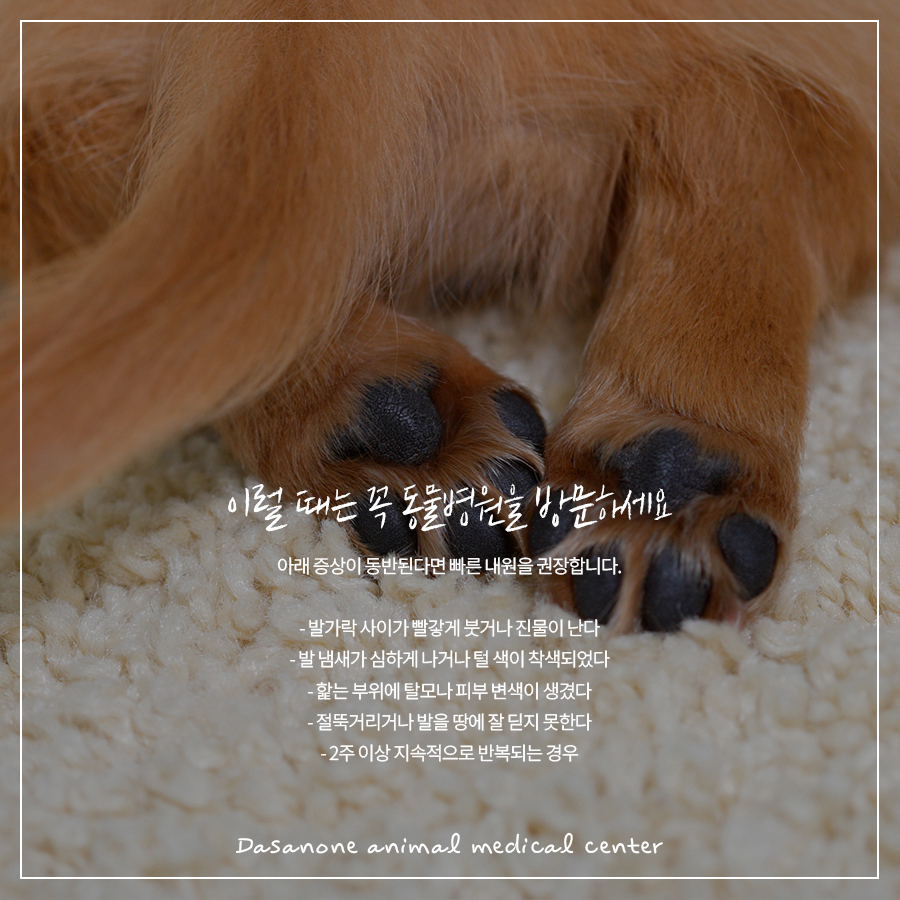
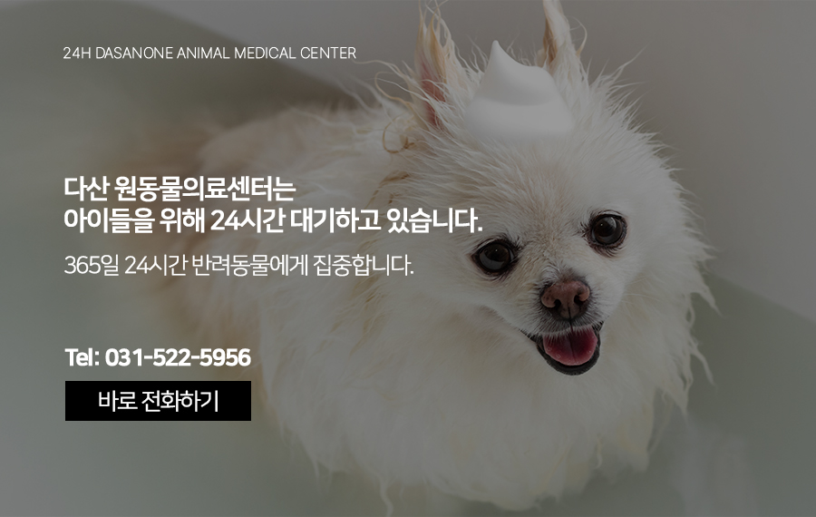

# 토평동 동물병원, 강아지가 발을 자꾸 핥아요 발사탕의 원인 총정리

- logNo: 224270671038
- date: 2026-04-30
- displayDate: 2026. 4. 30. 17:34
- url: https://blog.naver.com/PostView.naver?blogId=dasanoneamc&logNo=224270671038
- categoryNo: 14
- tags: 

---

우리 강아지가 틈만 나면 발을 핥고,
깨물고, 빨고 있나요? 마치 사탕처럼 발을
쪽쪽 핥는다고 해서 반려인들 사이에서
발사탕이라고 불리는 이 행동, 귀엽게 보일 수 있지만
사실은 몸이 보내는 중요한 신호일 수 있습니다.
일시적인 행동이라면 괜찮지만, 반복적으로 지속된다면
피부가 짓무르거나 2차 감염으로 이어질 수 있어요.
오늘은 강아지가 발사탕 행동을 하는 주요 원인을
하나씩 살펴보겠습니다.

> 알레르기(가장 흔한 원인)

발사탕의 가장 대표적인 원인은 바로 알레르기입니다.
환경성 알레르기
꽃가루, 집먼지진드기, 곰팡이 등 환경 속 물질에
반응해 발바닥과 발가락 사이에 가려움증이 생깁니다.
음식 알레르기
특정 단백질(닭고기, 소고기, 유제품 등)에 대한
과민 반응으로 발을 포함한 전신에
가려움이 나타날 수 있습니다.
접촉성 알레르기
산책 중 밟은 제초제, 세제, 방향제 등 화학물질이
발바닥 피부에 직접 자극을 주기도 합니다.
💡알레르기성 발사탕의 경우, 발가락 사이 털이
갈색이나 붉은빛으로 착색되어 있는 경우가 많습니다.

> 발바닥 피부 질환

발바닥 자체에 염증이나 감염이 생긴 경우에도
핥는 행동이 나타납니다.
세균성 피부염(농피증)
피부 장벽이 무너지면 세균이 번식해
염증과 가려움을 유발합니다.
말라세지아(효모균) 감염
습한 환경에서 곰팡이균이 과증식하면
발 냄새와 함께 심한 가려움이 생깁니다.
발바닥 갈라짐 & 건조
딱딱한 지면, 뜨거운 아스팔트, 건조한 실내 환경이
발바닥을 건조하고 거칠게 만들어 불편함을 유발합니다.

> 이물질 또는 외상

산책 후 발바닥에 뭔가 끼거나 찔린 경우에도
핥는 행동이 급격히 나타날 수 있습니다.
✓ 가시, 유리 조각, 모래알 등이
발가락 사이에 박힌 경우
✓ 발톱 주변 염증(조갑주위염) 또는 발톱이
너무 길게 자란 경우
✓ 산책 중 긁히거나 까진 작은 상처

> 기생충 감염

옴(개선충), 모낭충 등의 기생충이 발 부위에 감염되면
극심한 가려움과 함께 발사탕 행동이
나타날 수 있습니다. 특히 모낭충증은 발가락 사이에
잘 발생하며, 육안으로는 확인이 어려워
동물병원에서의 피부 검사가 필요합니다.

> 심리적인 원인 (스트레스&불안)

신체적인 원인이 없는데도 발을 핥는다면
심리적 요인을 의심해볼 수 있습니다.
✓ 분리불안, 환경 변화, 지루함 등으로 인한
강박적 핥기 행동
✓ 사람의 손톱 물어뜯기와 유사한 자기 위안 행동
✓ 운동량 부족이나 자극이 없을 때 나타나는
심심함 표현
심리적 원인의 경우 피부 문제가 없어도 지속되며,
방치하면 습관성 행동으로 굳어질 수 있습니다.

> 이럴 때는 꼭 동물병원을 방문하세요

아래 증상이 동반된다면 빠른 내원을 권장합니다.
✓ 발가락 사이가 빨갛게 붓거나 진물이 난다
✓ 발 냄새가 심하게 나거나 털 색이 착색되었다
✓ 핥는 부위에 탈모나 피부 변색이 생겼다
✓ 절뚝거리거나 발을 땅에 잘 딛지 못한다
✓ 2주 이상 지속적으로 반복되는 경우

---

강아지 발사탕, 단순한 버릇처럼 보여도
그 이면에는 다양한 원인이 숨어 있을 수 있습니다.
무엇보다 중요한 것은 정확한 원인을
파악하는 것입니다. 자가 판단으로 연고를 바르거나
방치하다보면 증상이 악화되거나
2차 감염으로 이어질 수 있습니다.

저희 다산 원동물의료센터는
보호자분들의 든든한 동반자가 되어,
반려동물의 평생 건강 관리를 책임지겠습니다.

📍 24시 다산 원동물의료센터 경기도 남양주시 다산중앙로 15 3층

#강아지발사탕 #강아지피부병
#강아지발바닥 #강아지알레르기
#다산동물병원 #남양주24시동물병원
#동구릉역동물병원 #수택동동물병원
