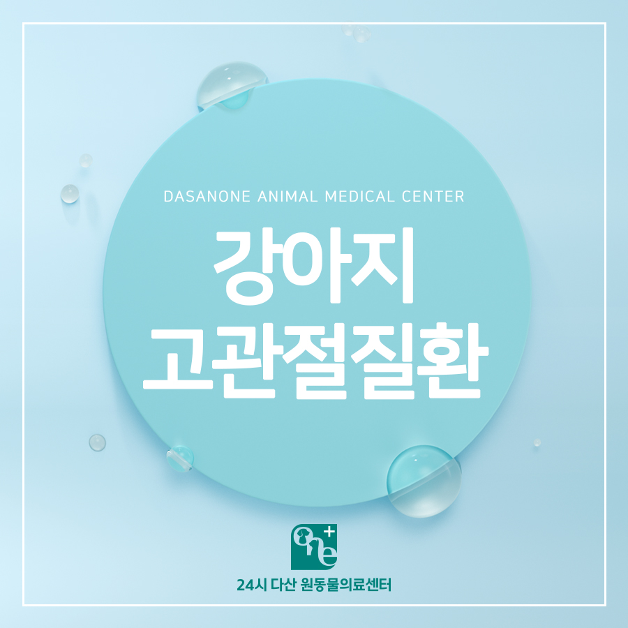
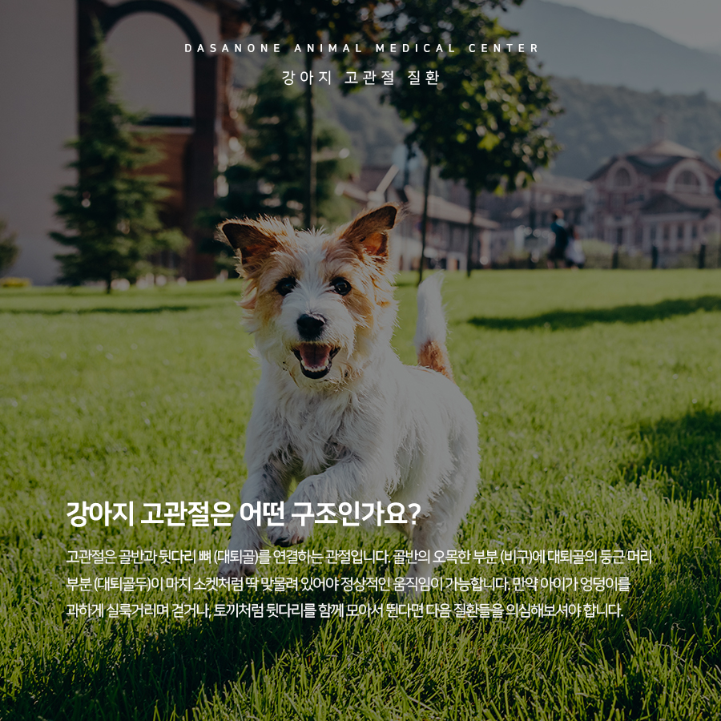
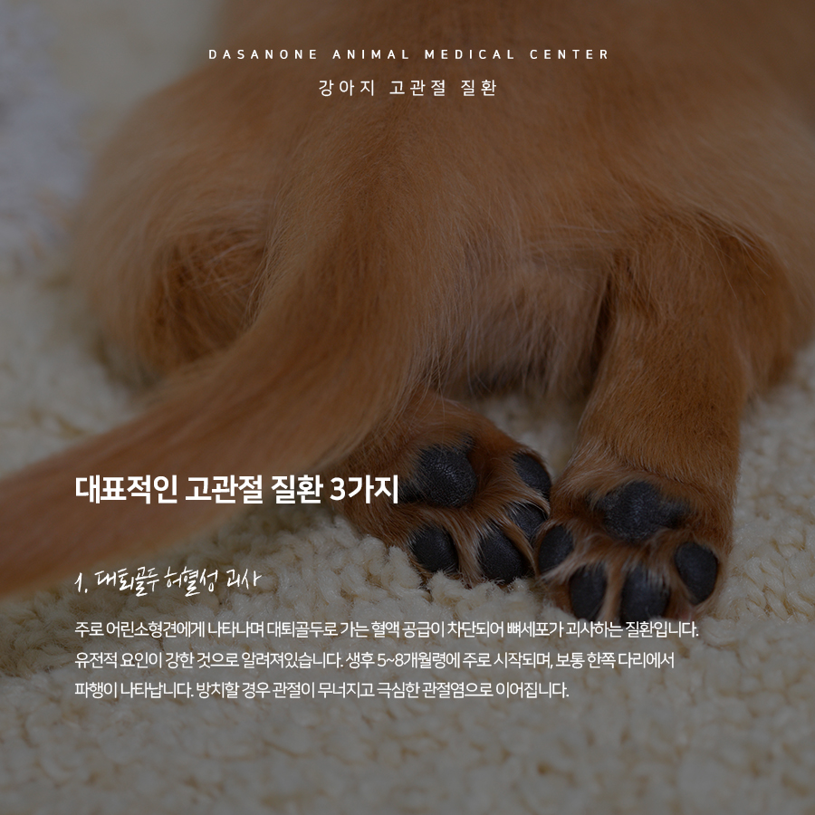
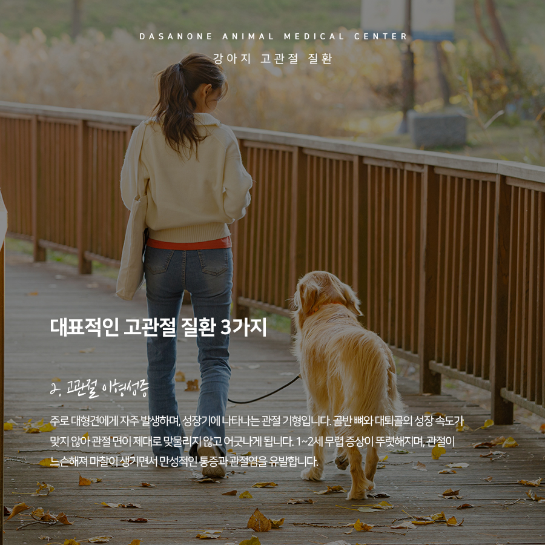
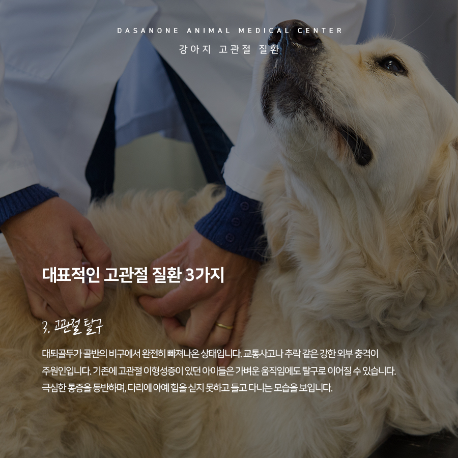
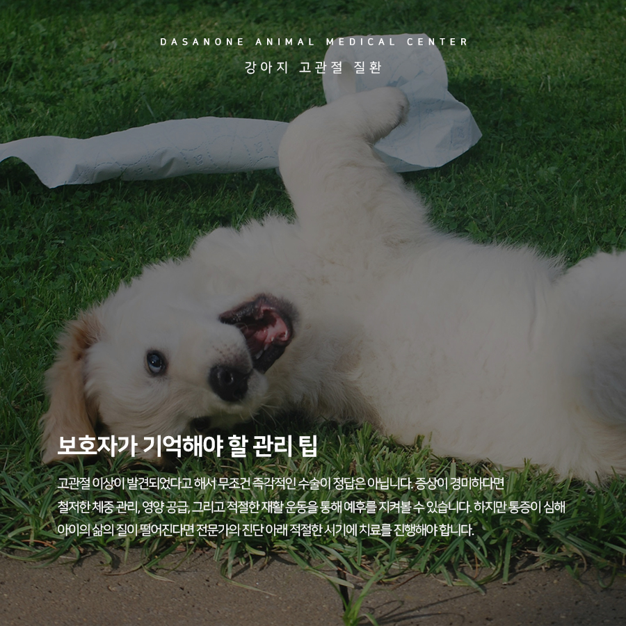
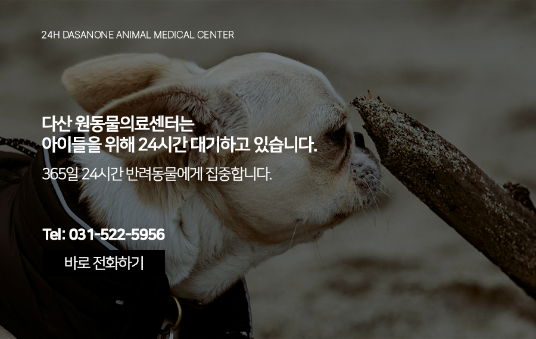

# 교문동 동물병원, 강아지 걸음걸이가 달라졌어요, 고관절 질환 알아보기

- logNo: 224278760747
- date: 2026-05-08
- displayDate: 2026. 5. 8. 12:23
- url: https://blog.naver.com/PostView.naver?blogId=dasanoneamc&logNo=224278760747
- categoryNo: 14
- tags: 

---

강아지들에게 산책은 단순한 운동을 넘어
삶의 가장 큰 즐거움 중 하나입니다. 꼬리를 흔들며
경쾌하게 걷는 모습을 보면 보호자님의 마음도
덩달아 행복해지시죠. 하지만 이때 유심히
살펴보셔야 할 것이 있습니다. 바로 아이들의
걸음걸이인데요, 만약 우리 아이가 평소와 다르다면
무릎이나 고관절에 문제가 생겼다는
위험신호일 수 있습니다. 오늘은 강아지 보행 이상을
유발하는 대표적인 고관절 질환에 대해 알아보겠습니다.

> 강아지 고관절은 어떤 구조인가요?

고관절은 골반과 뒷다리 뼈 (대퇴골)를 연결하는
관절입니다. 골반의 오목한 부분 (비구)에 대퇴골의
둥근 머리 부분 (대퇴골두)이 마치 소켓처럼
딱 맞물려 있어야 정상적인 움직임이 가능합니다.
만약 아이가 엉덩이를 과하게 실룩거리며 걷거나,
토끼처럼 뒷다리를 함께 모아서 뛴다면
다음 질환들을 의심해 보셔야 합니다.

> 대표적인 고관절 질환 3가지

1. 대퇴골두 허혈성 괴사
주로 어린 소형견에게 나타나며 대퇴골두로 가는
혈액 공급이 차단되어 뼈세포가 괴사하는 질환입니다.
유전적 요인이 강한 것으로 알려져 있습니다.
생후 5~8개월령에 주로 시작되며, 보통 한쪽 다리에서
파행이 나타납니다. 방치할 경우 관절이 무너지고
극심한 관절염으로 이어집니다.

2. 고관절 이형성증
주로 대형견에게 자주 발생하며, 성장기에 나타나는
관절 기형입니다. 골반뼈와 대퇴골의 성장 속도가
맞지 않아 관절면이 제대로 맞물리지 않고 어긋나게
됩니다. 1~2세 무렵 증상이 뚜렷해지며, 관절이
느슨해져 마찰이 생기면서 만성적인 통증과
관절염을 유발합니다.

3. 고관절 탈구
대퇴골두가 골반의 비구에서 완전히 빠져나온
상태입니다. 교통사고나 추락 같은 강한 외부 충격이
주원인입니다. 기존에 고관절 이형성증이 있던
아이들은 가벼운 움직임에도 탈구로 이어질 수
있습니다. 극심한 통증을 동반하며, 다리에 아예
힘을 싣지 못하고 들고 다니는 모습을 보입니다.

> 보호자가 기억해야 할 관리 팁

고관절 이상이 발견되었다고 해서 무조건 즉각적인
수술이 정답은 아닙니다. 증상이 경미하다면
철저한 체중 관리, 영양 공급, 그리고 적절한
재활 운동을 통해 예후를 지켜볼 수 있습니다.
하지만 통증이 심해 아이의 삶의 질이 떨어진다면
전문가의 진단 아래 적절한 시기에 치료를
진행해야 합니다.
아이들의 행복한 산책길, 걸음걸이가 예전 같지 않다면
언제든 내원하셔서 정확한 검진을 받아보시길 바랍니다.

저희 다산 원동물의료센터는
보호자분들의 든든한 동반자가 되어,
반려동물의 평생 건강 관리를 책임지겠습니다.

📍 24시 다산 원동물의료센터 경기도 남양주시 다산중앙로 15 3층

#강아지고관절질환 #강아지걸음걸이
#강아지고관절이형성증 #강아지고관절수술
#구리역동물병원 #교문동동물병원
#다산동물병원 #남양주24시동물병원
