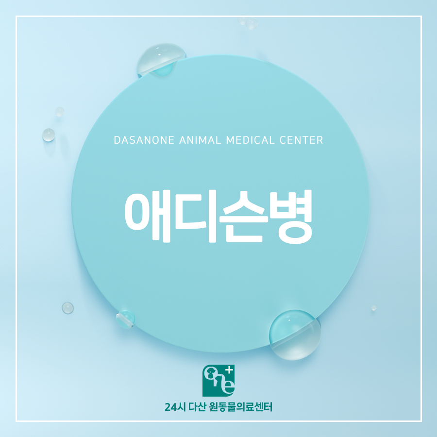
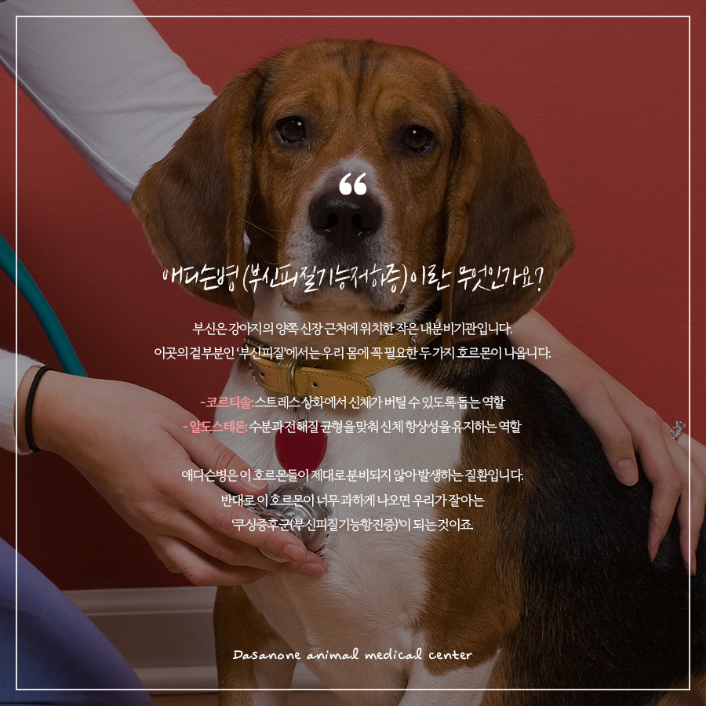
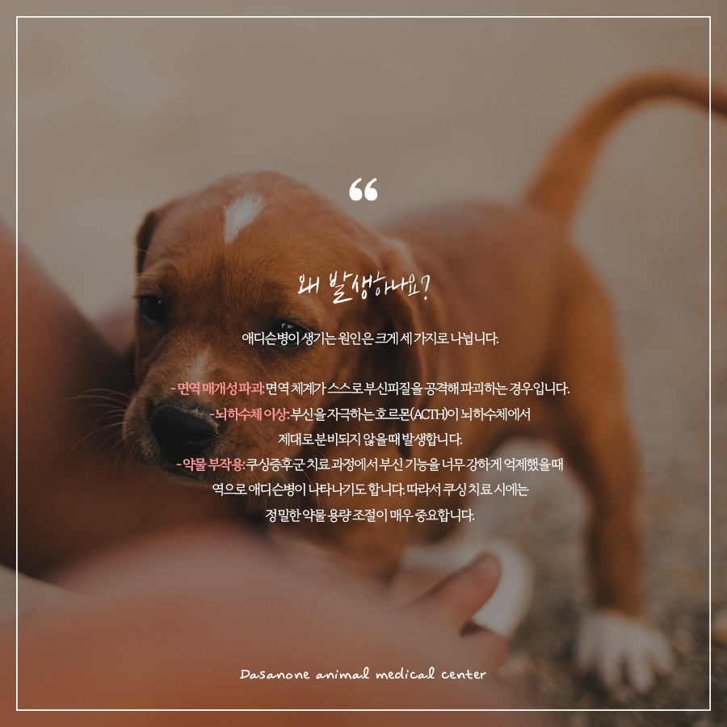
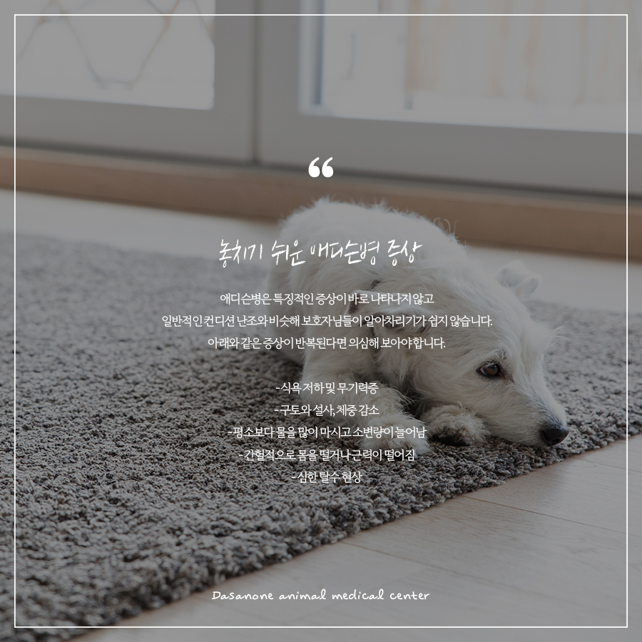
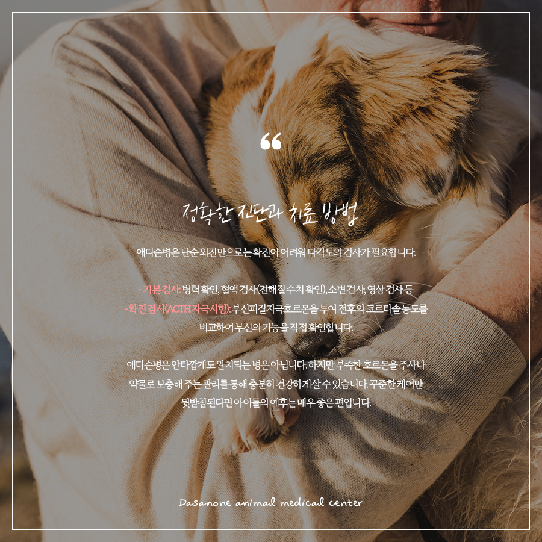
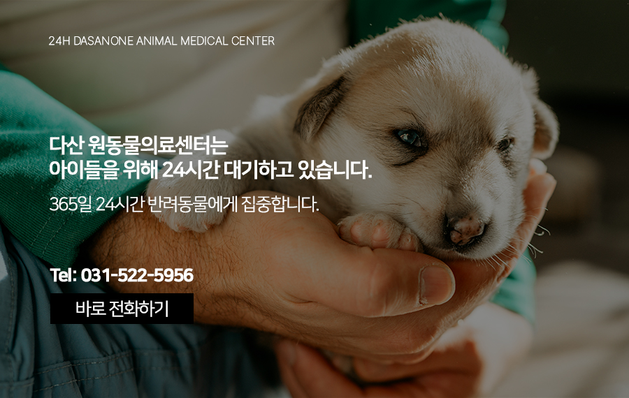

# 갈매동 동물병원, 증상이 모호해 더 위험한 부신피질기능저하증, 강아지 애디슨병

- logNo: 224281878710
- date: 2026-05-11
- displayDate: 2026. 5. 11. 16:04
- url: https://blog.naver.com/PostView.naver?blogId=dasanoneamc&logNo=224281878710
- categoryNo: 14
- tags: 

---

안녕하세요! 우리 아이들의 건강한 일상을
함께 고민하는 다산 원동물의료센터입니다.
반려 가족분들이라면 ‘쿠싱증후군’이라는 병명은
한 번쯤 들어보셨을 텐데요. 그와 정반대의
메커니즘을 가진 ‘애디슨병’에 대해서는
생소해하시는 경우가 많습니다. 오늘은
증상이 뚜렷하지 않아 더 위험할 수 있는
강아지 애디슨병에 대해 자세히 알아보겠습니다.

> 애디슨병(부신피질기능저하증)이란 무엇인가요?

부신은 강아지의 양쪽 신장 근처에 위치한
작은 내분비기관입니다. 이곳의 겉 부분인
‘부신피질’에서는 우리 몸에 꼭 필요한
두 가지 호르몬이 나옵니다.
코르티솔
스트레스 상화에서 신체가 버틸 수 있도록 돕는 역할
알도스테론
수분과 전해질 균형을 맞춰
신체 항상성을 유지하는 역할
애디슨병은 이 호르몬들이 제대로 분비되지 않아
발생하는 질환입니다. 반대로 이 호르몬이
너무 과하게 나오면 우리가 잘 아는
‘쿠싱증후군(부신피질기능항진증)’이 되는 것이죠.

> 왜 발생하나요?

애디슨병이 생기는 원인은 크게 세 가지로 나뉩니다.
✓ 면역 매개성 파괴
면역 체계가 스스로 부신피질을 공격해
파괴하는 경우입니다.
✓ 뇌하수체 이상
부신을 자극하는 호르몬(ACTH)이
뇌하수체에서 제대로 분비되지 않을 때 발생합니다.
✓ 약물 부작용
쿠싱증후군 치료 과정에서 부신 기능을 너무 강하게
억제했을 때 역으로 애디슨병이 나타나기도 합니다.
따라서 쿠싱 치료 시에는 정밀한 약물 용량 조절이
매우 중요합니다.

> 놓치기 쉬운 애디슨병 증상

애디슨병은 특징적인 증상이 바로 나타나지 않고
일반적인 컨디션 난조와 비슷해 보호자님들이
알아차리기가 쉽지 않습니다. 아래와 같은 증상이
반복된다면 의심해 보아야 합니다.
☑ 식욕 저하 및 무기력증
☑ 구토와 설사, 체중 감소
☑ 평소보다 물을 많이 마시고 소변량이 늘어남
☑ 간헐적으로 몸을 떨거나 근력이 떨어짐
☑ 심한 탈수 현상
⚠️주의!
평소 증상을 방치하다가 아이가
극심한 스트레스를 받으면, 신체가 이를 견디지 못해
저혈량성 쇼크로 쓰러질 수 있습니다.
이는 생명을 위협하는 응급 상황이므로
즉시 병원을 찾아 응급 처치를 받아야 합니다.

> 정확한 진단과 치료 방법

애디슨병은 단순 외진 만으로는 확진이 어려워
다각도의 검사가 필요합니다.
기본 검사
병력 확인, 혈액 검사(전해질 수치 확인),
소변 검사, 영상 검사 등
확진 검사(ACTH 자극 시험)
부신피질자극호르몬을 투여 전후의 코르티솔 농도를
비교하여 부신의 기능을 직접 확인합니다.
애디슨병은 안타깝게도 완치되는 병은 아닙니다.
하지만 부족한 호르몬을 주사나 약물로 보충해 주는
관리를 통해 충분히 건강하게 살 수 있습니다.
꾸준한 케어만 뒷받침된다면 아이들의 예후는
매우 좋은 편입니다.

---

애디슨병은 육안으로 바로 드러나지 않기에,
무엇보다 정기적인 건강검진이 최고의 예방법입니다.
노령견뿐만 아니라 젊은 강아지들도 평소와 다른
미세한 변화(식욕 부진, 떨림 등)를 보인다면
가볍게 넘기지 마시고 수의사와 상담해 보세요.

저희 다산 원동물의료센터는
보호자분들의 든든한 동반자가 되어,
반려동물의 평생 건강 관리를 책임지겠습니다.

📍 24시 다산 원동물의료센터 경기도 남양주시 다산중앙로 15 3층

#강아지식욕저하 #강아지ACTH검사
#강아지애디슨병 #강아지부신피질기능저하증
#남양주24시동물병원 #다산역동물병원
#갈매동동물병원 #구리역동물병원
